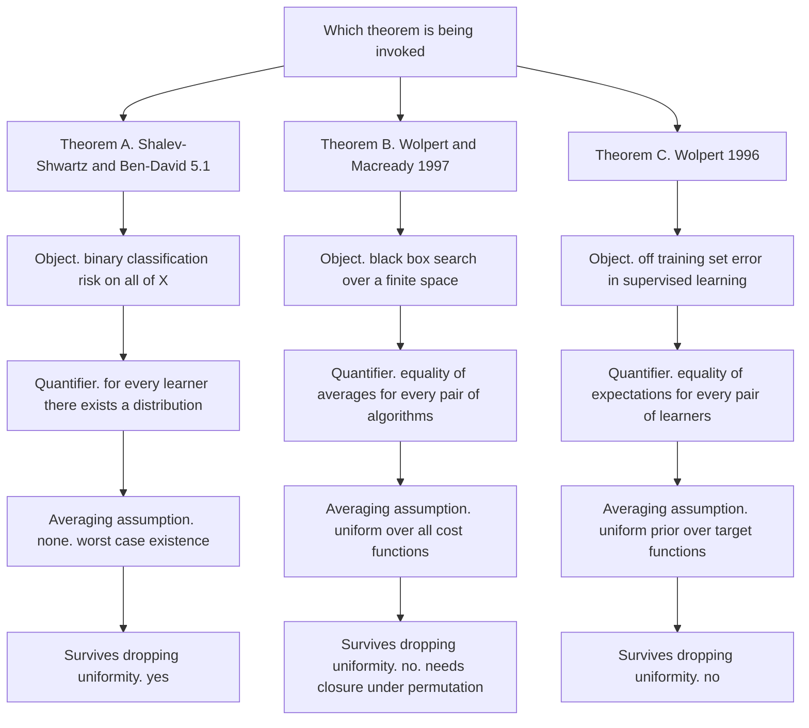
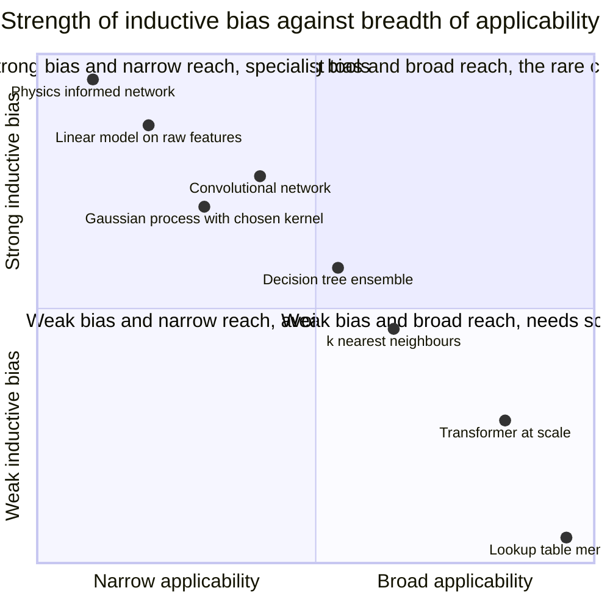
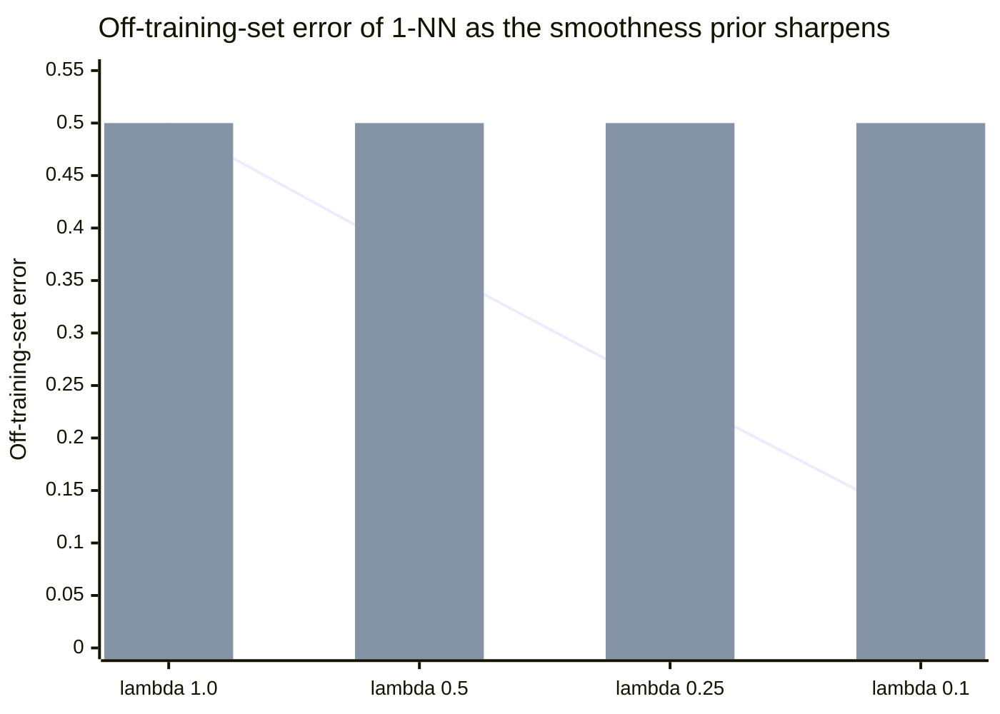

# No Free Lunch: Every Model Is an Assumption You Already Made

*Part of the series "Why Learning Works: The Theorems Behind Machine Learning." This post closes the block on guarantees. The previous instalment ended on the fundamental theorem of statistical learning: a binary hypothesis class is PAC learnable if and only if its VC dimension is finite. What follows is the other side of that equivalence.*

---

## The Obvious Escape, and Why It Is Closed

An "if and only if" invites a workaround. The criterion for learnability is a restriction: your hypothesis class $\mathcal{H}$ must not shatter arbitrarily large sets. Why accept it? Why not take $\mathcal{H}_1 \cup \mathcal{H}_2 \cup \cdots$ over every class anyone has proposed, or let $\mathcal{H}$ be $\{0,1\}^{\mathcal{X}}$, the set of *all* functions from domain to labels, and let empirical risk minimisation sort it out? Nothing in the definition of a learning algorithm forbids it, and modern practice looks superficially like it is heading that way: bigger classes, fewer architectural commitments, more capacity.

A theorem forbids it, and the theorem is short. For every learning algorithm there exists a distribution on which that algorithm fails, while some other algorithm succeeds on the same distribution. There is no universal learner. Restricting $\mathcal{H}$ is not computational convenience or statistical taste; it is the only thing that makes learning possible at all.

That result is called the **No Free Lunch theorem**. So are two other results — different theorems, about different objects, with different hypotheses, proved by different people for different reasons. Conflating them is the most common failure in writing on this topic, and it is why the phrase has degenerated into a shrug people deploy to end arguments rather than start them. So this post proves the supervised-learning version in full; states the optimisation version and locates where its weight rests; and separates both from Wolpert's off-training-set version, the one most often quoted and least often read.

Then it does the part that matters: reading the standard toolbox backwards. If no method works without an assumption, every method you use encodes one. That assumption is nameable. Naming it is the skill.

Notation follows Shalev-Shwartz and Ben-David. $\mathcal{X}$ is the domain, labels are $\{0,1\}$, $D$ is a distribution over $\mathcal{X} \times \{0,1\}$, and the true risk of a predictor $h$ is $L_D(h) = \mathbb{P}_{(x,y) \sim D}[h(x) \neq y]$ under $0$-$1$ loss. A learning algorithm $A$ maps a sample $S$ to a predictor $A(S)$.

---

## Theorem A: No Free Lunch for Supervised Learning

This is Theorem 5.1 of *Understanding Machine Learning* (Shalev-Shwartz and Ben-David, 2014): a worst-case existence statement, with no prior over anything and no averaging assumption. That is what makes it the strongest of the three.

> **Theorem A (No Free Lunch).** Let $A$ be any learning algorithm for the task of binary classification with respect to the $0$-$1$ loss over a domain $\mathcal{X}$. Let $m$ be any number smaller than $|\mathcal{X}|/2$, representing a training set size. Then there exists a distribution $D$ over $\mathcal{X} \times \{0,1\}$ such that:
>
> 1. There exists a function $f : \mathcal{X} \to \{0,1\}$ with $L_D(f) = 0$.
> 2. With probability at least $1/7$ over the choice of $S \sim D^m$, we have $L_D(A(S)) \geq 1/8$.

The quantifiers are the whole content. The algorithm is chosen first: *for all* $A$. The distribution comes second: *there exists* $D$. And that distribution is not pathological — it is uniform over a finite set and perfectly realisable, since clause 1 guarantees a hypothesis with exactly zero risk. Nothing is noisy, nothing is ill-posed. The failure is purely a failure of information.

### The Construction

Fix $m < |\mathcal{X}|/2$ and choose $C \subseteq \mathcal{X}$ with $|C| = 2m$. There are $T = 2^{2m}$ functions from $C$ to $\{0,1\}$; call them $f_1, \dots, f_T$. For each $i$, define a distribution $D_i$ over $C \times \{0,1\}$ by

$$
D_i(\{(x,y)\}) = \begin{cases} 1/|C| & \text{if } y = f_i(x) \\ 0 & \text{otherwise.} \end{cases}
$$

So $D_i$ draws $x$ uniformly from $C$ and labels it by $f_i$, deterministically; immediately $L_{D_i}(f_i) = 0$, discharging clause 1 for every $i$. The claim to prove is

$$
\max_{i \in [T]} \; \mathbb{E}_{S \sim D_i^m}\!\left[L_{D_i}(A(S))\right] \;\geq\; \frac{1}{4}. \tag{A.1}
$$

Everything else is bookkeeping. Once (A.1) holds for algorithms restricted to $C$ it holds on all of $\mathcal{X}$, since the $D_i$ place no mass outside $C$; so there are $f$ and $D$ with $L_D(f) = 0$ and $\mathbb{E}_{S \sim D^m}[L_D(A'(S))] \geq 1/4$.

### The Averaging Step

There are exactly $k = (2m)^m$ ordered sequences of $m$ points from $C$; write them $S_1, \dots, S_k$, and for $S_j = (x_1, \dots, x_m)$ let $S_j^i = ((x_1, f_i(x_1)), \dots, (x_m, f_i(x_m)))$ be that sequence labelled by $f_i$. Under $D_i$ the training sets $A$ can receive are exactly $S_1^i, \dots, S_k^i$, each equally likely, so

$$
\mathbb{E}_{S \sim D_i^m}\!\left[L_{D_i}(A(S))\right] = \frac{1}{k}\sum_{j=1}^{k} L_{D_i}\!\left(A(S_j^i)\right). \tag{A.2}
$$

Now use the two facts that carry the entire proof: a maximum is at least an average, and an average is at least a minimum.

$$
\begin{aligned}
\max_{i \in [T]} \frac{1}{k}\sum_{j=1}^{k} L_{D_i}(A(S_j^i))
&\;\geq\; \frac{1}{T}\sum_{i=1}^{T} \frac{1}{k}\sum_{j=1}^{k} L_{D_i}(A(S_j^i)) \\
&\;=\; \frac{1}{k}\sum_{j=1}^{k} \frac{1}{T}\sum_{i=1}^{T} L_{D_i}(A(S_j^i)) \\
&\;\geq\; \min_{j \in [k]} \frac{1}{T}\sum_{i=1}^{T} L_{D_i}(A(S_j^i)).
\end{aligned} \tag{A.3}
$$

The swap in the middle line is the pivot. We began with a quantity indexed by the target and averaged over samples; we now have one indexed by the sample and averaged over targets. The adversary has stopped choosing a hard distribution and started choosing a hard sample — and against a *fixed* sample, the target functions become symmetric.

### The Unseen Half

Fix $j \in [k]$ and write $S_j = (x_1, \dots, x_m)$. Let $v_1, \dots, v_p$ be the points of $C$ that do not appear in $S_j$. Since $|C| = 2m$ and $S_j$ contains at most $m$ distinct points, we have $p \geq m$. For any $h : C \to \{0,1\}$ and any $i$,

$$
L_{D_i}(h) = \frac{1}{2m}\sum_{x \in C} \mathbb{1}_{[h(x) \neq f_i(x)]} \;\geq\; \frac{1}{2m}\sum_{r=1}^{p} \mathbb{1}_{[h(v_r) \neq f_i(v_r)]} \;\geq\; \frac{1}{2p}\sum_{r=1}^{p} \mathbb{1}_{[h(v_r) \neq f_i(v_r)]},
$$

where the first inequality drops the seen points and the second uses $p \geq m$, so $\tfrac{1}{2m} \geq \tfrac{1}{2p}$. Therefore

$$
\begin{aligned}
\frac{1}{T}\sum_{i=1}^{T} L_{D_i}(A(S_j^i))
&\;\geq\; \frac{1}{2p}\sum_{r=1}^{p} \frac{1}{T}\sum_{i=1}^{T} \mathbb{1}_{[A(S_j^i)(v_r) \neq f_i(v_r)]} \\
&\;\geq\; \frac{1}{2}\cdot \min_{r \in [p]} \frac{1}{T}\sum_{i=1}^{T} \mathbb{1}_{[A(S_j^i)(v_r) \neq f_i(v_r)]}.
\end{aligned} \tag{A.4}
$$

### The Pairing

Fix $r \in [p]$ and partition $f_1, \dots, f_T$ into $T/2$ disjoint pairs, where $(f_i, f_{i'})$ is a pair exactly when $f_i(c) \neq f_{i'}(c)$ if and only if $c = v_r$: the two functions agree everywhere on $C$ except at the single unseen point $v_r$. Such a pairing exists because the $f$'s enumerate all of $\{0,1\}^C$, so flipping the $v_r$ coordinate is a fixed-point-free involution on the index set.

Now $v_r$ does not appear in $S_j$, so $f_i$ and $f_{i'}$ agree on every point of $S_j$ and $S_j^i = S_j^{i'}$ as labelled sequences. The algorithm sees literally the same input in both worlds and, being a function, returns the same predictor. But $f_i(v_r) \neq f_{i'}(v_r)$, so that predictor is wrong at $v_r$ in exactly one of them:

$$
\mathbb{1}_{[A(S_j^i)(v_r) \neq f_i(v_r)]} + \mathbb{1}_{[A(S_j^{i'})(v_r) \neq f_{i'}(v_r)]} = 1.
$$

Summing over all $T/2$ pairs and dividing by $T$,

$$
\frac{1}{T}\sum_{i=1}^{T} \mathbb{1}_{[A(S_j^i)(v_r) \neq f_i(v_r)]} = \frac{1}{2}. \tag{A.5}
$$

Exactly one half. Not approximately, not in the limit, and not depending on anything $A$ does. Substituting (A.5) into (A.4) gives $\tfrac{1}{2}\cdot\tfrac{1}{2} = \tfrac{1}{4}$ for every $j$, and chaining back through (A.3) and (A.2) establishes (A.1). $\blacksquare$

### From Expectation to Probability

Clause 2 asks for a probability, not an expectation. The conversion is two lines of Markov applied to the complement.

> **Lemma (Shalev-Shwartz and Ben-David, Lemma B.1).** Let $Z$ be a random variable taking values in $[0,1]$ with $\mathbb{E}[Z] = \mu$. Then for every $a \in (0,1)$, $\;\mathbb{P}[Z > a] \geq \dfrac{\mu - a}{1 - a}$.

*Proof.* Put $Y = 1 - Z \geq 0$, so $\mathbb{E}[Y] = 1 - \mu$. Markov gives $\mathbb{P}[Z \leq a] = \mathbb{P}[Y \geq 1-a] \leq \dfrac{1-\mu}{1-a}$, and taking complements,

$$
\mathbb{P}[Z > a] \;\geq\; 1 - \frac{1-\mu}{1-a} \;=\; \frac{(1-a) - (1-\mu)}{1-a} \;=\; \frac{\mu - a}{1-a}. \;\blacksquare
$$

Apply this to $Z = L_D(A(S)) \in [0,1]$ with $\mu \geq 1/4$ and $a = 1/8$:

$$
\mathbb{P}\!\left[L_D(A(S)) > \tfrac{1}{8}\right] \;\geq\; \frac{\tfrac14 - \tfrac18}{1 - \tfrac18} \;=\; \frac{\tfrac18}{\tfrac78} \;=\; \frac{1}{7}.
$$

That is where $1/8$ and $1/7$ come from, and it explains why they look arbitrary: they are. Any $a < 1/4$ works, yielding the pair $\left(a, \tfrac{1/4 - a}{1 - a}\right)$; $a = 1/8$ happens to give the clean $1/7$. The theorem is not about those constants. It is about $1/4$, and $1/4$ is $\tfrac12 \times \tfrac12$ — half the domain unseen, coin-flip accuracy on it.

### The Corollary That Motivates Everything

> **Corollary (Shalev-Shwartz and Ben-David, Corollary 5.2).** Let $\mathcal{X}$ be an infinite domain and let $\mathcal{H}$ be the set of all functions from $\mathcal{X}$ to $\{0,1\}$. Then $\mathcal{H}$ is not PAC learnable.

*Proof.* Suppose it were. Choose $\epsilon < 1/8$ and $\delta < 1/7$. PAC learnability supplies an algorithm $A$ and a finite $m = m(\epsilon, \delta)$ such that for every realisable $D$, with probability at least $1 - \delta$ we get $L_D(A(S)) \leq \epsilon$. But $\mathcal{X}$ is infinite, so $|\mathcal{X}| > 2m$, and Theorem A supplies a $D$ on which $L_D(A(S)) > 1/8 > \epsilon$ with probability greater than $1/7 > \delta$. Contradiction. $\blacksquare$

Run the same argument against any class that shatters a set of size $2m$ and you get Corollary 6.4, then Theorem 6.6: a class of infinite VC dimension is not PAC learnable. That is exactly the direction of the fundamental theorem this post's predecessor left standing on a promise.

The escape route is closed, and closed for an intelligible reason. Shalev-Shwartz and Ben-David put it in one line: *if someone can explain every phenomenon, his explanations are worthless.* A class rich enough to fit every labelling of a set tells you nothing about the labels you have not seen.

---

## Theorem B: No Free Lunch for Optimization

Wolpert and Macready's theorems are a different animal: black-box search, not supervised learning. They appeared in *IEEE Transactions on Evolutionary Computation* 1(1), 67-82, April 1997, expanding the longer Santa Fe Institute technical report SFI-TR-95-02-010, *No Free Lunch Theorems for Search* (1995).

The setting is a finite search space $\mathcal{X}$, a finite set of cost values $\mathcal{Y}$, and objective functions $\mathcal{F} = \mathcal{Y}^{\mathcal{X}}$, of size $|\mathcal{Y}|^{|\mathcal{X}|}$. A sample $d_m$ is a time-ordered set of $m$ *distinct* visited points with their costs; $d_m^y$ is the ordered sequence of cost values alone. An algorithm $a$ maps already-visited points to a new, previously unvisited one. Algorithms are compared on distinct evaluations only, which is how the framework sidesteps revisiting.

> **Theorem B (Wolpert and Macready, 1997, Theorem 1).** For any pair of algorithms $a_1$ and $a_2$,
> $$
> \sum_{f} P(d_m^y \mid f, m, a_1) = \sum_{f} P(d_m^y \mid f, m, a_2).
> $$

An immediate corollary, stated in the paper: for any performance measure $\Phi(d_m^y)$, the average over all $f$ of $P(\Phi(d_m^y) \mid f, m, a)$ is independent of $a$. Summed over every objective function in $\mathcal{F}$, hill climbing, simulated annealing, a genetic algorithm and uniform random search produce the same distribution over cost sequences. Any algorithm that beats random search on one subset of $\mathcal{F}$ performs *worse than random search* by exactly as much on the complement.

The proof lives in the paper's Appendix A; it does not compress into a paragraph and I will not pretend otherwise. The result is not deep in the way Theorem A is deep. It is a symmetry statement: $\mathcal{Y}^{\mathcal{X}}$ is invariant under permuting $\mathcal{X}$, an algorithm's behaviour is not, and averaging over the whole orbit destroys the distinction.

### Where the Weight Actually Rests

The load-bearing hypothesis is the *uniform average over all of $\mathcal{F}$*. Every popular restatement drops it, and dropping it turns a theorem into a slogan.

Here is the arithmetic that ought to accompany the theorem every time it is quoted. Take $|\mathcal{X}| = 10^6$ and $|\mathcal{Y}| = 2^{32}$ — a million candidate points, single-precision costs. Then $|\mathcal{F}| = 2^{32 \times 10^6}$, and specifying a uniformly random member requires $32 \times 10^6$ bits. Almost all such objects are incompressible: at most $2^{n-c}$ of the $2^n$ strings of length $n$ are compressible by $c$ bits, so a uniformly drawn $f$ has, with probability tending to one, no exploitable structure at all.

So Theorem B says: averaged over a set almost all of whose members are pure noise, search is impossible. True, and close to a tautology. Travelling-salesman instances, protein-folding energies and loss surfaces are compressible objects with short descriptions, and they form a vanishing fraction of $\mathcal{F}$.

Wolpert and Macready say so themselves, and their sentence is worth reading in place of the folklore: "Since it is certainly true that any class of problems faced by a practitioner will not have a flat prior, what are the practical implications of the NFL theorems when viewed as a statement concerning an algorithm's performance for nonfixed $f$?" Their answer is a conditional: if a practitioner has knowledge of problem characteristics *but does not incorporate it into the algorithm*, then $P(f)$ is effectively uniform and NFL applies. Uniformity is not a claim about the world. It is a description of an algorithm that ignores what you know.

### The Published Critique

The sharpest technical follow-up is Christian Igel and Marc Toussaint, "On Classes of Functions for which No Free Lunch Results Hold," *Information Processing Letters* 86(6), 317-321, 2003. Building on the sharpened NFL of Schumacher, Vose and Whitley (GECCO 2001), they prove that NFL results hold for a subset $\mathcal{F}' \subseteq \mathcal{Y}^{\mathcal{X}}$ **if and only if** $\mathcal{F}'$ is closed under permutation of $\mathcal{X}$. Then they count: the number of non-empty subsets closed under permutation is

$$
2^{\binom{|\mathcal{X}| + |\mathcal{Y}| - 1}{|\mathcal{X}|}} - 1, \qquad \text{against } \; 2^{|\mathcal{Y}|^{|\mathcal{X}|}} - 1 \; \text{ subsets in total,}
$$

and the ratio converges to zero double-exponentially in $|\mathcal{X}|$. Instantiate it on Boolean functions $\{0,1\}^3 \to \{0,1\}$, so $|\mathcal{X}| = 8$ and $|\mathcal{Y}| = 2$: there are $2^{\binom{9}{8}} - 1 = 511$ permutation-closed subsets among $2^{256} - 1$ in all, a fraction of about $4.4 \times 10^{-75}$. Eight points. Two labels.

Closure under permutation means that if a function is in your problem class, so is every relabelling of the search space — exactly the property that locality, neighbourhood and continuity destroy. "Nearby inputs have nearby costs" is not permutation-invariant, and almost no realistic problem class is. The NFL premise is not merely unlikely; it is negligible among the classes one could write down.

---

## Theorem C: The Off-Training-Set Version

The third result is David Wolpert's, "The Lack of A Priori Distinctions Between Learning Algorithms," *Neural Computation* 8(7), 1341-1390, 1996. This one *is* about supervised learning, which is why it gets confused with Theorem A, and it is genuinely different.

Its object is **off-training-set error**: performance measured only on inputs absent from the training set. Its averaging is over target functions under a uniform prior, and under that prior the expected off-training-set error of any two learning algorithms is identical. Cross-validation and its inverse — deliberately picking the algorithm with the *worst* held-out performance — have equal expected off-training-set behaviour, a consequence Wolpert restates in "What is important about the No Free Lunch theorems?" (arXiv:2007.10928, 2020).

The distinction from Theorem A is worth being precise about, because it is the crux of the whole confusion:

- **Theorem A is a worst-case existence statement with no prior.** Its form is $\forall A \; \exists D$. It never averages over targets in its conclusion; the averaging appears only inside the proof, as a device for lower-bounding a maximum. You cannot escape it by objecting to a prior, because there is none to object to. It survives any assumption you care to make about which distributions are realistic — it tells you only that *you must make one*.
- **Theorem C is an average-case statement resting on a uniform prior over targets.** Its form is: under $P(f) = 1/|\mathcal{F}|$, $\mathbb{E}[\text{OTS error}]$ is the same for all algorithms. Change the prior and the conclusion evaporates. Restricting the measurement to off-training-set points also matters; on-training-set behaviour is where memorisation lives, and excluding it is what makes the pairing symmetry available.

Only one of these survives dropping the uniformity assumption, and it is Theorem A. This matters for how you argue. When someone invokes "no free lunch" to claim that all model choices are equally arbitrary, they are invoking Theorem C's conclusion with Theorem A's authority. Theorem A does not say your assumptions are equally good. It says you need some.



---

## Reading Methods Backwards to Their Assumptions

Here is the productive consequence. If learning without an assumption is impossible, every working method embodies one, whether or not its designer wrote it down. That commitment is the **inductive bias**: the claims a learner makes about the target before seeing data. It is not a vibe, a "tendency," or a philosophy. It is a statement about $f^\star$ that is either approximately true on your data or is not, and the difference shows up in the approximation error term. So state it as a proposition each time.

**Linear models.** The claim is: *the target is well approximated by an affine function of the features you supplied*. The second clause does more work than the first. A linear model on raw pixels is a near-useless assumption; the same model on the penultimate layer of a pretrained encoder is an excellent one, and the encoder did not change the hypothesis class — it changed the feature map. Feature engineering is not preprocessing before the modelling; it *is* the modelling, and every basis expansion, interaction term and log transform edits the assumption.

**Decision trees.** The claim is: *the target is well approximated by an axis-aligned piecewise-constant function with few pieces*. The "axis-aligned" part is a commitment to your coordinate system, and it is fragile in a way that is easy to demonstrate: rotate a two-dimensional dataset by $45^\circ$ and a boundary one split captured exactly now needs a staircase of splits. Nothing about the data changed; the assumption did. It is also why trees excel on tabular data with heterogeneous, individually meaningful columns — there the coordinate system is semantic rather than arbitrary, and axis-alignment is a genuine prior about how the world is organised.

**Transformers.** Interesting precisely for what they *do not* assume. Self-attention is permutation-equivariant over tokens: no locality prior at all. That is why positional information must be injected explicitly, by sinusoidal encodings, learned embeddings or rotary schemes. Removing an assumption does not leave a model without one; it leaves a different one. The weakness of the built-in bias is exactly why transformers need so much data: with a weaker prior, more of the target must come from the likelihood.

The rest of the toolbox follows the same pattern — a claim about $f^\star$, stated precisely enough to be false:

| Method | Inductive bias, as a claim about the target $f^\star$ |
|---|---|
| Ordinary least squares | Well approximated by an affine function of the supplied features |
| Ridge ($L_2$) | Small $\ell_2$ norm in the chosen parameterisation; Gaussian prior on weights |
| Lasso ($L_1$) | Sparse in the chosen basis; Laplace prior on weights |
| $k$-nearest neighbours | Slowly varying with respect to the chosen metric |
| RBF kernel machine | Lies in the RKHS of the Gaussian kernel, smooth at length scale $\sigma$ |
| Decision tree | Axis-aligned piecewise constant with few pieces, in the given coordinates |
| Random forest / boosting | The above, plus additive over many weak axis-aligned pieces |
| Convolutional network | Local, translation-equivariant, hierarchically compositional |
| Transformer | Determined by learnable relevance structure; position supplied externally |
| Gaussian process | A draw from a GP with the chosen covariance kernel |
| Explicit Bayesian model | Has non-negligible mass under the stated prior |



---

## Why None of This Is Paralysing

The set of all functions is not the set of functions the world produces. That sentence is the resolution, and it is not a hand-wave but a claim with empirical content — the subject of an earlier post on [the manifold hypothesis](https://juanlara18.github.io/portfolio/#/blog/the-manifold-hypothesis), which I will not re-derive here. Natural data concentrates near low-dimensional structure inside its ambient space; images, language, audio and sensor readings occupy a vanishing fraction of the spaces their representations nominally span.

Put that beside Theorem B's premise and the tension dissolves. Theorem B averages over $\mathcal{Y}^{\mathcal{X}}$, almost every member of which is incompressible; real problems live in a set of compressible objects that is negligible in that average. The theorem describes one set, the world supplies another, and the theorem says nothing about the difference.

Goldblum, Finzi, Rowan and Wilson make this precise in "The No Free Lunch Theorem, Kolmogorov Complexity, and the Role of Inductive Biases in Machine Learning" (ICML 2024). Randomly sampled datasets have high complexity; real ones do not; and neural networks carry an intrinsic preference for low-complexity data, broad enough that one architecture can compress datasets from apparently unrelated domains. The corrective cuts both ways: NFL does not forbid general-purpose learners, because a bias toward simplicity is a real bias that happens to be widely applicable.

So the correct reading of Theorem A is not "nothing works." It is: **you must assume something, your assumption is a claim that can be true, and on the data you actually have, assumptions are not equally good.** The theorem constrains the form of a solution. It says nothing about the quality of any particular one.

---

## Three Misreadings, Corrected

**"All algorithms perform equally well in practice."** False, and Theorem B does not say it. The theorem asserts an equality of averages over a problem set nobody faces: uniformly weighted $\mathcal{Y}^{\mathcal{X}}$, almost all of whose members are noise. On any restricted class you would actually encounter, the equality fails — and by Igel and Toussaint it fails unless that class is closed under permutation of the search space, which realistic classes essentially never are. "Averaged over all problems" is not a rhetorical flourish appended to the claim. It is the claim.

**"You can never know in advance which model to try."** False, and it follows from none of the three theorems. Domain structure is evidence: images license locality and translation equivariance, heterogeneous semantic columns license axis-alignment, a band-limited signal licenses a smoothness prior with a specific scale. Theorem A says you cannot succeed without such knowledge. It does not say the knowledge is unavailable, and reading a theorem about the *necessity* of prior knowledge as a claim about its *impossibility* inverts it.

**"NFL is why you must always benchmark every model."** A non sequitur — worth separating carefully, because the practice is often reasonable while the justification is not. NFL is a statement about averages over problem spaces; benchmarking is an experimental protocol on one dataset. The theorem contains no premise about protocols and no conclusion about them. Worse, the version that does speak to model selection cuts the other way: Wolpert's off-training-set result implies that, absent assumptions relating the problem distribution to the candidate algorithms, cross-validation and anti-cross-validation have equal expected performance. Benchmarking is justified by beliefs about your validation split, not by NFL.

---

## What This Means in Practice

Model selection is assumption selection. That is not a metaphor, and it changes what a modelling decision looks like on paper. Choosing gradient-boosted trees over a linear model is not choosing a better estimator; it is asserting that the target is closer to axis-aligned piecewise-constant than to affine in these coordinates. Written that way, the decision is something you can argue about with a domain expert who has never heard of boosting — and their answer is usually more informative than another sweep.

Cross-validation does not escape this. It selects among assumptions using data, and that selection is itself an assumption: that the validation split is representative of deployment. When it is not — temporal drift, distribution shift, leakage through a grouping variable — cross-validation confidently selects the wrong assumption and reports a small standard error while doing it. Under Wolpert's off-training-set framing, model selection by held-out performance has no a priori justification at all; what justifies it is a substantive belief about the relationship between your split and your deployment. That belief is worth stating out loud, because unlike a hyperparameter it cannot be tuned.

Three habits follow, and they are cheap.

**Write the assumption down before choosing the method.** One sentence: "the target is approximately X in the coordinates Y." If you cannot complete it, you do not yet know what you are fitting, and no hyperparameter search will supply it.

**Audit the assumption against the domain, not only the validation score.** The score tells you whether the assumption held on the split you drew; the domain tells you whether it will hold next quarter. The second question determines whether the model survives contact with production.

**When a model underperforms, ask which assumption the data violated.** A far more productive diagnostic than a wider search, and it usually names the fix: a tree failing on a rotated boundary wants a feature rotation, not more depth; a $k$-NN failing on unstandardised columns wants a metric, not a bigger $k$.

None of this is a workaround for No Free Lunch. It is what No Free Lunch tells you to do. The theorem is not a limit on what learning can achieve; it is a specification of what learning *is*: the disciplined importation of prior knowledge into a form that data can refine. Every model is an assumption you already made. The only question is whether you made it on purpose.

---

## Verifying the Mechanism in Code

Theorem A's engine is (A.5): averaged over all labellings under a *uniform* prior, a fixed learner is wrong on an unseen point exactly half the time. That is small enough to enumerate exhaustively — $m = 3$, so $|C| = 6$, $T = 2^6 = 64$ labellings, $k = 6^3 = 216$ ordered samples — and to re-weight by a non-uniform prior to see whether the barrier is really about the labellings or about the uniformity. Two learners: a memoriser (recalls seen labels, predicts $0$ elsewhere) and $1$-NN on the index line. The prior weights each $f$ by $\lambda^{J(f)}$, where $J(f)$ counts adjacent disagreements along $0,\dots,5$; $\lambda = 1$ is uniform, smaller $\lambda$ favours smooth targets.

```python
import itertools
import numpy as np

m = 3
C = np.arange(2 * m)                                          # |C| = 2m = 6
labelings = np.array(list(itertools.product([0, 1], repeat=len(C))))
sequences = list(itertools.product(C, repeat=m))               # all (2m)^m samples

def memorizer(train_x, train_y, query):
    seen = dict(zip(train_x, train_y))
    return np.array([seen.get(q, 0) for q in query])

def nearest_seen(train_x, train_y, query):
    seen_x, seen_y = np.array(train_x), np.array(train_y)
    return np.array([seen_y[np.argmin(np.abs(seen_x - q))] for q in query])

def smoothness_prior(lam):
    jumps = np.abs(np.diff(labelings, axis=1)).sum(axis=1)     # J(f) per labeling
    w = lam ** jumps
    return w / w.sum()

def weighted_ots(learner, prior):
    total, mass = 0.0, 0.0
    for S in sequences:
        unseen = np.array([x for x in C if x not in S])
        for i, f in enumerate(labelings):
            h = learner(S, f[list(S)], C)
            total += prior[i] * np.mean(h[unseen] != f[unseen])
            mass += prior[i]
    return total / mass

for lam in [1.0, 0.5, 0.25, 0.1]:
    prior = smoothness_prior(lam)
    print(f"lambda = {lam:<4} | 1-NN OTS = {weighted_ots(nearest_seen, prior):.6f} | "
          f"memorizer OTS = {weighted_ots(memorizer, prior):.6f}")
```

```text
lambda = 1.0 | 1-NN OTS = 0.500000 | memorizer OTS = 0.500000
lambda = 0.5 | 1-NN OTS = 0.369658 | memorizer OTS = 0.500000
lambda = 0.25 | 1-NN OTS = 0.242577 | memorizer OTS = 0.500000
lambda = 0.1 | 1-NN OTS = 0.119175 | memorizer OTS = 0.500000
```

At $\lambda = 1$ both learners sit at exactly $0.500000$ — not approximately, since the enumeration is exhaustive: that row is (A.5). Sharpen the prior and $1$-NN drops to $0.119$ while the memoriser never moves off $0.5$. The barrier was never about $1$-NN; it was about the uniform weighting, and a non-uniform prior only pays out to a learner whose bias matches it. Match between the prior on targets and the bias of the learner is the entire content of "every model is an assumption," reduced to two columns.



The flat bars are the memoriser, the falling line $1$-NN. Same theorem, same domain, same sample space; the only difference is whether the learner's assumption matches the world's.

---

## Going Deeper

**Books:**
- Shalev-Shwartz, S., & Ben-David, S. (2014). *Understanding Machine Learning: From Theory to Algorithms.* Cambridge University Press.
  - Chapter 5 holds Theorem 5.1 and Corollary 5.2 as proved above, Chapter 6 the fundamental theorem, Lemma B.1 in Appendix B; free PDF from the authors.
- Mohri, M., Rostamizadeh, A., & Talwalkar, A. (2018). *Foundations of Machine Learning*, 2nd ed. MIT Press.
  - A more measure-theoretic development, with sharper bounds and full Rademacher complexity.
- Mitchell, T. M. (1997). *Machine Learning.* McGraw-Hill.
  - Still the clearest source on inductive bias as a formal concept.

**Online Resources:**
- [Understanding Machine Learning, free PDF](https://www.cs.huji.ac.il/~shais/UnderstandingMachineLearning/) — the authors' own copy; Chapter 5 is fourteen pages and contains everything proved here.
- [no-free-lunch.org](http://www.no-free-lunch.org/) — a maintained bibliography of NFL results and their sharpened successors.
- [Is the No Free Lunch Theorem relevant in practice?](https://coco-platform.org/misc/no-free-lunch.html) — the COCO benchmarking platform's answer, from people who benchmark optimisers professionally.

**Videos:**
- [Machine Learning for Intelligent Systems, CS4780](https://www.youtube.com/playlist?list=PLl8OlHZGYOQ7bkVbuRthEsaLr7bONzbXS) by Kilian Weinberger, Cornell — Lecture 3 covers no free lunch and its consequences for algorithm choice.
- [MIT 9.520 / 6.860, Statistical Learning Theory and Applications](https://www.youtube.com/playlist?list=PL_Ig1a5kxu55ivmyrfRmeUOFeaaWuqPpg) — the full graduate course, situating learnability inside regularisation theory.

**Academic Papers:**
- Wolpert, D. H., & Macready, W. G. (1997). ["No Free Lunch Theorems for Optimization."](https://doi.org/10.1109/4235.585893) *IEEE Transactions on Evolutionary Computation*, 1(1), 67-82.
  - Theorem B; read Section III-A on nonuniform $P(f)$, since the authors are far more careful there than most who cite them.
- Wolpert, D. H. (1996). ["The Lack of A Priori Distinctions Between Learning Algorithms."](https://doi.org/10.1162/neco.1996.8.7.1341) *Neural Computation*, 8(7), 1341-1390.
  - Theorem C: the off-training-set framing, and the source of the cross-validation equivalence.
- Igel, C., & Toussaint, M. (2003). ["On Classes of Functions for which No Free Lunch Results Hold."](https://arxiv.org/abs/cs/0108011) *Information Processing Letters*, 86(6), 317-321.
  - The published critique: NFL holds on a subset iff it is closed under permutation, and such subsets vanish doubly-exponentially fast.
- Goldblum, M., Finzi, M., Rowan, K., & Wilson, A. G. (2024). ["The No Free Lunch Theorem, Kolmogorov Complexity, and the Role of Inductive Biases in Machine Learning."](https://arxiv.org/abs/2304.05366) *ICML 2024.*
  - A preference for low Kolmogorov complexity is a real bias with unusually broad applicability.

**Questions to Explore:**
- Theorem A's constant $1/4$ improves to $\tfrac12 - \tfrac{1}{2k}$ when $|\mathcal{X}| \geq km$. Is there a parameterisation of "how much prior knowledge a learner has" interpolating between this bound and the finite-VC guarantees, instead of switching discontinuously?
- Closure under permutation is exactly what locality destroys. Is there a general principle mapping a symmetry of the hypothesis class to the strength of the resulting bias, with the permutation case as degenerate extreme?
- Kolmogorov complexity is uncomputable. What is the right computable surrogate for "a network prefers simple functions" — description length under a fixed architecture, spectral bias, flatness of minima — and do they agree on what counts as simple?
- Theorem A holds for deterministic learners and extends to randomised ones by conditioning on the seed. Does it hold for learners with side information outside the sample, such as a pretrained encoder? Where does the pairing argument break, and what does that say about what transfer learning buys?
- If model selection is assumption selection, and cross-validation is assumption selection using data, when may data be used to choose an assumption without circularity? The Bayesian answer is hierarchical modelling. Is there a distribution-free one?
