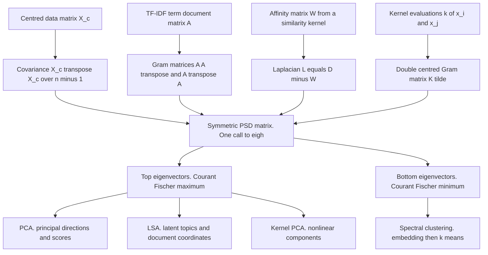
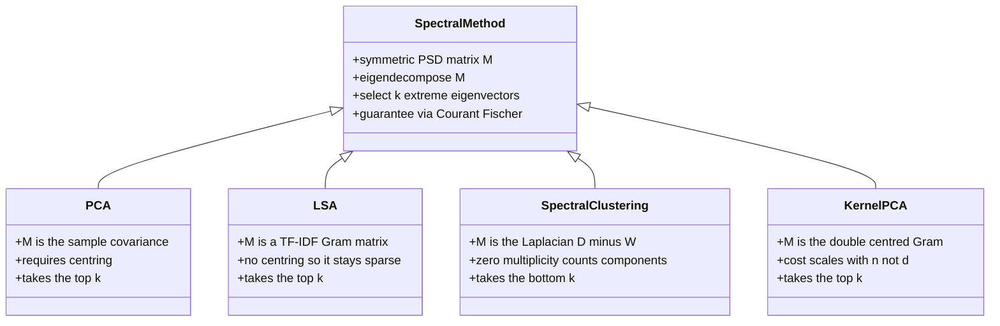

# One Eigendecomposition, Four Algorithms

*Part of the series "Why Learning Works: The Theorems Behind Machine Learning." Earlier instalments asked when learning is possible at all. This one asks something narrower and more useful: why does the single most reused computation in applied machine learning give the right answer?*

---

## Four Chapters, One `eigh` Call

Open four textbooks and you will find principal component analysis in the dimensionality-reduction chapter, latent semantic analysis in the information-retrieval chapter, spectral clustering in the unsupervised-learning chapter, and kernel PCA somewhere after support vector machines. Four names, four sets of hyperparameters, four folk traditions about when each one "works."

Strip the packaging and every one of them does this:

1. Build a symmetric matrix out of the data.
2. Compute its eigenvectors.
3. Keep the extreme ones.

Step 2 is the same call in all four cases. In NumPy it is `numpy.linalg.eigh`; in LAPACK it is `dsyevd`; in every case it is the routine specialised to *real symmetric* input, and choosing it over the general `eig` is not a micro-optimisation but an assertion that the spectral theorem applies. What differs between the four algorithms is only which matrix you hand it, and whether you take the top of the spectrum or the bottom.

That is not a cute observation. It has a consequence: **the optimality of all four is one theorem.** PCA is not optimal because of a fact about variance; it is optimal because a quadratic form on the unit sphere is maximised at the top eigenvector, and variance happens to be a quadratic form. Truncated SVD is not the best low-rank approximation because of anything about documents; it is best because of Eckart-Young-Mirsky, and LSA merely applies that to a term-document matrix. Once you have the theorems, the four algorithms are corollaries.

So this post proves the theorems. The spectral theorem's two load-bearing facts get three-line proofs; its existence half is standard and I cite it rather than pad. Courant-Fischer gets its top-eigenvalue case proved, which is the case every method here uses. Eckart-Young-Mirsky gets a complete proof in the Frobenius norm, including the trace lemma it rests on. Then the four algorithms fall out, and the last section says exactly what varies between them: one matrix, nothing else.

---

## The Spectral Theorem, and the Two Facts That Do the Work

> **Theorem 1 (spectral theorem, real symmetric case).** Let $A \in \mathbb{R}^{n \times n}$ satisfy $A^\top = A$. Then all eigenvalues of $A$ are real, and there exists an orthonormal basis $q_1, \dots, q_n$ of $\mathbb{R}^n$ consisting of eigenvectors of $A$. Equivalently $A = Q \Lambda Q^\top$ with $Q^\top Q = I$ and $\Lambda = \operatorname{diag}(\lambda_1, \dots, \lambda_n)$.

Two of the three claims have short proofs, and they are the two every algorithm below actually consumes.

**Eigenvalues are real.** A priori an eigenvalue could be complex, so work in $\mathbb{C}^n$ with the conjugate transpose $x^{*}$. Suppose $Ax = \lambda x$ with $x \neq 0$. Then

$$
\begin{aligned}
\overline{x^{*}Ax} \;=\; (x^{*}Ax)^{*} \;=\; x^{*}A^{*}x \;=\; x^{*}Ax,
\end{aligned}
$$

using $A^{*} = \overline{A}^\top = A^\top = A$ because $A$ is real and symmetric. A scalar equal to its own conjugate is real, so $x^{*}Ax \in \mathbb{R}$. Also $x^{*}x = \|x\|^2 > 0$. Hence

$$
\begin{aligned}
\lambda \;=\; \frac{x^{*}Ax}{x^{*}x} \;\in\; \mathbb{R}. \qquad \blacksquare
\end{aligned}
$$

**Eigenvectors for distinct eigenvalues are orthogonal.** Suppose $Ax = \lambda x$, $Ay = \mu y$, $\lambda \neq \mu$. Self-adjointness moves $A$ across the inner product:

$$
\begin{aligned}
\lambda \langle x, y\rangle \;=\; \langle Ax, y\rangle \;=\; x^\top A^\top y \;=\; x^\top A y \;=\; \langle x, Ay\rangle \;=\; \mu \langle x, y\rangle .
\end{aligned}
$$

So $(\lambda - \mu)\langle x, y\rangle = 0$, and since $\lambda \neq \mu$ we get $\langle x, y\rangle = 0$. $\blacksquare$

What remains is existence: that $A$ has $n$ eigenvectors at all, including inside repeated eigenvalues, where the argument above says nothing. The standard route is induction on $n$ — take a unit eigenvector $q_1$, which exists because the characteristic polynomial has a root over $\mathbb{C}$ and that root is real by the first fact; observe that symmetry makes $q_1^{\perp}$ an invariant subspace; apply the inductive hypothesis to the restriction of $A$ to it. It is a page, it is in every graduate text, and reproducing it here would add nothing: see Horn and Johnson, *Matrix Analysis*, Chapter 4, or Axler, *Linear Algebra Done Right*, Chapter 7. I use it; I do not prove it.

The reason to state the hypothesis carefully is that **symmetry is not a lucky property of the matrices below. It is forced by their construction.**

- A covariance matrix is $\Sigma = \mathbb{E}[(x-\mu)(x-\mu)^\top]$, and $(vv^\top)^\top = vv^\top$ pointwise, so $\Sigma^\top = \Sigma$.
- A Gram matrix has $K_{ij} = \langle \phi(x_i), \phi(x_j)\rangle = K_{ji}$, because inner products are symmetric.
- A graph Laplacian is $L = D - W$ with $W$ an affinity matrix, and an affinity is symmetric because "how similar are $i$ and $j$" does not depend on reading order.

There is a stronger property all three share. A matrix $M$ is **positive semidefinite** (PSD) when $v^\top M v \geq 0$ for all $v$; by Theorem 1 this is equivalent to $\lambda_i \geq 0$ for every $i$, since $q_i^\top M q_i = \lambda_i$. Covariance is PSD because $v^\top \Sigma v = \operatorname{Var}(v^\top x) \geq 0$. A Gram matrix is PSD because $v^\top K v = \|\sum_i v_i \phi(x_i)\|^2 \geq 0$. The Laplacian is PSD for a reason proved below. Symmetry buys the orthogonal basis; positive semidefiniteness buys nonnegative eigenvalues, which is what makes "sort the spectrum and keep the largest" a well posed instruction rather than an arbitrary one.

---

## Courant-Fischer: How an Eigenvector Becomes an Optimum

The spectral theorem is a statement about *structure*. It does not yet say eigenvectors solve any problem you care about. The bridge is the variational characterisation, and it is the reason anyone is entitled to call PCA optimal.

Fix a symmetric $A$ with eigenvalues ordered $\lambda_1 \geq \lambda_2 \geq \cdots \geq \lambda_n$ and matching orthonormal eigenvectors $q_1, \dots, q_n$. The **Rayleigh quotient** is $R(x) = \dfrac{x^\top A x}{x^\top x}$ for $x \neq 0$.

> **Theorem 2 (Courant-Fischer, top case).** $\displaystyle \max_{\|x\|=1} x^\top A x = \lambda_1$, attained at $x = q_1$. Symmetrically, $\displaystyle \min_{\|x\|=1} x^\top A x = \lambda_n$, attained at $q_n$.

*Proof.* The $q_i$ form an orthonormal basis, so write $x = \sum_{i=1}^n c_i q_i$ with $c_i = q_i^\top x$; orthonormality gives $\|x\|^2 = \sum_i c_i^2 = 1$. Expand, using $Aq_i = \lambda_i q_i$ and $q_i^\top q_j = \delta_{ij}$:

$$
\begin{aligned}
x^\top A x \;=\; \Big(\sum_i c_i q_i\Big)^{\!\top} \Big(\sum_j c_j \lambda_j q_j\Big) \;=\; \sum_{i,j} c_i c_j \lambda_j\, q_i^\top q_j \;=\; \sum_{i=1}^n \lambda_i c_i^2 .
\end{aligned}\tag{1}
$$

The weights $c_i^2$ are nonnegative and sum to one, so the right-hand side is a **convex combination of the eigenvalues**, and a convex combination never exceeds the largest of its terms:

$$
\begin{aligned}
\sum_{i=1}^n \lambda_i c_i^2 \;\leq\; \lambda_1 \sum_{i=1}^n c_i^2 \;=\; \lambda_1 ,
\end{aligned}
$$

with equality when all the weight sits on indices achieving $\lambda_1$ — in particular at $x = q_1$, where $c_1 = 1$. The minimum case replaces $\lambda_1$ by $\lambda_n$ in the same inequality. $\blacksquare$

That is the entire content, and it is worth naming what happened. Equation (1) says the quadratic form, restricted to the sphere, *is* an average of eigenvalues. Optimising over a continuum of directions collapses to picking the largest of $n$ numbers, because the eigenbasis diagonalises the problem.

One corollary makes iterated extraction legitimate.

> **Corollary 3 (deflation).** If $x$ is a unit vector orthogonal to $q_1, \dots, q_{k-1}$, then $x^\top A x \leq \lambda_k$, with equality at $x = q_k$.

*Proof.* Orthogonality to $q_1,\dots,q_{k-1}$ means $c_1 = \cdots = c_{k-1} = 0$ in the expansion above, so (1) becomes $x^\top Ax = \sum_{i \geq k} \lambda_i c_i^2 \leq \lambda_k \sum_{i \geq k} c_i^2 = \lambda_k$. $\blacksquare$

The general Courant-Fischer minimax theorem, $\lambda_k = \max_{\dim S = k} \min_{0 \neq x \in S} R(x)$, drops the requirement that the constraining subspace be spanned by eigenvectors, at the cost of a dimension-counting argument I do not need here; it is Theorem 4.2.6 in Horn and Johnson. Every method in this post uses only Theorem 2 and Corollary 3.

---

## PCA Is Courant-Fischer With a Covariance Matrix

Principal component analysis is usually motivated by a picture: find the direction of greatest spread. Write that down formally and the theorem is already proved.

Let $x$ be a random vector in $\mathbb{R}^d$ with mean $\mu$ and covariance $\Sigma$. For a unit vector $w$, the projection $w^\top x$ is a scalar random variable with

$$
\begin{aligned}
\operatorname{Var}(w^\top x) \;=\; \mathbb{E}\big[(w^\top x - w^\top \mu)^2\big] \;=\; \mathbb{E}\big[w^\top (x-\mu)(x-\mu)^\top w\big] \;=\; w^\top \Sigma w .
\end{aligned}
$$

The first principal direction is by definition $\arg\max_{\|w\|=1} w^\top \Sigma w$. That is verbatim the optimisation in Theorem 2 with $A = \Sigma$. So the first principal component is the top eigenvector of $\Sigma$, and the variance it captures is $\lambda_1$ — not by analogy and not by intuition, but because the objective *is* a Rayleigh quotient. The $j$-th principal direction is defined as the variance maximiser among unit vectors orthogonal to the first $j-1$, and Corollary 3 identifies it as $q_j$, with variance $\lambda_j$.

Two consequences come free. Since $\operatorname{tr}(\Sigma) = \sum_i \lambda_i$ and the trace is the total variance of the coordinates, the ratio $\lambda_j / \sum_i \lambda_i$ is the fraction of variance explained by component $j$; a scree plot is a picture of the spectrum. And because the $q_i$ are orthogonal, the components are uncorrelated: $\operatorname{Cov}(q_i^\top x, q_j^\top x) = q_i^\top \Sigma q_j = \lambda_j \delta_{ij}$. Decorrelation is not an extra design goal PCA happens to satisfy; it is Theorem 1's orthogonality, restated in statistical language.

The same eigenbasis diagonalises the Mahalanobis quadratic form, which is the identical object run backwards: for invertible $\Sigma$ we have $(x-\mu)^\top \Sigma^{-1}(x-\mu) = \sum_i \lambda_i^{-1}\big(q_i^\top(x-\mu)\big)^2$, so whitening, Mahalanobis outlier scores and PCA are three readings of one decomposition.

---

## SVD and Eckart-Young-Mirsky

PCA in practice is rarely computed from $\Sigma$. Forming $X^\top X$ squares the condition number and destroys small singular values; the numerically sane route is the singular value decomposition of the data matrix itself. The two are the same object.

Every real $X \in \mathbb{R}^{m \times n}$ factors as $X = U S V^\top$ with $U, V$ orthogonal and $S$ diagonal with entries $\sigma_1 \geq \cdots \geq \sigma_{\min(m,n)} \geq 0$. The connection to Theorem 1 is immediate:

$$
\begin{aligned}
X^\top X \;=\; V S^\top U^\top U S V^\top \;=\; V \big(S^\top S\big) V^\top ,
\end{aligned}
$$

which is an orthogonal diagonalisation of the symmetric PSD matrix $X^\top X$. So **the singular values are the square roots of the eigenvalues of $X^\top X$**, the right singular vectors $V$ are its eigenvectors, and by the mirror computation $XX^\top = U(SS^\top)U^\top$ the left singular vectors diagonalise the other Gram matrix. The number of nonzero $\sigma_i$ is the rank of $X$, since $U$ and $V$ are invertible and rank survives multiplication by them. One factorisation therefore hands you an orthonormal basis for the row space *and* one for the column space, aligned so that $Xv_i = \sigma_i u_i$.

Now centre the data: let $X_c$ have rows $x_i - \bar{x}$. The sample covariance is $S_{\text{cov}} = X_c^\top X_c/(n-1)$, so it shares eigenvectors with $X_c^\top X_c$ and has eigenvalues scaled by $1/(n-1)$. **PCA on $X$ is the SVD of $X_c$**, with $\lambda_i = \sigma_i^2/(n-1)$. Centring is exactly the hypothesis that makes them coincide; run an SVD on uncentred data and the first component points at the mean.

The theorem that makes truncation optimal is due to Eckart and Young (*Psychometrika*, 1936), who proved the Frobenius case, and to Mirsky (1960), who extended it to every unitarily invariant norm.

> **Theorem 4 (Eckart-Young-Mirsky, Frobenius case).** Let $X \in \mathbb{R}^{m \times n}$ have singular values $\sigma_1 \geq \cdots \geq \sigma_{\min(m,n)} \geq 0$, and let $X_k = \sum_{i=1}^{k} \sigma_i u_i v_i^\top$ be its rank-$k$ truncation. Then for every $B \in \mathbb{R}^{m\times n}$ with $\operatorname{rank}(B) \leq k$,
>
> $$
> \begin{aligned}
> \|X - B\|_F \;\geq\; \|X - X_k\|_F \;=\; \Big(\sum_{i > k} \sigma_i^2\Big)^{1/2}.
> \end{aligned}
> $$

The proof needs one lemma, which I prove rather than cite, because it is four lines and it is where the work happens.

> **Lemma 5 (trace minimum over projections).** Let $M \in \mathbb{R}^{n\times n}$ be symmetric with eigenvalues $\lambda_1 \geq \cdots \geq \lambda_n$, and let $W \in \mathbb{R}^{n \times p}$ satisfy $W^\top W = I_p$. Then $\operatorname{tr}(W^\top M W) \geq \sum_{i=n-p+1}^{n} \lambda_i$, the sum of the $p$ smallest eigenvalues.

*Proof.* Put $P = WW^\top$, the orthogonal projector onto the column space of $W$; it satisfies $P = P^\top = P^2$ and $\operatorname{tr}(P) = \operatorname{tr}(W^\top W) = p$. By cyclicity of the trace, $\operatorname{tr}(W^\top M W) = \operatorname{tr}(MP)$. Diagonalise $M = Q\Lambda Q^\top$ and set $t_i = q_i^\top P q_i$. Then

$$
\begin{aligned}
\operatorname{tr}(MP) \;=\; \operatorname{tr}\big(\Lambda\, Q^\top P Q\big) \;=\; \sum_{i=1}^n \lambda_i t_i ,
\end{aligned}
$$

where $t_i = q_i^\top P^2 q_i = \|Pq_i\|^2 \in [0,1]$ because $P$ is an orthogonal projector, and $\sum_i t_i = \operatorname{tr}(Q^\top P Q) = \operatorname{tr}(P) = p$. So we are minimising the linear functional $t \mapsto \sum_i \lambda_i t_i$ over the polytope $\{t \in [0,1]^n : \sum_i t_i = p\}$. If $t_i > 0$ for some $i$ while $t_j < 1$ for some $j$ with $\lambda_j < \lambda_i$, shifting mass from $i$ to $j$ strictly decreases the objective. So the minimum puts $t_i = 1$ on the $p$ smallest eigenvalues and $0$ elsewhere, with value $\sum_{i=n-p+1}^n \lambda_i$. $\blacksquare$

*Proof of Theorem 4.* First the value. Write $X - X_k = \sum_{i>k} \sigma_i u_i v_i^\top$. The rank-one terms are orthonormal in the trace inner product, since

$$
\begin{aligned}
\langle u_iv_i^\top,\, u_jv_j^\top\rangle_F \;=\; \operatorname{tr}\big(v_i u_i^\top u_j v_j^\top\big) \;=\; (u_i^\top u_j)(v_j^\top v_i) \;=\; \delta_{ij}.
\end{aligned}
$$

Hence $\|X - X_k\|_F^2 = \sum_{i>k}\sigma_i^2$, as claimed.

Now the bound. Let $\operatorname{rank}(B) \le k$. By rank-nullity, $\dim \ker(B) \geq n - k$; choose orthonormal $w_1, \dots, w_{n-k} \in \ker(B)$ and collect them as the columns of $W$. Extend them to an orthonormal basis of $\mathbb{R}^n$. The Frobenius norm satisfies $\|A\|_F^2 = \sum_{e} \|Ae\|^2$ over any orthonormal basis, so dropping the extra basis vectors gives

$$
\begin{aligned}
\|X - B\|_F^2 \;\geq\; \sum_{j=1}^{n-k} \big\|(X-B)w_j\big\|^2 \;=\; \sum_{j=1}^{n-k} \|Xw_j\|^2 \;=\; \operatorname{tr}\!\big(W^\top X^\top X\, W\big),
\end{aligned}
$$

where the middle equality is $Bw_j = 0$. Apply Lemma 5 with $M = X^\top X$, whose eigenvalues are $\sigma_1^2 \geq \cdots \geq \sigma_n^2$, and $p = n-k$:

$$
\begin{aligned}
\operatorname{tr}\!\big(W^\top X^\top X W\big) \;\geq\; \sum_{i=k+1}^{n} \sigma_i^2 \;=\; \|X - X_k\|_F^2 . \qquad \blacksquare
\end{aligned}
$$

Mirsky's generalisation — that the same $X_k$ is optimal in *every* unitarily invariant norm, with spectral-norm error exactly $\sigma_{k+1}$ — rests on the theory of symmetric gauge functions and is proved in his 1960 paper. I state it and use it; it does not fit here.

The practical reading of Theorem 4 is stronger than "SVD is a good compressor." It says the greedy answer is the global one. No rank-$k$ matrix anywhere, however cleverly constructed, beats truncating the spectrum, and the error is known in closed form *before* you truncate: the singular values tell you exactly what each $k$ costs.



---

## The Same Machinery, Three More Times

### Latent Semantic Analysis

LSA, introduced by Deerwester, Dumais, Furnas, Landauer and Harshman in 1990, is Theorem 4 applied to text. Build a term-document matrix $A \in \mathbb{R}^{m \times n}$ over $m$ vocabulary terms and $n$ documents with TF-IDF weighted entries, then replace $A$ by $A_k = U_k S_k V_k^\top$. Because Theorem 4 says $A_k$ is the closest rank-$k$ matrix, the resulting $k$-dimensional representation is not one compression among many; it is the least-squares optimal one. The retrieval payoff is that $A$ is sparse and nearly orthogonal between synonym pairs — "car" and "automobile" share no coordinate — whereas $A_k$ is dense, and two documents using different vocabulary for one idea land near each other because truncation forces correlated terms onto shared latent axes. In the eigen picture, $AA^\top$ is a term-term co-occurrence matrix and $A^\top A$ a document-document similarity matrix, and LSA diagonalises both at once. Note what it is *not*: there is no centring, so LSA is a truncated SVD but not PCA — which is exactly why it can run on a sparse matrix without ever materialising a dense mean-subtracted copy.

**The orientation trap.** The literature writes $A$ as terms $\times$ documents; scikit-learn's `TruncatedSVD` follows the estimator convention and expects samples $\times$ features, meaning documents $\times$ terms, the transpose. The two conventions swap the roles of $U$ and $V$. So with `TruncatedSVD` fitted on a document-term matrix, `components_` is $k \times m$ and its rows are the *topic-term* loadings you read to name a topic, while `transform` returns the $n \times k$ *document* coordinates you feed downstream. Half the confusion around LSA implementations is people looking for topic words inside the object holding document scores.

### Spectral Clustering

Given points and a similarity kernel, build a symmetric affinity matrix $W$ with $w_{ij} \geq 0$, set $D = \operatorname{diag}(d_i)$ with $d_i = \sum_j w_{ij}$, and define the unnormalised Laplacian $L = D - W$. Everything about $L$ follows from one identity.

> **Proposition 6.** For every $x \in \mathbb{R}^n$, $\;x^\top L x = \dfrac{1}{2}\sum_{i,j} w_{ij}(x_i - x_j)^2$.

*Proof.* Expand and symmetrise, using $d_i = \sum_j w_{ij}$ and $w_{ij} = w_{ji}$:

$$
\begin{aligned}
x^\top L x &\;=\; \sum_i d_i x_i^2 \;-\; \sum_{i,j} w_{ij} x_i x_j \\
&\;=\; \tfrac{1}{2}\Big( \sum_{i,j} w_{ij} x_i^2 \;-\; 2\sum_{i,j} w_{ij} x_i x_j \;+\; \sum_{i,j} w_{ij} x_j^2 \Big) \\
&\;=\; \tfrac{1}{2} \sum_{i,j} w_{ij} \big(x_i - x_j\big)^2 . \qquad \blacksquare
\end{aligned}
$$

Two facts read straight off it. Since $w_{ij} \geq 0$, the right side is nonnegative, so $L$ is PSD and Theorem 1 applies with an ordered nonnegative spectrum. And $x^\top L x = 0$ forces $x_i = x_j$ whenever $w_{ij} > 0$ — that is, $x$ is constant on each connected component of the affinity graph — while conversely every such $x$ lies in the kernel. So the eigenspace of $\lambda = 0$ is spanned by the indicator vectors of the connected components, and **the multiplicity of the zero eigenvalue equals the number of components** (von Luxburg, Proposition 2). Clustering is the perturbative version of that statement: when components are joined by a few weak edges instead of none, the corresponding eigenvalues lift slightly off zero and the bottom $k$ eigenvectors are approximately those indicators. The algorithm — embed each point as its row in the matrix of the bottom $k$ eigenvectors, then run $k$-means in $\mathbb{R}^k$ — is a relaxation of the discrete RatioCut or NCut objective, derived in von Luxburg's tutorial, which also covers the normalised variants $L_{\text{sym}} = I - D^{-1/2}WD^{-1/2}$ and $L_{\text{rw}} = I - D^{-1}W$. This is PCA's theorem read from the other end: Courant-Fischer's minimum instead of its maximum.

### Kernel PCA

Schölkopf, Smola and Müller's 1998 construction runs PCA in a feature space $\mathcal{H}$ reached by a map $\phi$, without ever computing $\phi$. The feature-space covariance is $C = \frac{1}{n}\sum_i \phi(x_i)\phi(x_i)^\top$ and its eigenvectors satisfy $Cv = \lambda v$. The observation that makes this tractable is that $Cv$ is a linear combination of the $\phi(x_i)$, so any eigenvector with $\lambda \neq 0$ lies in their span: $v = \sum_i \alpha_i \phi(x_i)$. Substituting and taking inner products with each $\phi(x_j)$ turns an eigenproblem in $\mathcal{H}$ — possibly infinite-dimensional — into

$$
\begin{aligned}
K \alpha \;=\; n \lambda\, \alpha, \qquad K_{ij} = k(x_i, x_j) = \langle \phi(x_i), \phi(x_j)\rangle,
\end{aligned}
$$

an $n \times n$ symmetric PSD eigenproblem, which is Theorem 1 again. The projection of a new point onto component $j$ is $\sum_i \alpha_i^{(j)} k(x_i, x)$: kernel evaluations only. PCA required centred data, and here centring must happen in $\mathcal{H}$, which is done on the Gram matrix directly by the double-centering formula

$$
\begin{aligned}
\tilde{K} \;=\; K - \mathbf{1}_n K - K \mathbf{1}_n + \mathbf{1}_n K \mathbf{1}_n, \qquad (\mathbf{1}_n)_{ij} = 1/n .
\end{aligned}
$$

I am stating this, not deriving it. The derivation substitutes $\tilde{\phi}(x_i) = \phi(x_i) - \frac{1}{n}\sum_r \phi(x_r)$ into $\langle \tilde\phi(x_i), \tilde\phi(x_j)\rangle$ and expands the four resulting terms; it is in the 1998 paper. The trade is worth naming: kernel PCA's matrix is $n \times n$ rather than $d \times d$, so it scales with the number of samples, not the number of features.

---

## What Actually Varies

Only the matrix.

| Method | Matrix decomposed | Symmetric because | End of spectrum | Output |
|---|---|---|---|---|
| PCA | Covariance $X_c^\top X_c/(n-1)$ | $(vv^\top)^\top = vv^\top$ | Top $k$ | Directions of maximal variance |
| LSA | Term-document $A$, via $A^\top A$ and $AA^\top$ | Gram matrix | Top $k$ | Latent topics, document coordinates |
| Spectral clustering | Laplacian $L = D - W$ | Affinity is symmetric | Bottom $k$ | Embedding, then $k$-means |
| Kernel PCA | Centred Gram $\tilde{K}$ | Inner products are symmetric | Top $k$ | Nonlinear components |

Everything else is shared. Symmetry buys the orthogonal eigenbasis, by Theorem 1. Positive semidefiniteness buys a nonnegative, orderable spectrum, so "keep the largest $k$" is well posed. Courant-Fischer turns "the top eigenvector" into "the solution of an optimisation problem," which is what licenses the word *optimal* in all four cases, and Eckart-Young-Mirsky upgrades that from one direction to a whole subspace, making truncation globally best rather than merely greedy. Choosing among the four is not choosing among algorithms. It is choosing what "similar" means, writing that down as a symmetric matrix, and calling `eigh`.

There is a fifth instance, and it is worth visiting precisely because it breaks the pattern. PageRank is the dominant eigenvector of a stochastic transition matrix, which is *not* symmetric, so nothing above applies and the guarantee comes from Perron-Frobenius instead. I derived it in [PageRank: The Eigenvector That Launched Google](https://juanlara18.github.io/portfolio/#/blog/pagerank-eigenvectors) and will not repeat it here; the contrast is the point. Symmetry is what you give up when you move from similarity to flow, and the theorem you need changes with it.



---

## Testing Theorem 4 Against Brute Force

Eckart-Young-Mirsky is a claim about *all* rank-$k$ matrices, which is the kind of claim worth attacking numerically. Take a random $40 \times 25$ matrix, truncate its SVD at $k=5$, then hunt for something better: fifty thousand blindly sampled rank-$5$ matrices, each optimally rescaled to give it the best possible chance, plus a hundred restarts of alternating least squares, the standard local optimiser for exactly this objective.

```python
import numpy as np

rng = np.random.default_rng(0)
m, n, k = 40, 25, 5
X = rng.normal(size=(m, n)) @ rng.normal(size=(n, n))     # full-rank test matrix

U, s, Vt = np.linalg.svd(X, full_matrices=False)
X_k = (U[:, :k] * s[:k]) @ Vt[:k]                          # rank-k truncation
svd_err = np.linalg.norm(X - X_k, "fro")
tail = np.sqrt((s[k:] ** 2).sum())                         # the theorem's predicted value

def frob(B):
    return np.linalg.norm(X - B, "fro")

blind, refined = np.inf, np.inf
for trial in range(50_000):
    A = rng.normal(size=(m, k))
    B = rng.normal(size=(k, n))
    C = A @ B
    blind = min(blind, frob(C * ((X * C).sum() / (C * C).sum())))   # optimal rescaling
    if trial < 100:                                                 # alternating least squares
        for _ in range(200):
            B = np.linalg.lstsq(A, X, rcond=None)[0]
            A = np.linalg.lstsq(B.T, X.T, rcond=None)[0].T
        refined = min(refined, frob(A @ B))

print(f"||X - X_k||_F  truncated SVD        = {svd_err:.8f}")
print(f"sqrt(sum_(i>k) sigma_i^2)  predicted = {tail:.8f}")
print(f"best of 50000 random rank-{k}        = {blind:.8f}")
print(f"best of 100 ALS-optimised rank-{k}   = {refined:.8f}")
print(f"anything strictly beat the SVD?      {min(blind, refined) < svd_err - 1e-9}")
print(f"ALS gap above the theorem's bound    = {refined - tail:.2e}")
```

```text
||X - X_k||_F  truncated SVD        = 93.96322019
sqrt(sum_(i>k) sigma_i^2)  predicted = 93.96322019
best of 50000 random rank-5        = 151.97521146
best of 100 ALS-optimised rank-5   = 93.96322019
anything strictly beat the SVD?      False
ALS gap above the theorem's bound    = 0.00e+00
```

Three things to read here. The truncation error agrees with $\big(\sum_{i>k}\sigma_i^2\big)^{1/2}$ to all printed digits, which is the closed form in Theorem 4. Blind sampling is hopeless, $151.98$ against $93.96$, because rank-$5$ matrices form a thin nonconvex set inside a $1000$-dimensional space. And the local optimiser, which actually works, converges to the SVD value with a gap of exactly zero in double precision from all hundred starts. That is what a global optimum looks like from the inside: the search does not merely fail to beat it, it keeps arriving at it.

## PCA Two Ways

The second check is the identity from the SVD section. Eigendecomposing the covariance and running an SVD on the centred data must give the same axes and the same variances.

```python
import numpy as np

rng = np.random.default_rng(7)
n, d = 500, 6
A = rng.normal(size=(d, d))
X = rng.normal(size=(n, d)) @ A + np.array([3.0, -1.0, 0.5, 2.0, 0.0, -4.0])

Xc = X - X.mean(axis=0)                       # centring is what makes the two agree
S = Xc.T @ Xc / (n - 1)                       # sample covariance, symmetric by construction

lam, Q = np.linalg.eigh(S)                    # ascending; eigh assumes symmetry
lam, Q = lam[::-1], Q[:, ::-1]                # descending, to match SVD order

U, sig, Vt = np.linalg.svd(Xc, full_matrices=False)
lam_svd = sig ** 2 / (n - 1)                  # eigenvalues of S from singular values

sign = np.sign((Q * Vt.T).sum(axis=0))        # eigenvectors are defined only up to sign
V = Vt.T * sign

print("k   lambda_k (eigh)   sigma_k^2/(n-1)   |difference|   1 - |q_k . v_k|")
for k in range(d):
    align = 1.0 - abs(Q[:, k] @ V[:, k])      # zero means the two axes coincide
    print(f"{k+1}   {lam[k]:13.8f}   {lam_svd[k]:15.8f}   "
          f"{abs(lam[k]-lam_svd[k]):12.2e}   {align:14.2e}")

w = Q[:, 0]
print(f"\nmax over unit w of Var(w^T x) = {(Xc @ w).var(ddof=1):.8f}  vs lambda_1 = {lam[0]:.8f}")
print(f"trace(S) = {np.trace(S):.8f}   sum of eigenvalues = {lam.sum():.8f}")
print(f"orthonormality  max|Q^T Q - I| = {abs(Q.T @ Q - np.eye(d)).max():.2e}")
```

```text
k   lambda_k (eigh)   sigma_k^2/(n-1)   |difference|   1 - |q_k . v_k|
1     17.03824832       17.03824832       2.13e-14        -1.11e-15
2      7.62148584        7.62148584       7.11e-15        -4.44e-16
3      3.69898594        3.69898594       2.22e-15        -6.66e-16
4      2.00720124        2.00720124       1.33e-15        -2.22e-16
5      1.19161871        1.19161871       2.22e-15        -4.44e-16
6      0.07667179        0.07667179       2.78e-17        -6.66e-16

max over unit w of Var(w^T x) = 17.03824832  vs lambda_1 = 17.03824832
trace(S) = 31.63421185   sum of eigenvalues = 31.63421185
orthonormality  max|Q^T Q - I| = 1.11e-15
```

Every column is a theorem. The eigenvalues match $\sigma_k^2/(n-1)$ to $10^{-14}$. The axes are parallel to within one part in $10^{15}$, the sign flip being the only genuine ambiguity in an eigenvector. The realised variance along $q_1$ is $\lambda_1$, which is Theorem 2 evaluated at its maximiser. The trace equals the eigenvalue sum, which is why scree plots add to one. And $Q$ is orthonormal to machine precision, which is Theorem 1. None of this depends on the seed: change the data and the numbers move together, because they are five readings of one decomposition.

---

## Going Deeper

**Books:**
- Horn, R. A., & Johnson, C. R. (2012). *Matrix Analysis*, 2nd ed. Cambridge University Press.
  - The reference for the existence half of Theorem 1, the full Courant-Fischer minimax theorem, and Weyl's singular value inequalities.
- Strang, G. (2019). *Linear Algebra and Learning from Data.* Wellesley-Cambridge Press.
  - Written around this post's thesis: the SVD as the organising computation of applied linear algebra.
- Golub, G. H., & Van Loan, C. F. (2013). *Matrix Computations*, 4th ed. Johns Hopkins University Press.
  - Why you should never form $X^\top X$ when an SVD of $X$ will do, with the conditioning analysis behind the warning.
- Axler, S. (2024). *Linear Algebra Done Right*, 4th ed. Springer.
  - Builds the spectral theorem from self-adjointness without determinants; free from the author's site.

**Online Resources:**
- [MIT 18.06SC Linear Algebra, OpenCourseWare](https://ocw.mit.edu/courses/18-06sc-linear-algebra-fall-2011/) — Strang's course, with the symmetric-matrix and SVD units usable as standalone problem sets.
- [The Extraordinary SVD](https://doi.org/10.4169/amer.math.monthly.119.10.838) — Martin and Porter's *American Mathematical Monthly* survey of what this one factorisation buys you.
- [A Tutorial on Spectral Clustering, arXiv:0711.0189](https://arxiv.org/abs/0711.0189) — von Luxburg's preprint, free, and the source of the Laplacian propositions used above.
- [scikit-learn decomposition user guide](https://scikit-learn.org/stable/modules/decomposition.html) — the orientation conventions for `TruncatedSVD` and `KernelPCA`, worth reading before debugging either.

**Videos:**
- [MIT 18.065, Matrix Methods in Data Analysis, Signal Processing, and Machine Learning, Spring 2018](https://www.youtube.com/playlist?list=PLUl4u3cNGP63oMNUHXqIUcrkS2PivhN3k) by Gilbert Strang — the whole course is this post's argument, at semester length.
- [Essence of linear algebra](https://www.youtube.com/playlist?list=PLZHQObOWTQDPD3MizzM2xVFitgF8hE_ab) by 3Blue1Brown — the geometric picture of eigenvectors and change of basis that makes equation (1) obvious in hindsight.

**Academic Papers:**
- Eckart, C., & Young, G. (1936). ["The approximation of one matrix by another of lower rank."](https://doi.org/10.1007/BF02288367) *Psychometrika*, 1(3), 211-218.
  - Theorem 4 in its original form, arrived at from factor analysis rather than from compression.
- Mirsky, L. (1960). ["Symmetric gauge functions and unitarily invariant norms."](https://doi.org/10.1093/qmath/11.1.50) *Quarterly Journal of Mathematics*, 11(1), 50-59.
  - The generalisation to every unitarily invariant norm, which is why the theorem carries three names.
- Deerwester, S., Dumais, S. T., Furnas, G. W., Landauer, T. K., & Harshman, R. (1990). ["Indexing by latent semantic analysis."](https://doi.org/10.1002/(SICI)1097-4571(199009)41:6<391::AID-ASI1>3.0.CO;2-9) *Journal of the American Society for Information Science*, 41(6), 391-407.
  - LSA as originally proposed; the retrieval motivation is clearer here than in any later summary.
- Schölkopf, B., Smola, A., & Müller, K.-R. (1998). ["Nonlinear component analysis as a kernel eigenvalue problem."](https://doi.org/10.1162/089976698300017467) *Neural Computation*, 10(5), 1299-1319.
  - Kernel PCA, including the derivation of the double-centering formula stated above.
- von Luxburg, U. (2007). ["A tutorial on spectral clustering."](https://doi.org/10.1007/s11222-007-9033-z) *Statistics and Computing*, 17(4), 395-416.
  - The Laplacian propositions, the RatioCut and NCut relaxations, and an unusually honest section on when the method fails.

**Questions to Explore:**
- Theorem 4 is exact for the Frobenius and spectral norms and, by Mirsky, for every unitarily invariant norm — but it is false for the entrywise maximum norm. What structural property of a norm makes the greedy spectral answer globally optimal, and is unitary invariance necessary as well as sufficient?
- Lemma 5 reduces a matrix optimisation to a linear program whose optimal vertices are $0$-$1$ vectors. That is the same phenomenon making the RatioCut relaxation tight for disconnected graphs. Is there one statement about the eigenvalue polytope from which both follow?
- Spectral clustering uses the bottom of the spectrum and PCA the top, yet both are Courant-Fischer. Is there a natural class of problems whose answer lives in the *middle* of a spectrum, and what would its variational characterisation be?
- Kernel PCA replaces a $d \times d$ problem with an $n \times n$ one, and Nyström and random-feature methods trade accuracy to get back to the small side. Where exactly does the Eckart-Young guarantee degrade when the Gram matrix is itself only an approximation?
- All four methods assume a fixed matrix, but under streaming or drifting data the matrix moves. Which guarantees survive as perturbation statements, and how large may the perturbation be before the top-$k$ subspace stops meaning anything?
