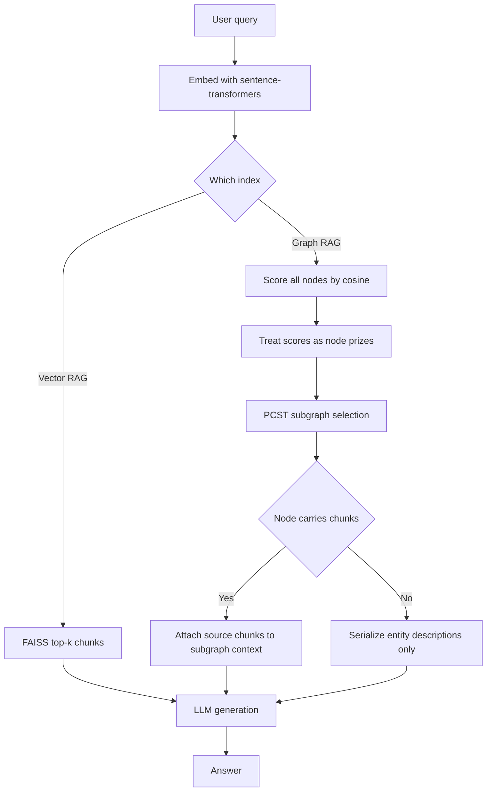
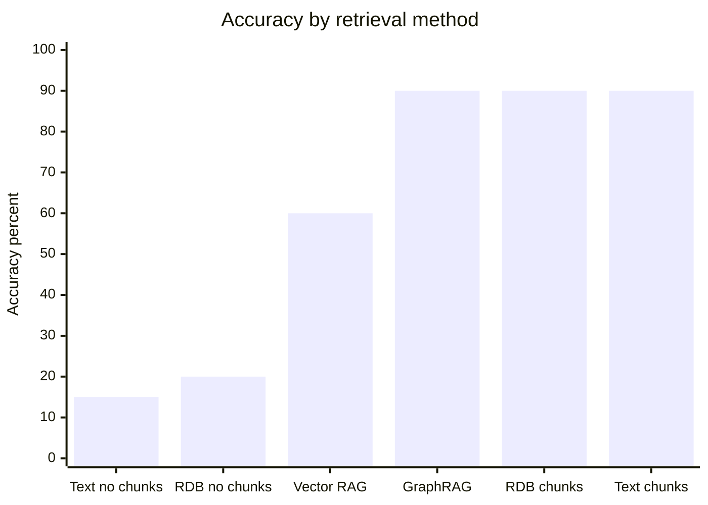
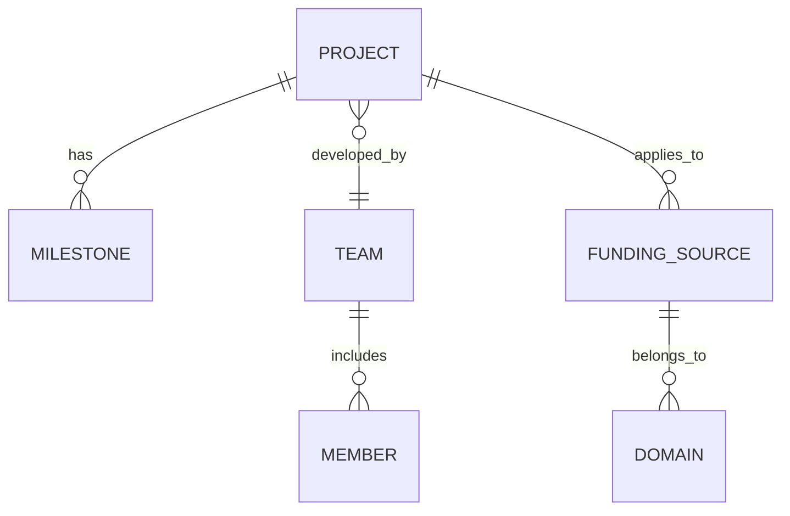
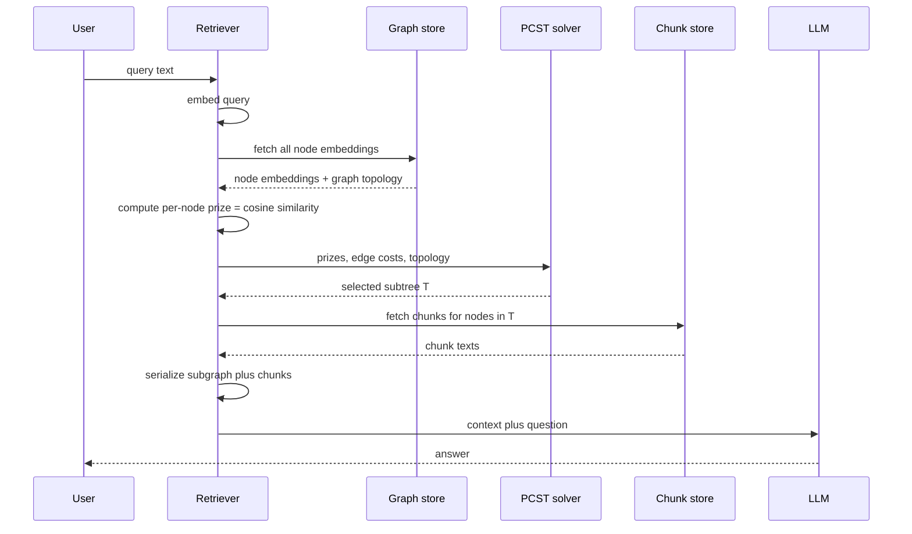

# Ontology-Grounded RAG: Why Chunks-in-Nodes Matter More Than the Ontology Itself

A grant application is a strange artifact. It has the rigor of a technical proposal, the hedging of a legal document, the optimism of a pitch deck, and the cross-referenced geometry of a company org chart stapled to a financial model. When da Cruz, Tavares, and Belo chose a real grant application from a startup called Granter.ai as the evaluation corpus for their 2025 study, *Ontology Learning and Knowledge Graph Construction: A Comparison of Approaches and Their Impact on RAG Performance* (arXiv:2511.05991), they picked a domain that punishes shortcuts. Any question you pose — "how does the team scale the platform to new funding domains?" — has an answer that lives across three sections, cross-referenced to two tables, and implicitly defined by a relationship that never appears in a single sentence anywhere.

This is a good stress test. A vector RAG system retrieves passages by cosine similarity and hopes the answer lives inside them. A graph RAG system builds structure — entities, relations, maybe communities — and retrieves subgraphs, hoping the *topology* of the answer is captured by the graph. The paper asks a blunt question: does it matter how you build that graph? And the answer it arrives at is not the one most readers will expect.

Six configurations. Twenty manually authored questions. Same underlying LLM. Here are the accuracy numbers, in the order the paper reports them:

| Configuration                          | Correct   |
|----------------------------------------|-----------|
| Vector RAG (baseline)                  | 12/20 (60%) |
| Microsoft GraphRAG                     | 18/20 (90%) |
| RDB-ontology KG, with chunks           | 18/20 (90%) |
| Text-ontology KG, with chunks          | 18/20 (90%) |
| RDB-ontology KG, no chunks             | 4/20 (20%)  |
| Text-ontology KG, no chunks            | 3/20 (15%)  |

Read that table twice. The gap between the best graph methods and naive vector RAG is 30 points. The gap between "ontology with chunks" and "ontology without chunks" is *70 points*. The gap between RDB-derived and text-derived ontologies, once chunks are in the nodes, is *zero*.

Most commentary on ontology-plus-graph-RAG papers dwells on the wrong axis. It asks whether structured schema or text extraction is the better ontology source. That debate is over in this paper by accident — both hit 90% when wired into a retriever that has text in its nodes, and both collapse below the naive baseline when they don't. The ontology is a trellis. The chunks are the climbing roses. An empty trellis is decorative wood. A wild rose bush with no trellis flops on the ground and looks fine. The miracle is what happens when you put the two together — but the miracle is mostly about the roses, not the trellis.

This post is going to spend the bulk of its time on that reading. I'll also cover the genuinely useful secondary result — that if your domain has a stable relational schema, you get the ontology essentially for free via a RIGOR-style pipeline and skip the per-update LLM extraction loop. And I'll sketch the retrieval side, including the Prize-Collecting Steiner Tree (PCST) subgraph selector the authors borrowed from G-Retriever, because PCST is the most underrated piece of graph-RAG plumbing of the last two years.

If you want background before going further, three posts on this blog frame what I'm about to say: [Ontologies for knowledge bases](/blog/ontologies-building-knowledge-bases), [Knowledge graphs in practice](/blog/knowledge-graphs-practice), and the reference [RAG primer](/blog/rag-retrieval-augmented-generation). The current post assumes you've already internalized the difference between a vector index and a graph index, and that "chunk" means a 300-to-1000-token passage produced by some splitter over the source corpus.

## The Six-Way Bakeoff

Before getting to the interpretation, let me be concrete about the setup.

**Corpus.** A single grant application document from Granter.ai — a technology startup applying for funding. The document covers company context, technical methodologies, team structure, financials, and a scalability narrative. The authors acknowledge upfront that a single document is a limited empirical base; we'll come back to that when we talk about generalizability.

**Questions.** Twenty manually written questions spanning five categories — corporate info, technical, strategic, financial, scalability/impact. Each question is hand-labeled with a gold answer, and responses are classified into one of four buckets: *correct*, *incomplete*, *false/wrong*, or *I don't know*.

**Models and embeddings.** All six configurations share the same LLM for generation and the same embedding model (sentence-transformers) for vector retrieval. The only thing that varies across configurations is how the index is built and how retrieval walks it.

**The six configurations.**

1. **Vector RAG.** Split the document into chunks, embed them, index them in FAISS, retrieve top-k by cosine, feed to the LLM. This is the baseline everyone has deployed by mid-2024.
2. **Microsoft GraphRAG.** LLM extracts entities and relations from text, builds a graph, detects communities with a hierarchical algorithm, generates community summaries at multiple levels. Retrieval can be local (entity-centric) or global (community-summary-centric). This is the current graph-RAG reference.
3. **RDB-ontology KG, without chunks.** Derive an OWL ontology from the relational schema that sits behind the document — tables become classes, foreign keys become object properties, lookup tables become taxonomies. The ontology's individuals (instances) populate the KG. Nodes carry structured properties; they do not carry raw text.
4. **RDB-ontology KG, with chunks.** Same as (3), but each node additionally carries a list of source chunks that mention or support that entity. Retrieval surfaces the node *and* the attached chunks.
5. **Text-ontology KG, without chunks.** Run an LLM over the corpus sentence-by-sentence, extract (subject, predicate, object) triples, accumulate them into an OWL ontology and a KG. Nodes are entities; they carry structured properties but no raw text.
6. **Text-ontology KG, with chunks.** Same as (5), but each node links back to the chunks from which its triples were extracted.

All three graph-based approaches (GraphRAG, RDB, text) retrieve subgraphs using the same PCST routine: embed a query, score nodes by cosine against their descriptions, treat the scores as node prizes, pay uniform edge cost, solve for the max-prize connected subgraph, serialize its nodes and edges (and, where applicable, its attached chunks) into LLM context.

Here is the retrieval pipeline in one picture:



The fork at the bottom of that diagram — "node carries chunks" yes or no — is where the entire chunk cliff lives.

## Reading the Chunk Cliff

Let me plot the numbers a different way.

| Method            | Accuracy |
|-------------------|----------|
| RDB no chunks     | 20%      |
| Text no chunks    | 15%      |
| Vector RAG        | 60%      |
| GraphRAG          | 90%      |
| RDB with chunks   | 90%      |
| Text with chunks  | 90%      |

And as a simple bar chart:



The conventional story you want to tell is that structure beats unstructured retrieval. That story is half right. Graph-based methods do outperform vector RAG — by 30 percentage points in the "with chunks" setting. But there is a *second* story hiding in the same data, and it's the one that should rewire your intuition: *ontology without text is worse than no ontology at all*. A KG whose nodes hold only entity identifiers, types, and structured relations scores 15-to-20%. That's less than rolling a die. Vector RAG, which knows nothing about structure, beats it handily.

Why? Think about what a chunk carries that an entity label does not. When the grant asks "how does Granter.ai plan to scale the platform to new funding domains?", the gold answer is a paragraph that spans "federated domain adapters" and "regulatory harmonization via the compliance ontology module." Those phrases are in the *prose*. The KG node for "Granter.ai platform" knows it's a `SoftwareSystem` with a relation `scales_to` pointing at `NewFundingDomain`, but it does not contain the phrases the LLM needs to compose a sentence. The ontology tells you *where* to look. The chunks are *what you look at*.

This is the interpretable handle argument. An ontology is a set of nameable handles — classes, properties, instances — that a retriever can reach for. Vector RAG has no handles; it has only a point cloud. A graph with no text in it has handles but nothing attached to them. A graph with text in it has handles with evidence hanging off them. The LLM, once it has evidence in context, is very good at composing; it is bad at guessing what evidence must have existed.

Another way to put this: the ontology + chunks pattern separates *addressing* from *content*. The ontology is the address book. The chunks are the letters. A retrieval system without chunks is trying to answer questions from the return addresses alone.

It's worth being precise about what "chunks in nodes" means mechanically. Each entity in the KG has, in addition to its RDF-style properties, a field like `source_chunks: List[ChunkID]` that points at a chunk store (flat list, embedded). When retrieval selects a subgraph, the system unions the chunk sets of every node in the subgraph and passes them to the LLM alongside a serialized view of the subgraph's structure. The structure tells the LLM which chunks are related to which; the chunks give the LLM the prose it needs to compose an answer.

One way to see why naive vector RAG underperforms graph-plus-chunks is that *chunk retrieval on its own is unordered*. Vector top-k gives you five chunks that each look relevant to the query embedding, but it tells you nothing about how they relate. The LLM has to infer that "federated domain adapters" (in chunk 3) is a subsystem of "Granter.ai platform" (in chunk 7) and that both tie to the scalability narrative in chunk 12. A graph-plus-chunks retriever hands the LLM the *same chunks* but with relational edges already drawn between them. That's the 30-point lift from vector RAG to graph-plus-chunks, and it is almost entirely about explicit relations between chunks rather than any magic in the graph structure itself.

## Inside a Chunk-Enhanced Node

Let me show what this looks like in the storage layer. Here's a JSON view of a node, roughly matching what you'd get from the RDB pipeline:

```python
{
  "id": "ent:GranterAIPlatform",
  "type": "ont:SoftwareSystem",
  "label": "Granter.ai funding automation platform",
  "properties": {
    "ont:foundedYear": 2024,
    "ont:licenseModel": "SaaS subscription",
    "ont:primaryLanguage": "Portuguese-English bilingual"
  },
  "relations": [
    {"predicate": "ont:scales_to", "object": "ent:EUFundingDomain"},
    {"predicate": "ont:scales_to", "object": "ent:USNSFDomain"},
    {"predicate": "ont:developed_by", "object": "ent:GranterAITeam"},
    {"predicate": "ont:uses_module", "object": "ent:ComplianceOntologyModule"}
  ],
  "source_chunks": ["chunk_0007", "chunk_0031", "chunk_0044"],
  "embedding": [0.041, -0.118, 0.502, ...]
}
```

Three things to notice. First, the node has a dense embedding — computed not from the raw text but from a textualized rendering of the node (label plus type plus relations plus a one-line summary). That rendering is what the retriever scores against the query. Second, relations are first-class: they have predicates (like `ont:scales_to`) that come from the ontology, not free-form strings. Third, `source_chunks` is a list of pointers, not inline text; the chunks live in a separate store with their own embeddings, and they're joined at retrieval time. This separation matters because a chunk can and often does support multiple entities, and duplicating chunks inside every node would blow up storage.

The equivalent in Cypher, if you're running this on Neo4j, looks like:

```cypher
// A single entity node with its chunk pointers and a relation
MERGE (p:SoftwareSystem {id: 'ent:GranterAIPlatform'})
  SET p.label = 'Granter.ai funding automation platform',
      p.foundedYear = 2024,
      p.embedding = $platformEmbedding
WITH p
MATCH (d:FundingDomain {id: 'ent:EUFundingDomain'})
MERGE (p)-[:SCALES_TO]->(d)
WITH p
UNWIND ['chunk_0007','chunk_0031','chunk_0044'] AS cid
MATCH (c:Chunk {id: cid})
MERGE (p)-[:SUPPORTED_BY]->(c)
```

Chunks are nodes too. Entities point to them via `SUPPORTED_BY` edges. The graph is actually heterogeneous: ontology-typed nodes on one side, generic chunk nodes on the other, connected by a single edge type that says "this prose supports this entity." Many production graph-RAG stacks already look like this; what the paper clarifies is that you cannot safely drop the chunk layer once you have the ontology layer, even though it would be tempting to do so for storage efficiency or schema purity reasons.

## Where the Ontology Comes From

The "how you build the ontology" axis is the one the paper's title foregrounds and the one that, per the numbers, matters least for end-to-end accuracy. But it matters a lot for *cost* — construction cost, update cost, and auditability — and it's where the paper earns its practical keep.

The two pipelines they compare:

**RDB pipeline (RIGOR-adapted).** The authors adapt the RIGOR method, which comes out of the OBDA (Ontology-Based Data Access) tradition. If you've ever used Ontop, Mastro, or the R2RML W3C mapping standard, this lineage will be familiar: you start with a relational schema (DDL), and you lift it to an RDF/OWL ontology by a set of systematic rules. Tables become OWL classes; columns become datatype properties; primary-to-foreign-key relations become object properties; lookup/code tables become SKOS taxonomies. The authors run the DDL through an LLM (temperature 0) guided by a reference domain ontology (DINGO, in their case) and emit Turtle, which they merge into a master ontology via RDFLib. Critically, this pipeline is *one-shot*. As long as the schema is stable — which is the dominant case for most enterprise domains — you pay the LLM cost once, and every subsequent corpus update (new records in existing tables) requires no re-extraction.

**Text pipeline (Bakker-style).** The authors adapt the sentence-by-sentence extraction approach from Bakker et al. The LLM reads each sentence, emits (subject, predicate, object) triples, and enforces naming conventions (CamelCase for classes, verb phrases for properties). A secondary LLM pass verifies syntax and attempts to repair malformed output. Triples are accumulated into a growing ontology, with merge rules to dedupe entities across sentences. This pipeline is *incremental*: every new document costs another LLM pass, and merging gets harder as the ontology grows.

The contrast in a picture:



Each entity in that schema maps to an OWL class. Each relationship line maps to an object property. Each attribute (not shown) maps to a datatype property. The mapping is so systematic that once you've done it for one schema, you can almost do it for the next schema with a template. That's the core RIGOR insight, and it's the reason the RDB pipeline achieves 90% accuracy with a fraction of the LLM spend of the text pipeline.

Why, then, does the text pipeline exist at all? Two reasons. First, many corpora don't have a backing relational schema — a library of PDFs, a corpus of emails, a set of meeting transcripts. There's nothing to lift. Second, when the ontology needs concepts that the schema doesn't name (like "compliance risk" or "go-to-market strategy"), text extraction is the only way to surface them. The paper's result is not that the text pipeline is bad; it's that when both are applicable, the RDB pipeline is competitive and much cheaper.

A small practical observation buried in the paper: the authors note the text pipeline generates slightly noisier ontologies — near-duplicate classes from lexical variation, inconsistent predicate naming, a tail of spurious triples from sentence-level overreach. The syntax-repair LLM pass catches most of it. But the residual noise does not, apparently, hurt end-to-end accuracy once chunks are in the nodes. The LLM at the generation step is tolerant of mild ontological sloppiness as long as the evidence chunks are the right ones. This is consistent with a pattern I've seen in other graph-RAG deployments: the retrieval layer can be noisier than you'd think, because the generator is doing the final filtering in context. But once you take evidence away — run the graph with no chunks — the noise becomes load-bearing and accuracy collapses.

If you've read the piece on [turning an ontology into an agent toolbox](/blog/ontology-to-agent-toolbox), the same asymmetry shows up there: the ontology matters for *addressing* (naming the functions the agent can call), but the calls themselves succeed or fail on the underlying data behind each function, not on the ontology's naming precision.

## The Prize-Collecting Steiner Tree Retriever

Retrieval in a graph-RAG system is fundamentally different from retrieval in a vector-RAG system. Vector RAG returns a *set* of top-k results. Graph RAG wants to return a *connected subgraph* — a contiguous region of the graph that collectively answers the query. Why connected? Because the LLM will serialize the subgraph into a text rendering, and disconnected fragments lose the relational context that was the whole reason you built a graph in the first place.

How do you pick a good connected subgraph? Informally: take the nodes the query cares most about (scored by embedding similarity), and return the smallest tree that connects them. That is the Steiner tree problem. But the Steiner tree problem in its classical form says "connect exactly these terminal nodes" — which isn't quite right here. You don't have a fixed set of terminals; you have a continuous score over every node saying how much it wants to be in the subgraph. The right relaxation is the *Prize-Collecting Steiner Tree*: every node comes with a prize (its relevance score), every edge costs something, and you pick the subtree that maximizes collected prize minus total edge cost.

Formally, given a graph $G = (V, E)$, prize $p_v \ge 0$ for each node, cost $c_e \ge 0$ for each edge, the PCST objective is:

$$
\max_{T \subseteq G,\ T \text{ tree}} \quad \sum_{v \in V(T)} p_v \;-\; \sum_{e \in E(T)} c_e
$$

subject to $T$ being a connected subtree of $G$. In graph-RAG usage, prizes are query-node cosine similarities (possibly shifted so only the top nodes have positive prize) and edge costs are uniform or derived from edge type frequency. Solving PCST exactly is NP-hard, but very good constant-factor approximations exist — the well-known Goemans-Williamson 2-approximation from 1995 and Ahmadi et al.'s 1.79-approximation in 2024 are the two most cited; Neo4j's Graph Data Science library ships a heuristic you can call directly.

The reason PCST is the right tool here, and not plain top-k node retrieval plus a hop-expansion, is that PCST *trades off* prize against cost in a principled way. It will skip a low-prize node that forces a long edge detour. It will include a zero-prize node if doing so connects two high-prize components cheaply. That's the right behavior for building LLM context: you want dense evidence, not a disconnected scatter of high-similarity hits.

The G-Retriever paper (He et al., NeurIPS 2024) made PCST the default graph-RAG retriever, and the ontology paper we're discussing follows suit. If you want to internalize one algorithm from this whole area, make it PCST. It's cheap to approximate, it's interpretable (you can visualize the subtree it picked), and it degrades gracefully: tune the prize/cost ratio and you smoothly trade between precision (fewer nodes, tighter subgraph) and recall (more nodes, broader context).

Here is the retrieval trace as a sequence:



The trade-off knob is the prize threshold. Set it low and PCST will collect a huge subtree (recall-biased). Set it high and only a handful of nodes survive (precision-biased). Most production systems keep roughly 10 to 40 nodes in the returned subtree. That, plus attached chunks (3 to 5 per node typically), becomes the LLM's context, usually a few thousand tokens.

One detail worth knowing: the authors use *uniform* edge costs, which is the simplest choice and works fine on their small graph. At scale, you probably want edge costs that penalize traversal through high-degree hub nodes (otherwise PCST routes everything through the hub and you get a star-shaped subtree that's less informative). A common heuristic is $c_e = \log(1 + \deg(v) \cdot \deg(u))$ for edge $(u, v)$. That pushes the tree toward specificity.

## Why This Matches GraphRAG at Lower Cost

Microsoft's GraphRAG pipeline, which I've covered from a different angle when talking about [agent decisions over query routing](/blog/query-routing-agent-decisions), builds its graph by asking an LLM to extract entities and relations from each chunk, then running a hierarchical community detection (Leiden, in the default configuration) over the resulting graph, then asking the LLM to *summarize* each community at multiple levels of abstraction. Those summaries are what get retrieved for global questions; for local questions, a more entity-centric walk is used.

The construction cost is dominated by two things: the per-chunk entity extraction pass (one LLM call per chunk, sometimes more for iterative merging) and the per-community summary pass (one LLM call per community at each hierarchy level). For a 1-million-token corpus, the total LLM spend is substantial — the Microsoft team has been public about GraphRAG's indexing cost, and LazyGraphRAG was introduced specifically to amortize it.

The ontology-plus-chunks pipeline in this paper has a different cost curve:

- **RDB variant:** one-shot LLM ontology lift from the DDL, then deterministic insertion of each record into the KG, then chunk-to-entity linking (one LLM pass per chunk — or, much cheaper, an entity-recognition model plus fuzzy matching against entity labels). No community detection. No hierarchical summarization. Incremental updates for new records cost essentially nothing on the ontology side and one pass per new chunk on the chunk side.

- **Text variant:** one LLM pass per chunk for triple extraction (comparable to GraphRAG's entity extraction), plus syntax repair, but no community summarization. Updates cost one pass per new chunk plus incremental merging.

Both ontology variants hit the same 90% accuracy as GraphRAG on this eval. The RDB variant in particular does so with an order of magnitude less inference during indexing, because the community-summarization step is the most token-heavy part of the GraphRAG pipeline and ontology methods skip it entirely. The trade-off: community summaries give GraphRAG a genuine edge on "global sensemaking" questions ("what are the themes in this corpus?"), which the twenty-question eval in this paper doesn't stress. On local, fact-seeking questions — the bulk of enterprise RAG workloads — ontology+chunks hits parity at a fraction of the indexing cost.

The way to read this, I think, is not "ontologies beat GraphRAG" — they tie, on a narrow eval — but "ontologies offer an independent route to the same end state, via different cost structure and different failure modes." If your corpus is the relational data behind a SaaS product, the RDB pipeline is almost unfair: you get an ontology from `pg_dump` output and don't pay the extraction loop at all. If your corpus is a library of PDFs with no schema behind them, the text pipeline or GraphRAG are your options, and they cost roughly the same. If your corpus is "sensemaking-heavy" — you want to ask what's in the whole thing — GraphRAG still has the edge because of its summaries.

## When This Breaks

I want to be fair to the paper's limitations, because they are nontrivial.

**Single-document eval.** Twenty questions, one document, one domain. The authors flag this themselves. Any effect size drawn from an n=20 eval has wide confidence intervals; treat the 90/90/90 three-way tie with appropriate skepticism. What I'd believe more strongly is the *directional* finding: structure-only KGs underperform naive vector RAG. That pattern would likely replicate on larger evals because it follows from a simple mechanism — the LLM needs evidence text to compose an answer, and the no-chunks configurations don't give it any.

**Domains without a schema.** The RDB pipeline's appeal rests on a stable relational schema. For corpora that genuinely don't have one — freeform text, emails, meeting notes — you're back to text extraction or GraphRAG. The paper's cost story applies only to the schema-backed case.

**Multi-hop queries.** PCST with a tight budget tends to return compact subtrees. Questions that require reasoning across 4+ hops can exceed the budget — PCST will drop intermediate nodes and break the connection. You'd see this show up as "I don't know" responses on long-chain questions. The twenty-question eval in the paper seems not to have many of these; on TriviaQA-style multi-hop evals, the chunk-cliff finding would likely hold but the absolute accuracies would drop for everyone.

**Chunk size.** The paper doesn't ablate chunk size carefully. Chunks that are too small miss context; chunks that are too large dilute relevance. A good rule of thumb from production deployments is 400-to-800 tokens with 10-to-20% overlap, but your corpus matters. For dense technical documents (API docs, legal text) you want smaller; for narrative prose, larger. The chunk-cliff finding probably doesn't depend on this, but *where* on the accuracy curve a given system lands does.

**Wrong ontology.** If the RDB-derived ontology is wrong — because the schema is badly normalized, or the LLM misread the DDL — the node addressing is wrong and retrieval points at the wrong chunks. The paper's pipeline includes a reference ontology (DINGO) to constrain the lift and reduce this risk, but at scale you need ontology validation as a first-class step. Broken FK interpretations are a particularly nasty failure mode: the ontology looks fine, the KG looks fine, but relations between entities are silently inverted.

**LLM-dependent evaluation.** Human judgment of "correct / incomplete / false / I don't know" is labor-intensive and noisy. LLM-as-judge approaches help at scale but introduce their own biases. A sensitivity analysis on the eval protocol — re-running it with a different judge or different rubric — would tighten the confidence intervals considerably.

The chunk-cliff finding I'd bet real money on. The 90/90/90 three-way tie I'd treat as "within noise of each other, further study needed." Both are useful, and both are actionable for practitioners today.

## A Minimal Implementation Sketch

Here's the pipeline end to end, Python-flavored and heavily commented at the "why" level. It's not runnable out of the box — you'll need your own schema, your own chunker, and a PCST solver — but the shape is production-relevant. I'll use Neo4j driver shapes because the graph structure translates cleanly; the same flow works against any property graph or triple store.

```python
"""
Ontology-grounded RAG with chunks-in-nodes.

Pipeline:
  1. Lift an ontology from the relational schema (one-shot).
  2. Load KG: populate entities from the DB, link chunks to entities.
  3. At query time: embed query, score nodes, run PCST, attach chunks, LLM.

Design choice: the ontology lift is an LLM pass, but everything downstream
is deterministic. Per-chunk linking uses a small NER model plus fuzzy match
against entity labels — reserving the LLM for cases where no match is found.
"""

from __future__ import annotations
from dataclasses import dataclass
from typing import List, Dict, Any, Iterable

import neo4j
from sentence_transformers import SentenceTransformer
# Pretend these exist. Swap for your real solver.
from pcst_fast import pcst_fast  # GitHub: fraenkel-lab/pcst_fast

EMBED_MODEL = "sentence-transformers/all-MiniLM-L6-v2"
_embedder = SentenceTransformer(EMBED_MODEL)


# --------- 1. Ontology lift (one-shot per schema) ---------

def lift_ontology_from_ddl(ddl: str, reference_ontology_ttl: str) -> str:
    """
    Ask an LLM to convert a SQL DDL into OWL/Turtle, using a reference
    ontology as a constraint. Temperature 0, no creativity desired.
    The output is Turtle that you commit to version control — this is
    an artifact, not a runtime object.
    """
    prompt = _RDB_LIFT_PROMPT.format(
        ddl=ddl,
        reference=reference_ontology_ttl,
    )
    return _call_llm(prompt, temperature=0.0)


# --------- 2. KG population ---------

@dataclass
class EntityRecord:
    """
    One row from the DB, already mapped through the ontology lift.
    `ontology_class` is the OWL class IRI this row corresponds to.
    `relations` is a list of (predicate_iri, object_entity_id) tuples
    derived from foreign keys.
    """
    id: str
    ontology_class: str
    label: str
    properties: Dict[str, Any]
    relations: List[tuple]


def populate_kg(driver: neo4j.Driver, records: Iterable[EntityRecord]) -> None:
    """
    Idempotent insertion. Each entity gets an embedding of its textualized
    form — that is what the retriever scores against, not the raw fields.
    We compute the embedding once at insert time to keep retrieval latency
    flat regardless of corpus size.
    """
    with driver.session() as session:
        for rec in records:
            text_view = _textualize(rec)
            emb = _embedder.encode(text_view).tolist()
            session.execute_write(_merge_entity, rec, emb)


def _textualize(rec: EntityRecord) -> str:
    """
    The textualization is load-bearing. The retriever only sees this.
    Include the label, the class, and the top properties — NOT the
    raw chunks, because those are retrieved separately.
    """
    parts = [f"{rec.label} (type: {rec.ontology_class})"]
    for k, v in rec.properties.items():
        parts.append(f"{k}: {v}")
    return ". ".join(parts)


# --------- 3. Chunk linking ---------

def link_chunks(driver: neo4j.Driver, chunks: List[Dict]) -> None:
    """
    For each chunk, find which entities it mentions. We try cheap options
    first: exact label match, then fuzzy match, then an LLM call only for
    chunks that remained unmatched. This bounds the LLM spend to the tail.
    """
    with driver.session() as session:
        all_entities = session.execute_read(_fetch_entity_labels)

    label_index = _build_fuzzy_index(all_entities)

    for chunk in chunks:
        hits = _match_exact_and_fuzzy(chunk["text"], label_index)
        if not hits:
            hits = _llm_entity_extraction(chunk["text"], all_entities)

        with driver.session() as session:
            for entity_id in hits:
                session.execute_write(_link_chunk_to_entity,
                                      chunk["id"], entity_id)


# --------- 4. Retrieval ---------

def retrieve(driver: neo4j.Driver, query: str,
             prize_topk: int = 40, edge_cost: float = 1.0) -> Dict:
    """
    The full retrieval trace: embed, score, PCST, attach chunks.
    Returns a context object ready for LLM generation.
    """
    q_emb = _embedder.encode(query)

    # Pull node embeddings + topology. On a large graph you'd narrow
    # with a vector-index ANN search first rather than scanning all nodes.
    with driver.session() as session:
        nodes = session.execute_read(_fetch_nodes_with_embeddings)
        edges = session.execute_read(_fetch_edges)

    # Prize = cosine similarity, zeroed below the top-k cutoff.
    # Zeroing matters: PCST penalizes edge cost, so nodes with 0 prize
    # will only be included if they're structurally necessary to connect
    # high-prize regions.
    prizes = _cosine_batch(q_emb, [n["embedding"] for n in nodes])
    threshold = _topk_threshold(prizes, prize_topk)
    prizes = [p if p >= threshold else 0.0 for p in prizes]

    # Uniform edge cost; at scale, use a degree-penalizing cost.
    costs = [edge_cost] * len(edges)

    # pcst_fast returns indices of selected nodes and edges.
    node_ix, edge_ix = pcst_fast(
        edges=[(e["from"], e["to"]) for e in edges],
        prizes=prizes,
        costs=costs,
        root=-1, num_clusters=1,
        pruning="strong", verbosity_level=0,
    )

    selected_nodes = [nodes[i] for i in node_ix]
    selected_edges = [edges[i] for i in edge_ix]

    # Union all chunks attached to selected nodes. Dedup.
    chunk_ids = set()
    for n in selected_nodes:
        chunk_ids.update(n.get("source_chunks", []))

    with driver.session() as session:
        chunks = session.execute_read(_fetch_chunks, list(chunk_ids))

    # Keep the context under a budget. Rank chunks by how many selected
    # nodes they support — highly-connected chunks tend to be central.
    chunks = _rank_by_support(chunks, selected_nodes)[:20]

    return {
        "subgraph_text": _serialize_subgraph(selected_nodes, selected_edges),
        "chunks": chunks,
    }


# --------- 5. Generation ---------

def answer(query: str, context: Dict) -> str:
    """
    The final LLM call. Present the subgraph structure FIRST (it's the
    addressing), then the chunks (the evidence). This ordering matters in
    practice; the LLM uses the subgraph to understand how the chunks relate.
    """
    prompt = f"""You are answering a question using a knowledge graph and
supporting text passages.

Graph context (entities and relations):
{context['subgraph_text']}

Supporting passages:
{chr(10).join(c['text'] for c in context['chunks'])}

Question: {query}

Answer the question using only the information above. If the passages
do not support a confident answer, reply 'I don't know'.
"""
    return _call_llm(prompt, temperature=0.0)
```

A few notes on what's deliberately *not* in this sketch:

- **No graph vector index.** On graphs bigger than 10k nodes you want a vector index (Neo4j has one, or put embeddings in FAISS keyed by node ID) so you're not scanning everything per query. I omitted it to keep the flow legible.
- **No caching.** In production you'd cache the PCST result per query signature, because re-solving for a paraphrase is wasteful.
- **No re-ranker.** A cross-encoder re-ranker on the final chunk list buys you a few more points; it's a standard RAG addition and is orthogonal to the ontology question.

## Prerequisites, Gotchas, Testing

### Prerequisites

You need three things before the chunks-in-nodes pattern pays off:

- **A schema, a reasonable domain ontology, or both.** Without one of these, the "nodes" in your graph won't have stable IDs and re-derivations will shift identities. If your domain is purely textual, start with GraphRAG or the text-ontology pipeline rather than RDB.
- **An embedding model whose semantic surface matches your corpus.** MiniLM is fine for English prose; for code, regulatory text, or bilingual corpora (the Granter.ai eval is bilingual), you probably want a specialized model. The retriever's prize signal is only as good as the embedding.
- **A PCST implementation.** `pcst_fast` (MIT, fraenkel-lab on GitHub) is the standard. Neo4j GDS ships a Prize-Collecting Steiner Tree algorithm. Don't write your own — the constant factor matters and battle-tested solvers get subtle things right (root handling, pruning, numerical stability).

### Gotchas

Things that will bite you.

- **Chunk duplication when a chunk supports many entities.** If you store chunk text *inside* each node you'll inflate your KG by orders of magnitude. Always store chunks as separate nodes with pointers, as in the sketch above.
- **Entity label ambiguity.** "Java" is a language and an island. Fuzzy matching without type context will link a chunk about coffee beans to your programming-language entity. Always constrain fuzzy matches by ontology class when possible.
- **PCST returning disconnected components on pathological queries.** If no single subtree has positive total utility, the solver returns the empty set. Catch this and fall back to naive top-k node retrieval; returning nothing is worse than returning a scatter.
- **LLM-derived triples that look plausible but are wrong.** The text-ontology pipeline will occasionally produce a triple like `(Granter.ai, acquires, OpenAI)` because a sentence said "Granter.ai leverages OpenAI-style retrieval" and the LLM over-reached. Syntax repair won't catch this. Semantic validation against the schema (does `acquires` make sense between these classes?) helps.
- **Ontology drift.** If you regenerate the ontology from a newer schema version, class IRIs may shift if your lift pipeline is not deterministic. Pin the IRIs. Changes to the ontology should be PR-reviewed like code.

### Testing

For graph-RAG systems in particular, you need three layers of tests.

- **Unit tests on the lift.** Given a fixed DDL, the lifted ontology should be byte-for-byte stable. Run the lift LLM at temperature 0 and snapshot the Turtle output; diff on every change.
- **Retrieval tests at the subgraph level.** Hand-author a small set of (query, gold subgraph) pairs. Compute Jaccard between the PCST-returned subgraph and the gold one. A Jaccard above 0.6 is usually enough to support a correct answer; below 0.3 and the generator will flail.
- **End-to-end accuracy tests on a held-out question set.** The paper's evaluation format — four-way classification (correct / incomplete / false / I don't know) by human judges — is solid. If you can afford it, replicate it. If not, use an LLM-as-judge with a fixed rubric and calibrate against 50 human-labeled pairs.

If you've read the post on [building enterprise knowledge bases](/blog/enterprise-knowledge-bases), the testing story here is a superset of that one — graphs add subgraph-level tests on top of the usual chunk-level retrieval tests.

## What This Changes for Practitioners

Three concrete shifts, I think, in how you should make build-vs-buy decisions in graph RAG after reading this paper:

**If your corpus has a stable relational schema, seriously consider the RDB pipeline over GraphRAG.** You will match GraphRAG's accuracy on local questions at a fraction of the indexing cost, and your ontology is interpretable and version-controllable in a way that an LLM-derived graph is not. This is the under-advertised practical result of the paper. The only reason to reach past it is if you need GraphRAG's hierarchical summaries for global sensemaking questions. For SaaS product analytics, HR knowledge bases, and most enterprise RAG work, you don't.

**Whatever KG you build, put chunks in the nodes.** Do not ship an ontology-only KG to production under any circumstance. The chunk cliff is the clearest result in the paper and the easiest one to act on. Even if you only add a single representative chunk per entity, you'll be above 60% instead of below 20%. The storage cost is trivial next to the accuracy gain.

**PCST is worth learning.** It's the best-motivated subgraph retriever in the literature right now, it has a closed-form optimization objective, it degrades gracefully, and it has good open-source implementations. If you're currently using top-k-node-plus-hop-expansion, try PCST as a drop-in and measure. The interpretability alone — being able to draw the exact subtree that answered a given query — is worth it for debugging.

The less obvious takeaway is about *where to spend your LLM budget*. Both graph-construction pipelines (text extraction, GraphRAG community summaries) burn LLM calls proportional to corpus size, and you pay that cost on every update. The ontology+chunks pipeline shifts the spend: a small upfront LLM cost for the schema lift, then cheap deterministic insertion forever after. For corpora that are updated daily, that cost structure is decisive. You're trading one-off intelligence (the lift) for repeated automation (the update loop), which is almost always the right trade when the domain is stable.

The trellis metaphor, one more time. You can grow roses without a trellis, and they'll bloom — a wild rose bush is beautiful. You can build a trellis without roses, and it'll stand — but nobody will stop to look. What this paper shows is that the trellis *with* roses is both prettier and more productive than either alone, but only marginally more productive than the roses alone with a trellis they grew into organically (that's GraphRAG). The RDB trellis is just a trellis you got for free because the lumberyard of your existing database came pre-cut. Use it.

## Going Deeper

**Books:**

- Hogan, A., Blomqvist, E., Cochez, M., d'Amato, C., de Melo, G., Gutierrez, C., Kirrane, S., Labra Gayo, J. E., Navigli, R., Neumaier, S., Ngonga Ngomo, A.-C., Polleres, A., Rashid, S. M., Rula, A., Schmelzeisen, L., Sequeda, J., Staab, S., & Zimmermann, A. (2022). *Knowledge Graphs.* Synthesis Lectures on Data, Semantics, and Knowledge, Morgan & Claypool.
  - The definitive survey of KG construction, schema, reasoning, and retrieval. Reads long but every section pays off. The OBDA and mapping chapters contextualize the RDB pipeline in this paper.
- Allemang, D., Hendler, J., & Gandon, F. (2020). *Semantic Web for the Working Ontologist* (3rd ed.). ACM Books.
  - Still the clearest practical introduction to OWL, RDF, and ontology modeling patterns. If the erDiagram-to-OWL mapping in this post felt fast, read chapters 5-8 of this book.
- Gutierrez-Basulto, V., & Kostylev, E. V. (2024). *Ontology-Based Data Access: The Foundations.* Springer.
  - The foundations textbook for OBDA — the tradition RIGOR grows out of. Covers R2RML, query rewriting, and the complexity results behind why the virtual approach works.
- Suchanek, F., & Preda, N. (2024). *Knowledge Representation and Web Knowledge Bases.* Cambridge University Press.
  - Sits between Allemang's practical lens and Hogan et al.'s survey. Strong on how to evaluate a knowledge base, which is increasingly the bottleneck in KG-RAG work.

**Online Resources:**

- [Ontop framework documentation](https://ontop-vkg.org/) — The open-source OBDA system. Read the "virtual knowledge graph" section to see how far you can push the lift-from-schema idea without ever materializing RDF.
- [Neo4j Graph Data Science: Prize-Collecting Steiner Tree](https://neo4j.com/docs/graph-data-science/current/algorithms/prize-collecting-steiner-tree/) — Production PCST implementation with tunable parameters and a Cypher interface. The algorithm page includes a clean worked example.
- [Microsoft GraphRAG repo](https://github.com/microsoft/graphrag) — The reference implementation. Reading the indexing pipeline side by side with the ontology-lift approach in this paper makes the cost-structure difference vivid.
- [DeepLearning.AI short course: Knowledge Graphs for RAG](https://www.deeplearning.ai/short-courses/knowledge-graphs-rag/) — Practical Neo4j-based walkthrough of building a chunk-augmented KG for RAG. Free, about three hours, covers the chunk-pointer pattern in detail.
- [pcst_fast on GitHub](https://github.com/fraenkel-lab/pcst_fast) — The canonical fast approximation solver used by G-Retriever and many graph-RAG stacks. MIT-licensed, Python bindings.
- [W3C R2RML Recommendation](https://www.w3.org/TR/r2rml/) — The standard the RDB pipeline ultimately cashes out against. Worth reading once even if you use Ontop or another tool that abstracts it.

**Academic Papers:**

- Da Cruz, T., Tavares, B., & Belo, F. (2025). ["Ontology Learning and Knowledge Graph Construction: A Comparison of Approaches and Their Impact on RAG Performance."](https://arxiv.org/abs/2511.05991) arXiv:2511.05991.
  - The paper this post is about. Read section 4 (retriever) and section 5 (results) closely.
- Edge, D., Trinh, H., Cheng, N., Bradley, J., Chao, A., Mody, A., Truitt, S., & Larson, J. (2024). ["From Local to Global: A Graph RAG Approach to Query-Focused Summarization."](https://arxiv.org/abs/2404.16130) arXiv:2404.16130.
  - Microsoft's GraphRAG paper. Community detection plus multi-level summaries, which is the comparison point for the ontology+chunks approach.
- He, X., Tian, Y., Sun, Y., Chawla, N. V., Laurent, T., LeCun, Y., Bresson, X., & Hooi, B. (2024). ["G-Retriever: Retrieval-Augmented Generation for Textual Graph Understanding and Question Answering."](https://arxiv.org/abs/2402.07630) NeurIPS 2024.
  - Where PCST enters the graph-RAG lineage as a first-class retriever. The objective formulation in section 3 is the cleanest in the literature.
- Sarmah, B., Hall, B., Rao, R., Patel, S., Pasquali, S., & Mehta, D. (2024). ["HybridRAG: Integrating Knowledge Graphs and Vector Retrieval Augmented Generation for Efficient Information Extraction."](https://arxiv.org/abs/2408.04948) arXiv:2408.04948.
  - Cross-reads well against this paper. Shows the same chunks-plus-graph pattern working in a financial-document domain, with a Reciprocal Rank Fusion scoring variant instead of PCST.
- Ahmadi, A., Gholami, A., Hajiaghayi, M., Jabbarzade, P., & Mahdavi, M. (2024). ["Prize-Collecting Steiner Tree: A 1.79 Approximation."](https://arxiv.org/abs/2405.03792) arXiv:2405.03792.
  - The current best approximation ratio for exact-ish PCST. Useful to know the theoretical ceiling when you're benchmarking a heuristic.
- Calvanese, D., De Giacomo, G., Lembo, D., Lenzerini, M., Poggi, A., Rodriguez-Muro, M., & Rosati, R. (2011). "The Mastro System for Ontology-Based Data Access." *Semantic Web Journal*, 2(1), 43-53.
  - The canonical OBDA system paper. Reads dated but clarifies the lineage behind RIGOR and behind any "schema-to-ontology" pipeline you'll see in 2026.

**Questions to Explore:**

- What would a truly *global-sensemaking* evaluation look like for ontology+chunks systems? GraphRAG's community summaries are specifically designed for "what are the themes" questions; ontology pipelines don't produce that artifact. Is there a cheaper way to generate summaries from an ontology+chunks KG post-hoc, or is the community-summary pass an unavoidable cost for global queries?
- The paper's eval uses a single domain with a clean backing schema. How does the RDB pipeline degrade on *poorly normalized* schemas — the real-world case where a table has 80 columns and three of them are actually foreign keys in disguise? Is there a way to measure schema quality that predicts RDB-pipeline accuracy?
- If the chunk cliff is as robust as it looks, why do so many graph-RAG tutorials still present ontology-only KGs as a viable retrieval target? Is this a teaching pattern (KGs are easier to draw than KGs-with-chunks) that has outrun the evidence?
- PCST chooses a single connected subtree. For some queries the answer lives in two disconnected regions of the graph (a "who funds what, and who governs it" question spans financial and governance subgraphs). Should the retriever return multiple subtrees (a Steiner forest) rather than one? What's the right budget-allocation mechanism across forests?
- The text-ontology pipeline in this paper leaves a residue of near-duplicate classes and noisy predicates. Do those residues *help* at retrieval time, by giving the embedding model more hooks to match queries against, even though they hurt the ontology's semantic cleanliness? What does a controlled ablation on ontology cleanliness-vs-retrieval-accuracy look like?
