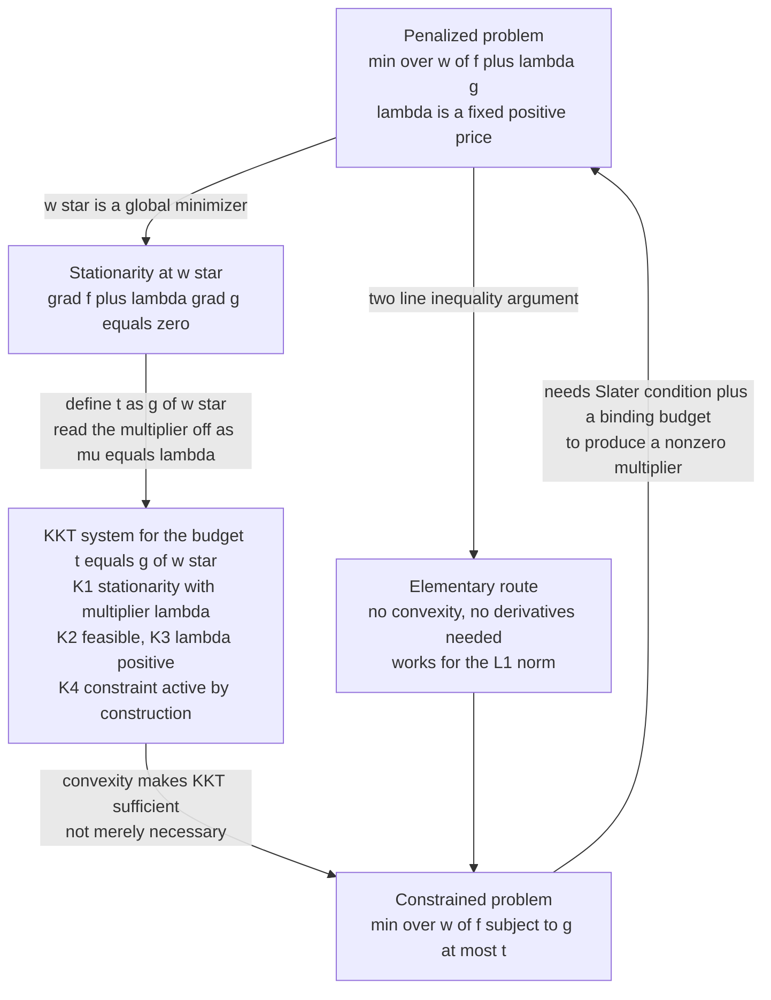
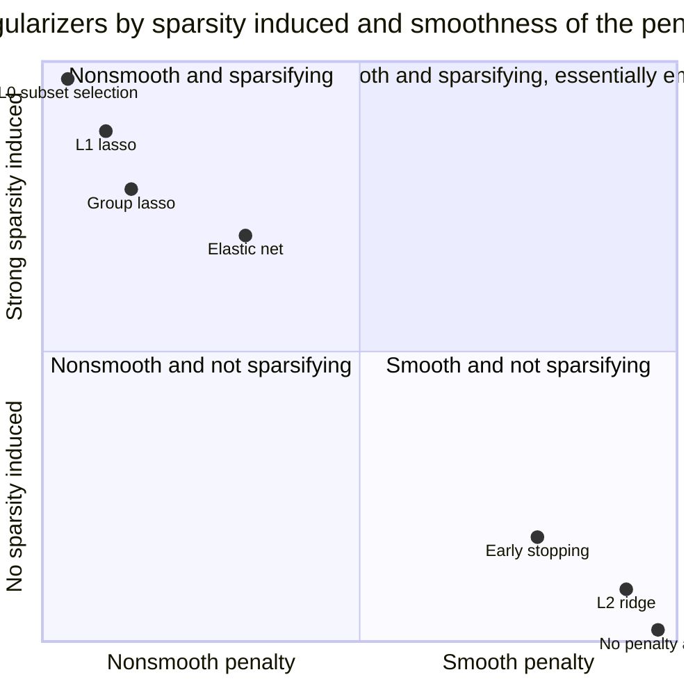

# Penalizing Is Constraining: What Regularization Actually Does

*Part of "Why Learning Works: The Theorems Behind Machine Learning," a series that proves, rather than asserts, why a model fitted on a finite sample says anything at all about the world. Earlier parts established that every method carries an inductive bias and that without one you cannot generalize at all. This part is about the most common way that bias gets written down: a penalty term added to a loss. The regularizer **is** the assumption. This post proves exactly which assumption it is.*

---

## The Picture Everyone Draws and Nobody Justifies

You have seen the figure. Two axes, $w_1$ and $w_2$. A family of concentric ellipses centred on the least-squares solution — the level sets of the squared error — and a second shape centred on the origin: a circle for ridge, a diamond for LASSO. The solution sits where the smallest ellipse touching the shape makes contact. For the circle, contact happens at a generic point; for the diamond, contact tends to happen at a **corner**, and corners sit on the axes, where a coordinate is exactly zero. Therefore, the caption says, LASSO produces sparse solutions. The figure appears in *The Elements of Statistical Learning*, in a thousand lecture slides, and in the original LASSO paper — genuinely illuminating, but, as normally presented, an argument about a problem you are not solving.

Look at what the picture depicts: a **feasible region** — the set $\{w : \|w\|_1 \le t\}$ or $\{w : \|w\|_2 \le t\}$ — with the error minimized over it. That is a *constrained* optimization problem. But the objective you type into your code is

$$
\min_w\ \|Xw - y\|_2^2 + \lambda \|w\|_1,
$$

which has no feasible region at all. Every $w \in \mathbb{R}^d$ is admissible; there is no diamond anywhere in that expression. The picture is a picture of a different problem.

So either the picture is decoration, or there is a theorem saying the two problems are the same. There is a theorem. Almost nobody states it, and those who do usually wave at "Lagrangian duality" and move on. That is a shame: the theorem is short, provable in a paragraph, and once you have it the picture stops being a mnemonic and becomes an argument. Better still, the machinery needed to prove it — the KKT conditions and the subdifferential — is exactly the machinery that lets you *derive* LASSO's sparsity in closed form, with an explicit threshold, instead of gesturing at corners. That derivation is the destination.

---

## Two Problems That Look Different

Fix a loss $f : \mathbb{R}^d \to \mathbb{R}$ — for us, almost always the squared error — and a **regularizer** $g : \mathbb{R}^d \to \mathbb{R}$ measuring how much structure a candidate $w$ violates. The two problems are:

$$
\textbf{(P}_\lambda\textbf{)}\quad \min_w\ f(w) + \lambda\, g(w) \qquad\text{versus}\qquad \textbf{(C}_t\textbf{)}\quad \min_w\ f(w)\ \ \text{s.t.}\ \ g(w) \le t.
$$

$(\mathrm{P}_\lambda)$, the **penalized** or **Lagrangian** form, treats $\lambda>0$ as an *exchange rate* — how much loss you will pay for one unit of regularizer — but tells you nothing about how large $g(w)$ ends up being. $(\mathrm{C}_t)$, the **constrained** or **bound** form, treats $t>0$ as a *budget* — how much regularizer you may spend, full stop — but tells you nothing about the marginal price of relaxing it.

These are different knobs, and the map between them is **data-dependent**: the $t$ matching a given $\lambda$ is a function of $f$, hence of your sample, so you cannot carry a tuned $\lambda$ to a new dataset and expect the same budget. What the next section proves is that despite this, the two families trace out the *same set of solutions* as their parameters sweep. Every solution reachable by pricing is reachable by budgeting, and — with one extra hypothesis — the reverse. The knobs differ; the reachable set does not.

---

## The Convexity Toolkit

Everything that follows rests on convexity, so here it is, stated without illustration — machinery, not the point.

A set $C \subseteq \mathbb{R}^d$ is **convex** if $\alpha x_1 + (1-\alpha) x_2 \in C$ for all $x_1, x_2 \in C$, $\alpha \in [0,1]$ — both the Euclidean ball and the cross-polytope $\{w:\|w\|_1\le t\}$ qualify, as sublevel sets of norms. A function $f$ on a convex domain is **convex** if $f(\alpha x_1+(1-\alpha)x_2) \le \alpha f(x_1)+(1-\alpha)f(x_2)$, and **strictly convex** if the inequality is strict for $x_1 \ne x_2$, $\alpha \in (0,1)$.

For differentiable $f$, convexity is equivalent to the **first-order condition** $f(y) \ge f(x) + \nabla f(x)^\top(y-x)$ for all $x,y$ — a local certificate, the gradient at $x$, proves a global lower bound, so **every stationary point of a convex function is a global minimizer**. For twice-differentiable $f$, the equivalent **second-order condition** is $\nabla^2 f(x) \succeq 0$ everywhere; strict positive definiteness is sufficient but not necessary for strict convexity ($f(x)=x^4$ is a counterexample at $x=0$).

One fact we use repeatedly:

> **Lemma (uniqueness).** A strictly convex function has at most one global minimizer.

*Proof.* Suppose $x_1 \ne x_2$ both attain the minimum value $m$. Then by strict convexity, $f\!\left(\tfrac12 x_1 + \tfrac12 x_2\right) < \tfrac12 m + \tfrac12 m = m$, contradicting that $m$ is the minimum. $\blacksquare$

Existence needs its own hypothesis — coercivity, $f(w) \to \infty$ as $\|w\| \to \infty$, suffices and holds throughout this post because the penalty supplies it. When we write $\arg\min$ we are asserting a minimizer exists.

---

## Theorem: Penalizing Is Constraining

We need the Karush–Kuhn–Tucker conditions, written down rather than assumed memorized. For the constrained problem

$$
\textbf{(C}_t\textbf{)}\quad \min_w f(w) \quad \text{s.t.}\quad g(w) - t \le 0,
$$

form the **Lagrangian** with multiplier $\mu \in \mathbb{R}$:

$$
L(w, \mu) = f(w) + \mu\,\big(g(w) - t\big).
$$

A pair $(w^\star, \mu)$ satisfies the **KKT conditions** for $(\mathrm{C}_t)$ when all four of the following hold:

$$
\begin{aligned}
&\textbf{(K1) Stationarity:} && \nabla f(w^\star) + \mu \nabla g(w^\star) = 0,\\
&\textbf{(K2) Primal feasibility:} && g(w^\star) \le t,\\
&\textbf{(K3) Dual feasibility:} && \mu \ge 0,\\
&\textbf{(K4) Complementary slackness:} && \mu\,\big(g(w^\star) - t\big) = 0.
\end{aligned}
$$

(K4) is the interesting one: at an optimum, either the constraint is *active* ($g(w^\star)=t$) or the multiplier is zero. You cannot have a strictly slack constraint with a positive shadow price. For general nonconvex problems KKT is *necessary* under a constraint qualification; for convex problems it is also *sufficient*, which is what we need.

> **Lemma (KKT sufficiency).** Let $f$ and $g$ be convex and differentiable. If $(w^\star, \mu)$ satisfies (K1)–(K4), then $w^\star$ is a global minimizer of $(\mathrm{C}_t)$.

*Proof.* Since $\mu \ge 0$ and both $f$ and $g$ are convex, the function $w \mapsto L(w,\mu)$ is convex (a nonnegative combination of convex functions). Condition (K1) says $\nabla_w L(w^\star, \mu) = 0$, so by the first-order condition $w^\star$ is a global minimizer of $L(\cdot, \mu)$ over all of $\mathbb{R}^d$. Now take any feasible $w$, so $g(w) - t \le 0$. Then

$$
f(w) \ \ge\ f(w) + \mu\big(g(w) - t\big) \ =\ L(w, \mu) \ \ge\ L(w^\star, \mu) \ =\ f(w^\star) + \mu\big(g(w^\star) - t\big) \ =\ f(w^\star),
$$

where the first inequality uses $\mu \ge 0$ and $g(w) - t \le 0$, the second uses global minimality of $w^\star$ for $L(\cdot,\mu)$, and the last equality is (K4). $\blacksquare$

Now the theorem.

> **Theorem (penalization is constrained optimization).** Let $f, g : \mathbb{R}^d \to \mathbb{R}$ be convex and differentiable, let $\lambda > 0$, and suppose $w^\star \in \arg\min_w \big[f(w) + \lambda g(w)\big]$ exists. Define the budget
> $$
> t_\lambda := g(w^\star).
> $$
> Then $w^\star$ is a global minimizer of $(\mathrm{C}_{t_\lambda})$. If in addition $f + \lambda g$ is strictly convex, $w^\star$ is the *unique* minimizer of $(\mathrm{C}_{t_\lambda})$.

*Proof.* The penalized objective $f + \lambda g$ is convex and differentiable, and $w^\star$ minimizes it, so its gradient vanishes there:

$$
\nabla f(w^\star) + \lambda \nabla g(w^\star) = 0.
$$

That is exactly (K1) for $(\mathrm{C}_{t_\lambda})$ with multiplier $\mu = \lambda$. Check the remaining three. (K2): $g(w^\star) = t_\lambda \le t_\lambda$. (K3): $\mu = \lambda > 0 \ge 0$. (K4): $g(w^\star) - t_\lambda = 0$, so the product vanishes regardless of $\mu$ — the constraint is active at $w^\star$ **by construction**, because we defined the budget to be exactly what $w^\star$ spends. All four hold, and by the sufficiency lemma $w^\star$ minimizes $(\mathrm{C}_{t_\lambda})$.

For uniqueness, suppose $w'$ also minimizes $(\mathrm{C}_{t_\lambda})$. Then $f(w') = f(w^\star)$ and $g(w') \le t_\lambda = g(w^\star)$, so

$$
f(w') + \lambda g(w') \le f(w^\star) + \lambda g(w^\star),
$$

making $w'$ a minimizer of the penalized objective too. Strict convexity and the uniqueness lemma give $w' = w^\star$. $\blacksquare$

### The direction that is free, and the direction that costs

The proof above never used convexity in an essential way *for the main claim*. Here is the same result with the hypotheses stripped to the bone.

> **Proposition.** Let $f, g$ be *any* functions, $\lambda > 0$, and let $w^\star$ be a global minimizer of $f + \lambda g$. Set $t_\lambda = g(w^\star)$. Then $w^\star$ is a global minimizer of $(\mathrm{C}_{t_\lambda})$.

*Proof.* Let $w$ be feasible, i.e. $g(w) \le t_\lambda$. By minimality of $w^\star$ for the penalized objective, $f(w) + \lambda g(w) \ge f(w^\star) + \lambda g(w^\star)$, hence

$$
f(w) \ \ge\ f(w^\star) + \lambda\big(g(w^\star) - g(w)\big) \ =\ f(w^\star) + \lambda\big(t_\lambda - g(w)\big) \ \ge\ f(w^\star),
$$

since $\lambda > 0$ and $g(w) \le t_\lambda$. $\blacksquare$

No convexity, no differentiability, two lines. This matters because $g(w) = \|w\|_1$ is *not* differentiable, so the KKT-based theorem does not literally cover LASSO as stated — the proposition does. The penalized LASSO you solve is a constrained LASSO with budget $t_\lambda = \|w^\star\|_1$, and the diamond in the picture is a real diamond of a computable size.

The converse is genuinely harder, and it is where the hypotheses live.

> **Converse (sketch, not proved here).** Let $f, g$ be convex, let $w^\star$ solve $(\mathrm{C}_t)$, and assume **Slater's condition**: there exists $\bar w$ with $g(\bar w) < t$, so the feasible region has nonempty interior. Then strong duality holds and there exists $\mu \ge 0$ such that $(w^\star, \mu)$ satisfies (K1)–(K4); consequently $w^\star$ minimizes $f + \mu g$. Moreover $\mu > 0$ unless the unconstrained minimizer of $f$ is already feasible, in which case $\mu = 0$ and the constraint does nothing.

I am not proving that here: the existence of the multiplier is a strong-duality result, going through the separating hyperplane theorem applied to the epigraph of the perturbed value function, and it is Section 5.2.3 and Section 5.5.3 of Boyd and Vandenberghe where to read the real argument. What matters is *which hypotheses the converse needs and the forward direction does not*: a constraint qualification, and an active constraint to get a nonzero price.



---

## A Closed Form You Can Check by Hand

The theorem promises a budget $t_\lambda$ exists. In one dimension you can compute it and watch the correspondence work.

Take $f(x) = (x-a)^2$ and $g(x) = (x-b)^2$ for fixed reals $a \ne b$. Both are strictly convex. The penalized objective is

$$
h(x) = (x-a)^2 + \lambda (x-b)^2, \qquad h'(x) = 2(x-a) + 2\lambda(x-b).
$$

Setting $h'(x) = 0$ gives $x(1+\lambda) = a + \lambda b$, so

$$
\boxed{\ x^\star = \frac{a + \lambda b}{1+\lambda}\ }
$$

a convex combination of $a$ and $b$, sitting at $a$ when $\lambda=0$ and dragged toward $b$ as $\lambda\to\infty$; since $h''(x) = 2(1+\lambda) > 0$, this is the unique global minimizer.

Now compute the budget the theorem hands you:

$$
g(x^\star) = (x^\star - b)^2 = \left(\frac{a + \lambda b - b - \lambda b}{1+\lambda}\right)^2,
$$

$$
\boxed{\ t_\lambda = g(x^\star) = \left(\frac{a-b}{1+\lambda}\right)^2.\ }
$$

This is the whole theorem in miniature: $t_\lambda$ sweeps $\big(0,(a-b)^2\big)$ **strictly monotonically downward** as $\lambda$ sweeps $(0,\infty)$, a bijection between price and budget.

The same check, done numerically in $d$ dimensions for ridge on a random design: solve the penalized problem in closed form, read off the budget, then solve the constrained problem with a general-purpose solver that knows nothing about the closed form.

```python
import numpy as np
from scipy.optimize import minimize

rng = np.random.default_rng(0)
n, d = 60, 8
X = rng.normal(size=(n, d))
w_true = rng.normal(size=d)
y = X @ w_true + 0.5 * rng.normal(size=n)

H = X.T @ X                       # Hessian of the squared error
b = X.T @ y

f      = lambda w: 0.5 * np.sum((X @ w - y) ** 2)
grad_f = lambda w: H @ w - b
g      = lambda w: 0.5 * w @ w    # the ridge regularizer R(w)

def penalized(lam):
    """argmin_w  f(w) + lam * g(w),  in closed form."""
    return np.linalg.solve(H + lam * np.eye(d), b)

def constrained(t):
    """argmin_w f(w)  subject to  g(w) <= t,  by SLSQP."""
    cons = [{"type": "ineq",
             "fun":  lambda w: t - g(w),
             "jac":  lambda w: -w}]
    res = minimize(f, np.zeros(d), jac=grad_f, constraints=cons,
                   method="SLSQP", tol=1e-12,
                   options={"maxiter": 1000, "ftol": 1e-14})
    return res.x

print(f"{'lambda':>10} {'t_lambda':>12} {'||w_pen - w_con||':>20}")
for lam in [0.01, 1.0, 100.0, 1000.0]:
    w_pen = penalized(lam)
    t_lam = g(w_pen)              # the budget the theorem promises
    w_con = constrained(t_lam)
    print(f"{lam:10.2f} {t_lam:12.6f} {np.linalg.norm(w_pen - w_con):20.3e}")

lams = np.logspace(-3, 3, 200)
ts   = np.array([g(penalized(l)) for l in lams])
print("\nbudget strictly decreasing in lambda:", bool(np.all(np.diff(ts) < 0)))
```

```
    lambda     t_lambda    ||w_pen - w_con||
      0.01     3.175408            8.269e-10
      1.00     3.071985            2.277e-09
    100.00     0.558161            1.116e-08
   1000.00     0.017333            4.451e-09

budget strictly decreasing in lambda: True
```

Agreement to nine or ten digits — solver tolerance, not disagreement — across five orders of magnitude of $\lambda$.

---

## The Squared Error Is a Quadratic Form

To say anything precise about *what* a penalty does, we need the loss in a form that separates into coordinates. For linear least squares it does, via the spectral theorem.

Write the data as $x_1, \dots, x_n \in \mathbb{R}^d$ with targets $y_1, \dots, y_n \in \mathbb{R}$, stack the $x_i^\top$ as rows of $X \in \mathbb{R}^{n \times d}$, and define $E(w) = \tfrac12\|Xw-y\|_2^2$. Expanding the square gives

$$
\boxed{\ E(w) = \tfrac12 w^\top H w - b^\top w + c,\qquad H = X^\top X,\quad b = X^\top y,\quad c = \tfrac12 \sum_i y_i^2.\ }
$$

$H$ is **symmetric** by construction and **positive semidefinite**, since $v^\top H v = \sum_i (x_i^\top v)^2 \ge 0$ for any $v$. So $E$ is convex — never anything else, for any data — and if the columns of $X$ are linearly independent, $H \succ 0$, $E$ is strictly convex, and the minimizer $w^\circ = H^{-1}b$ is unique.

Because $H$ is real symmetric, the spectral theorem gives $H = Q\Lambda Q^\top$ with $Q^\top Q = I$ and $\Lambda = \operatorname{diag}(h_1,\dots,h_d)$, all $h_i \ge 0$. Assuming $H \succ 0$, completing the square around $w^\circ$ gives the **exact** identity (exact, not a Taylor approximation, since $E$'s higher derivatives vanish)

$$
E(w) = E(w^\circ) + \tfrac12 (w - w^\circ)^\top H (w - w^\circ).
$$

Substituting $u = Q^\top(w-w^\circ)$ turns the level set $\{E(w) = E(w^\circ)+\rho\}$ into $\tfrac12\sum_i h_i u_i^2 = \rho$: an ellipsoid centred at $w^\circ$, axes along the eigenvectors of $H$, semi-axis lengths proportional to $1/\sqrt{h_i}$. The picture's ellipses are now derived rather than drawn. Directions where the data vary a lot (large $h_i$) give short axes — the error rises steeply and the fit is well determined. Directions where the data barely vary (small $h_i$) give long axes — the error is nearly flat and the fit is badly determined. That last observation is the whole reason regularization does anything useful, and the rotation into the eigenbasis is what lets the next two sections analyze each direction **separately**.

---

## Ridge, One Eigendirection at a Time

Ridge regression, introduced by Hoerl and Kennard in 1970 to fix exactly the ill-conditioning just described, adds a squared Euclidean penalty: $J_\lambda(w) = \tfrac12 w^\top H w - b^\top w + c + \tfrac{\lambda}{2}\|w\|_2^2$. Setting $\nabla J_\lambda(w) = Hw - b + \lambda w = 0$ gives $(H+\lambda I)w = b$. Since $H \succeq 0$ and $\lambda > 0$, $H + \lambda I \succ 0$ is invertible and $J_\lambda$ is strictly convex, so the ridge solution exists, is unique, and is $w_\lambda = (H+\lambda I)^{-1}b$ — this holds even when $H$ itself is singular, so ridge repairs a problem with no unregularized solution at all.

Rotating into the eigenbasis, $\tilde b = Q^\top b$ and $\tilde w_\lambda = Q^\top w_\lambda$, the system $(\Lambda+\lambda I)\tilde w_\lambda = \tilde b$ decouples into $d$ scalar equations $\tilde w_{\lambda,i} = \tilde b_i/(h_i+\lambda)$. With $\tilde w^\circ_i = \tilde b_i/h_i$ the unregularized optimum, this is the identity we were after:

$$
\boxed{\ \tilde w_{\lambda,i} = \frac{h_i}{h_i + \lambda}\,\tilde w^{\circ}_i,\qquad \frac{h_i}{h_i+\lambda} \in (0,1).\ }
$$

Ridge is a **coordinate-wise multiplicative shrinkage in the eigenbasis of $H$**, with three immediate consequences. **The factor is never zero:** for $h_i > 0$ and any finite $\lambda$, $h_i/(h_i+\lambda) > 0$ strictly, so a coefficient that started nonzero stays nonzero — ridge shrinks, it does not select. (If $h_i = 0$ exactly then $\tilde b_i = 0$ too, since $b=X^\top y$ lies in the range of $H$, and ridge assigns exactly $0$ — not selection, just declining to guess along a direction the data never observed.) **Small-eigenvalue directions are hit hardest:** the amount removed is $\lambda/(h_i+\lambda)$, decreasing in $h_i$, so the badly determined directions — long axes, flat error, high variance — are damped the most while the well-determined ones are left nearly alone; this is the design, not a side effect. **Ridge is a conditioning fix:** the condition number $\kappa(H)=h_{\max}/h_{\min}$ becomes $\kappa(H+\lambda I) = (h_{\max}+\lambda)/(h_{\min}+\lambda)$, strictly decreasing in $\lambda$ toward $1$ whenever $h_{\max}>h_{\min}$ — on an ill-conditioned design spanning five orders of magnitude in eigenvalue, $\lambda=100$ takes $\kappa \approx 2\times10^5$ down to about $20$, while every coefficient, including the one riding the smallest eigenvalue, stays strictly nonzero.

---

## LASSO and the Soft Threshold

Replace the squared penalty with an absolute one. Tibshirani's LASSO, from 1996, minimizes

$$
F(w) = \tfrac12\|Xw - y\|_2^2 + \lambda \|w\|_1, \qquad \|w\|_1 = \sum_{i=1}^d |w_i|.
$$

$F$ is convex — a sum of a convex quadratic and a norm — but it is **not differentiable** wherever any coordinate is zero. That is not a technical annoyance to be smoothed away; it is the entire mechanism. A differentiable penalty with a minimum at the origin has zero derivative there, so it exerts no force on a coefficient that is already tiny. The absolute value has a *kink*: its one-sided derivatives are $+1$ and $-1$, so it pushes with constant force $\lambda$ no matter how close to zero the coefficient gets. Constant force plus a restoring force that vanishes at the optimum equals a coefficient pinned exactly at zero. To make that precise we need to differentiate a function that is not differentiable.

### Subgradients

> **Definition.** Let $\varphi : \mathbb{R} \to \mathbb{R}$ be convex. A number $v$ is a **subgradient** of $\varphi$ at $x$ if
> $$
> \varphi(y) \ \ge\ \varphi(x) + v\,(y - x)\qquad\text{for all } y.
> $$
> The set of all such $v$ is the **subdifferential** $\partial\varphi(x)$.

This is the first-order condition promoted to a definition: $v$ is a subgradient if the line through $(x, \varphi(x))$ with slope $v$ stays below the graph. Where $\varphi$ is differentiable, $\partial\varphi(x) = \{\varphi'(x)\}$ — the tangent is the only such line. Where there is a kink, a whole interval of slopes fits underneath.

> **Fermat's rule.** $x$ minimizes the convex function $\varphi$ if and only if $0 \in \partial\varphi(x)$.

*Proof.* By definition, $0 \in \partial\varphi(x)$ means $\varphi(y) \ge \varphi(x) + 0\cdot(y-x) = \varphi(x)$ for all $y$, which is precisely the statement that $x$ is a global minimizer. $\blacksquare$

The one subdifferential we need:

> **Lemma.** $\partial|\cdot|(0) = [-1, 1]$.

*Proof.* $v \in \partial|\cdot|(0)$ means $|y| \ge v y$ for all $y \in \mathbb{R}$. Taking $y = 1$ gives $v \le 1$; taking $y = -1$ gives $-v \le 1$, i.e. $v \ge -1$. So $|v| \le 1$. Conversely if $|v| \le 1$ then $vy \le |v||y| \le |y|$ for every $y$. $\blacksquare$

We also use the sum rule: if $\varphi = \varphi_1 + \varphi_2$ with $\varphi_1$ differentiable and $\varphi_2$ convex, then $\partial\varphi(x) = \varphi_1'(x) + \partial\varphi_2(x)$. (This is the easy case of the Moreau–Rockafellar theorem; the general statement needs a relative-interior condition that is automatic here.)

### The derivation

Assume $H = X^\top X \succ 0$ and let $w^\circ = H^{-1}b$ be the unregularized optimum. Using the exact completion of the square from the previous section,

$$
F(w) = E(w^\circ) + \tfrac12 (w-w^\circ)^\top H (w - w^\circ) + \lambda\sum_{i=1}^d |w_i|.
$$

**Now assume $H$ is diagonal**, $H = \operatorname{diag}(H_{11},\dots,H_{dd})$ — that is, the feature columns are orthogonal. Then the quadratic form separates and the whole objective decouples into $d$ independent scalar problems:

$$
F(w) = E(w^\circ) + \sum_{i=1}^d \underbrace{\left[\tfrac12 H_{ii}\,(w_i - w^\circ_i)^2 + \lambda |w_i|\right]}_{\varphi_i(w_i)}.
$$

I want to be exact about what is assumed here. The expansion of $E$ is *not* an approximation — $E$ is quadratic, so the second-order identity is exact. The *only* assumption is diagonality of $H$, and it buys separability. (If $E$ were a general smooth loss, logistic for instance, the expansion would be a genuine quadratic approximation and everything below would be approximate too.)

Fix $i$, drop the subscript, and minimize $\varphi(u) = \tfrac12 H (u - u^\circ)^2 + \lambda|u|$ with $H > 0$, $\lambda > 0$. Three exhaustive cases.

**Case $u > 0$.** Here $|u| = u$ is differentiable and $\varphi'(u) = H(u - u^\circ) + \lambda$. Setting this to zero gives $u = u^\circ - \lambda/H$. This is a valid solution only if it is consistent with the case assumption $u > 0$, i.e. only if $u^\circ > \lambda/H$.

**Case $u < 0$.** Now $|u| = -u$ and $\varphi'(u) = H(u - u^\circ) - \lambda = 0$, giving $u = u^\circ + \lambda/H$, valid only if $u^\circ < -\lambda/H$.

**Case $u = 0$.** Here we need the subdifferential. By the sum rule and the lemma,

$$
\partial\varphi(0) = H(0 - u^\circ) + \lambda\,[-1,1] = \big[-Hu^\circ - \lambda,\ -Hu^\circ + \lambda\big].
$$

By Fermat's rule, $u = 0$ is optimal if and only if $0$ lies in that interval, i.e. $-\lambda \le H u^\circ \le \lambda$, i.e.

$$
|u^\circ| \le \frac{\lambda}{H}.
$$

The three cases are mutually exclusive and cover the line, and $\varphi$ is strictly convex ($H>0$) so the minimizer is unique. Assembling them:

$$
\boxed{\ w_i \;=\; \operatorname{sign}(w^\circ_i)\,\max\!\left\{\,|w^\circ_i| - \frac{\lambda}{H_{ii}},\ 0\,\right\}. \ }
$$

This is the **soft-thresholding operator**, central to Donoho and Johnstone's wavelet denoising work in 1994.

### Reading the formula

It says two things. **There is a dead zone.** For $|w^\circ_i| \le \lambda/H_{ii}$ the coefficient is *exactly* zero, not merely small, at a finite $\lambda$. The dead zone widens linearly in $\lambda$ and shrinks with the data variance $H_{ii}$ along that feature. LASSO's sparsity is therefore a **selection rule with an explicit threshold computable before you run anything**: coordinate $i$ survives if and only if $H_{ii}|w^\circ_i| > \lambda$. Not an empirical tendency, not a numerical artifact — a derived consequence of the kink.

**Outside the dead zone, everything translates.** Survivors are moved toward zero by exactly $\lambda/H_{ii}$, the same absolute amount regardless of size — a coefficient of $3.0$ and a coefficient of $0.6$ both lose the same quantity. This is what makes LASSO biased even for the coefficients it keeps. Contrast ridge's proportional shrinkage from the previous section: a strictly positive factor that never produces an exact zero.

One fact needs no diagonality at all. When is the entire solution zero? By Fermat's rule applied to $F$ at the origin, using $\partial\|\cdot\|_1(0) = \{s : \|s\|_\infty \le 1\}$,

$$
0 \in \partial F(0) = \{-X^\top y + \lambda s : \|s\|_\infty \le 1\} \iff \|X^\top y\|_\infty \le \lambda.
$$

So $\lambda_{\max} = \|X^\top y\|_\infty$ is the exact price at which the whole model collapses to the zero vector, for *any* design matrix — why every LASSO path implementation starts its $\lambda$ grid there.

### What the diagonality assumption costs

For correlated features — nonzero off-diagonal entries in $H$ — the coordinates do not decouple and **the closed form above is false**. The exact solution needs an algorithm: cyclic coordinate descent, which applies exactly this scalar soft threshold to one coordinate at a time against a partial residual (what `glmnet` does), or the LARS algorithm of Efron, Hastie, Johnstone and Tibshirani, which traces the entire solution path in finitely many steps.

What survives is the qualitative conclusion, for a reason we can state: the stationarity condition for general $X$ reads $X^\top(Xw-y) + \lambda s = 0$ with $\|s\|_\infty \le 1$ and $s_i = \operatorname{sign}(w_i)$ wherever $w_i \ne 0$. Coordinates with $|s_i| < 1$ are pinned at zero, a condition on an open set — positive measure in the space of problems, not a knife edge. What is lost is the clean formula for *where* the threshold sits.

Here is the closed form checked against a numerical solve, on an orthonormal design where the diagonality assumption holds exactly.

```python
import numpy as np
from scipy.optimize import minimize

rng = np.random.default_rng(7)
n, d = 200, 10

# orthonormal design: X^T X = I, so H is the identity and every H_ii = 1
X, _ = np.linalg.qr(rng.normal(size=(n, d)))
w_true = np.array([3.0, -2.0, 0.8, 0.0, 0.0, 0.35, 0.0, -0.15, 0.0, 0.05])
y = X @ w_true + 0.05 * rng.normal(size=n)

w_ols = X.T @ y                       # unregularized optimum, since X^T X = I
soft  = lambda u, thr: np.sign(u) * np.maximum(np.abs(u) - thr, 0.0)

def lasso_numeric(lam):
    """min 0.5*||Xw - y||^2 + lam*||w||_1 via the split w = u - v, u,v >= 0."""
    def obj(z):
        w = z[:d] - z[d:]
        return 0.5 * np.sum((X @ w - y) ** 2) + lam * np.sum(z)
    def jac(z):
        r = X.T @ (X @ (z[:d] - z[d:]) - y)
        return np.concatenate([r + lam, -r + lam])
    res = minimize(obj, np.zeros(2 * d), jac=jac, method="SLSQP",
                   bounds=[(0, None)] * (2 * d), tol=1e-14,
                   options={"maxiter": 2000, "ftol": 1e-16})
    return res.x[:d] - res.x[d:]

for lam in [0.1, 1.0]:
    w_num, w_fml = lasso_numeric(lam), soft(w_ols, lam)   # lam / H_ii with H_ii = 1
    w_rdg = w_ols / (1.0 + lam)                           # ridge factor h/(h+lam), h=1
    print(f"lambda = {lam}")
    print(f"  max |numeric - soft threshold| : {np.max(np.abs(w_num - w_fml)):.3e}")
    print(f"  exact zeros, lasso             : {int(np.sum(np.abs(w_num) < 1e-9))} of {d}")
    print(f"  exact zeros, ridge             : {int(np.sum(np.abs(w_rdg) < 1e-9))} of {d}")

print("\nw_ols       :", np.round(w_ols, 4))
print("lasso lam=.5:", np.round(lasso_numeric(0.5), 4))
print("ridge lam=.5:", np.round(w_ols / 1.5, 4))
```

```
lambda = 0.1
  max |numeric - soft threshold| : 1.887e-15
  exact zeros, lasso             : 5 of 10
  exact zeros, ridge             : 0 of 10
lambda = 1.0
  max |numeric - soft threshold| : 3.828e-13
  exact zeros, lasso             : 8 of 10
  exact zeros, ridge             : 0 of 10

w_ols       : [ 2.9673 -1.9656  0.7503 -0.0603  0.0157  0.3965 -0.0533 -0.1838  0.0324
 -0.0359]
lasso lam=.5: [ 2.4673 -1.4656  0.2503  0.      0.      0.      0.      0.      0.
  0.    ]
ridge lam=.5: [ 1.9782 -1.3104  0.5002 -0.0402  0.0104  0.2643 -0.0355 -0.1226  0.0216
 -0.0239]
```

Look at the last three lines against the formula. At $\lambda = 0.5$: $2.9673 \to 2.4673$, $-1.9656 \to -1.4656$, $0.7503 \to 0.2503$. Every survivor moved by exactly $0.5$, and every coefficient with $|w^\circ_i| \le 0.5$ went to exactly zero. The ridge row, at the same $\lambda$, has ten nonzeros and no thresholding anywhere — every entry is the OLS value divided by $1.5$.

---

## What the Picture Shows, and What It Hides

Now the figure from the opening is licensed: the theorem says the constrained problem it depicts *is* the penalized problem you solve, with budget $t_\lambda = \|w^\star\|_1$. What it correctly conveys is that hitting a vertex of the L1 ball is a **generic** event while hitting an axis point of the L2 ball is not — the cross-polytope's vertex has a whole *cone* of outward normals, while the ball's normal at any point is the single ray through that point, so a coordinate axis is hit only by measure-zero coincidence.

What it hides: there is no $\lambda$ in it, so you can see that sparsity occurred but not read off its level; it is misleading in high dimensions, since a $d=100$ solution typically lands on a face with dozens of nonzero coordinates rather than a single "corner"; and it cannot show the modern regime $d \gg n$, where $w^\circ$ does not even exist and the whole analysis has to be redone through restricted eigenvalue conditions. The figure is a good picture — now a good picture *of a theorem*, rather than a good picture standing in for one.

---

## What Assumption Each Penalty Encodes

We can now say what you are asserting when you type a penalty, and the sharpest way to say it is through **symmetry**: a regularizer expresses an assumption about the truth, and the transformations that leave it unchanged are exactly the reparameterizations under which that assumption is unchanged.

**$L_2$ says the truth has small Euclidean norm in your parameterization.** For orthogonal $Q$, $\|Qw\|_2=\|w\|_2$, so ridge is rotation-invariant — but emphatically **not** invariant under rescalings: multiply feature $j$ by $c$ and its penalty contribution changes by $1/c^2$, so measuring in millimetres instead of metres penalizes that coefficient a million times less. Feature standardization before ridge is not preprocessing hygiene — it is *part of the assumption you are making*.

**$L_1$ says the truth is sparse in your basis.** $\|w\|_1$ is invariant only under permutations and sign flips, not rotations: $e_1$ is maximally sparse, but a generic rotation $Qe_1$ has every coordinate nonzero. Sparsity is a property of a vector *relative to a basis* — which is why wavelet thresholding works on images (natural images are sparse in a wavelet basis, not the pixel basis, and thresholding the wavelet coefficients is exactly the LASSO derivation above with $H=I$). Choose the basis wrong and L1 asserts something false.

**Elastic net says both, with a knob.** Zou and Hastie's 2005 penalty $\lambda\big(\alpha\|w\|_1 + \tfrac{1-\alpha}{2}\|w\|_2^2\big)$ restores strict convexity via its quadratic part — unique solutions even with duplicated columns — while the L1 part keeps the kink and the exact zeros. They also prove a *grouping effect*: correlated predictors enter and leave the model together rather than one being chosen arbitrarily.

There is one more way to say this. Suppose $y\mid w \sim \mathcal{N}(Xw,\sigma^2 I)$ with a prior on $w$; the MAP estimate minimizes $\|Xw-y\|_2^2/(2\sigma^2) - \log p(w)$. A Gaussian prior contributes $\|w\|_2^2/(2\tau^2)$ — ridge, $\lambda=\sigma^2/\tau^2$ — and a Laplace prior contributes $\|w\|_1/b$ — LASSO, $\lambda=\sigma^2/b$. The penalty is a prior, and $\lambda$ the ratio of noise variance to prior variance. But be careful: LASSO is the posterior *mode* under a Laplace prior, and under a continuous density the posterior probability any coefficient is exactly zero is zero — the sparsity is an artifact of reporting the argmax rather than the posterior mean.



The quadrant that is essentially empty — smooth penalties that induce strong sparsity — is not a coincidence. A smooth penalty has a vanishing derivative at its minimum, so it exerts no force on an already-small coefficient and cannot pin one at exactly zero — sparsity requires a kink, which is the content of the three-case derivation above.

Which brings us back to where the series has been heading: learning is impossible without an inductive bias, and a penalty term is the most common place that bias gets written down, usually without comment. Both claims above are falsifiable, both are frequently false, and both are asserted every time you add a term to a loss. Cross-validating $\lambda$ chooses *how strongly* to assert the claim, not *what* you are claiming — that choice was made when you picked the penalty, and now you can say exactly what it was.

---

## Going Deeper

**Books:**
- Boyd, S., & Vandenberghe, L. (2004). *Convex Optimization.* Cambridge University Press.
  - The KKT conditions, Slater's condition, and the sufficiency lemma (Sections 5.2.3, 5.5.3, 5.5.5).
- Hastie, T., Tibshirani, R., & Friedman, J. (2009). *The Elements of Statistical Learning*, 2nd ed. Springer.
  - Section 3.4 is the canonical treatment of ridge and LASSO, including the eigenbasis shrinkage factors and the diamond-and-ellipse figure this post set out to justify.
- Hastie, T., Tibshirani, R., & Wainwright, M. (2015). *Statistical Learning with Sparsity: The Lasso and Generalizations.* CRC Press.
  - Chapter 2 does the constrained-versus-penalized correspondence carefully; Chapter 5 covers the algorithms that replace the closed form when the design is not orthogonal.

**Online Resources:**
- [*Convex Optimization* by Boyd and Vandenberghe, full text PDF](https://web.stanford.edu/~boyd/cvxbook/bv_cvxbook.pdf) — The complete book, free from the authors; Chapter 5 pairs with this post.
- [Stanford EE364a, "Duality" lecture slides](https://web.stanford.edu/class/ee364a/lectures/duality.pdf) — KKT, Slater's condition, and complementary slackness in forty slides.
- [Ryan Tibshirani, "Sparsity, the Lasso, and Friends" (CMU 10-702 notes)](https://www.stat.cmu.edu/~ryantibs/statml/lectures/sparsity.pdf) — Careful notes on the bound/Lagrangian equivalence and what changes for correlated designs.

**Videos:**
- [Stanford EE364A: Convex Optimization I (2023), full lecture playlist](https://www.youtube.com/playlist?list=PLoROMvodv4rMJqxxviPa4AmDClvcbHi6h) by Stephen Boyd — The complete course from the textbook's author; duality and KKT sit in the middle third.
- [EE364a course website](https://ee364a.stanford.edu/) — Problem sets and slides for the same course.

**Academic Papers:**
- Tibshirani, R. (1996). ["Regression Shrinkage and Selection via the Lasso."](https://academic.oup.com/jrsssb/article/58/1/267/7027929) *Journal of the Royal Statistical Society, Series B*, 58(1), 267–288.
  - The paper that introduced LASSO, originally stated in the constrained form with budget $t$.
- Hoerl, A. E., & Kennard, R. W. (1970). ["Ridge Regression: Biased Estimation for Nonorthogonal Problems."](https://www.tandfonline.com/doi/abs/10.1080/00401706.1970.10488634) *Technometrics*, 12(1), 55–67.
  - Ridge's origin, motivated by the ill-conditioning analysis above: fixing $X^\top X$ with a small eigenvalue, not Bayesian inference.
- Donoho, D. L., & Johnstone, I. M. (1994). ["Ideal Spatial Adaptation by Wavelet Shrinkage."](https://academic.oup.com/biomet/article-abstract/81/3/425/256924) *Biometrika*, 81(3), 425–455.
  - Soft thresholding analyzed as an estimator in its own right, two years before LASSO, in the orthonormal setting where the closed form here is exact.

**Questions to Explore:**
- For a nonconvex regularizer such as $\|w\|_0$, the penalized and constrained families can index genuinely different solution sets. What does that gap look like?
- The soft threshold translates every surviving coefficient by the same amount; SCAD and MCP threshold without translating. What do you give up in exchange?
- Sparsity is basis-dependent, so the L1 penalty is really two decisions: choose a basis, then penalize. Is there a principled way to select the basis, or does doing so just relocate the inductive bias?
