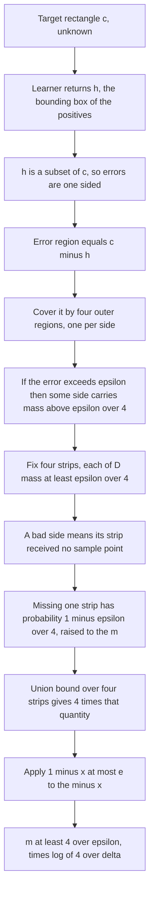
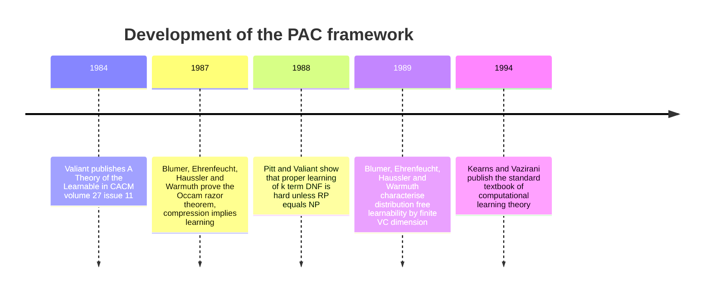

# Probably Approximately Correct: What It Means to Say a Machine Learned

*Part of the series "Why Learning Works: The Theorems Behind Machine Learning." The previous post proved Hoeffding's inequality and ended on the thing it cannot do. This one is the answer to that.*

---

## The Sentence Hoeffding Cannot Finish

Here is the inequality the last post earned. Fix a hypothesis $h$ **before** you look at any data. Draw $n$ labeled examples independently from a distribution $D$, let $\hat{R}(h)$ be the fraction of them that $h$ gets wrong, and let $R(h)$ be the probability that $h$ is wrong on a fresh draw. Then

$$
\mathbb{P}\big(|\hat{R}(h) - R(h)| \geq \varepsilon\big) \leq 2e^{-2n\varepsilon^2}.
$$

That is a genuinely strong statement, and it is useless for the thing you actually want to do. The words *fixed in advance* are load-bearing: your algorithm reads the sample, searches a space of candidates, and returns whichever one fit best -- exactly the one for which the sample is least representative, since "fits best on this sample" is a property that was selected for. The hypothesis your learner returns is a function of the data, so $R(h_S)$ is a random variable with a distribution nobody wrote down, and Hoeffding has nothing to say about it.

The gap is not a technicality; it is the entire problem of generalization, and until 1984 there was no framework in which you could even pose it as a mathematical question. People had learning algorithms and intuitions about overfitting, but no definition of *learned* precise enough that a theorem could be stated about it. Then Leslie Valiant published "A Theory of the Learnable" (*Communications of the ACM* 27(11), 1134-1142, 1984), nine pages proposing a definition good enough that the field of computational learning theory grew out of it -- work for which he later received the ACM Turing Award.

The name of the framework is also its thesis. You cannot demand that a learner be *correct* -- only that it be **approximately** correct, and only **probably** so. This post argues that both hedges are forced, not conservative bookkeeping but consequences of the setup, and then proves three theorems inside the framework, in increasing order of generality.

---

## Why Both Qualifiers Are Forced

Set up the objects carefully, since the whole argument depends on which of them are random. Let $X$ be the **instance space**, the set of possible inputs. Let $c : X \to \{0,1\}$ be the **target concept**, an unknown member of a known **concept class** $\mathcal{C}$. Let $D$ be a probability distribution on $X$ -- arbitrary, unknown, and fixed. The learner receives a sample

$$
S = \big((x_1, c(x_1)), \dots, (x_m, c(x_m))\big), \qquad x_i \sim D \text{ i.i.d.},
$$

and returns a hypothesis $h_S$ from a hypothesis class $\mathcal{H}$. The quantity we care about is the **generalization error**

$$
e(h) = \mathbb{P}_{x \sim D}\big[h(x) \neq c(x)\big].
$$

For a *fixed* $h$ this is a number; for $h_S$ it is not, since $S \mapsto e(h_S)$ is a real-valued function of the sample, so $e(h_S)$ is a random variable and every honest question about a learner is a question about its distribution. Now ask for the two things you might naively want.

**Can we demand $e(h_S) = 0$?** Take $\mathcal{C}$ to be the axis-aligned rectangles in the plane and let $D$ have a density. After seeing $m$ points, every rectangle sitting between the bounding box of the positives and the region carved out by the negatives is still consistent with everything observed. That family is a continuum, and typical pairs drawn from it disagree on a set of positive $D$-measure, so no finite sample distinguishes them. Exact identification is impossible for any class rich enough to be interesting, and the best you can ask is that the disagreement region be *small*. That is the **approximately**.

**Can we demand the bound hold with probability 1?** Suppose $D$ assigns probability $p > 0$ to some small region $B \subset X$. The event that all $m$ draws land in $B$ has probability $p^m > 0$, and on it the learner has no information about $X \setminus B$, so any hypothesis it returns can be wrong on almost all of the remaining mass. This event is unlikely but never impossible -- more data only makes it exponentially less likely. So you cannot ask for a guarantee that holds always. That is the **probably**.

Both hedges are thus forced by the structure of the problem, and once you accept them there is exactly one shape of question left.

> **Definition (PAC learnability).** A concept class $\mathcal{C}$ over $X$ is **PAC learnable** by a hypothesis class $\mathcal{H}$ if there exists an algorithm $A$ and a function $m_{\mathcal{H}} : (0,1)^2 \to \mathbb{N}$ such that for every $\varepsilon, \delta \in (0,1)$, every distribution $D$ on $X$, and every target $c \in \mathcal{C}$, the following holds. If $A$ is given a sample $S$ of size $m \geq m_{\mathcal{H}}(\varepsilon, \delta)$ drawn i.i.d. from $D$ and labeled by $c$, it outputs $h_S \in \mathcal{H}$ with
> $$
> \mathbb{P}_{S \sim D^m}\big[e(h_S) \leq \varepsilon\big] \geq 1 - \delta.
> $$
> The pointwise smallest such $m_{\mathcal{H}}$ is the **sample complexity** of the class.

The quantifiers are where the content is: $D$ is quantified *before* the sample and *after* the algorithm, so the learner must work for every $D$ without being told which one it faces -- the **distribution-free** requirement. $\varepsilon$ is the **accuracy** and $\delta$ the **confidence**. Everything below is an instance of this definition.

---

## Theorem 1: Learning a Rectangle You Cannot See

The first theorem is the one worth carrying around: the cleanest nontrivial PAC argument in existence, entirely elementary, and it produces a bound that does not mention the distribution at all. The example opens Kearns and Vazirani's textbook, and the technique is the one Blumer, Ehrenfeucht, Haussler and Warmuth later generalized.

**Setup.** $X = \mathbb{R}^2$. The concept class $\mathcal{C}$ is the set of axis-aligned rectangles $[a_1,b_1] \times [a_2,b_2]$. An unknown target $c \in \mathcal{C}$ labels a point $1$ if it lies inside and $0$ otherwise. The distribution $D$ on $\mathbb{R}^2$ is arbitrary and unknown. The learner draws $x_1, \dots, x_m$ i.i.d. from $D$, sees their labels, and outputs the **tightest axis-aligned rectangle containing every positive example** -- the bounding box of the points labeled $1$, and the empty set if there are none.

> **Theorem 1.** For every $\varepsilon, \delta \in (0,1)$, every distribution $D$ on $\mathbb{R}^2$ and every target rectangle $c$, the tightest-fit learner satisfies $\mathbb{P}[e(h_S) > \varepsilon] \leq \delta$ whenever
> $$
> m \geq \frac{4}{\varepsilon} \ln \frac{4}{\delta}.
> $$

**Proof.**

*Step 1: the error region is one-sided.* Every positive example lies in $c$, and $h_S$ is the smallest axis-aligned rectangle containing all of them. Since $c$ is itself an axis-aligned rectangle containing all of them, minimality gives $h_S \subseteq c$. Consequently $h_S$ never produces a false positive: if $h_S(x) = 1$ then $x \in h_S \subseteq c$, so $c(x) = 1$. The set on which $h_S$ and $c$ disagree is therefore exactly $c \setminus h_S$, and

$$
e(h_S) = D(c \setminus h_S).
$$

*Step 2: decompose the error region into four sides.* Write $c = [a_1,b_1] \times [a_2,b_2]$ and $h_S = [\alpha_1,\beta_1] \times [\alpha_2,\beta_2]$. Define the four **outer regions**

$$
\begin{aligned}
R_{\text{top}} &= \{x \in c : x_2 > \beta_2\}, &\qquad R_{\text{bot}} &= \{x \in c : x_2 < \alpha_2\}, \\
R_{\text{right}} &= \{x \in c : x_1 > \beta_1\}, &\qquad R_{\text{left}} &= \{x \in c : x_1 < \alpha_1\}.
\end{aligned}
$$

If $x \in c \setminus h_S$ then $x$ violates at least one of the four inequalities defining $h_S$, so $c \setminus h_S \subseteq R_{\text{top}} \cup R_{\text{bot}} \cup R_{\text{left}} \cup R_{\text{right}}$. (When $h_S = \varnothing$, adopt the convention that each outer region equals $c$; the inclusion still holds.) Hence

$$
e(h_S) > \varepsilon \implies D(R_j) > \tfrac{\varepsilon}{4} \text{ for at least one } j \in \{\text{top}, \text{bot}, \text{left}, \text{right}\},
$$

since four regions each of measure at most $\varepsilon/4$ cannot cover a set of measure exceeding $\varepsilon$.

*Step 3: replace the random regions by fixed strips.* The outer regions depend on $h_S$, hence on $S$, so we cannot apply an independence argument to them directly. Replace them with fixed sets. For the top side, consider the closed strips $c_{\geq t} = \{x \in c : x_2 \geq t\}$ and define

$$
t^*_{\text{top}} = \sup\Big\{ t \in [a_2, b_2] : D(c_{\geq t}) \geq \tfrac{\varepsilon}{4} \Big\}, \qquad T_{\text{top}} = c_{\geq t^*_{\text{top}}},
$$

with the convention that if no such $t$ exists -- that is, if $D(c) < \varepsilon/4$ -- we set $T_{\text{top}} = \varnothing$. Define $T_{\text{bot}}, T_{\text{left}}, T_{\text{right}}$ symmetrically. These four strips are determined by $c$, $D$ and $\varepsilon$ alone. They are not random.

Two facts about $T_{\text{top}}$, when it is nonempty.

1. $D(T_{\text{top}}) \geq \varepsilon/4$. The sets $c_{\geq t}$ decrease as $t$ increases and $D$ is a finite measure, so by continuity from above $D(c_{\geq t^*}) = \lim_{t \uparrow t^*} D(c_{\geq t}) \geq \varepsilon/4$.
2. If $D(R_{\text{top}}) > \varepsilon/4$ then $T_{\text{top}} \subseteq R_{\text{top}}$. Indeed $R_{\text{top}} = \{x \in c : x_2 > \beta_2\}$ is the increasing union of the $c_{\geq t}$ over $t > \beta_2$, so by continuity from below there is some $t' > \beta_2$ with $D(c_{\geq t'}) \geq \varepsilon/4$. Then $t^*_{\text{top}} \geq t' > \beta_2$, and therefore $T_{\text{top}} = c_{\geq t^*} \subseteq \{x \in c : x_2 > \beta_2\} = R_{\text{top}}$.

*Step 4: a bad side means a missed strip.* Suppose $D(R_{\text{top}}) > \varepsilon/4$. First, this forces $D(c) > \varepsilon/4$, so $T_{\text{top}}$ is nonempty and fact 2 applies: $T_{\text{top}} \subseteq R_{\text{top}}$. Second, $R_{\text{top}}$ contains no sample point at all. Every $x_i$ landing in $c$ is a positive example, and $\beta_2$ is by construction the largest second coordinate among the positive examples, so no sample point of $c$ has $x_2 > \beta_2$. Combining the two,

$$
\Big\{ D(R_{\text{top}}) > \tfrac{\varepsilon}{4} \Big\} \subseteq \big\{ x_1, \dots, x_m \notin T_{\text{top}} \big\}.
$$

Notice where the edge cases went. If $D(c) < \varepsilon/4$ then the antecedent is vacuous: that side can never contribute more than $\varepsilon/4$ to the error, so it drops out of the union bound entirely and the estimate only improves. Similarly, if $D$ places an atom on the boundary of the strip then $D(T_{\text{top}})$ may exceed $\varepsilon/4$ strictly -- again in our favour, since a heavier strip is harder to miss.

*Step 5: the union bound and the exponential.* Combining Steps 2 and 4 over all four sides,

$$
\{e(h_S) > \varepsilon\} \subseteq \bigcup_{j} \{x_1,\dots,x_m \notin T_j\}.
$$

The samples are independent, so for each nonempty strip

$$
\mathbb{P}\big[x_1,\dots,x_m \notin T_j\big] = \big(1 - D(T_j)\big)^m \leq \Big(1 - \frac{\varepsilon}{4}\Big)^m,
$$

and the union bound gives

$$
\mathbb{P}\big[e(h_S) > \varepsilon\big] \leq 4\Big(1 - \frac{\varepsilon}{4}\Big)^m.
$$

Finally apply $1 - x \leq e^{-x}$, valid for all real $x$, to get $\mathbb{P}[e(h_S) > \varepsilon] \leq 4e^{-\varepsilon m/4}$. Requiring this to be at most $\delta$,

$$
4e^{-\varepsilon m /4} \leq \delta \iff e^{-\varepsilon m/4} \leq \frac{\delta}{4} \iff \frac{\varepsilon m}{4} \geq \ln\frac{4}{\delta} \iff m \geq \frac{4}{\varepsilon}\ln\frac{4}{\delta}. \qquad \blacksquare
$$



Notice what is missing from the bound $\frac{4}{\varepsilon}\ln\frac{4}{\delta}$: it does not contain $D$ or the target $c$. The distribution can be uniform, concentrated on a fractal, or heavy-tailed with no moments, and the same sample size suffices, because the strips of Step 3 were built *in terms of* $D$ -- whatever $D$ does, the strips deform to compensate, and the difficulty of the distribution is absorbed into their geometry rather than into the sample count. The two parameters are not symmetric either: halving $\varepsilon$ doubles the sample, but halving $\delta$ only adds $\frac{4}{\varepsilon}\ln 2$ -- confidence is cheap, accuracy is expensive.

### Checking the theorem against a simulation

A distribution-free bound is worth attacking numerically, because if it is right it must survive a distribution chosen to be awkward. Below, the instance distribution is a product of two skewed Beta densities pulling mass toward opposite corners, and the target rectangle sits off-centre. The learner sees only $m$ labeled points; the evaluation, deliberately, does not -- since $D$ is a product measure, the $D$-mass of any rectangle factors into its two marginals, which we estimate once from a fresh sample of two million points, making two hundred thousand trials feasible at negligible cost.

```python
import numpy as np

RNG = np.random.default_rng(20241214)

# Target rectangle c = [x_lo, x_hi] x [y_lo, y_hi]
C = (0.10, 0.50, 0.40, 0.95)

def sample_D(n, rng):
    """A deliberately NON-uniform product distribution on the unit square."""
    x = rng.beta(2.0, 5.0, size=n)
    y = rng.beta(5.0, 2.0, size=n)
    return np.stack([x, y], axis=-1)

# ---- One large fresh sample, used only to evaluate true error ----
POOL = 2_000_000
pool = sample_D(POOL, np.random.default_rng(99))
xs = np.sort(pool[:, 0]); ys = np.sort(pool[:, 1])

def Fx(t): return np.searchsorted(xs, t, side="right") / POOL
def Fy(t): return np.searchsorted(ys, t, side="right") / POOL

def measure(x_lo, x_hi, y_lo, y_hi):
    """D-measure of an axis-aligned rectangle (D has independent coordinates)."""
    return np.maximum(Fx(x_hi) - Fx(x_lo), 0.0) * np.maximum(Fy(y_hi) - Fy(y_lo), 0.0)

P_C = measure(*C)

def trial_errors(m, trials, rng):
    """Fit the tightest consistent rectangle on `trials` independent samples of size m."""
    S = sample_D(trials * m, rng).reshape(trials, m, 2)
    inside = ((S[:, :, 0] >= C[0]) & (S[:, :, 0] <= C[1]) &
              (S[:, :, 1] >= C[2]) & (S[:, :, 1] <= C[3]))
    big = np.where(inside[..., None], S, np.inf)
    small = np.where(inside[..., None], S, -np.inf)
    lo = big.min(axis=1); hi = small.max(axis=1)
    npos = inside.sum(axis=1)
    P_h = np.where(npos > 0,
                   measure(lo[:, 0], hi[:, 0], lo[:, 1], hi[:, 1]),
                   0.0)
    return P_C - P_h            # h is always a subset of c, so this IS the error

eps, delta = 0.10, 0.10
m_thm = int(np.ceil((4.0 / eps) * np.log(4.0 / delta)))
TRIALS = 200_000

err = trial_errors(m_thm, TRIALS, RNG)
fail = float((err > eps).mean())

print(f"P_D[c] (mass of the target)        = {P_C:.4f}")
print(f"epsilon = {eps}, delta = {delta}")
print(f"m from the theorem                 = {m_thm}")
print(f"trials                             = {TRIALS}")
print(f"empirical P[e(h) > eps]            = {fail:.5f}")
print(f"mean error e(h)                    = {err.mean():.5f}")
print(f"99th percentile of e(h)            = {np.percentile(err, 99):.5f}")
print()

# ---- How small can m actually be before the guarantee breaks? ----
print("  m     empirical P[e(h) > eps]")
for m in [10, 40, 63, 64, 100, 148]:
    e = trial_errors(m, 300_000, np.random.default_rng(1000 + m))
    print(f"{m:5d}   {float((e > eps).mean()):.5f}")
```

```
P_D[c] (mass of the target)        = 0.7191
epsilon = 0.1, delta = 0.1
m from the theorem                 = 148
trials                             = 200000
empirical P[e(h) > eps]            = 0.00008
mean error e(h)                    = 0.02642
99th percentile of e(h)            = 0.06529

  m     empirical P[e(h) > eps]
   10   0.97850
   40   0.39391
   63   0.10271
   64   0.09564
  100   0.00696
  148   0.00015
```

The guarantee holds, and it holds with enormous room to spare. At the prescribed $m = 148$ the theorem promises a failure probability of at most $0.1$; the measured value is $8 \times 10^{-5}$, roughly **1200 times smaller**. Read in the other direction -- the direction a practitioner cares about -- the sweep says $m = 64$ already brings the empirical failure rate to $0.0956$, just under $\delta$, while $m = 63$ leaves it at $0.1027$. So on this problem the theorem's sample requirement is loose by a factor of about **2.3**, and two of its sources are visible in the proof: the union bound in Step 5 treats the four missed-strip events as though they were disjoint when they actually overlap heavily, and the inequality $1-x \leq e^{-x}$ discards a second-order term. Both are inequalities in the safe direction, and both are precisely what buys the distribution-freeness -- an argument tight for one $D$ would have to be loose for another.

---

## Theorem 2: Finite Classes and the Arithmetic of Occam's Razor

Rectangles were handled by a bespoke geometric argument. The next theorem gives up geometry entirely and asks what can be said about an arbitrary finite hypothesis class -- and almost the same proof works, with the four strips replaced by the hypotheses themselves.

We stay in the **realizable** case: assume some $h^\star \in \mathcal{H}$ achieves $e(h^\star) = 0$. The learner is any **consistent** learner -- it returns some $h_S \in \mathcal{H}$ agreeing with every labeled example in $S$, which realizability guarantees is possible.

> **Theorem 2.** Let $\mathcal{H}$ be finite and suppose the realizable case holds. Then any consistent learner satisfies $\mathbb{P}[e(h_S) > \varepsilon] \leq \delta$ whenever
> $$
> m \geq \frac{1}{\varepsilon}\left(\ln|\mathcal{H}| + \ln\frac{1}{\delta}\right).
> $$

**Proof.** Call a hypothesis **bad** if its true error exceeds $\varepsilon$, and let

$$
\mathcal{B} = \{h \in \mathcal{H} : e(h) > \varepsilon\}.
$$

Crucially, $\mathcal{B}$ is a fixed, non-random subset of $\mathcal{H}$: membership depends on $D$ and $c$, not on $S$. So we may reason about each of its elements as a hypothesis fixed in advance -- which is exactly what Hoeffding demanded and what the learner's output could not provide.

Fix $h \in \mathcal{B}$. On a single draw, $h$ agrees with $c$ with probability $1 - e(h) < 1 - \varepsilon$. The $m$ draws are independent, so

$$
\mathbb{P}\big[h \text{ is consistent with } S\big] = \big(1 - e(h)\big)^m < (1-\varepsilon)^m \leq e^{-\varepsilon m},
$$

using $1-x \leq e^{-x}$ once more. Now take a union bound over $\mathcal{B}$:

$$
\mathbb{P}\big[\exists h \in \mathcal{B} \text{ consistent with } S\big] \leq \sum_{h \in \mathcal{B}} e^{-\varepsilon m} = |\mathcal{B}|\,e^{-\varepsilon m} \leq |\mathcal{H}|\,e^{-\varepsilon m}.
$$

Finally, observe that the event we care about is contained in the event just bounded. If the returned $h_S$ has $e(h_S) > \varepsilon$, then $h_S \in \mathcal{B}$, and $h_S$ is consistent with $S$ by assumption on the learner; so some bad hypothesis survived the whole sample. Therefore

$$
\mathbb{P}\big[e(h_S) > \varepsilon\big] \leq |\mathcal{H}|e^{-\varepsilon m}.
$$

Setting the right-hand side at most $\delta$ and taking logarithms,

$$
\ln|\mathcal{H}| - \varepsilon m \leq \ln \delta \iff m \geq \frac{1}{\varepsilon}\left(\ln|\mathcal{H}| + \ln \frac{1}{\delta}\right). \qquad \blacksquare
$$

The structure is identical to Theorem 1: identify a family of bad events, show each is exponentially unlikely for the *fixed* objects involved, and pay a union bound for not knowing in advance which one will bite you -- a factor of $4$ there, a factor of $|\mathcal{H}|$ here. Because $e^{-\varepsilon m}$ eventually beats any fixed constant, the price of a large class is only logarithmic in the sample size.

### What $\ln|\mathcal{H}|$ actually measures

The term $\ln|\mathcal{H}|$ deserves to be read carefully: it is the first appearance in this series of a quantitative theory of model complexity.

Suppose you encode each hypothesis in $\mathcal{H}$ as a binary string, using a prefix-free code. If every hypothesis fits in $k$ bits then $|\mathcal{H}| \leq 2^k$, so $\ln|\mathcal{H}| \leq k \ln 2$, and the bound becomes

$$
m \geq \frac{k \ln 2 + \ln(1/\delta)}{\varepsilon}.
$$

**Sample complexity scales linearly with the number of bits it takes to write your model down** -- not with the number of parameters, not with expressive power in any vague sense, but with description length. A hypothesis class you can describe in a kilobyte needs on the order of $10^4/\varepsilon$ examples; one that needs a megabyte needs a thousand times more.

This is Occam's razor with a constant of proportionality attached: simplicity is not aesthetically preferable but statistically cheaper, because there are fewer short descriptions than long ones, and so fewer chances one of them fits your data by accident.

Blumer, Ehrenfeucht, Haussler and Warmuth made this precise in "Occam's Razor" (*Information Processing Letters* 24(6), 377-380, 1987), showing that any algorithm which, given a sample of size $m$, efficiently produces a *consistent* hypothesis whose description length grows **sublinearly** in $m$ is automatically a PAC learner. Compression implies generalization -- you need not reason about the hypothesis class at all, only observe that the output is shorter than the input. Note the direction, though: compression is *sufficient* for learning here, not shown to be necessary.

---

## Theorem 3: When Nothing Is Perfect

Realizability is a strong assumption and it is almost always false. Real labels contain noise, real feature vectors omit relevant information, and real hypothesis classes do not contain the truth. The **agnostic** setting drops the assumption entirely.

Now $D$ is a distribution over labeled pairs in $X \times \{0,1\}$ -- the label may be a noisy or ambiguous function of the instance -- and the risk of a hypothesis is

$$
R(h) = \mathbb{P}_{(x,y) \sim D}\big[h(x) \neq y\big], \qquad \hat{R}_S(h) = \frac{1}{m}\sum_{i=1}^m \mathbb{1}\big[h(x_i) \neq y_i\big].
$$

Nothing is assumed about $\min_{h \in \mathcal{H}} R(h)$; it may well be $0.4$. The learner is **empirical risk minimization**, $\hat{h} = \arg\min_{h \in \mathcal{H}} \hat{R}_S(h)$. Since perfection is unattainable, the goal changes: we ask only that ERM come close to $h^\star_{\mathcal{H}} = \arg\min_{h \in \mathcal{H}} R(h)$, which exists because $\mathcal{H}$ is finite.

The tool is **uniform convergence**: rather than controlling one hypothesis, control all of them at once.

> **Lemma (uniform convergence over a finite class).** Let $\mathcal{H}$ be finite. With probability at least $1 - \delta$ over the draw of $S \sim D^m$, *simultaneously for every* $h \in \mathcal{H}$,
> $$
> \big|R(h) - \hat{R}_S(h)\big| \leq \sqrt{\frac{\ln(2|\mathcal{H}|/\delta)}{2m}}.
> $$

**Proof.** Fix $h \in \mathcal{H}$ and set $Z_i = \mathbb{1}[h(x_i) \neq y_i]$. These are i.i.d. random variables taking values in $[0,1]$ with $\mathbb{E}[Z_i] = R(h)$, and $\hat{R}_S(h)$ is their average. Hoeffding's inequality -- the result quoted at the top of this post, applied to variables bounded in $[0,1]$ -- gives, for any $t > 0$,

$$
\mathbb{P}\big[|\hat{R}_S(h) - R(h)| \geq t\big] \leq 2e^{-2mt^2}.
$$

This application is legitimate because $h$ was fixed before $S$ was drawn. Union bound over the finitely many $h \in \mathcal{H}$:

$$
\mathbb{P}\Big[\exists h \in \mathcal{H} : |\hat{R}_S(h) - R(h)| \geq t\Big] \leq 2|\mathcal{H}|e^{-2mt^2}.
$$

Set the right-hand side equal to $\delta$ and solve for $t$:

$$
2|\mathcal{H}|e^{-2mt^2} = \delta \iff e^{-2mt^2} = \frac{\delta}{2|\mathcal{H}|} \iff 2mt^2 = \ln\frac{2|\mathcal{H}|}{\delta} \iff t = \sqrt{\frac{\ln(2|\mathcal{H}|/\delta)}{2m}}.
$$

With that $t$ the failure event has probability at most $\delta$, and on its complement the stated inequality holds for every $h$ at once. $\blacksquare$

> **Theorem 3 (agnostic ERM).** Let $\mathcal{H}$ be finite and let $\hat{h}$ minimize empirical risk on $S$. With probability at least $1-\delta$,
> $$
> R(\hat{h}) \leq R\big(h^\star_{\mathcal{H}}\big) + 2\sqrt{\frac{\ln(2|\mathcal{H}|/\delta)}{2m}}.
> $$

**Proof.** Write $t$ for the deviation in the Lemma and condition on the event of probability at least $1-\delta$ on which uniform convergence holds. Then three inequalities chain together:

$$
\begin{aligned}
R(\hat{h}) &\leq \hat{R}_S(\hat{h}) + t && \text{uniform convergence applied to } \hat{h} \\
&\leq \hat{R}_S(h^\star_{\mathcal{H}}) + t && \hat{h} \text{ minimizes empirical risk} \\
&\leq R(h^\star_{\mathcal{H}}) + t + t && \text{uniform convergence applied to } h^\star_{\mathcal{H}}.
\end{aligned}
$$

The factor of two is now transparent: you pay the deviation $t$ once for the hypothesis you chose and once for the hypothesis you are compared against, and the middle step -- the only algorithmic fact in the chain, everything else being probabilistic -- is where ERM is used. A per-hypothesis bound would not do here: $\hat{h}$ is a function of $S$, so applying Hoeffding to it directly is exactly the illegal move this post opened by describing. Uniform convergence buys the right to make that move, and the union bound is what it costs. $\blacksquare$

### The price of dropping realizability

Now compare the two sample complexities. To force the realizable bound below $\varepsilon$, Theorem 2 asks for

$$
m \geq \frac{1}{\varepsilon}\left(\ln|\mathcal{H}| + \ln\frac{1}{\delta}\right).
$$

To force the agnostic excess risk $2t$ below $\varepsilon$ we need $t \leq \varepsilon/2$, that is $\ln(2|\mathcal{H}|/\delta)/(2m) \leq \varepsilon^2/4$, which rearranges to

$$
m \geq \frac{2}{\varepsilon^2}\left(\ln|\mathcal{H}| + \ln\frac{2}{\delta}\right).
$$

The dependence on the class is identical, $\ln|\mathcal{H}|$ in both. The dependence on accuracy is not: $1/\varepsilon$ has become $1/\varepsilon^2$. **Dropping the assumption that a perfect hypothesis exists costs you a square.**

The reason is structural, the same distinction the previous post drew between Markov-style and Chernoff-style rates. In the realizable case a bad hypothesis must survive $m$ independent chances to be caught, each killing it with probability at least $\varepsilon$, so the survival probability $(1-\varepsilon)^m$ is exponential in $\varepsilon m$. In the agnostic case no hypothesis can be *eliminated* at all -- every $h$ has nonzero error, and the only question is whether its empirical error estimates its true error well, a fluctuation question governed by the central-limit scale $1/\sqrt{m}$. Inverting $\varepsilon \sim 1/\sqrt{m}$ gives $m \sim 1/\varepsilon^2$: elimination is exponential, estimation only square-root.

```python
import numpy as np

def m_real(lg, eps, d): return int(np.ceil((lg + np.log(1/d)) / eps))
def m_agn(lg, eps, d):  return int(np.ceil(2 * (lg + np.log(2/d)) / eps**2))

delta = 0.05
classes = [("conjunctions, n=50", 50*np.log(3)),
           ("float32 net, 1M par", 1_000_000*32*np.log(2))]

print(f"{'class':<22}{'ln|H|':>14}{'eps':>7}{'realizable':>16}{'agnostic':>19}{'ratio':>8}")
for name, lg in classes:
    for eps in (0.10, 0.01):
        a, b = m_real(lg, eps, delta), m_agn(lg, eps, delta)
        print(f"{name:<22}{lg:>14.1f}{eps:>7}{a:>16,}{b:>19,}{b/a:>8.0f}")
```

```
class                          ln|H|    eps      realizable           agnostic   ratio
conjunctions, n=50              54.9    0.1             580             11,724      20
conjunctions, n=50              54.9   0.01           5,793          1,172,390     202
float32 net, 1M par       22180709.8    0.1     221,807,128      4,436,142,694      20
float32 net, 1M par       22180709.8   0.01   2,218,071,278    443,614,269,336     200
```

The ratio column is essentially $2/\varepsilon$ regardless of the class, which is the $1/\varepsilon$-versus-$1/\varepsilon^2$ gap made arithmetic. The last row is a reductio: a million float32 parameters gives $\ln|\mathcal{H}| \approx 2.2 \times 10^7$, and the bound then demands hundreds of millions of examples for even crude accuracy, though real networks of that size learn from far less. The bound is not wrong, but counting hypotheses is evidently a wasteful way to measure a neural network's complexity -- and much of the rest of this series is about doing better.

---

## Efficient PAC Learnability: Where the Cost Moves

Everything so far has been statistical: how many examples suffice. Valiant's paper, written by a complexity theorist, also demanded that the learner be *fast*.

> **Definition (efficient PAC learnability).** A concept class $\mathcal{C}$ over instance spaces $X_n$ -- say $\{0,1\}^n$ -- is **efficiently PAC learnable** if it is PAC learnable by an algorithm whose running time is polynomial in $1/\varepsilon$, $1/\delta$, $n$, and the representation size of the target concept.

Polynomial running time forces polynomial sample complexity, since an algorithm must at least read its input. The converse fails, and it fails in an instructive way.

**A class where everything works.** Let $\mathcal{C}$ be the Boolean conjunctions over $n$ variables, so $|\mathcal{C}| = 3^n$ and Theorem 2 gives $m = O(n/\varepsilon)$. A consistent hypothesis is equally easy to find: start with the conjunction of all $2n$ literals and, for each positive example, delete every literal it falsifies. The result is always consistent and never produces a false positive, in $O(mn)$ time -- statistics and computation both easy.

**A class where the statistics are easy and the computation is not.** Let $\mathcal{C}$ instead be the **3-term DNF** formulas, $T_1 \vee T_2 \vee T_3$, each $T_i$ a conjunction of literals. There are at most $(3^n)^3$ such formulas, so $\ln|\mathcal{C}| \leq 3n\ln 3$ and $O(n/\varepsilon)$ examples suffice -- statistically trivial.

But finding a 3-term DNF consistent with a labeled sample is NP-hard. Pitt and Valiant proved it by reduction from graph 3-colouring: from a graph $G$ they construct a labeled sample admitting a consistent 3-term DNF exactly when $G$ is 3-colourable ("Computational limitations on learning from examples," *Journal of the ACM* 35(4), 965-984, 1988). So a polynomial-time PAC learner for 3-term DNF **that is required to output a 3-term DNF** could decide an NP-complete problem in polynomial time, forcing $\mathsf{RP} = \mathsf{NP}$.

Then comes the twist. Distribute the disjunction over the conjunctions:

$$
T_1 \vee T_2 \vee T_3 = \bigwedge_{u \in T_1,\; v \in T_2,\; w \in T_3} (u \vee v \vee w).
$$

The right-hand side is a **3-CNF** -- a conjunction of clauses of three literals each. Every 3-term DNF is therefore also a 3-CNF. And 3-CNF over $n$ variables is efficiently PAC learnable, by the very same elimination algorithm: treat each of the at most $(2n)^3$ possible clauses as a meta-variable, so that a 3-CNF is nothing but a conjunction over $O(n^3)$ meta-variables. Then $\ln|\mathcal{H}| = O(n^3)$, giving polynomial sample complexity, and the elimination algorithm runs in polynomial time on the transformed instances.

So the concept class of 3-term DNF formulas *is* efficiently PAC learnable -- provided the learner is permitted to return a 3-CNF instead. Learning exactly the same concepts becomes intractable the moment you insist the output wear a particular form. The hardness lives in the **representation you demand of the answer**, not in the concepts themselves.

This is why the PAC definition separates $\mathcal{C}$ from $\mathcal{H}$: a learner with $\mathcal{H} = \mathcal{C}$ is **proper**, one permitted a larger $\mathcal{H}$ is **improper**, and the distinction looks like bookkeeping until it becomes the difference between polynomial time and NP-hardness. Any practitioner told a model must be an interpretable rule list rather than whatever fits best has met this theorem in the wild.



---

## Where the Union Bound Runs Out

Look back at what carried Theorems 2 and 3: in both, the decisive step was a union bound over $\mathcal{H}$, producing the factor $|\mathcal{H}|$ that becomes $\ln|\mathcal{H}|$ after logarithms. That step is worthless when $|\mathcal{H}| = \infty$ -- the bound reads $\infty \cdot e^{-\varepsilon m} \leq \delta$, which holds for no $m$ whatsoever.

And yet infinite classes plainly learn: linear classifiers in the plane form an uncountable family, and a perceptron trained on a few hundred separable points generalizes perfectly well. Theorem 1 was itself about an infinite class -- there are continuum-many axis-aligned rectangles -- and it produced the bound $\frac{4}{\varepsilon}\ln\frac{4}{\delta}$ with no dependence on class size at all, because the size of the class never entered the argument; the four strips did. So counting hypotheses cannot be the right notion of complexity: it returns $\infty$ for a class already proved easy.

The question the next post answers is therefore forced on us. If the number of hypotheses is the wrong quantity, what is the right one? The clue is in the rectangle proof. What mattered there was not how many rectangles exist but how many genuinely *different behaviours* they can exhibit on a finite set of points -- and on $m$ points, a class of continuum size can produce only finitely many distinct labelings. Counting labelings rather than hypotheses turns an infinite quantity into a finite one, and it is where Vapnik-Chervonenkis theory begins.

---

## Going Deeper

**Books:**
- Kearns, M. J. & Vazirani, U. V. (1994). *An Introduction to Computational Learning Theory.* MIT Press.
  - The canonical reference for this post, developing the rectangle example and the finite-class bound in Chapter 1.
- Shalev-Shwartz, S. & Ben-David, S. (2014). *Understanding Machine Learning: From Theory to Algorithms.* Cambridge University Press.
  - Chapters 2 to 4 give the realizable and agnostic PAC definitions in essentially the form used here, and the book is freely downloadable.
- Mohri, M., Rostamizadeh, A. & Talwalkar, A. (2018). *Foundations of Machine Learning.* MIT Press (2nd edition).
  - Covers the same three theorems with slightly different constants, plus a fuller treatment of Rademacher complexity and margin bounds.

**Online Resources:**
- [Valiant's original paper, full text PDF](https://people.mpi-inf.mpg.de/~mehlhorn/SeminarEvolvability/ValiantLearnable.pdf) -- Nine pages, worth reading for how much of the modern framework is already present.
- [Varun Kanade's Oxford lecture notes on computational learning theory](https://www.cs.ox.ac.uk/people/varun.kanade/teaching/CLT-MT2018/lectures/lecture01.pdf) -- Sets up the PAC model and works the rectangle example with full measure-theoretic care.
- [Brendan Juba's notes on the hardness of properly learning 3-term DNF](https://www.cse.wustl.edu/~bjuba/cse513t/s18/notes/l5.pdf) -- The graph-colouring reduction spelled out in detail.

**Videos:**
- [Cornell CS4780, Machine Learning for Intelligent Systems](https://www.youtube.com/playlist?list=PLl8OlHZGYOQ7bkVbuRthEsaLr7bONzbXS) by Kilian Weinberger -- The full lecture series, setting up supervised learning in the language this post assumes.
- [Lecture 1, Supervised Learning Setup](https://www.youtube.com/watch?v=MrLPzBxG95I) by Kilian Weinberger -- Twenty minutes on why the i.i.d. assumption is the load-bearing one.
- [MIT 9.520, Statistical Learning Theory and Applications](https://cbmm.mit.edu/video/95206860s-statistical-learning-theory-and-applications-fall-2017) -- Full recorded course carrying generalization bounds well past where this post stops.

**Academic Papers:**
- Valiant, L. G. (1984). ["A Theory of the Learnable."](https://dl.acm.org/doi/10.1145/1968.1972) *Communications of the ACM*, 27(11), 1134-1142.
  - The founding paper, introducing the framework and its insistence on computational efficiency.
- Pitt, L. & Valiant, L. G. (1988). ["Computational Limitations on Learning from Examples."](https://dl.acm.org/doi/10.1145/48014.63140) *Journal of the ACM*, 35(4), 965-984.
  - The source of the k-term DNF hardness result.
- Blumer, A., Ehrenfeucht, A., Haussler, D. & Warmuth, M. K. (1989). ["Learnability and the Vapnik-Chervonenkis Dimension."](https://dl.acm.org/doi/10.1145/76359.76371) *Journal of the ACM*, 36(4), 929-965.
  - Answers the question this post ends on: distribution-free learnability holds iff the VC dimension is finite.

**Questions to Explore:**
- Theorem 1's bound is $\frac{4}{\varepsilon}\ln\frac{4}{\delta}$, and the simulation puts the truth about $2.3$ times smaller. What is the worst-case constant over all distributions?
- The realizable case costs $1/\varepsilon$ and the agnostic case costs $1/\varepsilon^2$. Do intermediate assumptions -- bounded noise, or a low but nonzero optimal risk -- interpolate between the two rates?
- How much of the practical difficulty of interpretable machine learning is the 3-term DNF representation theorem in disguise?
- What is the right analogue of the PAC definition when the test distribution is permitted to drift from the training one?
