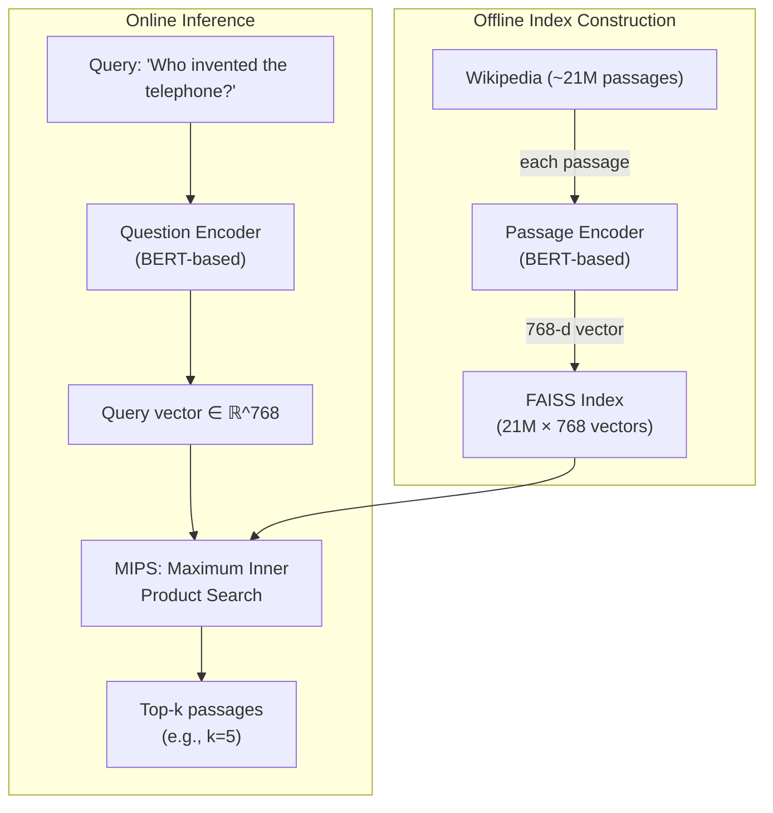
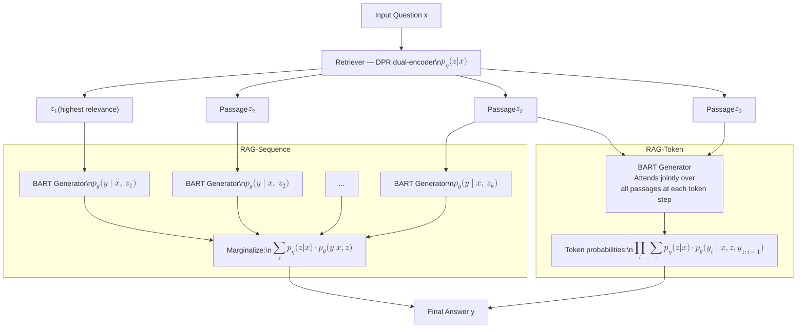

# RAG: How Language Models Learned to Look Things Up

## The Library Problem

Imagine a scholar who has spent years reading—millions of books, papers, encyclopedias, everything ever written. They have absorbed an extraordinary amount of knowledge. But there is a catch: they read all of it before a specific date, and they will never read anything new. If you ask them about something that happened after they stopped reading, they will not say "I don't know." They will confabulate. They will produce something plausible-sounding, drawn from the patterns of what they do know, and present it with the same confidence they apply to facts they actually absorbed. They cannot distinguish between what they remember and what they invented.

This is, roughly, what parametric language models do. They encode knowledge into billions of learned weights during training, and those weights become fixed at the moment training ends. Ask a model about an event that occurred after its training cutoff, or about a highly specific fact that was underrepresented in its training corpus, and you don't get uncertainty—you get a hallucination delivered in smooth, grammatical prose.

In 2020, a team of researchers at Facebook AI Research led by Patrick Lewis asked a different question: what if the knowledge didn't have to live in the parameters at all?

Their paper, "Retrieval-Augmented Generation for Knowledge-Intensive NLP Tasks," published at NeurIPS 2020, proposed a model that could look things up. Not browse the web—but consult a dense, indexed corpus of text at inference time, retrieve the passages most relevant to a given question, and generate an answer grounded in those documents. The model didn't need to have memorized the answer during training. It just needed to know how to find it.

RAG, as it became universally known, was not just a new architecture. It was a new way of thinking about what a language model can be—and what the relationship between intelligence and memory ought to look like.

## What Existed Before, and Why It Wasn't Enough

Open-domain question answering—answering factual questions without specifying a reference document—is one of the hardest problems in NLP. Unlike reading comprehension tasks, where a passage is provided and the model simply needs to locate the answer within it, open-domain QA requires the model to figure out which passage even matters before it can begin reasoning.

The classical approach to this problem was a pipeline: first, retrieve relevant documents using keyword search; then, extract an answer from those documents using a reading comprehension model. The retrieval step typically relied on **TF-IDF** or **BM25**, statistical methods that score documents based on word overlap with the query. A question asking about "the capital of France" would surface documents containing both "capital" and "France." These methods are fast, interpretable, and surprisingly robust.

Facebook AI Research itself had advanced this pipeline significantly in 2017 with **DrQA** (Chen et al.), which used a Wikipedia-scale TF-IDF retrieval system followed by a neural reading comprehension model. DrQA demonstrated that combining classical retrieval with deep learning was a viable strategy for open-domain QA, and it remained a strong baseline for years.

But TF-IDF and BM25 have a fundamental limitation: they match symbols, not meaning. If the query asks about "symptoms of myocardial infarction" and the relevant passage discusses "signs of heart attack," sparse retrieval systems may completely miss the connection. The words don't overlap, so the relevance score is low, even though the semantic content is identical. Lexical retrieval lives in token space. Meaning lives elsewhere.

Simultaneously, a different approach was gaining momentum: parametric models that encoded all their knowledge in weights. GPT-2 (2019) demonstrated that a large enough language model, trained on enough text, would absorb enormous amounts of factual knowledge simply as a side effect of learning to predict the next word. You could ask GPT-2 about historical events, scientific facts, biographical details, and it would often answer correctly—not because it was explicitly trained to do so, but because this knowledge was distributed across its parameters, crystallized from patterns in the training data.

This parametric approach had obvious appeal: one model, no retrieval infrastructure, end-to-end training. But its problems were equally obvious. The knowledge was frozen. It was opaque—you couldn't trace where an answer came from or verify it against a source. And crucially, it was brittle: models hallucinate with exactly the same fluency they use to state facts, and there is no internal mechanism that distinguishes between the two.

The gap between these approaches was clear. Sparse retrieval was fast but semantically shallow. Parametric knowledge was semantically rich but frozen and unverifiable. What was missing was a system that combined the best properties of both: retrieval that understood meaning rather than matching keywords, and generation that could use retrieved evidence rather than confabulating from memory.

That is precisely the gap RAG was designed to fill.

## Dense Passage Retrieval: The Retriever That Understands

At the heart of RAG is a retriever that works not by matching keywords but by comparing meanings. This retriever—DPR, for Dense Passage Retrieval, introduced in a companion paper by Karpukhin et al. in 2020—is built on a conceptually elegant architecture.

The idea is straightforward: represent both the query and every passage in the corpus as dense vectors in the same high-dimensional embedding space, trained such that relevant query-passage pairs are close together while irrelevant pairs are far apart. Retrieval then becomes a nearest-neighbor search. Given a new question, embed it, find the passages whose embeddings are nearest, and return them.

DPR uses two BERT-based encoders that operate independently. The question encoder takes a query and maps it to a 768-dimensional vector. The passage encoder takes a text passage and maps it to a 768-dimensional vector in the same space. The encoders share an architecture but have different weights—a **dual-encoder** (also called bi-encoder) design.

```
Query: "What year did Neil Armstrong land on the moon?"
       → Question Encoder → q ∈ ℝ^768

Passage: "The Apollo 11 mission landed on July 20, 1969..."
       → Passage Encoder → p ∈ ℝ^768

Relevance score: sim(q, p) = q^T · p
```

The relevance score between a question and a passage is simply the dot product of their embeddings. This inner product has a crucial property: it can be computed extraordinarily fast using approximate nearest-neighbor algorithms like FAISS (Facebook AI Similarity Search), which indexes millions of vectors and retrieves the top-k nearest neighbors in milliseconds.

The indexing step happens offline, before any queries arrive. Every passage in a corpus—Wikipedia, in the original paper, chunked into 100-word passages—is encoded by the passage encoder and stored in the FAISS index. This produces an index of roughly 21 million passage vectors for English Wikipedia. At inference time, a query arrives, gets encoded by the question encoder in one forward pass, and is compared against all 21 million indexed vectors. The top-k passages—typically 5 or 10—are returned.

Training DPR uses **contrastive learning**. For each question in a labeled QA dataset, there is a positive passage (known to contain the answer) and several negative passages (known not to contain it). The training objective pushes the question embedding close to its positive passage and far from the negatives:

$$\mathcal{L}(q, p^+, p_1^-, \ldots, p_n^-) = -\log \frac{e^{\text{sim}(q, p^+)}}{e^{\text{sim}(q, p^+)} + \sum_{i=1}^n e^{\text{sim}(q, p_i^-)}}$$

The choice of negative examples matters enormously. **Hard negatives**—passages that contain related information but not the specific answer—force the encoder to develop genuinely fine-grained semantic distinctions rather than learning superficial topic matching. A hard negative for a question about Neil Armstrong might be a passage about the moon's geology that mentions astronauts in general. The model must learn to distinguish "this passage discusses the topic" from "this passage answers the specific question."



The resulting system is qualitatively different from BM25. Where BM25 would fail to connect "automobile" and "car," DPR embeds both into nearby regions of the same semantic space. It matches meaning first, lexical overlap second. In the original DPR paper, the system achieved a top-20 passage retrieval accuracy of 79.4% on the Natural Questions benchmark—an improvement of more than 9 percentage points over BM25. The dense retriever was not marginally better. It was categorically better.

## BART: The Generator That Can Synthesize

Having retrieved the relevant passages, you still need to produce an answer. And this is where RAG departs from the extractive approach that had dominated QA before it.

Extractive QA—the approach used by most BERT-based reading comprehension systems—works by pointing to a span of text within the retrieved passage. Given "The Apollo 11 mission landed on July 20, 1969, and Neil Armstrong was the first to step on the surface," the extractive model would return "July 20, 1969" as the answer to "When did Armstrong land?" It finds the answer; it does not generate it.

Extraction is elegant for questions with single, locatable answers. But many knowledge-intensive tasks require something more: synthesizing information across multiple passages, restating facts in a different form, generating answers that don't appear verbatim in any single source. For these tasks, generation—actually producing new text—is not just an option but a requirement.

RAG uses **BART** as its generator. BART (Bidirectional and Auto-Regressive Transformers, Lewis et al. 2020—the same first author) is a denoising autoencoder pre-trained to reconstruct original text from various corrupted versions. It uses a standard Transformer encoder-decoder architecture: the encoder processes an input sequence, and the decoder generates output tokens autoregressively, attending to the encoder's representations at each step via cross-attention.

Why BART rather than BERT? BERT is encoder-only. It can produce rich contextual representations, but it cannot generate text—there is no decoder, no autoregressive generation loop. BART's encoder-decoder structure makes it naturally suited to seq2seq tasks: given an input of arbitrary text (including noisy, concatenated, or out-of-order passages), generate a coherent output. The denoising pre-training specifically prepared BART to handle imperfect inputs, which is exactly what retrieved passages are—relevant but heterogeneous text that must be fused into a single answer.

The input to the BART generator in RAG is the concatenation of the query with a retrieved passage, formatted as a single sequence that the encoder reads. The decoder then generates the answer token by token, attending to this combined input at every step. The key question—and the key architectural insight of the RAG paper—is how to combine generation across multiple retrieved passages.

## The Architecture: Marginalizing Over Knowledge

The mathematical heart of RAG is a probability equation. Understanding it is understanding why RAG works the way it does.

Standard neural QA models define a single probability distribution over answers given a question: $p(y | x)$. RAG introduces an intermediate variable $z$—the retrieved passage—and marginalizes over it. The model considers multiple possible evidence passages and integrates them into a single probability over answers.

Let $p_\eta(z | x)$ be the probability that passage $z$ is relevant for question $x$ (estimated by the retriever using inner products). Let $p_\theta(y | x, z)$ be the probability of generating answer $y$ given question $x$ and passage $z$ (estimated by the generator). The full model probability is:

$$p(y | x) = \sum_{z \in \text{top-}k} p_\eta(z | x) \cdot p_\theta(y | x, z)$$

This says: the probability of generating answer $y$ is the sum, over the most relevant retrieved passages, of the generator's probability for that answer conditioned on each passage, weighted by the retriever's confidence in each passage. The model doesn't commit to a single piece of evidence. It spreads probability mass across the top-k retrieved passages and asks: accounting for all of them, what answer is most likely?

This marginalization has a beautiful intuition. If five different passages all support the same answer, the combined probability of that answer is much higher than if only one does. If evidence is divided—some passages pointing to answer A, others to answer B—the model reflects that uncertainty in the output distribution. The retriever and generator are not in a pipeline where errors in retrieval silently propagate; they are jointly reasoned about.

The paper introduces two variants of this marginalization that differ in where the aggregation happens during generation.

**RAG-Sequence** retrieves the top-k passages once, generates a complete answer sequence for each passage independently, then combines the sequence probabilities across passages:

$$p_{\text{RAG-Seq}}(y | x) \approx \sum_{z \in \text{top-}k} p_\eta(z | x) \cdot p_\theta(y | x, z)$$

Here, $p_\theta(y | x, z)$ is the full sequence probability of $y$ given the concatenation of $x$ and a single passage $z$. Each passage generates one candidate answer, and the final answer is selected (or re-ranked) by the total probability.

**RAG-Token** aggregates at every individual token generation step. When generating the $i$-th token $y_i$, it attends over all top-k passages simultaneously, computing a mixture probability:

$$p_{\text{RAG-Token}}(y | x) = \prod_{i=1}^{N} \sum_{z \in \text{top-}k} p_\eta(z | x) \cdot p_\theta(y_i | x, z, y_{1:i-1})$$

This is subtly but importantly different. In RAG-Token, a single answer can draw from different passages at different positions. The model might use passage 1 to generate the first part of the answer and passage 3 to generate a later detail. The aggregation is token-granular rather than sequence-granular.

The tradeoff is intuitive: RAG-Sequence is better for questions where the answer is fully contained in a single document—where you want the model to find the right passage and generate from it coherently. RAG-Token is better for tasks where the answer must synthesize fragments from different sources—where you want the model to weave together evidence as it generates.



Training the full RAG system involves fine-tuning the BART generator while keeping the retriever's weights from DPR, and updating the FAISS index offline rather than end-to-end. The generator learns to produce good answers given retrieved evidence; the retriever continues to provide passages based on its pre-trained relevance model. In the original paper, the retriever was frozen during RAG training—the FAISS index was not updated during gradient descent. This was a practical choice that enabled efficient training, and it came with an important architectural benefit: the index can be updated completely independently of the generator. Change the document corpus—add new documents, remove stale ones—by re-encoding and re-indexing, without touching the generator weights. The knowledge is decoupled from the model.

## What the Numbers Said

The results of the RAG paper were not ambiguous.

On **Natural Questions**, one of the most rigorous open-domain QA benchmarks (drawn from actual Google search queries), RAG-Token achieved an exact match score of 44.5—compared to 41.5 for the previous best retrieval-augmented approach (REALM) and 29.8 for a parametric-only T5 model of similar size. This gap matters: the parametric model, with all its knowledge baked into its weights, couldn't come close to a model that was allowed to look things up.

On **TriviaQA**, a dataset of trivia questions with answers verifiable against Wikipedia, RAG-Token scored 56.8 exact match, outperforming the previous best by over 5 points. On **WebQuestions**, a benchmark of questions about Freebase entities, RAG again set the state of the art.

The pattern was consistent: tasks requiring specific, verifiable facts about the world were where RAG's advantage was largest. Parametric models learn to estimate which facts are plausible given the patterns in their training data. RAG learns to find the actual fact and read it. For knowledge-intensive tasks, finding and reading beats estimating.

Beyond question answering, the paper tested RAG on several other knowledge-intensive tasks that reveal different properties. For **Jeopardy! question generation**—given an answer like "The capital of France," generate the corresponding question "What is Paris?"—RAG produced generations that human evaluators rated as more factual and more specific than a parametric BART baseline. The retrieval grounded the generation in specific factual context rather than generating from statistical priors alone.

On **FEVER**, a fact verification benchmark where the model must determine whether a claim is supported, refuted, or neither by a Wikipedia passage, RAG improved substantially over extractive baselines. The capacity to generate rather than merely classify allowed the model to reason across retrieved passages rather than relying on pattern-matched surface features.

The RAG-Sequence versus RAG-Token comparison also yielded informative results. RAG-Sequence was better on tasks that benefit from holistic document-level reasoning—where the whole passage matters and coherent generation from a single source is preferred. RAG-Token was better on generative tasks requiring synthesis—where the model benefits from picking and choosing specific evidence tokens from multiple passages. The two variants are not competing approaches; they illuminate different regimes of knowledge-intensive generation.

Perhaps the most telling comparison was between RAG and a parametric-only BART model of comparable size. Given the same question, the parametric BART frequently produced answers that were plausible-sounding but factually wrong—hallucinations stated with the same fluency as correct answers. RAG produced answers that were grounded in specific retrieved passages, and when those passages contained the answer, the RAG answers were reliable. The hallucination rate dropped not because the generator became more honest but because it now had evidence to ground its generation in. It wasn't guessing; it was reading.

## What This Changed

The first thing RAG changed was conceptual. Before RAG, knowledge in an NLP system was treated as a property of the model—something learned during training, encoded in weights, opaque and inaccessible. RAG made knowledge a first-class engineering artifact: an external, queryable, updateable resource. This is a profound reframing. Instead of asking "does the model know this fact," you ask "is this fact in the index?" The first question has no clear answer for a parametric model. The second has a definitive one.

The second thing RAG changed was practical: it created a viable path to systems that could be kept current without retraining. A parametric language model that knows information from its training cutoff will become increasingly stale over time. The cost of updating it—retraining or fine-tuning on new data—is high. With RAG, updating what the system "knows" is as simple as updating the document index. Add a new Wikipedia revision to the index; the model can now answer questions about it. Remove outdated passages; the model stops citing them. The knowledge base and the reasoning engine are decoupled.

The third thing RAG changed was traceability. When a RAG system answers a question, it is—at least in principle—possible to identify which retrieved passages contributed to the answer. This is not merely a nice-to-have for debugging. In high-stakes domains like medicine, law, or finance, the ability to point to a source document and say "this is where the answer came from" is the difference between a useful tool and an unacceptable liability. Parametric models produce answers without sources. RAG produces answers with something resembling provenance.

These three changes—knowledge as artifact, knowledge as updateable, knowledge as traceable—planted the seeds for an entire generation of systems. When vector databases like Pinecone, Weaviate, and Chroma emerged as infrastructure primitives a few years after the RAG paper, they were building on exactly this insight: that retrieval over dense embeddings was a foundational capability worth engineering seriously. When LangChain and LlamaIndex appeared as frameworks for building RAG pipelines, they were productizing the RAG paradigm. When enterprises began building document Q&A systems over their internal corpora, RAG was the architectural pattern they reached for.

The paper didn't just introduce a model. It introduced a paradigm—and paradigms, once they take hold, are remarkably durable.

## What the Paper Left Open

A paper that establishes a paradigm also reveals the contours of the problem it leaves unsolved.

The indexing assumptions in the original RAG paper were restrictive in ways that only became apparent at scale. The paper used English Wikipedia, chunked into 100-word passages of clean, well-structured prose. Real-world knowledge corpora look nothing like this. They contain PDFs with inconsistent formatting, HTML with navigation menus and cookie banners, scanned documents with OCR errors, tables, figures with captions, and code. The question of how to chunk these documents—what constitutes a semantically meaningful unit of retrieval—turned out to be a major engineering problem. Too small, and individual chunks lose context. Too large, and they dilute relevance and overflow context windows. The choice of chunking strategy can change RAG system quality by enormous margins, and the paper gave no guidance on this because it was working with clean pre-segmented Wikipedia passages.

A subtler problem is what subsequent research identified as the **"lost in the middle" phenomenon**. When the retrieved passages are concatenated and fed to the generator, the model's attention is not distributed uniformly. Empirical studies found that transformers attend more strongly to text at the beginning and end of long input sequences, and substantially less to information buried in the middle. If the key passage is retrieved but placed in the middle of a five-document context window, the generator may effectively ignore it. The retriever may do its job perfectly; the generator fails to use the evidence. This problem is architectural and not easy to solve by improving retrieval alone.

There is also a deeper question about faithfulness that the paper does not fully address: even when the right passages are retrieved, does the generator actually produce answers grounded in those passages? Or does it sometimes generate a fluent, plausible answer that contradicts or ignores the retrieved evidence, substituting parametric knowledge from pre-training? This phenomenon—parametric knowledge overriding retrieved evidence—became a significant research concern as RAG systems scaled, because it partially undermines the traceability argument. A system that sometimes ignores its sources is not truly grounded.

The evaluation methodology for retrieval quality also remained unsettled. The paper evaluates the end-to-end answer quality, which conflates retrieval quality with generation quality. If the system gets a question wrong, is it because the retriever returned irrelevant passages, or because the generator failed to use the right passage, or because the relevant information simply wasn't in the index? Disentangling these failure modes requires additional instrumentation that was not part of the original framework.

What followed the original RAG paper was an extraordinarily productive research program addressing these gaps. **Self-RAG** (2023) introduced a mechanism for the model to assess its own retrieved passages—generating "reflection tokens" that evaluate relevance and support before incorporating evidence. **FLARE** (2023, Forward-Looking Active REtrieval) proposed dynamic retrieval: instead of retrieving once at the start of generation, the model retrieves new passages whenever it encounters uncertainty during generation. **HyDE** (Hypothetical Document Embeddings, 2022) addressed the query-passage mismatch by first generating a hypothetical answer to the question, then using the embedding of that hypothetical answer as the retrieval query—matching the embedding space more closely to passage-style text. **GraphRAG** (2024) replaced flat passage retrieval with knowledge graph traversal, enabling multi-hop reasoning across entities and relationships. Each of these was a direct response to a limitation visible in the original RAG architecture.

The field that the RAG paper helped create has moved very fast. But the core architectural pattern—retrieve, then generate, marginalize over evidence—has proven remarkably stable. The implementations have grown sophisticated; the fundamental insight has remained.

## A Note on Fusion in Decoder

Before concluding, it is worth briefly situating RAG against its closest contemporary competitor: **Fusion in Decoder** (FiD, Izacard and Grave, 2020). FiD appeared nearly simultaneously with RAG and proposed a similar approach with one architectural difference. Where RAG concatenates the question and each retrieved passage into a single sequence for the encoder, FiD encodes each passage independently through the BART encoder (passing each as a separate question-passage pair), then concatenates the resulting encoder representations and feeds the combined representation to the decoder.

This is a subtle but meaningful difference. FiD's decoder attends over a much richer set of encoded representations—each passage has been independently contextualized relative to the question—whereas RAG's encoder sees all passages concatenated into a single long sequence. FiD achieved marginally higher performance than RAG on some QA benchmarks, and both papers contributed meaningfully to the field. The RAG paper's broader influence came partly from its conceptual framing—the explicit marginalization over retrieved documents, the focus on the parametric/non-parametric duality—and partly from the DPR retriever paper which accompanied it. RAG gave the field a vocabulary and a theoretical framework, not just a model.

## Memory as Infrastructure

There is a philosophical question running beneath the technical surface of the RAG paper that is worth naming directly.

A language model, in the conventional view, is an entity that knows things—or doesn't. Knowledge lives in weights. Training builds it in. Inference consults it. This model of knowledge is deeply parametric: the model is its knowledge, in some sense. What it knows and what it is are inseparable.

RAG challenges this model by separating two things that were previously fused: **reasoning capacity** and **world knowledge**. The BART generator provides reasoning capacity—the ability to read passages and produce coherent, relevant answers from them. The FAISS index provides world knowledge—a structured representation of facts, updateable independently of the generator. The model is not its knowledge. The model is its reasoning over accessed knowledge.

This distinction maps interestingly onto theories of human memory. Cognitive psychology distinguishes between **working memory**—the small, fast, actively maintained buffer that holds current information—and **long-term memory**—the large, slow, declarative store of facts and experiences. We don't know things by having all of them active in working memory simultaneously. We know things by being able to retrieve them when needed. Intelligence, for humans, is less about having information than about knowing which information to retrieve and how to use it.

RAG makes an analogous architectural claim: intelligence in a language system is less about having facts baked into weights than about knowing how to find the relevant facts and reason over them. The retriever is the access mechanism. The generator is the reasoning engine. Together they constitute something that behaves more like a scholar with a library than a scholar who has memorized everything.

The tension between parametric and non-parametric knowledge is not fully resolved by RAG—it is articulated more clearly. Parametric knowledge is fast (no retrieval overhead), seamless (integrated into generation naturally), and compresses world knowledge into compact representations. Non-parametric knowledge is accurate (grounded in specific text), updateable (change the index, change what the system knows), and traceable (you can point to the source). Real systems often want both. The question is not which is better in the abstract but which properties matter most for a given application.

For tasks where currency matters—answering questions about recent events, navigating rapidly changing domains—non-parametric retrieval is indispensable. For tasks where fluency and reasoning matter more than factual precision—creative writing, code generation, conversational interaction—parametric knowledge may dominate. Most interesting real-world systems exist somewhere in between, which is why hybrid approaches that combine dense retrieval with large language models' inherent parametric knowledge have become the dominant architectural pattern.

The insight from RAG that has proven most durable is not a specific number or benchmark. It is the recognition that knowledge can be externalized—that it can live outside the model, updated independently, consulted dynamically—without sacrificing the model's ability to reason coherently about it. This externalization turned knowledge into infrastructure.

And infrastructure, once it exists, invites engineering.

## Closing: The Right Question

When a student asks a question they don't know the answer to, there are two possible responses. They can try to reconstruct the answer from first principles, reasoning outward from what they do know. Or they can say "let me look that up." The first approach is sometimes faster and feels more impressive. The second approach is more likely to be correct.

Language models, before RAG, could only do the first. They were brilliant reconstructors—able to synthesize plausible-sounding answers from distributional patterns learned during training. But reconstruction and remembering are different, and reconstruction can fail silently, producing confident confabulations indistinguishable from genuine recall.

RAG gave language models the ability to look things up. Not by connecting them to the internet (that came later), and not by eliminating their parametric knowledge (that remains valuable), but by giving them a structured mechanism to consult external evidence before generating an answer. The model still reasons. It just no longer has to reason alone.

The paper's title contains the word "augmented"—retrieval-augmented generation. The augmentation is the key term. RAG didn't replace language model generation with retrieval. It augmented generation with retrieval. The model still produces the answer; it just does so with better evidence. The model is still the reasoning engine; the index is the library it can walk into.

In the years since the paper's publication, retrieval-augmented architectures have become so widespread that "RAG" is now a category rather than a model—a design pattern that encompasses hundreds of implementations, refinements, and variations. The original paper's specific architecture has been superseded many times over. Its questions haven't been.

What does it mean for a system to "know" something? Is knowledge the capacity to generate plausible text about a topic, or the capacity to retrieve and reason over specific evidence? What is the right relationship between what a model has learned and what it can access? When should a system trust its parametric memory, and when should it go look something up?

These are not engineering questions. They are questions about the nature of intelligence—and RAG, in its modest but precise way, took a specific empirical stance on them. Intelligence doesn't have to mean memory. It can mean access. And access, it turns out, is something you can build.

---

## Going Deeper

**The Papers:**

- Lewis, P., Perez, E., Piktus, A., Petroni, F., Karpukhin, V., Goyal, N., ... & Kiela, D. (2020). ["Retrieval-Augmented Generation for Knowledge-Intensive NLP Tasks."](https://arxiv.org/abs/2005.11401) *NeurIPS 2020*. — The paper itself. The writing is clear, the ablations are informative, and the framing of parametric vs. non-parametric knowledge rewards careful reading.
- Karpukhin, V., Oguz, B., Min, S., Lewis, P., Wu, L., Edunov, S., ... & Yih, W. (2020). ["Dense Passage Retrieval for Open-Domain Question Answering."](https://arxiv.org/abs/2004.04906) *EMNLP 2020*. — The DPR paper, the companion to RAG. Essential for understanding how the retriever works and why it outperforms sparse methods.
- Chen, D., Fisch, A., Weston, J., & Bordes, A. (2017). ["Reading Wikipedia to Answer Open-Domain Questions."](https://arxiv.org/abs/1704.00051) *ACL 2017*. — DrQA, the predecessor. Reading this paper first makes the progress represented by RAG much more concrete.
- Izacard, G., & Grave, E. (2020). ["Leveraging Passage Retrieval with Generative Models for Open Domain Question Answering."](https://arxiv.org/abs/2007.01282) *EACL 2021*. — Fusion in Decoder (FiD), the concurrent competitor to RAG. The architectural comparison between FiD and RAG illuminates both approaches.
- Gao, Y., Xiong, Y., Gao, X., Jia, K., Pan, J., Bi, Y., ... & Wang, H. (2023). ["Retrieval-Augmented Generation for Large Language Models: A Survey."](https://arxiv.org/abs/2312.10997) — The most comprehensive survey of where RAG went after 2020. Covers Self-RAG, FLARE, HyDE, advanced indexing, and evaluation methods.

**Books:**

- Jurafsky, D., & Martin, J. H. *Speech and Language Processing* (3rd ed., in progress). Free draft at web.stanford.edu. — Chapter 14 on information retrieval is an excellent introduction to the full spectrum from BM25 to dense retrieval.
- Manning, C. D., Raghavan, P., & Schütze, H. *Introduction to Information Retrieval*. Cambridge University Press, 2008. Available free online at nlp.stanford.edu/IR-book. — The authoritative textbook on IR fundamentals—essential context for understanding why dense retrieval was a breakthrough.
- Tunstall, L., von Werra, L., & Wolf, T. *Natural Language Processing with Transformers*. O'Reilly Media, 2022. — Chapter 7 covers question answering in depth, with practical code using Hugging Face.

**Online Resources:**

- [LangChain RAG documentation](https://python.langchain.com/docs/use_cases/question_answering/) — The most widely-used practical implementation of the RAG pattern, with extensive coverage of chunking strategies, retriever types, and evaluation approaches.
- [LlamaIndex documentation](https://docs.llamaindex.ai/) — Higher-level abstraction over RAG pipelines, with particularly good coverage of the indexing and document processing challenges that the original paper set aside.
- [Pinecone Learning Center](https://www.pinecone.io/learn/) — Exceptionally clear explanations of vector search and RAG architecture, aimed at practitioners rather than researchers.

**Videos:**

- Andrej Karpathy's lecture series on neural networks — particularly his discussions of how knowledge is stored in transformer weights, provides useful context for understanding the parametric side of the parametric/non-parametric duality.
- James Briggs's RAG series on YouTube (Pinecone) — covers the full implementation pipeline with clear visual explanations of the retrieval and indexing steps.

**A Question to Sit With:**

The tension between parametric and non-parametric knowledge maps remarkably well onto a distinction in cognitive science: the difference between knowing something and knowing where to find it. A chess grandmaster who has memorized thousands of openings has deep parametric knowledge; a researcher who knows which textbook to consult has non-parametric access. Both are forms of intelligence. But they have different properties under change—when the world updates, the grandmaster's memorized openings may become obsolete, while the researcher simply updates the bibliography.

Is the same distinction meaningful for artificial systems? And if so, what does the right balance look like—and for which tasks? The original RAG paper is a specific, empirical answer to a question that probably doesn't have a universal answer. Which is what makes it interesting to keep thinking about.
