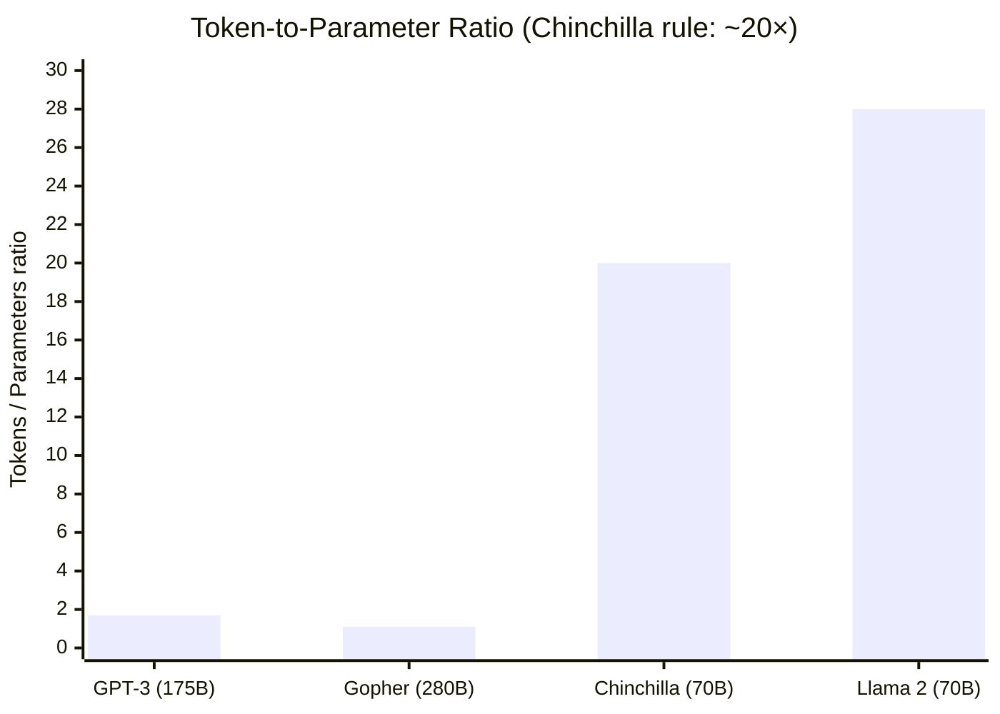
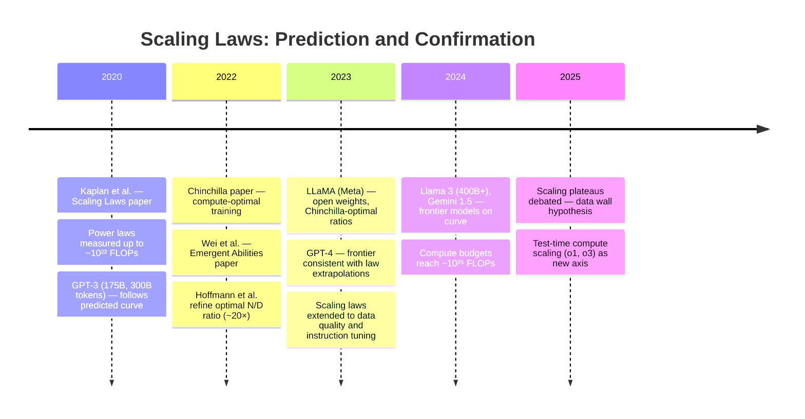

# Scaling Laws: The Equations That Predicted the Future of AI

## January 2020: Before the Certainty

In January 2020, OpenAI published "Scaling Laws for Neural Language Models." The paper didn't introduce a new architecture. It didn't propose a new training technique. It didn't even claim a new benchmark result.

What it did was measure something.

The team — Jared Kaplan, Sam McCandlish, Tom Henighan, and colleagues — trained hundreds of language models, deliberately varying three quantities: the number of parameters, the amount of training data, and the amount of compute used. They tracked performance on a simple metric: the cross-entropy loss on held-out text. And they found that performance followed smooth, predictable curves — power laws — as each variable increased.

This sounds dry. It wasn't.

What the curves implied was that language model performance was not subject to the unpredictable dynamics that most researchers assumed. It wasn't going to plateau suddenly, or require a clever architectural breakthrough to keep improving, or respond erratically to scale. Within the ranges studied — and, as it turned out, well beyond them — performance improved smoothly and reliably as you added compute, data, or parameters. The relationship was mathematical. You could write down the equation.

More than that: the equations were *predictive*. You could train a small model cheaply, fit the scaling curve, and extrapolate forward to estimate what a much larger model would achieve. You didn't have to train the large model to know its performance. You could predict it from first principles — from the shape of the curve.

This changed everything. Not immediately, not all at once, but in a way that proved irreversible. The scaling laws paper gave the field a roadmap where it had previously been navigating by intuition. And the teams that understood its implications earliest moved fastest.

## What Was Known Before, and What Wasn't

The idea that larger models tend to work better wasn't new. NLP researchers had been observing for years that more parameters generally helped, that more data generally helped, that more training generally helped. This was folk wisdom, reinforced by benchmark results, but not precisely characterized.

The problems with folk wisdom are well-known. "More is better" doesn't tell you how much better, or whether you're getting diminishing returns, or how to allocate a fixed compute budget between bigger models and more data, or at what point you should stop training. The practical decisions — how many parameters to use, how long to train, how much data to collect — were made largely by intuition, convention, and copying what seemed to work.

There had been some empirical work on neural language model performance at scale. Hestness et al. (2017) and Rosenfeld et al. (2019) had found power-law relationships in certain settings. But these results weren't widely integrated into the intuitions of the field, and the characterization wasn't systematic enough to be actionable for practical training decisions.

What the 2020 scaling laws paper added was precision, scope, and actionability. It measured the relationships across a wide enough range and with enough care that the curves were credibly extrapolable. It identified the key variables cleanly. And it drew the practical implications explicitly: given a fixed compute budget, how should you allocate it? The answer turned out to be surprising.

## The Three Variables

The scaling laws govern the relationship between performance and three quantities.

**$N$: Model size** — the number of non-embedding parameters in the model. More parameters means a more expressive model, one capable of representing more complex functions. In a Transformer language model, this is dominated by the weight matrices in the attention layers and feedforward layers.

**$D$: Dataset size** — the number of tokens the model is trained on. More data means exposure to more of the distribution you're trying to model. In language modeling, this is the total number of tokens processed during training, counting repeated passes through data (epochs).

**$C$: Compute** — measured in floating-point operations. This is the most fundamental resource: the actual physical computation performed. $C$ is approximately proportional to $N \times D$ — if you have $N$ parameters and train for $D$ tokens, you perform roughly $6ND$ floating-point operations (factor of 6 from forward pass, backward pass, and parameter updates).

The loss is measured as cross-entropy on held-out text, in nats (natural-log units). Lower is better.

## The Power Laws

The central empirical finding is that, when each variable is varied while the others are held at large values, performance follows a clean power law:

$$L(N) \sim N^{-\alpha_N}$$

$$L(D) \sim D^{-\alpha_D}$$

$$L(C) \sim C^{-\alpha_C}$$

With exponents approximately:

$$\alpha_N \approx 0.076, \quad \alpha_D \approx 0.095, \quad \alpha_C \approx 0.050$$

These numbers are small — the performance improvement per doubling is modest. But they are *consistent*. And they hold across many orders of magnitude.

What does $\alpha_N \approx 0.076$ mean practically? Doubling the number of parameters multiplies the loss by $2^{-0.076} \approx 0.95$. A 5% reduction in loss per doubling of parameters. Not dramatic in isolation — but consistent across every doubling from 10 million to 10 billion parameters. Ten doublings of parameters (roughly a 1000× increase) reduces loss by approximately $(0.95)^{10} \approx 0.60$, cutting the loss by 40%.

The flatness of these curves — the small exponents — is itself informative. It means there are no phase transitions, no cliffs, no sudden jumps. Performance improves gradually and predictably. The smooth curves also mean there are no obvious local maxima; more is always better in each dimension, with no indication that any of the trends level off within the ranges studied.

```
Loss as a function of parameters (schematic):

     ↑ Loss (cross-entropy)
 4.0 |●
     |  ●
 3.5 |    ●
     |      ●
 3.0 |        ●
     |          ●
 2.5 |            ●
     |              ●
 2.0 |                ●
     +--+--+--+--+--+--→
     1M 10M 100M 1B 10B 100B
               Parameters (N)
```

The slope of this curve in log-log coordinates is $-\alpha_N$. The curve is straight in log-log space — that is the definition of a power law.

## The Irreducible Loss: Entropy of Language

The full model for the loss as a function of $N$ and $D$ simultaneously is:

$$L(N, D) = \left[\left(\frac{N_c}{N}\right)^{\frac{\alpha_N}{\alpha_D}} + \frac{D_c}{D}\right]^{\alpha_D}$$

Where $N_c$ and $D_c$ are fitted constants that set the scale of the relationship.

As both $N$ and $D$ go to infinity, the loss approaches an **irreducible floor** — the entropy of the language distribution itself. Even a perfect language model cannot predict perfectly, because language is genuinely stochastic. Different completions are valid; different speakers would say different things. This floor is not zero.

The existence of this floor is meaningful. It separates the achievable loss into two components: what can be reduced by more compute, and what cannot. The gap between current model performance and the irreducible floor represents the remaining headroom for improvement. Scaling curves show this gap closing, slowly but continuously, as models grow.

## The Critical Insight: How to Allocate Compute

The most practically consequential finding in the paper is not the existence of scaling laws — it is what they imply about optimal compute allocation.

Given a fixed compute budget $C = 6ND$, how should you split it between parameters $N$ and training tokens $D$?

The naive intuition: train the biggest model you can afford, for as long as you can afford. Maximize $N$.

The scaling laws say: **this is wrong**. For a given compute budget, you should train a model that is smaller than the maximum you could fit in memory, for longer — more tokens. The optimal model size and optimal number of training tokens grow together, roughly proportionally, as compute increases.

Formally, for optimal performance at compute budget $C$:

$$N_{\text{opt}} \propto C^{0.73}, \quad D_{\text{opt}} \propto C^{0.27}$$

Parameters grow faster than tokens in the optimal allocation, but tokens can't be neglected. Doubling compute means roughly 60% more parameters and 60% more tokens — not 100% more parameters.

```
At each compute budget, the optimal (N, D) lies on a curve:

    Log(N)
      ↑
      |            ● C = 10^24 FLOP
      |       ● C = 10^23 FLOP
      |  ● C = 10^22 FLOP
      | ● C = 10^21 FLOP
      +------------------------→ Log(D)

Training below this curve (too large N, too few D): undertrained
Training above this curve (too small N, too many D): underparameterized
```

This finding had a striking implication: most of the large models trained before 2020 were undertrained. They were trained on too little data for their size. GPT-3 (175B parameters, 300B tokens), released later in 2020, was already a case in point. By the scaling laws, 175B parameters should have been trained on substantially more tokens to hit the optimal performance for that compute budget.

This is not a criticism of GPT-3. The compute budget for GPT-3 was unprecedented, and the optimal allocation implied by scaling laws may have required data pipelines that didn't yet exist. But the implication was clear for the future: as compute increased, the critical constraint would increasingly be data and training duration, not model size.

## Chinchilla: When the Prediction Was Tested

In 2022, DeepMind published "Training Compute-Optimal Large Language Models" — commonly called the Chinchilla paper, after the model it introduced. The paper's thesis was a direct response to the 2020 scaling laws: most frontier models were undertrained, and you could achieve better performance with a smaller model trained on more data.

The Chinchilla team fit new scaling laws using a different methodology (training many models to completion rather than stopping early) and arrived at a cleaner rule of thumb: for optimal performance, the number of training tokens should be approximately **20× the number of parameters**.

| Model | Parameters | Tokens | Ratio (tokens/params) |
|-------|-----------|--------|----------------------|
| GPT-3 | 175B | 300B | 1.7× |
| Gopher | 280B | 300B | 1.1× |
| **Chinchilla** | **70B** | **1.4T** | **20×** |
| Llama 2 70B | 70B | 2T | 28× |

Chinchilla (70B parameters, 1.4T tokens) significantly outperformed Gopher (280B parameters, 300B tokens) despite being 4× smaller. The prediction of the 2020 scaling laws — that models were being trained suboptimally — was confirmed.

The contrast in token-to-parameter ratios is stark — the pre-Chinchilla models were trained on dramatically fewer tokens than optimal:



The Chinchilla result restructured priorities across the field. Frontier labs shifted focus toward data pipelines, data quality, and long training runs. The race to maximize parameter count gave way to a more nuanced view of the parameter-to-token ratio as the key design variable.

## What Power Laws Are Saying About Difficulty

There is something philosophically interesting about the shape of the scaling curves.

Power laws — the kind that describe scaling in neural networks — appear across a remarkable range of natural and social systems. The distribution of city sizes. The frequency of words in language (Zipf's law). The magnitude of earthquakes. The connectivity of networks. Whenever you see a power law, you are likely looking at a system with a hierarchical structure, where things of different sizes interact across many scales simultaneously.

In language modeling, the power law might be telling us something about the structure of language itself. Language understanding decomposes into sub-skills that are themselves hierarchically organized: phonology, morphology, syntax, semantics, pragmatics, world knowledge, discourse structure. These skills span many levels of abstraction, and a language model must acquire all of them. A power law relationship with model size may reflect the fact that you need to acquire more and more of this hierarchy — skills that are progressively harder, requiring progressively more capacity — to keep improving.

This interpretation is speculative, but it connects to an empirical observation that makes more sense in this light: there are no sharp thresholds or phase transitions in the basic scaling curves. If language understanding were "unlocked" at a specific scale, you'd expect a kink in the curve. Instead, the curve is smooth. Every increment of scale helps, because there is always another skill in the hierarchy waiting to be learned.

## Emergent Abilities: Where Scaling Laws End

The scaling laws describe cross-entropy loss on a held-out text distribution. This is a smooth, continuous measure. Specific downstream capabilities — solving math problems, writing code, reasoning through multi-step arguments — are not smooth, and scaling laws do not directly predict them.

In 2022, Wei et al. published a paper documenting **emergent abilities**: capabilities that appear absent in small models and present in large ones, with what appeared to be sharp transitions rather than gradual improvements. Zero-shot arithmetic, multi-step reasoning, code generation, translation into rare languages — these abilities seemed to materialize suddenly around certain parameter thresholds.

This created apparent tension with the smooth scaling laws. If loss decreases smoothly with scale, how can specific capabilities emerge discontinuously?

The reconciliation came gradually. Several papers showed that "emergence" depends heavily on the metric. When you measure a capability with a binary correct/incorrect metric (right or wrong), small improvements in the underlying distribution can look like a jump from zero to near-perfect performance. But when you switch to a partial-credit metric, the same capability often shows continuous improvement from the start. The discontinuity was often in the measurement, not the model.

This doesn't eliminate emergence entirely. Some capabilities do appear to require qualitative shifts — model representations that support more complex operations, not just better versions of simpler ones. But the scaling laws paper's core finding holds: cross-entropy loss improves smoothly, and many apparent discontinuities dissolve under more careful measurement.

## The Compute Threshold and What It Predicted

One of the most striking aspects of the 2020 scaling laws is that they were written before GPT-3, before ChatGPT, before the instruction-following revolution. They described trends that, at the time, had been measured up to roughly $10^{22}$ FLOPs. They extrapolated those trends forward.

The extrapolations proved accurate.

GPT-3, trained at roughly $3 \times 10^{23}$ FLOPs, performed approximately where the scaling curves predicted. GPT-4, while its training details are not public, is consistent with the scaling law predictions extended further. Llama 2 and 3, Mistral, Gemini — the frontier models of 2023 and 2024 — follow the trajectories the 2020 paper described.

This is the unusual achievement of the scaling laws paper: it made predictions about systems that didn't yet exist, and the systems, when they were built, confirmed the predictions. This is what scientific laws are supposed to do.



The predictive success had a practical consequence. Labs with access to the scaling laws could estimate, *before* training, what performance a given model would achieve. This transformed the economics of large-scale training. Instead of training a large model and discovering its capabilities after enormous compute expenditure, you could extrapolate from smaller experiments. The smaller models became pilots for the larger ones.

## Implications That Went Beyond the Paper

The scaling laws changed how people think about AI progress, in ways the 2020 paper didn't explicitly argue.

**Progress became predictable.** If performance scales as a power law with compute, and compute roughly doubles every one to two years with improving hardware and decreasing costs, then AI progress follows a predictable trajectory. This doesn't mean progress is guaranteed — data quality, algorithmic improvements, and architectural choices all matter — but it provides a baseline expectation that is far better than intuition.

**The race dynamics changed.** If the primary bottleneck to better models is compute, then the organizations best positioned to advance the frontier are those with the largest compute budgets. This concentrated the frontier in a small number of well-resourced labs in a way that was more explicit than before. The scaling laws didn't cause this concentration — the trend was already present — but they made the logic legible.

**Emergent capabilities became expected.** If scaling continuously improves the underlying model quality, and if specific capabilities unlock when the model quality passes some threshold, then new capabilities should be expected to emerge as scale increases. The appropriate reaction to an unexpected emergent ability is not surprise but curiosity about what threshold was crossed.

**Architectural choices became less critical.** If performance is primarily determined by scale — parameters, data, and compute — then the exact architecture matters less than the resources brought to bear. This is an overstatement; architecture still matters at the margins, and efficiency improvements can move you further along the scaling curve at fixed cost. But the dominant factor in the performance of large language models since 2020 has been scale, not clever architectural novelty.

## What Scaling Laws Don't Predict

The 2020 paper is careful about its scope. The scaling laws describe cross-entropy loss on the training distribution. They do not describe:

**Alignment and behavior.** A lower cross-entropy loss means better next-token prediction. It does not mean a safer, more helpful, or more truthful model. The relationship between loss and behavior is mediated by many factors — fine-tuning, instruction tuning, RLHF — that the scaling laws don't address.

**Reasoning and grounding.** Scaling laws say nothing about whether a model that can predict text well can also reason correctly about the physical world, maintain logical consistency, or avoid confabulation. These are separate dimensions of capability that may or may not scale smoothly.

**The ceiling.** The scaling laws describe trends within measured ranges. They don't tell you where the trends end, whether language model performance will plateau at human level, or whether there are upper bounds set by the structure of language or the nature of intelligence.

**Other modalities.** The 2020 paper focuses on text. The degree to which the same scaling laws apply to vision, audio, multimodal systems, and code is an active research area. Some generalize cleanly; others don't.

These limitations don't diminish the paper's contribution. They clarify its scope. The scaling laws describe one thing — loss as a function of compute, parameters, and data — and they describe it precisely. The translation from loss to capability, from capability to behavior, from behavior to value — these require additional theory that the scaling laws paper was not attempting to provide.

## The Equations Underneath Everything

Reading the 2020 scaling laws paper in 2026, from the vantage point of GPT-4, Claude 3, Gemini, and the rest, is a disorienting experience.

The models that have reshaped how knowledge workers do their jobs, that have made software engineering faster and scientific literature more navigable, that have generated debate about whether AI development should be slowed or regulated — all of these trace part of their lineage to a paper that showed, in January 2020, that language model performance follows $L(N) \sim N^{-0.076}$.

The equations were modest. The implications were not.

What the scaling laws established, and what has held since, is that intelligence — or at least the kind of intelligence required to predict text well — is not mysterious in its growth. It doesn't require insight or luck or breakthrough. It requires parameters, data, and compute. Given enough of all three, performance improves. The curve is predictable. The extrapolations work.

Whether this says something profound about the nature of intelligence, or only about the narrow task of next-token prediction, is a question worth asking carefully. The scaling laws don't answer it. They describe a curve. What the curve means — what it implies about minds, about understanding, about what these systems are actually doing — remains genuinely open.

But the curve is real. And following it has taken us, in five years, from models that could complete sentences to models that can write software, interpret medical images, and hold extended conversations. The equations were always there, waiting to be measured. Someone finally took the time to measure them.

---

## Going Deeper

Scaling laws sit at the intersection of empirical science, theory of computation, and practical AI engineering. Understanding them thoroughly means understanding the statistical physics of learning, the economics of compute, and what predictability implies about the trajectory of AI development.

**Books:**

- **[The Alignment Problem](https://www.google.com/search?q=Brian+Christian+The+Alignment+Problem+book) — Brian Christian**
  - The scaling laws fundamentally changed the alignment problem: if capabilities scale predictably, then the gap between current systems and highly capable ones is a matter of resources, not breakthroughs. Christian's careful account of what AI systems learn, what they optimize for, and why alignment is hard reads differently with scaling as background context.
- **[Human Compatible](https://www.google.com/search?q=Stuart+Russell+Human+Compatible+book) — Stuart Russell**
  - Russell's argument for why current approaches to AI are dangerous, and what the alternative looks like, becomes sharper when read alongside scaling laws. If performance scales smoothly, the window for addressing alignment before systems become highly capable may be narrower than intuition suggests.
- **[Deep Learning](https://www.deeplearningbook.org/) — Goodfellow, Bengio & Courville**
  - The foundational textbook, free online. The sections on optimization, regularization, and generalization provide the technical background needed to interpret what cross-entropy loss measures and why its behavior at scale is surprising.
- **[The Coming Wave](https://www.google.com/search?q=Mustafa+Suleyman+The+Coming+Wave+book) — Mustafa Suleyman**
  - Co-founder of DeepMind and CEO of Microsoft AI, writes directly about the implications of scaling for society, governance, and the pace of AI development. The book is explicitly informed by the scaling dynamics that the 2020 paper documented.

**Videos:**

- **[Scaling Laws for Neural Language Models — Explained](https://www.youtube.com/results?search_query=scaling+laws+neural+language+models+Kaplan+explained) — Various**
  - Several researchers have produced careful walkthroughs of the Kaplan et al. paper. Searching for "scaling laws Kaplan 2020" surfaces recent videos from research groups and practitioners who explain both the methodology and the practical implications clearly.
- **[Chinchilla Paper Explained](https://www.youtube.com/results?search_query=chinchilla+scaling+laws+paper+explained) — Yannic Kilcher / Various**
  - Kilcher's or similar walkthroughs of the Chinchilla paper provide essential context for the scaling laws, since Chinchilla refined and in some ways corrected the 2020 findings. Understanding how the two papers relate clarifies what is robust about scaling laws and what depends on methodology.
- **[The Bitter Lesson — Rich Sutton](https://www.youtube.com/results?search_query=Rich+Sutton+bitter+lesson+AI) — Various talks**
  - Sutton's 2019 essay (and various recorded talks about it) argued that general methods that leverage computation consistently outperform methods that try to encode human knowledge. The scaling laws paper is the most rigorous empirical validation of this thesis.
- **[AI and Compute — Trends and Implications](https://www.youtube.com/results?search_query=AI+compute+trends+scaling+implications+OpenAI) — OpenAI / Various**
  - OpenAI's AI and Compute blog post (and associated talks) documented the doubling time of compute used in frontier AI training. Read alongside the scaling laws, it allows you to extrapolate where the curves lead.

**Online Resources:**

- [The Bitter Lesson — Rich Sutton](http://www.incompleteideas.net/IncIdeas/BitterLesson.html) — The concise essay that stated the scaling thesis before the scaling laws paper proved it quantitatively. Essential reading. One page.
- [AI and Compute — OpenAI Blog](https://openai.com/index/ai-and-compute/) — OpenAI's documentation of how compute used in training frontier models has grown over time. The combination of the scaling laws and this compute trajectory defines the pace of AI progress.
- [Predictability and Surprise in Large Generative Models](https://hai.stanford.edu/sites/default/files/2022-12/Predictability_Surprise_Final_Dec2022.pdf) — Stanford HAI. A careful analysis of when scaling predicts and when it doesn't, examining the emergent abilities literature and its relationship to the smooth scaling laws.

**Papers That Matter:**

- **Kaplan, J., et al. (2020). *Scaling Laws for Neural Language Models*. [arXiv:2001.08361](https://arxiv.org/abs/2001.08361)**
  - The paper itself. Sections 1, 3, and 4 are essential. The appendix contains detailed derivations. The paper is unusual for its methodological transparency — the authors explicitly describe how they fit the curves and what their confidence is in extrapolation.
- **Hoffmann, J., et al. (2022). *Training Compute-Optimal Large Language Models (Chinchilla)*. [arXiv:2203.15556](https://arxiv.org/abs/2203.15556)**
  - The direct successor. Chinchilla refined the scaling laws by training models more carefully and arrived at the 20× tokens-per-parameter rule of thumb. The methodology section explains clearly why the two papers get different numbers despite studying the same phenomenon.
- **Wei, J., et al. (2022). *Emergent Abilities of Large Language Models*. [arXiv:2206.07682](https://arxiv.org/abs/2206.07682)**
  - Documents specific capabilities that appear to emerge discontinuously with scale. Should be read alongside the response papers (Schaeffer et al. 2023) that argue many apparent emergent abilities are artifacts of discontinuous metrics rather than discontinuous capabilities.
- **Schaeffer, R., et al. (2023). *Are Emergent Abilities of Large Language Models a Mirage?* [arXiv:2304.15004](https://arxiv.org/abs/2304.15004)**
  - The paper that showed many emergent abilities dissolve when you use graded metrics instead of binary ones. An important methodological corrective. Reading Wei et al. and then Schaeffer et al. gives you a clear picture of the debate.
- **Hestness, J., et al. (2017). *Deep Learning Scaling Is Predictable, Empirically*. [arXiv:1712.00409](https://arxiv.org/abs/1712.00409)**
  - An earlier, less comprehensive study that found power-law scaling in several settings. The 2020 Kaplan paper built on this work. Reading both shows how the earlier finding was refined into actionable predictions.

**A Question to Sit With:**

The scaling laws describe cross-entropy loss — a measure of how surprised the model is by the next token. As loss decreases, the model becomes better at predicting text. But what exactly does it mean to predict text well? Predicting text requires modeling the statistics of language, but also the world that language describes: history, science, social dynamics, human motivation, causal reasoning. A model with lower loss knows more about all of these — not because it was taught them explicitly, but because they are encoded in the statistical structure of text. If this is true, then scaling loss is also scaling world-knowledge, reasoning capacity, and understanding. But "understanding" feels like it should mean something more than very accurate prediction. Does predicting text well, at sufficient scale, amount to understanding the world? Or is it an indefinitely improvable approximation that approaches understanding without ever arriving?
