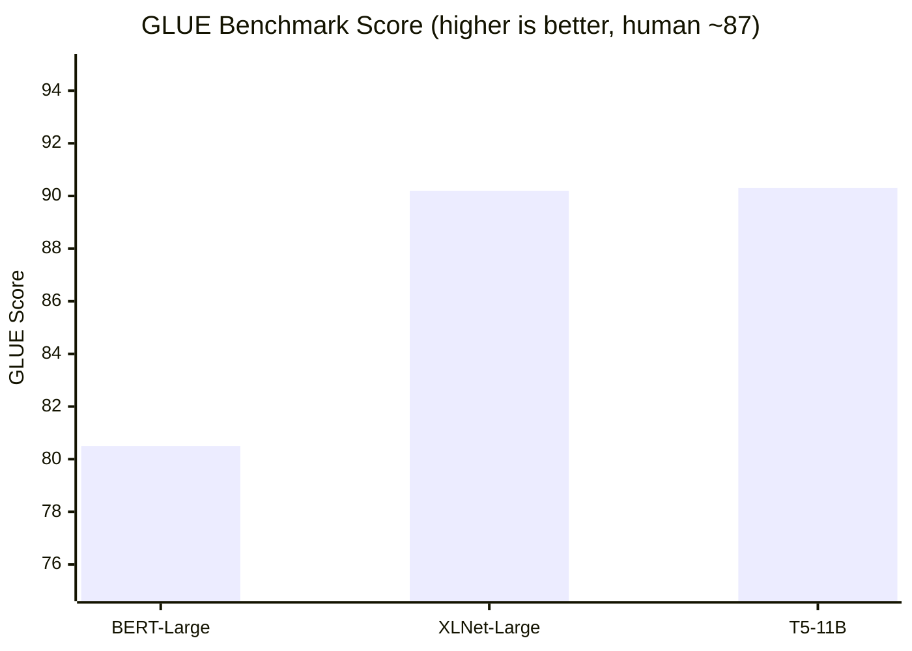
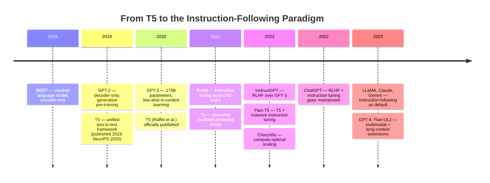

# T5: The Unification of Language

## 2019: NLP Was Winning and Fragmenting at the Same Time

By 2019, natural language processing had never been more capable, or more complicated.

BERT had arrived the year before and shattered benchmarks across language understanding. GPT had shown that generative pre-training could produce surprisingly coherent text. ELMo, ULMFiT, XLNet — each paper brought new tricks, new objectives, new architectural variants. Translation had its models. Summarization had its models. Question answering, reading comprehension, sentiment analysis, textual entailment — each task had its own dedicated pipeline, its own fine-tuning recipe, its own set of hyperparameter decisions.

The field was producing results. It was also producing, with every new task, a small explosion of design choices that were hard to compare and harder to reason about. If you wanted to apply NLP to a new problem, you faced a branching decision tree: which pre-trained model? Which fine-tuning objective? Which input format? Which decoding strategy? The answers were scattered across papers with incompatible setups, trained on different corpora, evaluated with different metrics.

A team at Google Research, led by Colin Raffel, looked at this proliferation and asked a question that seems obvious in retrospect: **what if we unified everything?**

Not as an engineering convenience. As a research principle. What if the right way to think about NLP — all of NLP — was as a single kind of problem: given some text as input, produce some text as output?

The paper that resulted, "Exploring the Limits of Transfer Learning with a Unified Text-to-Text Transformer," is one of the most carefully constructed empirical studies in deep learning. It didn't introduce a dramatic new architectural idea. It proposed a *framework* — and then, with unusual rigor, tested that framework against nearly every reasonable alternative. The result was T5, the Text-to-Text Transfer Transformer, and a set of findings about scale, data, and pre-training objectives that shaped the next several years of language model development.

## The Framework: Everything Is Text-to-Text

The central idea of T5 is radical in its simplicity. **Every NLP task is reframed as a seq2seq problem: the input is a text string, the output is a text string.**

This sounds obvious. It isn't. Before T5, the standard practice was task-specific output formats:

- **Classification** tasks (GLUE, sentiment): add a classification head, output a class probability
- **Span extraction** tasks (SQuAD): output start and end indices pointing into the input
- **Generation** tasks (summarization, translation): use an encoder-decoder architecture
- **Regression** tasks (STS-B, a semantic similarity benchmark): output a single float

Each format required different output layers, different loss functions, different decoding procedures. A model trained for classification couldn't easily be repurposed for generation, and vice versa. The pre-trained backbone was shared, but the task-specific heads were not.

T5's proposal: **drop all of that**. Make every output a text string. Classification becomes outputting the class name as text ("positive," "negative," "entailment"). Span extraction becomes outputting the span text itself. Translation and summarization are already text. Even regression is reframed: the model outputs a number *as text* ("3.8") and you parse it back.

```
# Every task becomes: given input text → predict output text

Translation (EN→DE):
  Input:  "translate English to German: The house is wonderful."
  Output: "Das Haus ist wunderbar."

Classification (sentiment):
  Input:  "sst2 sentence: The movie was surprisingly good."
  Output: "positive"

QA (SQuAD):
  Input:  "question: Who wrote Hamlet? context: William Shakespeare wrote Hamlet..."
  Output: "William Shakespeare"

Summarization:
  Input:  "summarize: The researchers found that... [long article] ..."
  Output: "Researchers discovered that early intervention..."

Regression (STS-B):
  Input:  "stsb sentence1: The cat sat. sentence2: A cat was sitting."
  Output: "3.8"
```

The task is signaled by a natural language prefix in the input. The model learns, across tasks, to follow these prefixes — to understand that "translate English to German:" means one thing and "summarize:" means another.

This unification has consequences that go beyond elegance. When a single model handles all tasks, it shares not just parameters but training signal. Information about one task can, in principle, transfer to others. The model learns what it means to "understand" language because it has to apply that understanding to dozens of different downstream objectives simultaneously.

More importantly for the paper's research agenda: a unified framework makes systematic comparison possible. If all tasks share the same architecture and the same output format, you can vary one thing at a time — pre-training objective, model scale, dataset — and measure the effect cleanly. T5 is as much a methodology as it is a model.

## The Architecture: Encoder-Decoder, Not Encoder-Only

T5 uses an encoder-decoder Transformer. This is a deliberate choice that distinguishes it from BERT (encoder-only) and GPT (decoder-only), and the choice is load-bearing for the text-to-text framework.

An encoder-only model like BERT produces a representation of the input that is useful for tasks requiring classification or span prediction. But it doesn't naturally produce new text. Adding a decoder for generation requires bolting on additional machinery. For T5's unified framework — where the output is always text — an encoder-decoder structure is the natural fit.

```
Encoder-Decoder Architecture (T5):

Input tokens → Encoder → Contextualized representations
                              ↓
Output tokens ← Decoder ← [Cross-attention over encoder outputs]
```

The encoder processes the full input sequence with bidirectional attention (every token can attend to every other token). The decoder generates the output token by token, attending to its own previous outputs (causal) and to the full encoder representation (cross-attention). This gives you the best of both worlds: full bidirectional understanding of the input, and autoregressive generation of the output.

Relative position encodings replace the absolute sinusoidal encodings of the original Transformer — a small but meaningful change that improves generalization to different sequence lengths.

The paper trains five model sizes, spanning nearly three orders of magnitude in parameter count:

| Model | Parameters | Encoder layers | Decoder layers | $d_{model}$ | Heads |
|-------|-----------|---------------|---------------|-------------|-------|
| T5-Small | 60M | 6 | 6 | 512 | 8 |
| T5-Base | 220M | 12 | 12 | 768 | 12 |
| T5-Large | 770M | 24 | 24 | 1024 | 16 |
| T5-XL | 3B | 24 | 24 | 2048 | 32 |
| T5-XXL | 11B | 24 | 24 | 4096 | 64 |

The architecture itself is a refinement of the original Transformer, not a dramatic departure. T5's architectural contribution is modest. What T5 contributes is the framework and the study.

## The Data: Building C4

Before training, the team needed a corpus. Not just any corpus — a massive, clean, diverse corpus that could support training models up to 11 billion parameters.

They started with Common Crawl, a public dataset of web pages scraped from the internet since 2008. Common Crawl is enormous — petabytes of raw text. But it is also noisy: pages in non-English languages, pages that are mostly code, pages consisting of repeated boilerplate, pages that are clearly machine-generated or low-quality.

The team applied a series of filters:
- Keep only pages ending in terminal punctuation (attempting to select complete sentences)
- Remove any page containing words from a blocklist of offensive content
- Remove duplicated three-sentence spans (deduplication)
- Keep only pages in English (using langdetect)
- Remove pages from domains flagged as containing objectionable content

The result was the **Colossal Clean Crawled Corpus** — C4. Roughly 750 gigabytes of clean English web text. At the time, it was among the largest text corpora ever assembled for language model training.

The paper's ablations on data quality and quantity turned out to be instructive. Training on smaller, cleaner datasets was often better than training on larger, noisier ones. The relationship between data scale and model performance was not simply "more is better" — quality matters, and at some point, repeated exposure to the same data hurts more than it helps.

## The Pre-training Objective: Span Corruption

BERT masks individual tokens (15% of them, replacing each with [MASK], a random token, or the original). T5 takes a different approach: **span corruption**, also called denoising.

A contiguous span of tokens is replaced with a single sentinel token. The model learns to predict the original span. Multiple spans can be corrupted in a single input. The decoder outputs all the missing spans, each preceded by its sentinel.

```
Original: "Thank you for inviting me to your party last week."

Corrupted input:  "Thank you <X> me to <Y> party last week."
Target output:    "<X> for inviting <Y> your <Z>"

(Sentinel tokens: <X>, <Y>, <Z> mark each corrupted span)
```

Why span corruption rather than token-level masking? A few reasons:

**Efficiency**: Span corruption removes more tokens per corrupted region, creating shorter inputs and longer targets. This means more compute is spent on the generation side (which requires more skill) and less on processing the easy parts of the input.

**Natural**: Corrupting spans rather than individual tokens creates more natural missing-text scenarios. The model learns to fill in phrases and sub-clauses, not just individual words.

**Better empirically**: The paper's ablations showed that span corruption, with a mean span length of 3 and a corruption rate of 15%, consistently outperformed token-level masking across tasks.

This is a characteristic T5 contribution: not a dramatic theoretical claim, but a careful empirical finding backed by extensive ablation. The paper runs hundreds of experiments. Its conclusions are grounded.

## The Systematic Study

What makes T5 unusual as a research paper is its methodology. Most papers propose one thing and show it works. T5 proposes a framework and then systematically tests nearly every reasonable design choice within it.

**Pre-training objectives compared:** Token masking (BERT-style), span corruption (various span lengths and rates), prefix language modeling, and several variants. Span corruption with mean length 3 and 15% rate wins across the board.

**Architectures compared:** Encoder-decoder (T5-style), encoder-only with decoder (language model head), decoder-only (GPT-style). For the text-to-text framework, encoder-decoder is best.

**Unsupervised objectives compared:** Different masking strategies, different corruption rates, different ways of framing the denoising objective. Fine-grained ablations across dozens of conditions.

**Training strategies compared:** Pre-training on C4 only, pre-training on a mixture of C4 and downstream task data (multi-task pre-training), various curriculum approaches. The findings here are nuanced: multi-task pre-training during the pre-training phase can hurt, but multi-task fine-tuning helps.

**Scale experiments:** All model sizes on all tasks. The paper provides one of the clearest early demonstrations of scaling laws in NLP — more parameters consistently improve performance, but with diminishing returns, and the returns differ across tasks.

The result is not just a model. It is a map of the design space. Researchers reading T5 don't just learn what to do — they learn why, with evidence, and they learn which choices matter more than others.

## Results: State of the Art Across the Board

T5-11B achieved state-of-the-art on every benchmark the paper measured:

- **GLUE**: 90.3, surpassing BERT-Large (80.5) and XLNet (90.2)
- **SuperGLUE**: 89.3, the first model to exceed human performance (89.8) on several subtasks
- **SQuAD**: 96.5 F1 on the SQuAD 1.1 reading comprehension benchmark
- **CNN/DailyMail** (summarization): 43.5 ROUGE-2
- **WMT English-German translation**: 29.1 BLEU
- **WMT English-French translation**: 43.4 BLEU

These numbers are less interesting than the fact that a *single model* achieved them across all these tasks simultaneously. Previous state of the art on each benchmark came from different models, each specialized for that task. T5 unified them without losing performance — in many cases, gaining it.

The gains on SuperGLUE were particularly striking. SuperGLUE was designed as a harder successor to GLUE, specifically because BERT and similar models had reached near-human performance on GLUE. T5 didn't just match human performance — on several SuperGLUE subtasks, it exceeded it.



## What the Paper Was Really Saying

Beyond the results, T5 was making an argument.

The argument was that **the right framing matters more than the right architecture**. BERT had been a breakthrough not primarily because of architectural novelty — the Transformer was already there — but because of the right pre-training objective (masked language modeling) applied at the right scale. T5 extended this logic: the right *framework* (text-to-text, encoder-decoder, span corruption) applied systematically, at scale, with careful data curation, could unify NLP in a way that specialized pipelines never could.

This was a shift in how to think about what a language model *is*. A language model is not a model for one task that happens to transfer to others. It is, if the framework is right, a general-purpose text transformation engine. The task is not a constraint to design around — it is just another part of the input.

The implications were not immediately obvious, but they were profound. If a model can be taught to do any task that can be phrased as text-to-text, then the bottleneck is not architecture — it is the *description of the task*. What instructions you give the model, how you phrase the task in the input, becomes the critical variable.

This insight — latent in T5 but not fully articulated — would soon become the central question of the field.

## The Next Step: What Happens When You Instruct

In 2021, two papers independently started pulling on the thread T5 had left hanging.

**FLAN** ("Finetuned Language Models Are Zero-Shot Learners," Wei et al., 2021) asked: what if you take a T5 model and fine-tune it on a massive collection of tasks, each described in natural language instructions? Not just "summarize:" as a prefix, but "Please provide a brief summary of the following article:" or "What is the main idea of this passage?" — many different phrasings of the same underlying task.

The result was striking. A T5 model fine-tuned on 62 tasks phrased as natural language instructions dramatically outperformed the base T5 model on *unseen* tasks. The model had learned not just individual task mappings, but something more general: how to follow natural language instructions. It had developed, from task diversity and natural language framing, a kind of meta-skill.

This was the birth of **instruction tuning** — a technique that would become central to how every major language model is trained and deployed today.

```
Instruction-tuned model receives:

"Determine whether the following review is positive or negative.
 Review: The acting was unconvincing and the plot had no coherence.
 Answer:"

And outputs: "negative"

Even if it has never seen this exact phrasing during training,
because it has learned what "determine whether" means from
hundreds of similar tasks in different phrasings.
```

**Flan-T5** (2022) systematized this further. The team scaled the approach: 1,800 tasks, 473 task categories, careful task formatting, and a mixture of chain-of-thought reasoning examples. Flan-T5 variants — trained on this instruction mixture — outperformed the base T5 models on nearly every benchmark, often substantially. Flan-T5-XL outperformed GPT-3 on many tasks despite having 27x fewer parameters.

```
Base T5 trained on:          Flan-T5 additionally trained on:
- Span corruption            - 1,800 tasks as instructions
- Downstream task labels     - Multiple phrasings per task
                             - Chain-of-thought examples
                             - Input/output inversion
```

The flan — the dessert you can make almost anything with, that takes its shape from whatever mold you pour it into — turned out to be an apt metaphor. Instruction-tuned T5 takes its behavior from whatever instructions you give it. The model becomes maximally plastic, maximally general. The task is no longer baked into the architecture or even into dedicated fine-tuning. It lives entirely in the input.

## Implications: The Instruction-Following Paradigm

What T5 and the instruction tuning work following it established is now the foundation of how language models are used:

**The prompting paradigm**: Rather than fine-tuning a model for each new task, you phrase the task as a text input. The model follows the instruction. This shift — from fine-tuning to prompting — made it practical to deploy a single large model for hundreds of different use cases without retraining. It is why you can describe a task to ChatGPT or Claude in plain language and get a coherent response, without any model-specific configuration.

**Task diversity matters**: The findings from FLAN and Flan-T5 showed that training on more tasks, not just more data, improves generalization. A model that has seen thousands of different task phrasings develops a more robust understanding of instruction-following than one that has seen one task perfectly. Diversity of exposure, not just scale of exposure, is the driver.

**Chain-of-thought reasoning**: Flan-T5 included chain-of-thought examples — cases where the model writes out intermediate reasoning before giving an answer. This turned out to improve performance on complex reasoning tasks substantially. The finding influenced the use of chain-of-thought prompting across all subsequent large language models.

**Scale and instruction tuning interact**: Small models fine-tuned on instructions don't benefit nearly as much as large models. Below a certain parameter threshold, instruction tuning doesn't transfer — the model lacks the capacity to generalize from instruction descriptions to new tasks. This sets a meaningful floor on how small an "instruction-following" model can usefully be.

These are not footnotes to the T5 story. They are the story. T5 itself was primarily an empirical study, methodologically careful but limited in its ambition to understand the design space of 2019. The instruction tuning work turned T5 into the foundation of a new paradigm for deploying language models.



## The Scaling Picture

One of T5's clearest contributions was a systematic look at what happens as you scale.

The paper trained all five model sizes across all tasks, with careful logging of compute, data, and performance. The patterns that emerged were consistent enough to be described as laws:

- Performance improves with parameter count, roughly as a power law, across most tasks
- Performance improves with training tokens, but with diminishing returns, and the marginal value of more data decreases as model size decreases
- At fixed compute budget, it is usually better to train a larger model for fewer steps than a smaller model for more steps

These findings anticipated, and in some ways grounded, the more formal scaling laws work that OpenAI and DeepMind would publish in 2020 and 2022. T5's empirical landscape provided some of the earliest clean evidence that scaling was predictable — that doubling parameters would produce a predictable improvement across a wide range of tasks.

This predictability was not obvious before it was demonstrated. The hypothesis that neural networks scale smoothly, that their capabilities grow reliably with compute and data rather than jumping unpredictably or plateauing, required empirical validation. T5 contributed to that validation at a scale that earlier work hadn't reached.

## What T5 Got Partly Wrong

T5 is an excellent paper, but some of its specific conclusions have aged less well than others.

**Multi-task pre-training**: The paper found that mixing downstream task supervision into pre-training (as opposed to doing pure self-supervised pre-training followed by fine-tuning) often hurt. This conclusion was broadly accepted at the time. The instruction tuning work later showed that this was a matter of *how* you mix the tasks — doing it with natural language instructions and diverse phrasings reversed the finding.

**The fine-tuning paradigm**: T5's framework still assumes you fine-tune the model on task-specific data to get best performance. FLAN and Flan-T5 showed that sufficiently broad instruction tuning can reduce or eliminate the need for task-specific fine-tuning. The model can generalize from instruction descriptions alone, without labeled examples, if it has seen enough diverse task instruction pairs during training. This makes the fine-tuning step increasingly optional for many applications.

**The encoder-decoder architecture**: T5 chose encoder-decoder for the text-to-text framework, and for the tasks studied in 2019/2020, this was the right call. Subsequent work has shown that decoder-only models (GPT-style), trained at sufficient scale, can match or exceed encoder-decoder models on generation and many understanding tasks, while being simpler to implement and potentially more efficient at inference. The architectural debate is ongoing, but the empirical advantage of encoder-decoder is less clear at larger scales than it appeared in 2019.

None of these limitations diminish what T5 accomplished. They are signs that T5 was consequential enough to generate real follow-on work — work that clarified, extended, and in some cases corrected the original findings.

## A Framework Becomes a Philosophy

There is something instructive about how the T5 paper chose to present its contribution.

The authors didn't claim a new architecture. They didn't claim a new theoretical insight about language or learning. They claimed a *framework*, and then they tested it exhaustively. The paper is structured as an empirical study, with hundreds of ablations, careful baselines, and explicit acknowledgment of uncertainty where the evidence doesn't clearly favor one choice over another.

This is a particular kind of scientific contribution — one that advances a field not by inventing something fundamentally new, but by systematically mapping what already exists and showing how it fits together. T5 built the map of the 2019 NLP design space. Researchers reading it after 2019 knew what to do and what not to do, with evidence. The field moved faster because T5 had done the work of comparison.

The framework itself — treat every task as text-to-text, use natural language to describe the task in the input, train a single model for everything — proved to be more radical than it looked in 2019. When instruction tuning arrived, the T5 framework was exactly the right substrate. The prefix-based task conditioning used in T5 ("translate English to German:", "summarize:", "sst2:") was a rough precursor to the natural language instructions that would power FLAN, Flan-T5, and eventually the instruction-tuned models that most people interact with today.

T5 didn't predict instruction tuning. But it created the conditions for instruction tuning to be discovered. A unified text-to-text framework was the only setting in which you could ask "what happens if we replace the task prefix with a natural language description?" and get a clean answer.

That question, asked at the right moment by the right researchers, became the answer to one of the biggest open problems in deploying language models: how do you make a model that a non-expert can use without writing code or providing labeled examples? You teach it, with enough diversity, to follow descriptions of tasks.

The flan is poured. The mold is the instruction. The model takes whatever shape you pour it into.

## The Legacy of Unification

There is a before-T5 and an after-T5 in how NLP thinks about itself.

Before T5: different architectures for different tasks, task-specific fine-tuning pipelines, separate decisions about input format, output format, loss function, and decoding strategy for each problem you wanted to solve.

After T5: a growing consensus that the right approach is a single flexible architecture, a unified input-output format, and enough pre-training breadth to enable generalization. The specific architecture and objective continue to evolve — encoder-decoder gave way to decoder-only at scale, span corruption gave way to variants and mixtures, task prefixes gave way to natural language instructions. But the core intuition — that unification is better than specialization — has held.

This intuition extends beyond NLP. Vision Transformers unified image processing under the same framework as language. Multimodal models unified text, image, and audio. The "everything is sequence-to-sequence" insight, once established for language, became a template for broader unification across modalities.

T5 is not the paper that created this trend. But it is among the papers that demonstrated, most clearly, that the trend was real — that a unified framework, properly constructed, could match or exceed specialized approaches across a wide range of conditions.

That is not a small contribution. And the flan it became — instruction-tuned, diverse, general-purpose, conversational — may be the most consequential thing to come out of the original paper.

---

## Going Deeper

T5 sits at an unusual intersection: it is both a technical contribution and a philosophy. Understanding it fully means understanding transfer learning, the role of scale, and how the instruction-following paradigm that dominates modern AI grew out of a deceptively simple idea about text-to-text unification.

**Books:**

- **[Natural Language Processing with Transformers](https://www.google.com/search?q=Tunstall+Lewis+NLP+with+Transformers+book) — Lewis Tunstall, Leandro von Werra & Thomas Wolf**
  - The Hugging Face team's practical guide covers T5 and its descendants in depth, including practical fine-tuning for text-to-text tasks. The chapters on seq2seq models and multi-task learning are directly relevant. The code is clean and immediately usable.
- **[Designing Machine Learning Systems](https://www.google.com/search?q=Chip+Huyen+Designing+Machine+Learning+Systems) — Chip Huyen**
  - Huyen's treatment of deployment, evaluation, and the operational challenges of large language models provides essential context for understanding why the unified framework T5 proposed matters in practice — and how instruction-tuned models change the economics of deploying NLP at scale.
- **[The Alignment Problem](https://www.google.com/search?q=Brian+Christian+The+Alignment+Problem) — Brian Christian**
  - The shift to instruction-tuned models — which T5 planted the seed for — created a new set of alignment challenges. Christian's account reads differently after understanding how instruction tuning works: if models learn to follow descriptions of tasks, what happens when the descriptions are wrong, adversarial, or misaligned with human values?
- **[Speech and Language Processing](https://web.stanford.edu/~jurafsky/slp3/) — Dan Jurafsky & James Martin**
  - The standard NLP reference, freely available. The chapters on machine translation and summarization provide the task-specific background that makes T5's unification of those tasks legible.

**Videos:**

- **[T5 Paper Explained](https://www.youtube.com/results?search_query=T5+text+to+text+transfer+transformer+paper+explained) — Yannic Kilcher**
  - Kilcher's walkthrough pays particular attention to the ablation methodology — the part of the paper that is most important and easiest to skim — and explains why the empirical comparison between pre-training objectives matters.
- **[FLAN: Finetuned Language Models Are Zero-Shot Learners](https://www.youtube.com/results?search_query=FLAN+finetuned+language+models+zero+shot+learners) — Various**
  - Multiple videos explain the FLAN paper and instruction tuning in clear terms. Watching FLAN explained after understanding T5 makes the connection between the two visible.
- **[Scaling Laws for Neural Language Models](https://www.youtube.com/results?search_query=scaling+laws+neural+language+models+explained) — Various**
  - The formal scaling laws work (Kaplan et al., 2020) was informed in part by empirical observations in T5. Several talks explain the scaling laws clearly, helping interpret T5's scale experiments more precisely.
- **[Stanford CS324: Large Language Models](https://stanford-cs324.github.io/winter2022/) — Stanford University**
  - Covers T5, instruction tuning, and the pre-training paradigm in a structured way. The module on fine-tuning vs prompting is directly relevant to the T5 → Flan-T5 evolution.

**Online Resources:**

- [Hugging Face T5 Documentation](https://huggingface.co/docs/transformers/model_doc/t5) — The canonical reference for working with T5 in practice. Covers model architecture, input formatting, and links to Flan-T5 checkpoints.
- [Google Research Blog: Exploring the Limits of Transfer Learning](https://ai.googleblog.com/2020/02/exploring-transfer-learning-with-t5.html) — The accessible companion to the paper. Explains the key ideas without the full technical machinery and includes visualizations of the text-to-text framework.
- [Scaling, Finetuning, and FLAN-T5](https://www.promptingguide.ai/models/flan) — The Prompt Engineering Guide's coverage of Flan-T5 situates instruction tuning in the broader context of prompting.

**Papers That Matter:**

- **Raffel, C., et al. (2020). *Exploring the Limits of Transfer Learning with a Unified Text-to-Text Transformer*. [arXiv:1910.10683](https://arxiv.org/abs/1910.10683)**
  - The T5 paper itself. Unusually long — over 60 pages including appendices — because it reports so many ablations. Read Section 3 (experimental setup) and Section 4 (experiments) carefully. The appendix contains the full ablation tables.
- **Wei, J., et al. (2021). *Finetuned Language Models Are Zero-Shot Learners*. [arXiv:2109.01652](https://arxiv.org/abs/2109.01652)**
  - The FLAN paper. The core finding — that training on many tasks described as instructions improves zero-shot generalization — is presented clearly with careful baselines. Read alongside T5 to see exactly where instruction tuning builds on and departs from the original framework.
- **Chung, H., et al. (2022). *Scaling Instruction-Finetuned Language Models*. [arXiv:2210.11416](https://arxiv.org/abs/2210.11416)**
  - The Flan-T5 paper. Scales the instruction tuning approach to 1,800 tasks and larger models. Key finding: instruction tuning becomes increasingly valuable at scale, and chain-of-thought data is disproportionately helpful for multi-step reasoning.
- **Wei, J., et al. (2022). *Emergent Abilities of Large Language Models*. [arXiv:2206.07682](https://arxiv.org/abs/2206.07682)**
  - Built significantly on observations from T5 and similar scale experiments. The central claim — that certain capabilities appear discontinuously at scale thresholds — is contested but important.
- **Kaplan, J., et al. (2020). *Scaling Laws for Neural Language Models*. [arXiv:2001.08361](https://arxiv.org/abs/2001.08361)**
  - The foundational scaling laws paper. T5's empirical scale experiments provided evidence that the field needed formal characterization. Reading this clarifies which of T5's scale findings reflect deeper regularities and which were specific to its choices.

**A Question to Sit With:**

The instruction tuning insight — that training on diverse task descriptions improves generalization to new tasks — raises a question about what language models are actually learning. When a Flan-T5 model follows an instruction it has never seen before, is it applying a general skill of instruction-following? Or is it pattern-matching to similar instructions seen during training? The distinction matters: a model with a genuine instruction-following capability would be qualitatively different from a sophisticated pattern-matcher. But how would you test which one you have? What evidence would distinguish a model that understands instructions from a model that has memorized enough instruction-like patterns to appear to understand them? This question — about the difference between generalization and interpolation, between understanding and retrieval — is one of the deepest open problems in language model research, and T5's legacy made it urgent.
