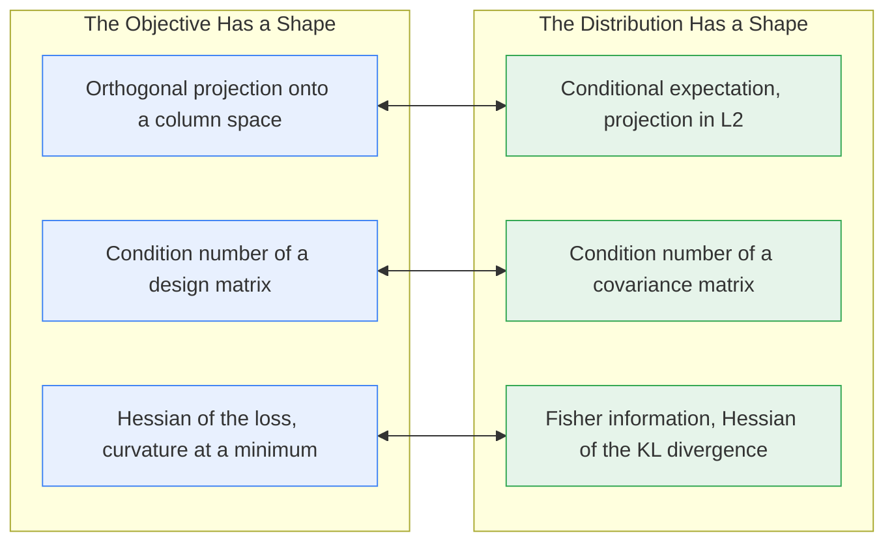
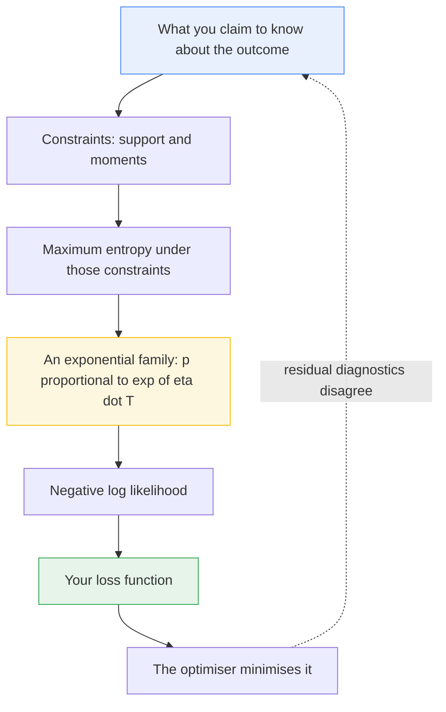
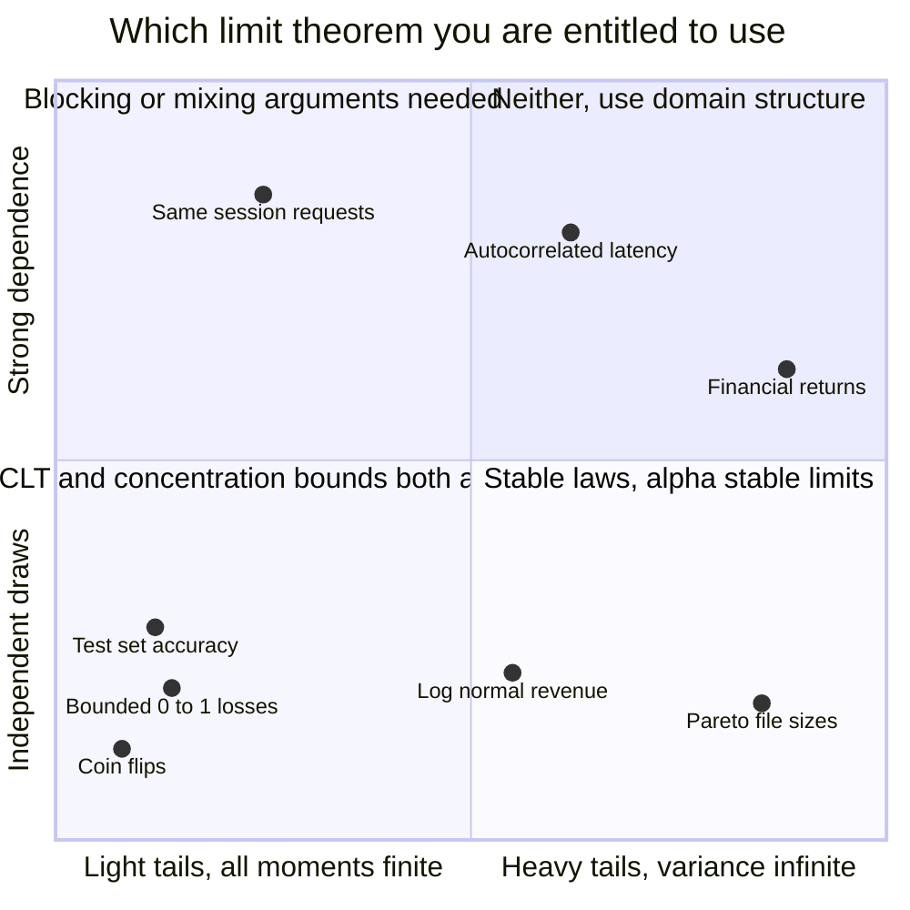
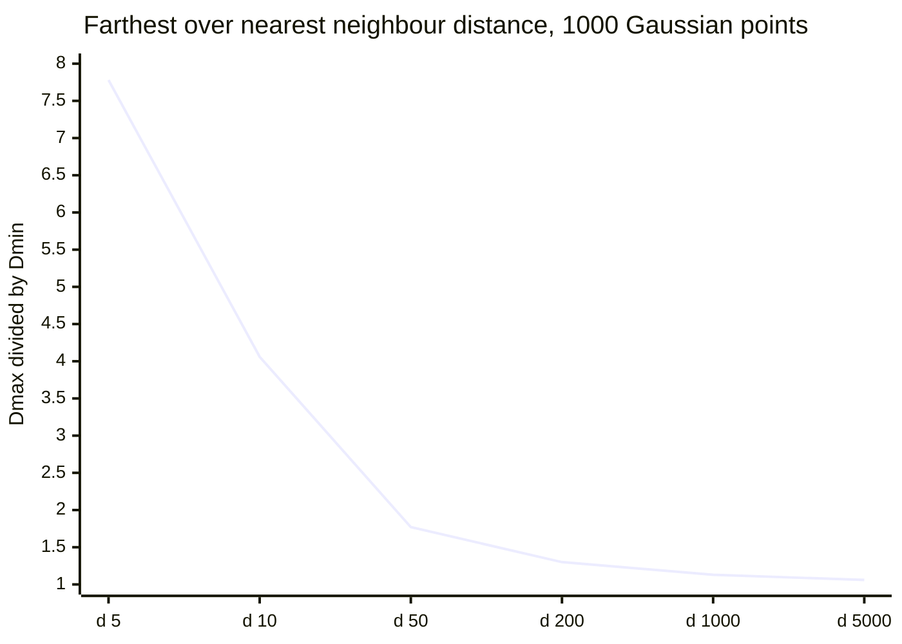

# The Distribution Has a Shape

*Second post in **The Shape of a Problem**, a prologue to **Why Learning Works: The Theorems Behind Machine Learning**. The previous post read the geometry of the objective -- norms, projections, quadratic forms, condition numbers, curvature. This one reads the geometry of the data, and finds the same three operations under different names.*

---

## The Model Predicts the Average. The Average of What, in What Sense?

Someone asks what your regression model does and you say it predicts the average outcome. It is the correct answer and almost nobody who gives it can say what it means: an average over what population, and in what sense is the average the *right* thing to predict, rather than the median?

Here is the sharp version. Fix a joint distribution over $(X, Y)$. Among **all** measurable functions $g$ of $X$ -- every lookup table, every neural network, every rule you could write down -- the one minimising $\mathbb{E}\big[(Y - g(X))^2\big]$ is the conditional expectation $\mathbb{E}[Y \mid X]$, exactly and uniquely up to sets of measure zero.

That is not a fact about averages but about *distance*: the square-integrable random variables form a Hilbert space, the functions of $X$ a closed subspace of it, and $\mathbb{E}[Y \mid X]$ the orthogonal projection of $Y$ onto that subspace. The optimality condition pinning it down is

$$
\mathbb{E}\Big[\big(Y - \mathbb{E}[Y \mid X]\big)\, h(X)\Big] = 0 \quad \text{for every } h,
$$

which says the residual is orthogonal to everything you were allowed to use. If you read *The Objective Has a Shape*, you have met that equation: it is the normal equation, the statement that least squares projects $y$ onto the column space of the design matrix with the residual perpendicular to every column. Regression was never curve-fitting that happened to have a closed form; it was a projection.

That is the first of three rhymes this post is built on. Here are all three, stated now so you can watch them arrive:



Project, measure with a quadratic form, read curvature. The previous post applied those three operations to a loss surface; this one applies them to a probability distribution.

---

## A Random Variable Is a Function, and the Sigma-Algebra Is What You Are Allowed to See

The measure-theoretic setup has a reputation for being ceremony. It is not.

A probability space is a triple $(\Omega, \mathcal{F}, \mathbb{P})$: outcomes, a collection $\mathcal{F}$ of subsets called events, and a measure on them. A random variable is not a number and not "a thing that varies randomly" -- it is a **function** $X : \Omega \to \mathbb{R}$, deterministic once $\omega$ is fixed; the randomness lives entirely in which $\omega$ nature drew.

The sigma-algebra is not bookkeeping about which sets are measurable. **It is a formal encoding of what you are allowed to see.** A sub-sigma-algebra $\mathcal{G} \subseteq \mathcal{F}$ is a coarser view of the world, and a random variable is $\mathcal{G}$-measurable exactly when it is computable from the information in $\mathcal{G}$ alone. Conditioning on $X$ means conditioning on $\sigma(X)$.

Two things you already do are this idea:

- **Feature availability at inference.** At serving time your model sees one sigma-algebra: the features computable from the request. A feature in your warehouse but not in the request path is not in $\mathcal{G}$, and no function of it is a legal predictor.
- **Leakage.** Target leakage is the failure to be measurable with respect to the right sigma-algebra: the training-time feature used information that will not exist at prediction time. The model is not wrong; it is answering a question you cannot ask in production.

Conditioning is not "plugging in a value." It is restricting to a subspace of functions you are permitted to compute.

---

## Expectation Is a Linear Functional; Conditional Expectation Is an Orthogonal Projection

Expectation is $\mathbb{E}[X] = \int_\Omega X \, d\mathbb{P}$: an integral, therefore linear, therefore a **linear functional**. Linearity holds with no independence assumption whatsoever -- $\mathbb{E}[X + Y] = \mathbb{E}[X] + \mathbb{E}[Y]$ for any $X, Y$ with finite means, correlated or not -- which is why expectations compose so easily and variances do not.

The interesting object is conditional expectation. Take $L^2 = L^2(\Omega, \mathcal{F}, \mathbb{P})$, the space of random variables with $\mathbb{E}[X^2] < \infty$, with the inner product

$$
\langle U, V \rangle = \mathbb{E}[UV], \qquad \|U\|^2 = \mathbb{E}[U^2].
$$

This is a genuine Hilbert space. Let $\mathcal{H}_X \subset L^2$ be the square-integrable functions of $X$, a closed linear subspace. Hilbert space theory then hands you, for free, the existence and uniqueness of a nearest point in $\mathcal{H}_X$ to any $Y \in L^2$, characterised by orthogonality of the residual.

> **Theorem (conditional expectation as projection).** Let $\mathbb{E}[Y^2] < \infty$ and write $m(X) = \mathbb{E}[Y \mid X]$. Then for every measurable $g$ with $\mathbb{E}[g(X)^2] < \infty$,
>
> $$
> \mathbb{E}\big[(Y - g(X))^2\big] \;=\; \mathbb{E}\big[(Y - m(X))^2\big] \;+\; \mathbb{E}\big[(m(X) - g(X))^2\big],
> $$
>
> so $m$ is the unique minimiser up to almost-sure equality.

**Proof.** Insert and remove $m(X)$, then expand:

$$
\mathbb{E}\big[(Y - g)^2\big] = \mathbb{E}\big[(Y - m)^2\big] + 2\,\mathbb{E}\big[(Y-m)(m-g)\big] + \mathbb{E}\big[(m-g)^2\big].
$$

The cross term vanishes. Condition on $X$: since $m - g$ is a function of $X$ it leaves the inner conditional expectation, and $\mathbb{E}[Y - m(X) \mid X] = 0$ by the definition of $m$, so

$$
\mathbb{E}\big[(Y-m)(m-g)\big] = \mathbb{E}\Big[\big(m(X) - g(X)\big)\,\mathbb{E}\big[Y - m(X) \mid X\big]\Big] = 0.
$$

Both remaining terms are nonnegative and the second is zero exactly when $g = m$ almost surely. $\blacksquare$

That display is the Pythagorean theorem. Squared error decomposes into an irreducible part -- the conditional variance averaged over $X$ -- plus the squared distance from your function to the projection. **This is literally the same theorem as least squares in *The Objective Has a Shape*,** with the column space of $\mathbf{X}$ swapped for the infinite-dimensional set of *all* measurable functions of $X$. Replace one subspace with the other and every line survives.

Once conditional expectation is a projection operator, its properties stop needing proofs and start needing pictures. Idempotence: $\mathbb{E}[\mathbb{E}[Y \mid X] \mid X] = \mathbb{E}[Y \mid X]$, because projecting twice onto the same subspace does nothing. The **tower property**, $\mathbb{E}\big[\mathbb{E}[Y \mid X, Z] \mid X\big] = \mathbb{E}[Y \mid X]$, is projection onto a large subspace followed by projection onto a smaller one nested inside it.

The practically important corollary restricts the subspace to *affine* functions of $X$: the projection onto it is population least squares, $\beta^\star = \Sigma_{XX}^{-1}\Sigma_{XY}$. So linear regression does not estimate "the linear truth"; it estimates the **best $L^2$ approximation to $\mathbb{E}[Y \mid X]$ within the linear subspace**, whether or not the conditional mean is linear. That is why a misspecified linear model still converges to something meaningful: its coefficients describe the projection, not the function projected.

```python
# The conditional mean is the projection: no measurable function of X beats it.
import numpy as np

rng = np.random.default_rng(20260907)
n = 400_000

x = rng.uniform(-3.0, 3.0, size=n)
m = np.sin(x) + 0.3 * x**2            # the true conditional mean E[Y|X]
y = m + rng.normal(0.0, 1.0, size=n)  # noise independent of x

candidates = {
    "constant  E[Y]":        np.full(n, y.mean()),
    "best linear in x":      np.polyval(np.polyfit(x, y, 1), x),
    "cubic in x":            np.polyval(np.polyfit(x, y, 3), x),
    "E[Y|X], scaled by 1.1": 1.1 * m,
    "E[Y|X]  (the truth)":   m,
}

print(f"{'candidate g(X)':<24}{'MSE':>10}{'excess over E[Y|X]':>22}")
base = np.mean((y - m) ** 2)
for name, g in candidates.items():
    mse = np.mean((y - g) ** 2)
    print(f"{name:<24}{mse:>10.5f}{mse - base:>22.5f}")

# The orthogonality condition itself: E[(Y - E[Y|X]) h(X)] = 0 for every h.
resid = y - m
for label, h in [("h(x) = 1", np.ones(n)), ("h(x) = x", x), ("h(x) = x^2", x**2)]:
    print(f"E[(Y - E[Y|X]) {label:<10}] = {np.mean(resid * h):+.5f}")
```

```text
candidate g(X)                 MSE    excess over E[Y|X]
constant  E[Y]             2.16672               1.16520
best linear in x           1.80948               0.80796
cubic in x                 1.00446               0.00294
E[Y|X], scaled by 1.1      1.02222               0.02070
E[Y|X]  (the truth)        1.00152               0.00000

E[(Y - E[Y|X]) h(x) = 1  ] = -0.00260
E[(Y - E[Y|X]) h(x) = x  ] = -0.00198
E[(Y - E[Y|X]) h(x) = x^2] = -0.01210
```

Read the excess column: it is exactly $\mathbb{E}[(m - g)^2]$, nonnegative even for candidates built *from* the truth. Scaling $m$ by 1.1 costs $0.0207$, and $\mathbb{E}[(0.1\,m)^2]$ over this design is $0.0207$ -- the Pythagorean identity is an equality here.

---

## Covariance Is a Quadratic Form

For a random vector $X \in \mathbb{R}^d$ with mean $\mu$, the covariance matrix is $\Sigma = \mathbb{E}[(X-\mu)(X-\mu)^\top]$. It is usually introduced as a table of pairwise covariances, which is true and useless. The useful reading is one line:

$$
v^\top \Sigma\, v \;=\; \operatorname{Var}\big(v^\top X\big) \quad \text{for every } v \in \mathbb{R}^d.
$$

The proof is two steps of linearity. What it says is that $\Sigma$ is not a table; it is a **machine that eats a direction and returns the variance of the data along it** -- a quadratic form, positive semidefinite because variances are nonnegative, the same object *The Objective Has a Shape* spent a section on as the loss surface.

Every quadratic form is an ellipsoid, so the distribution has one. The set

$$
\mathcal{E}_c = \Big\{ z \in \mathbb{R}^d \;:\; (z-\mu)^\top \Sigma^{-1}(z-\mu) = c^2 \Big\}
$$

has principal axes along the eigenvectors of $\Sigma$, with semi-axis lengths $c\sqrt{\lambda_i}$ -- for a Gaussian the exact level sets of the density, otherwise still the right first-order picture of where the mass sits. The quantity on the left is the **Mahalanobis distance** squared: ordinary Euclidean distance *after changing the metric so the data has identity covariance*. Whitening by $W = \Sigma^{-1/2}$ turns the ellipsoid into a sphere and Mahalanobis into Euclidean, which is why PCA and whitening are one act seen from two angles -- *One Eigendecomposition, Four Algorithms* has the machinery.

```python
# The covariance ellipsoid: equal Euclidean distance, unequal Mahalanobis distance.
import numpy as np

Sigma = np.array([[4.0, 3.8],
                  [3.8, 4.0]])

lam, V = np.linalg.eigh(Sigma)  # ascending eigenvalues
order = np.argsort(lam)[::-1]
lam, V = lam[order], V[:, order]

print("eigenvalues            ", np.round(lam, 4))
print("semi-axis lengths      ", np.round(np.sqrt(lam), 4))
print("condition number kappa ", round(lam[0] / lam[-1], 2))

Sinv = np.linalg.inv(Sigma)
maha = lambda z: float(np.sqrt(z @ Sinv @ z))
along, across = 2.0 * V[:, 0], 2.0 * V[:, -1]

for name, z in [("along  major axis", along), ("across minor axis", across)]:
    print(f"{name}: point {np.round(z, 3)}  Euclidean {np.linalg.norm(z):.3f}  Mahalanobis {maha(z):.3f}")
print("Mahalanobis ratio      ", round(maha(across) / maha(along), 2),
      " = sqrt(kappa) =", round(np.sqrt(lam[0] / lam[-1]), 2))

W = V @ np.diag(lam ** -0.5) @ V.T  # whitening: sends the ellipsoid to a sphere
print("whitened Euclidean, across:", round(float(np.linalg.norm(W @ across)), 4))
print("whitened covariance:\n", np.round(W @ Sigma @ W.T, 10))
```

```text
eigenvalues             [7.8 0.2]
semi-axis lengths       [2.7928 0.4472]
condition number kappa  39.0
along  major axis: point [1.414 1.414]  Euclidean 2.000  Mahalanobis 0.716
across minor axis: point [-1.414  1.414]  Euclidean 2.000  Mahalanobis 4.472
Mahalanobis ratio       6.24  = sqrt(kappa) = 6.24
whitened Euclidean, across: 4.4721
whitened covariance:
 [[ 1. -0.]
 [ 0.  1.]]
```

Two points, both at Euclidean distance exactly $2.0$ from the mean, sit at Mahalanobis $0.72$ (unremarkable) and $4.47$ (a six-sigma event). The ratio is $\sqrt{\kappa(\Sigma)}$ exactly, not approximately, and that identity is where the second rhyme lands.

**The condition number $\kappa(\Sigma) = \lambda_{\max}/\lambda_{\min}$ is the aspect ratio of the ellipsoid.** Large $\kappa$ means the cloud is a needle: nearly all variation along a few directions, almost none across -- multicollinearity, stated geometrically. And it is the *same number* the previous post used, up to a square: the empirical covariance is $\hat\Sigma = \mathbf{X}^\top\mathbf{X}/n$ for centred data, whose eigenvalues are the squared singular values of $\mathbf{X}/\sqrt{n}$, so $\kappa(\hat\Sigma) = \kappa(\mathbf{X})^2$. An optimiser converging slowly on a canyon-shaped loss and an estimator with unstable coefficients from collinear features are one problem, diagnosed on one matrix, reported in two units -- which is why centring, scaling, decorrelating and ridge each fix both at once.

---

## What a Distribution Assumes: Exponential Families and Maximum Entropy

Choosing a likelihood feels like choosing a tool. It is closer to signing a statement of what you claim to know: an **exponential family** in natural form is

$$
p(x \mid \eta) \;=\; h(x)\,\exp\!\big(\eta^\top T(x) - A(\eta)\big),
$$

with $\eta$ the natural parameter, $T(x)$ the sufficient statistic, $h$ a base measure, and $A(\eta) = \log \int h(x)e^{\eta^\top T(x)}dx$ the **log-partition function**, whose only job is to make the density integrate to one. Gaussian, Bernoulli, Poisson, exponential, gamma, beta, categorical, Dirichlet -- all of them, with different $T$.

> **Proposition.** On the interior of the natural parameter space, $\nabla A(\eta) = \mathbb{E}[T(X)]$ and $\nabla^2 A(\eta) = \operatorname{Cov}(T(X))$. In particular $A$ is convex.

**Proof.** Differentiating under the integral gives $\nabla A(\eta) = \int T h e^{\eta^\top T} / \int h e^{\eta^\top T} = \mathbb{E}[T(X)]$. Differentiating again, the quotient rule produces $\mathbb{E}[TT^\top] - \mathbb{E}[T]\mathbb{E}[T]^\top = \operatorname{Cov}(T)$, positive semidefinite, so $A$ is convex. $\blacksquare$

**The curvature of the log-partition function is the covariance of the sufficient statistic.** The same identity reappears in Section 8 in a different costume, which is why "information is curvature" is a theorem rather than a slogan.

The second fact is where the distributions come from. Maximise entropy $H(p) = -\int p \log p$ subject to normalisation and moment constraints $\mathbb{E}[T_j(X)] = \mu_j$, and the Lagrangian gives $p(x) \propto \exp(\sum_j \lambda_j T_j(x))$: an exponential family with $T$ as its sufficient statistic, exactly as in the duality section of *The Objective Has a Shape*. Concretely:

| Support | Constraint imposed | Maximum-entropy law |
|---|---|---|
| $\mathbb{R}$ | mean and variance fixed | Gaussian |
| $(0, \infty)$ | mean fixed | exponential |
| $[a,b]$ | nothing beyond the range | uniform |
| $\mathbb{R}$ | $\mathbb{E}\lvert X \rvert$ fixed | Laplace |
| $\{0,1\}$ | mean fixed | Bernoulli |

So the Gaussian is not an empirical claim that the world is bell-shaped; it is the *least committal* law on the real line consistent with a known variance. The exponential is the least committal positive-valued law with a known mean, which is why it appears in queueing and survival analysis without anyone deriving it from mechanics.

This closes a loop with *The Loss Function Is a Probability Assumption*: that post proved the loss you minimise is the negative log-density of the noise you assumed, and this section says where that assumption comes from. Squared error, all the way down, is the claim "I know the variance and nothing more."



---

## Pushing Distributions Through Maps: the Jacobian Determinant

Your model transforms data. What happens to the distribution when it does?

Let $X$ have density $p_X$ and let $g$ be a differentiable bijection with differentiable inverse. Set $Y = g(X)$. Then

$$
p_Y(y) \;=\; p_X\big(g^{-1}(y)\big)\,\big|\det J_{g^{-1}}(y)\big| \;=\; \frac{p_X(x)}{\big|\det J_g(x)\big|}, \qquad x = g^{-1}(y).
$$

The entire content is **volume distortion**. Probability mass is conserved by any bijection -- the mass in a small box around $x$ equals the mass in its image -- but *density* is mass per unit volume, so if $g$ stretches a neighbourhood by $|\det J_g|$, the density there must shrink by the same factor.

Three consequences, all load-bearing.

**Normalizing flows are this formula and nothing else.** A flow composes invertible layers $g_L \circ \cdots \circ g_1$ from a simple base density and evaluates

$$
\log p_Y(y) \;=\; \log p_X(x) \;-\; \sum_{\ell=1}^{L} \log \big|\det J_{g_\ell}\big|.
$$

That is why every flow loss contains a $\log|\det J|$ term, and why the architectural game is entirely about making that determinant cheap: triangular Jacobians, from autoregressive and coupling layers, give one that is a product of diagonal entries.

**The manifold hypothesis is a statement about pushforwards.** If a generator maps a latent $z \in \mathbb{R}^k$ into $\mathbb{R}^d$ with $k \ll d$, the pushforward concentrates on a $k$-dimensional set; *The Manifold Hypothesis* argues real data behaves this way, and the change-of-variables formula prices it.

**It costs the density's existence.** The formula requires a bijection between spaces of equal dimension. When $g$ collapses dimensions, $J_g$ is not square, no determinant exists, and the pushforward's mass sits on a set of Lebesgue measure zero. That is why GANs cannot report a likelihood, why KL between non-overlapping manifolds is infinite, and why the Wasserstein distance -- which compares by transport cost, not density ratio -- was reached for.

---

## Why the Gaussian Keeps Winning: LLN and the CLT

Two theorems, constantly conflated, about two different things.

> **Strong law of large numbers.** If $X_1, X_2, \ldots$ are i.i.d. with $\mathbb{E}|X| < \infty$ and mean $\mu$, then $\bar{X}_n \to \mu$ almost surely.
>
> **Central limit theorem (Lindeberg--Lévy).** If in addition $\operatorname{Var}(X) = \sigma^2 \in (0,\infty)$, then $\sqrt{n}\,(\bar{X}_n - \mu) \xrightarrow{d} \mathcal{N}(0, \sigma^2)$.

The law says *where the average goes*. The CLT says *what the error looks like at the right magnification*: shrink the deviation by $1/\sqrt{n}$ and it stops shrinking, revealing a shape. The law needs a first moment; the CLT needs a second.

Why is the Gaussian the attractor? Write $\varphi(t) = \mathbb{E}[e^{itX}]$ for a centred summand with variance $\sigma^2$. Near the origin, using $\mathbb{E}[X] = 0$,

$$
\log \varphi(t) \;=\; -\tfrac{1}{2}\sigma^2 t^2 \;+\; o(t^2).
$$

Characteristic functions of independent sums multiply, so the standardised sum $S_n = \sqrt{n}\,\bar{X}_n$ has

$$
\log \varphi_{S_n}(t) \;=\; n \log \varphi\!\left(\frac{t}{\sqrt{n}}\right) \;=\; -\tfrac{1}{2}\sigma^2 t^2 \;+\; n \cdot o\!\left(\frac{t^2}{n}\right) \;\longrightarrow\; -\tfrac{1}{2}\sigma^2 t^2,
$$

which is the log characteristic function of $\mathcal{N}(0,\sigma^2)$; Lévy's continuity theorem converts that into convergence in distribution. The cumulant of order $k$ enters $\log\varphi_{S_n}$ with a factor $n \cdot n^{-k/2} = n^{1-k/2}$: for $k=2$ that is $1$, the variance survives exactly, but for $k=3$ it is $n^{-1/2}$ and for $k=4$ it is $n^{-1}$ -- skewness, kurtosis and everything above are scaled away. **The Gaussian wins because it is the distribution with no cumulants above the second, and $\sqrt{n}$ is precisely the magnification at which only the second survives.** The skewness term is the leading Edgeworth correction, which is why small-sample $t$-intervals on skewed data are wrong in a predictable direction.

Now the honest part: "everything is Gaussian eventually" is how people get hurt.

**Infinite variance breaks it outright.** A Pareto with shape $\alpha < 2$ has infinite variance, so the hypothesis fails. Gnedenko and Kolmogorov's generalised limit theory says such sums, normalised by $n^{1/\alpha}$ rather than $n^{1/2}$, converge to an $\alpha$-stable law with power-law tails, not a Gaussian; for $\alpha \le 1$ even the law of large numbers fails. Latency, file sizes and financial returns are routinely in this regime, and quoting a normal error bar there asserts a hypothesis you have not checked. **Dependence breaks it too** -- independence can be weakened to mixing conditions, not removed, and correlated summands concentrate far more slowly.

**Convergence in distribution says nothing about tails.** The CLT constrains $\mathbb{P}(S_n \le t)$ at fixed $t$ as $n$ grows; it does not control $\mathbb{P}(S_n \le t_n)$ for $t_n$ drifting outward -- exactly the regime a value-at-risk estimate or a five-nines latency target lives in.

When the CLT does not apply, the alternative is *finite-sample* bounds that never invoke it. *From Markov to Hoeffding* builds that toolbox from Markov's inequality upward, requiring only boundedness, paying for the generality in width rather than validity.



---

## Divergence, Entropy, and Information as Curvature

Now the payoff of the two-post arc. The **Kullback--Leibler divergence** between densities is

$$
\mathrm{KL}(p \,\|\, q) \;=\; \mathbb{E}_p\!\left[\log \frac{p(X)}{q(X)}\right],
$$

the expected log-likelihood ratio when the data really comes from $p$: evidence per sample against $q$. It is nonnegative, zero only when $p = q$ -- Gibbs' inequality, proved by Jensen -- and it is **not symmetric**, which is a feature.

Forward, $\mathrm{KL}(p \,\|\, q)$ integrates against $p$, so it is enormous wherever $p$ has mass and $q$ has none: **mass-covering**, and a unimodal $q$ fitted to a bimodal $p$ spreads across both modes and the valley between. Reverse, $\mathrm{KL}(q\,\|\,p)$ integrates against $q$, punishing it only where it *itself* puts mass: **mode-seeking**, collapsing onto one mode instead. Maximum likelihood minimises the forward direction; most variational objectives minimise the reverse, which is why VAE samples are blurry averages and variational posteriors are famously overconfident.

Cross-entropy sits between them:

$$
H(p, q) \;=\; -\mathbb{E}_p[\log q(X)] \;=\; H(p) \;+\; \mathrm{KL}(p \,\|\, q).
$$

Since $H(p)$ is fixed by the world and not by you, **minimising cross-entropy is exactly minimising forward KL to the truth**, and the irreducible floor of your training loss is the label entropy. A cross-entropy that plateaus above zero is not necessarily underfitting; it may be reporting $H(p)$.

Now differentiate. Ask what KL looks like *locally*, for a small parameter perturbation $\delta$, writing the score $s(x, \theta) = \nabla_\theta \log p_\theta(x)$.

> **Theorem (Fisher information is the Hessian of KL).** Under standard regularity conditions,
>
> $$
> \mathrm{KL}\big(p_\theta \,\|\, p_{\theta + \delta}\big) \;=\; \tfrac{1}{2}\,\delta^\top F(\theta)\,\delta \;+\; O\big(\|\delta\|^3\big), \qquad F(\theta) = \nabla^2_{\theta'}\left. \mathrm{KL}\big(p_\theta \,\|\, p_{\theta'}\big)\right|_{\theta' = \theta},
> $$
>
> where $F(\theta) = \mathbb{E}_\theta[s\,s^\top] = -\mathbb{E}_\theta[\nabla^2_\theta \log p_\theta]$ is the Fisher information matrix.

**Proof sketch, short enough to give.** The score has mean zero: differentiating $\int p_\theta = 1$ under the integral gives $\int \nabla_\theta p_\theta = 0$, and $\nabla_\theta p_\theta = p_\theta\, s$, so $\mathbb{E}_\theta[s] = 0$. Differentiating a second time gives $\mathbb{E}_\theta[\nabla^2 \log p_\theta] + \mathbb{E}_\theta[ss^\top] = 0$, the **information equality**. Now write $\mathrm{KL}(p_\theta \| p_{\theta+\delta}) = \mathbb{E}_\theta[\log p_\theta] - \mathbb{E}_\theta[\log p_{\theta+\delta}]$ and Taylor-expand the second term inside the expectation:

$$
\log p_{\theta+\delta} = \log p_\theta + \delta^\top s + \tfrac{1}{2}\delta^\top \nabla^2 \log p_\theta\, \delta + O(\|\delta\|^3).
$$

Take $\mathbb{E}_\theta$. The constant cancels, the linear term dies because $\mathbb{E}_\theta[s] = 0$, and what is left is $-\tfrac12 \delta^\top \mathbb{E}_\theta[\nabla^2\log p_\theta]\delta = \tfrac12 \delta^\top F(\theta)\delta$. $\blacksquare$

Three things fall out.

**KL is locally a quadratic form, and the space of distributions is curved with $F$ as its metric.** Section 4's quadratic form measured distance in data space with $\Sigma$; this one measures distance in *parameter* space with $F$: $\delta^\top F \delta$ is a Mahalanobis distance between distributions, the ellipsoid it defines the set of parameter perturbations your data cannot distinguish. A statistical model is a manifold whose points are distributions and $F$ a Riemannian metric on it -- information geometry, which is why "distance between models" is meaningless until you say which metric, the point *The Objective Has a Shape* made about the gradient being metric-dependent.

**The natural gradient is preconditioning in that metric.** Ordinary gradient descent steps steepest under the *Euclidean* metric on parameters, an arbitrary choice with no statistical meaning: rescale a parameter and the step changes. Amari's natural gradient steps steepest under $F$:

$$
\theta \;\leftarrow\; \theta - \eta\, F(\theta)^{-1} \nabla_\theta L(\theta),
$$

the same move as Newton's method in the previous post, with the Hessian of the loss replaced by the Hessian of the KL divergence. K-FAC, Adam's second-moment scaling and TRPO's trust region are all approximations to it. The third rhyme, plainly:

**Information is curvature.** Fisher information is not a metaphor for how much a sample tells you. It is the second derivative of the KL divergence: the amount you learn about $\theta$ equals how sharply the model's *predictions* change when $\theta$ moves. A parameter you cannot learn is one the distribution does not curve along.

```python
# Fisher information three ways on N(mu, sigma^2): KL Hessian, E[score score^T], closed form.
import numpy as np

rng = np.random.default_rng(11235)
theta = np.array([1.5, 2.0])  # (mu, sigma)

def kl(a, b):
    (m1, s1), (m2, s2) = a, b
    return np.log(s2 / s1) + (s1**2 + (m1 - m2) ** 2) / (2 * s2**2) - 0.5

def kl_hessian(theta, h=1e-4):
    d = len(theta)
    H = np.zeros((d, d))
    for i in range(d):
        for j in range(d):
            ei, ej = np.zeros(d), np.zeros(d)
            ei[i], ej[j] = h, h
            H[i, j] = (kl(theta, theta + ei + ej) - kl(theta, theta + ei - ej)
                       - kl(theta, theta - ei + ej) + kl(theta, theta - ei - ej)) / (4 * h * h)
    return H

def score(x, theta):
    mu, s = theta
    return np.stack([(x - mu) / s**2, (x - mu) ** 2 / s**3 - 1.0 / s], axis=1)

x = rng.normal(theta[0], theta[1], size=4_000_000)
S = score(x, theta)
F_kl, F_mc = kl_hessian(theta), S.T @ S / len(x)
F_exact = np.diag([1 / theta[1] ** 2, 2 / theta[1] ** 2])

np.set_printoptions(precision=5, suppress=True)
print("Hessian of KL at theta:\n", F_kl)
print("E[score score^T], Monte Carlo:\n", F_mc)
print("closed form:\n", F_exact)
print("max abs difference, KL Hessian vs closed form:",
      f"{np.abs(F_kl - F_exact).max():.2e}")

# Cramer-Rao: no unbiased estimator of mu from n samples beats sigma^2/n.
n = 50
crlb = np.linalg.inv(n * F_exact)
emp = np.var([rng.normal(theta[0], theta[1], n).mean() for _ in range(200_000)], ddof=1)
print(f"\nCramer-Rao floor for Var(mu_hat) at n={n}: {crlb[0, 0]:.6f}")
print(f"observed variance of the sample mean:      {emp:.6f}")
```

```text
Hessian of KL at theta:
 [[0.25 0.  ]
 [0.   0.5 ]]
E[score score^T], Monte Carlo:
 [[ 0.25002 -0.00001]
 [-0.00001  0.49945]]
closed form:
 [[0.25 0.  ]
 [0.   0.5 ]]
max abs difference, KL Hessian vs closed form: 1.08e-08

Cramer-Rao floor for Var(mu_hat) at n=50: 0.080000
observed variance of the sample mean:      0.080014
```

Three routes -- a numerical second derivative of a divergence, a Monte Carlo average of squared scores, a closed form -- agree to eight decimal places, because they are the same matrix. The off-diagonal zero says location and scale are *orthogonal* parameters for a Gaussian, which is why the sample mean and sample variance are independent.

---

## What an Estimator Can and Cannot Do

With $F$ in hand, the classical theory of estimation is three statements.

An estimator $\hat\theta_n$ is a function of the sample. Its **bias** is $\mathbb{E}[\hat\theta_n] - \theta$, its **variance** is $\operatorname{Var}(\hat\theta_n)$, and $\mathrm{MSE} = \text{bias}^2 + \text{variance}$ -- the decomposition *What Are We Minimizing?* builds its tradeoff on. It is **consistent** if $\hat\theta_n \to \theta$ in probability, an asymptotic statement: an estimator can be consistent and useless at $n = 500$.

> **Theorem (Cramér--Rao).** Let $\hat\theta$ be an unbiased estimator of $\theta$ from $n$ i.i.d. observations, under the same regularity conditions as above, with $F(\theta)$ nonsingular. Then
>
> $$
> \operatorname{Cov}(\hat\theta) \;\succeq\; \frac{1}{n}F(\theta)^{-1},
> $$
>
> meaning the difference is positive semidefinite. In the scalar case, $\operatorname{Var}(\hat\theta) \ge 1/(n I(\theta))$.

Reading it geometrically is the point: variance is bounded below by inverse curvature. **A flat log-likelihood is an unlearnable parameter** -- if $F$ is singular in some direction, no unbiased estimator has finite variance along it, and the data literally cannot distinguish nearby values. Near-singular $F$ is the softer version, the same pathology as an ill-conditioned $\Sigma$ one section up and a flat direction in a loss surface one post back: **flat** means a direction the objective does not care about, so the answer along it is whatever noise decides.

Two cautions: Cramér--Rao bounds *unbiased* estimators, and biased ones routinely beat it in MSE, which is what every regulariser exploits; and for $\mathrm{Uniform}(0,\theta)$, whose support depends on $\theta$, the regularity conditions fail and the sample maximum beats the "bound" by a whole order of $n$.

Maximum likelihood attains the bound in the limit: $\sqrt{n}(\hat\theta_{\mathrm{MLE}} - \theta) \xrightarrow{d} \mathcal{N}(0, F(\theta)^{-1})$, so MLE is asymptotically unbiased, normal and efficient -- asymptotically; its variance estimate is biased downward at every finite $n$, as *The Loss Function Is a Probability Assumption* derives.

Which brings us to the most misused object in applied statistics. A 95% confidence interval does **not** say the parameter is in it with probability 0.95 -- the parameter is not random, the interval is; the correct statement is about the *procedure*, that 95% of intervals so constructed contain the true value.

The width is approximately $2 z_{0.975}/\sqrt{n\, I(\theta)}$. **A confidence interval is a curvature measurement:** narrow means the log-likelihood is sharply peaked, wide means flat, and an implausibly narrow interval is the model claiming curvature the data does not have -- usually because the independence assumption behind the $\sqrt{n}$ is false and the effective sample size is far below $n$.

---

## Bayes: Conditioning Is the Whole Operation

Bayes' rule is one line,

$$
p(\theta \mid x) \;=\; \frac{p(x \mid \theta)\,p(\theta)}{p(x)},
$$

and it is the conditioning operation from Section 3 applied with the parameter as the unknown: the prior states where mass may live before data, the likelihood reweights, the posterior is what remains.

The connection to regularisation is exact. Take the log:

$$
\log p(\theta \mid x) \;=\; \underbrace{\log p(x \mid \theta)}_{-\text{loss}} \;+\; \underbrace{\log p(\theta)}_{-\text{penalty}} \;+\; \text{const}.
$$

Maximising the posterior -- the MAP estimate -- is minimising loss plus penalty. A Gaussian prior $\theta \sim \mathcal{N}(0, \tau^2 I)$ contributes $-\|\theta\|_2^2/(2\tau^2)$, so MAP under Gaussian noise and a Gaussian prior is **ridge regression** with $\lambda = \sigma^2/\tau^2$; a Laplace prior contributes $-\|\theta\|_1/b$, giving **lasso**. *Penalizing Is Constraining* proves the other half -- a penalty is a constraint in disguise, the multiplier its shadow price, exactly the Lagrangian duality reading of *The Objective Has a Shape*. Chain the three: **a constraint is a penalty is a prior**, one number in three notations.

Now be honest about where this correspondence is over-sold. MAP is a **mode**, and a posterior is a distribution: the mode of a $d$-dimensional Gaussian posterior sits where the density is highest, but the mass in any fixed neighbourhood of that centre is negligible, since mass is density times volume and the volume near a point in $\mathbb{R}^d$ vanishes against the shell at radius $\sqrt{d}$ -- so sampling from the posterior almost never resembles the MAP estimate. And MAP is not invariant under reparameterisation: send $\theta \mapsto \psi(\theta)$ and the density picks up a Jacobian factor -- Section 6 again -- so the mode moves while the posterior mean does not; a quantity that changes when you reparameterise a variance as a log-variance is a property of your coordinates, not your beliefs.

---

## High-Dimensional Geometry: Your Intuition Is Calibrated for the Wrong Dimension

Everything above is dimension-agnostic. This section is where dimension takes revenge.

**Almost all the mass of a high-dimensional Gaussian lies in a thin shell, not near the mode.** Let $X \sim \mathcal{N}(0, I_d)$. Then $\|X\|^2 \sim \chi^2_d$ with mean $d$ and standard deviation $\sqrt{2d}$, so $\|X\| \approx \sqrt{d}$ with fluctuation of order $1$ *regardless of $d$*: the relative width of the shell is $O(1/\sqrt{d})$ and shrinks. The origin has the highest density and none of the mass, because density falls as $e^{-r^2/2}$ while the volume of a spherical shell grows as $r^{d-1}$, and the product peaks at $r = \sqrt{d-1}$. A typical draw in a thousand dimensions has norm about $31.6$, which is why interpolating between two latent codes crosses a region the prior never visits, and why spherical interpolation exists.

**Random directions are nearly orthogonal.** For independent uniform unit vectors in $\mathbb{R}^d$, $\mathbb{E}[(u^\top v)^2] = 1/d$, so a typical cosine is about $1/\sqrt{d}$ -- roughly $0.03$ in a thousand dimensions. You can pack exponentially many nearly-orthogonal directions into $\mathbb{R}^d$, which is why embedding spaces hold more distinguishable concepts than they have dimensions; any measured cosine must be judged against that baseline, not zero.

**The nearest and farthest neighbours converge.** This is the result that should be taught alongside every vector index.

> **Theorem (Beyer, Goldstein, Ramakrishnan and Shaft, 1999, informally).** Let $D_{\min}^{(d)}$ and $D_{\max}^{(d)}$ be the distances from a query to the nearest and farthest of $n$ points in $\mathbb{R}^d$. If $\operatorname{Var}\big(\|X_d\|^p / \mathbb{E}\|X_d\|^p\big) \to 0$ as $d \to \infty$, then for every $\varepsilon > 0$,
>
> $$
> \mathbb{P}\Big(D_{\max}^{(d)} \le (1 + \varepsilon)\, D_{\min}^{(d)}\Big) \;\longrightarrow\; 1.
> $$

In words: *every point becomes equidistant from the query*, an effect the paper's experiments find biting at as few as ten to fifteen dimensions for i.i.d. data. The saving grace is the hypothesis: the condition is on the *relative variance of the distances*, and real data with strong low-dimensional structure violates it -- the manifold hypothesis doing useful work. Nearest-neighbour search fails not because $d$ is large but when the data fills $d$ dimensions uniformly, which is the honest argument for learned metrics and cosine over raw Euclidean distance; *Embeddings: The Geometry of Meaning* gives it practical form.

**But you can compress ruthlessly**, with one of the most useful theorems in applied mathematics.

> **Theorem (Johnson--Lindenstrauss; Dasgupta and Gupta's form).** For any $0 < \varepsilon < 1$, any integer $n$, and any set $S$ of $n$ points in $\mathbb{R}^d$, if
>
> $$
> k \;\ge\; \frac{4 \ln n}{\varepsilon^2/2 - \varepsilon^3/3},
> $$
>
> then there is a map $f : \mathbb{R}^d \to \mathbb{R}^k$ with
>
> $$
> (1-\varepsilon)\,\|u - v\|^2 \;\le\; \|f(u) - f(v)\|^2 \;\le\; (1+\varepsilon)\,\|u-v\|^2 \quad \text{for all } u, v \in S.
> $$

The target dimension $k$ is $O(\log n / \varepsilon^2)$, logarithmic in the number of points and **completely independent of $d$**: a million points in a million dimensions need the same $k$ as a million points in a thousand. The map can be a random Gaussian projection; the $\varepsilon$ dependence is quadratic, so halving the distortion quadruples the dimension. This is the licence under which random projection, sketching, FastRP and locality-sensitive hashing operate -- applications of a theorem with an explicit distortion guarantee, not heuristics that happen to work.

```python
# Distances concentrate, directions decorrelate, and JL still works.
import numpy as np

rng = np.random.default_rng(4242)
n = 1000

def diagnostics(d, n=n):
    X = rng.normal(size=(n, d))
    q = rng.normal(size=d)
    dist = np.linalg.norm(X - q, axis=1)
    Xn = X / np.linalg.norm(X, axis=1, keepdims=True)
    cos = Xn[:200] @ Xn[200:400].T
    norms = np.linalg.norm(X, axis=1)
    return (dist.max() / dist.min(), np.abs(cos).mean(),
            norms.mean() / np.sqrt(d), norms.std() / norms.mean())

print(f"{'d':>6}{'Dmax/Dmin':>12}{'mean |cos|':>12}{'E|X| / sqrt(d)':>16}{'rel. sd of |X|':>16}")
for d in [2, 5, 10, 50, 200, 1000, 5000]:
    ratio, c, shell, rel = diagnostics(d)
    print(f"{d:>6}{ratio:>12.3f}{c:>12.4f}{shell:>16.4f}{rel:>16.4f}")

# Johnson-Lindenstrauss: k >= 4 ln(n) / (eps^2/2 - eps^3/3), independent of d.
d, eps = 5000, 0.2
k = int(np.ceil(4 * np.log(n) / (eps**2 / 2 - eps**3 / 3)))
X = rng.normal(size=(n, d))
R = rng.normal(size=(d, k)) / np.sqrt(k)
Y = X @ R

idx = rng.choice(n, size=(20_000, 2))
idx = idx[idx[:, 0] != idx[:, 1]]
d2_before = np.sum((X[idx[:, 0]] - X[idx[:, 1]]) ** 2, axis=1)
d2_after = np.sum((Y[idx[:, 0]] - Y[idx[:, 1]]) ** 2, axis=1)
ratio = d2_after / d2_before

print(f"\nd = {d} -> k = {k}   (eps = {eps}, n = {n})")
print(f"worst squared-distance distortion observed: "
      f"{max(abs(ratio.min() - 1), abs(ratio.max() - 1)):.4f}  (bound {eps})")
```

```text
     d   Dmax/Dmin  mean |cos|  E|X| / sqrt(d)  rel. sd of |X|
     2      98.137      0.6348          0.8857          0.5157
     5       7.777      0.3768          0.9548          0.3221
    10       4.055      0.2604          0.9710          0.2316
    50       1.771      0.1131          0.9967          0.1011
   200       1.302      0.0566          0.9985          0.0501
  1000       1.125      0.0254          1.0008          0.0225
  5000       1.055      0.0113          1.0000          0.0100

d = 5000 -> k = 1595   (eps = 0.2, n = 1000)
worst squared-distance distortion observed: 0.1510  (bound 0.2)
```

Every column is a theorem. `Dmax/Dmin` falls from 98 to 1.055: at $d = 5000$ the farthest of a thousand points is five percent farther than the nearest, and a ranking built on that gap is built on nothing. `mean |cos|` tracks $1/\sqrt{d}$ at every row, and the relative shell width is exactly $0.0100 \approx 1/\sqrt{2d}$. The projection from $5000$ dimensions to $1595$ keeps every one of twenty thousand pairwise squared distances inside $\pm 15\%$, under the promised $20\%$.



---

## The Theorems You Actually Need, and What Each One Licenses

A compact reference: statement on the left, permission on the right.

| Theorem | What it says | What it licenses |
|---|---|---|
| **Law of total expectation** | $\mathbb{E}[Y] = \mathbb{E}\big[\mathbb{E}[Y \mid X]\big]$ | Decomposing any average by conditioning on anything, including a variable you did not model. Stratification, importance weighting, variance decomposition. |
| **Jensen's inequality** | $\varphi$ convex $\Rightarrow \varphi(\mathbb{E}[X]) \le \mathbb{E}[\varphi(X)]$ | Moving an expectation through a nonlinearity *in one direction only*. Gives KL nonnegativity and the ELBO. |
| **Cauchy--Schwarz** | $\lvert\mathbb{E}[XY]\rvert \le \sqrt{\mathbb{E}[X^2]\mathbb{E}[Y^2]}$ | Correlation lies in $[-1,1]$; bounding a covariance by variances; the inequality Cramér--Rao is proved with. |
| **Law of large numbers** | $\bar{X}_n \to \mu$ a.s. when $\mathbb{E}\lvert X\rvert < \infty$ | Using a sample average as an estimate of a population mean at all. Fails for $\alpha \le 1$ heavy tails. |
| **Central limit theorem** | $\sqrt{n}(\bar{X}_n - \mu) \xrightarrow{d} \mathcal{N}(0,\sigma^2)$, $\sigma^2 < \infty$ | Every standard error you have printed -- conditional on finite variance and near-independence. |
| **Cramér--Rao** | $\operatorname{Var}(\hat\theta) \ge 1/(n I(\theta))$ for unbiased $\hat\theta$ | Calling an estimator efficient; recognising that a flat likelihood makes a parameter unlearnable whatever the method. |
| **Gaussian maximum entropy** | The Gaussian maximises entropy on $\mathbb{R}$ at fixed variance | Defending a Gaussian as *minimal commitment* rather than empirical claim. |
| **Bayes' rule** | $p(\theta\mid x) \propto p(x\mid\theta)p(\theta)$ | Turning a forward model into an inverse one; reading any penalty as a prior and any prior as a penalty. |
| **Johnson--Lindenstrauss** | $k = O(\log n/\varepsilon^2)$ dimensions preserve all pairwise distances to $1\pm\varepsilon$ | Random projection, sketching, LSH, FastRP -- with a distortion guarantee independent of $d$. |
| **Change of variables** | $p_Y(y) = p_X(x)\,\lvert\det J_g(x)\rvert^{-1}$ | Transforming a distribution through an invertible map; flows; knowing when a density ceases to exist. |

---

## Reading the Shape: A Diagnostic Table

The point of all this is to look at a symptom and know what to measure.

| Symptom | Distributional cause | What to measure | What to do |
|---|---|---|---|
| Feature importances flip sign between seeds | Near-singular $\Sigma$: the ellipsoid is a needle, so a shared effect is split between collinear features by noise | $\kappa(\hat\Sigma)$, variance inflation factors, smallest eigenvalues of $\hat\Sigma$ | Ridge, drop or combine collinear features. Never interpret coefficients when $\kappa$ is large |
| Model is confident and wrong on the tails | Light-tailed likelihood fitted to heavy-tailed data; the assumed density says large residuals cannot happen | Sample kurtosis, a Hill estimator on the tail index, a QQ plot against the assumed law | Switch to a Student-$t$ or Huber likelihood; predict quantiles instead of a mean |
| Confidence interval is implausibly narrow | Effective sample size far below $n$: dependence inflates the assumed curvature of the log-likelihood | Autocorrelation, intra-cluster correlation, ratio of $n$ to the number of independent groups | Cluster-robust or block-bootstrap standard errors; use the group count as $n$ |
| Retrieval quality collapses as the index grows | Distance concentration: relative variance of distances drifting toward the Beyer condition | $D_{\max}/D_{\min}$ on sampled queries, mean pairwise cosine, spectrum of the embedding covariance | Learn the metric, reduce dimension, add a reranker, exploit structure rather than raw distance |
| Loss is fine but calibration is terrible | Right family, wrong constraint: the variance model is misspecified even where the mean is not | Reliability diagram, expected calibration error, residual variance against fitted value | Model the dispersion explicitly, use a heteroscedastic head, or temperature scaling |
| Training loss plateaus well above zero | Nothing is wrong: cross-entropy floors at the label entropy $H(p)$, not at zero | Estimate $H(p)$ from label noise or repeated annotation | Stop tuning; the residual is Bayes error and $\mathrm{KL}$ is already near zero |
| Latent interpolations look unnatural | The chord between two typical latents crosses the empty interior of the shell | Norms of interpolated latents against $\sqrt{d}$ | Spherical interpolation, or normalise the interpolant to the typical radius |

---

## Two Posts, Three Rhymes

*The Objective Has a Shape* projected $y$ onto a column space, measured a design matrix with a condition number, and read the curvature of a loss surface off a Hessian. This post projected $Y$ onto a space of measurable functions, measured a covariance matrix with the same condition number, and read the curvature of a divergence off the Fisher information. The objects changed; the operations did not.

That is not a stylistic observation. Least squares and conditional expectation are one theorem in two subspaces. Multicollinearity in a design and anisotropy in a data cloud are one number, differing by a square. Newton's method and the natural gradient are one algorithm applied to two Hessians -- the curvature of a loss, the curvature of a divergence. Optimisation and inference are the same geometry applied to different objects, and the reason a machine learning system can be diagnosed at all is that both halves answer the same three questions: what are you projecting onto, what metric are you measuring with, and how sharply does the thing curve.

The series that follows proves theorems -- PAC learnability, VC dimension, kernels, boosting, the Bellman contraction, universal approximation -- and every one is downstream of those three operations. Knowing which one is running is most of what it takes to read a proof, and most of what it takes to read a model that has gone wrong.

---

## Going Deeper

**Books:**

- **Cover, T. M., & Thomas, J. A. (2006). *Elements of Information Theory*, 2nd edition. Wiley.**
  - Chapter 12 on maximum entropy; Chapter 2 on entropy, cross-entropy and KL.
- **Amari, S. (2016). *Information Geometry and Its Applications*. Springer.**
  - The statistical manifold whose metric is Fisher information, source of the natural-gradient reading.
- **Vershynin, R. (2018). *High-Dimensional Probability*. Cambridge University Press.**
  - Thin-shell, near-orthogonality and Johnson--Lindenstrauss with complete proofs.
- **Lehmann, E. L., & Casella, G. (1998). *Theory of Point Estimation*, 2nd edition. Springer.**
  - Cramér--Rao with its regularity conditions spelled out, plus the asymptotics of MLE.

**Academic Papers:**

- **Dasgupta, S., & Gupta, A. (2003). ["An Elementary Proof of a Theorem of Johnson and Lindenstrauss."](https://cseweb.ucsd.edu/~dasgupta/papers/jl.pdf) *Random Structures & Algorithms*, 22(1), 60--65.**
  - The version of the lemma quoted above, with a proof short enough for one sitting.
- **Beyer, K., Goldstein, J., Ramakrishnan, R., & Shaft, U. (1999). ["When Is 'Nearest Neighbor' Meaningful?"](https://link.springer.com/chapter/10.1007/3-540-49257-7_15) In *Proc. 7th International Conference on Database Theory*, LNCS 1540, 217--235.**
  - The distance-concentration theorem every vector-database design should have read.
- **Amari, S. (1998). ["Natural Gradient Works Efficiently in Learning."](https://direct.mit.edu/neco/article/10/2/251/6143/Natural-Gradient-Works-Efficiently-in-Learning) *Neural Computation*, 10(2), 251--276.**
  - Where the Fisher-preconditioned gradient is shown to be steepest descent under the information metric.
- **Jaynes, E. T. (1957). ["Information Theory and Statistical Mechanics."](https://journals.aps.org/pr/abstract/10.1103/PhysRev.106.620) *Physical Review*, 106(4), 620--630.**
  - The paper that turned maximum entropy into an inference principle.

**Online Resources:**

- [Larry Wasserman, statistical theory notes (CMU 36-705)](https://www.stat.cmu.edu/~larry/=stat705/) — Conditional expectation, Fisher information and Cramér--Rao in roughly this post's order.
- [Roman Vershynin, *High-Dimensional Probability* (PDF)](https://www.math.uci.edu/~rvershyn/papers/HDP-book/HDP-book.pdf) — Freely readable; the thin-shell computation and the JL proof.
- [scikit-learn: Random Projection](https://scikit-learn.org/stable/modules/random_projection.html) — The JL bound as an API, including `johnson_lindenstrauss_min_dim`.
- [Stanford CS229 Main Notes](https://cs229.stanford.edu/main_notes.pdf) — Exponential families and log-partition identities, worked examples.

**Videos:**

- [But what is the Central Limit Theorem?](https://www.youtube.com/watch?v=zeJD6dqJ5lo) by 3Blue1Brown — The clearest visual account of why the second cumulant survives.
- [What is Fisher Information?](https://www.youtube.com/watch?v=82molmnRCg0) by Kapil Sachdeva — Builds Fisher information from the score, complementing the KL-Hessian route.
- [Lecture 1: The curse of dimensionality](https://www.youtube.com/watch?v=dUEUQe0UKdE) by Christophe Giraud — Opens a high-dimensional statistics course with these phenomena.

**Questions to Explore:**

- Fisher information is the Hessian of KL, one of a family of $f$-divergences. Do the others induce metrics, and is Fisher's uniqueness a theorem or a convention?
- Information is curvature in parameter space, and sharp minima generalise worse than flat ones. Are those two curvatures related, or does the shared word "flat" hide two unconnected phenomena?
