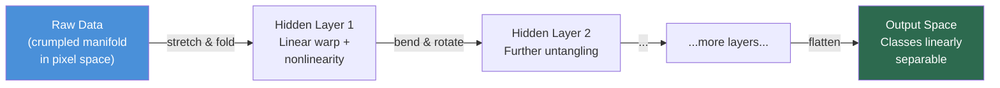

# The Manifold Hypothesis: Why Deep Learning Works

## The Impossible Math of Reality

Consider the dimensionality of a simple image—a calculation that reveals something profound.

Take a humble $256 \times 256$ grayscale image. To a human, it's a face, a landscape, or a cat. To a computer, it is a vector of $65,536$ dimensions. Every pixel is an axis. Every possible image is a single point in a hypercube of dimension 65,536.

The volume of this space is incomprehensible. It defies human intuition. If you tried to explore it by randomly sampling points, you would see static. Noise. Chaos. For eons.

Let me make this concrete: if you sampled one random image configuration every **nanosecond** since the Big Bang (about $10^{17}$ seconds), you would have sampled roughly $10^{26}$ images. But the number of possible $256 \times 256$ grayscale images (with 256 intensity levels per pixel) is:

$$256^{65536} \approx 10^{157,826}$$

That's a number with 157,826 digits. The probability of randomly hitting a configuration that looks even remotely like a "digit" or a "face" is so infinitesimally small it's statistically indistinguishable from zero. The universe isn't old enough. The atoms in the observable universe aren't numerous enough. You will never find a cat by random search.

And yet, here we are.

We train neural networks on datasets like MNIST (60,000 images) or ImageNet (14 million images). Compared to the vastness of the input space—$10^{157,826}$ possible configurations—these datasets are microscopic specks of dust floating in an infinite void. We are trying to map a galaxy using five data points scattered at random.

By all the laws of classical statistics, this shouldn't work. The **Curse of Dimensionality** dictates that our data is too sparse to learn anything meaningful. We should be overfitting wildly, memorizing the training noise, and failing to generalize to unseen examples.

But we don't. Deep Learning works. It generalizes beautifully.

Why?

The answer is one of the most profound concepts in AI theory, a bridge between topology, geometry, and intelligence: **The Manifold Hypothesis**.

## The Universe is a Crumpled Sheet of Paper

### The Insight

The Manifold Hypothesis proposes a stunningly simple resolution to the paradox: **Real-world data does not fill the high-dimensional space it lives in.**

Instead, real data concentrates on a low-dimensional, continuous surface (a **manifold**) embedded within that high-dimensional space.

Let me make this precise. Mathematically, the hypothesis states:

> **The Manifold Hypothesis:** Natural data in high-dimensional spaces ($\mathbb{R}^D$) actually concentrates near a much lower-dimensional manifold $\mathcal{M}$ of intrinsic dimension $d$, where $d \ll D$.

Think of it this way:

Imagine a flat sheet of paper. It is a 2D object. You can describe any point on it with just two coordinates: $(x, y)$. This is its **intrinsic dimension**—the minimum number of coordinates needed to uniquely specify a location on the surface.

Now, crumple that paper into a tight ball.

That ball exists in 3D space. To describe a point on the crumpled ball using the room's coordinate system, you need three numbers: $(x, y, z)$. This is the **extrinsic** or **ambient dimension**. But structurally, topologically, it is still just a 2D sheet. The data hasn't changed; only its embedding has. If you were an ant walking on that paper, your world is still 2D, even if the paper is twisted through 3D space.

**Real-world data is that crumpled paper.**

### Constraints Create Structure

Why does this happen? Why doesn't data fill the space? Because reality is constrained by physics, causality, and structure.

Consider the space of "all possible images of human faces." You have millions of pixels, but you cannot change them independently and still have a valid face:

1.  **Biological Constraints:** Faces have a predictable structure. Two eyes (roughly horizontal), one nose (centered), one mouth (below nose). Evolution has standardized this topology.

2.  **Physical Constraints:** Light obeys physics. Lambertian reflectance, shadows, specular highlights—these aren't arbitrary. They follow Maxwell's equations.

3.  **Geometric Constraints:** If you rotate a face, all pixels transform coherently according to rotation matrices. You can't move the left eye independently of the right and still have a face.

4.  **Statistical Regularities:** Skin tones cluster in a small region of RGB space. Hair textures follow Perlin noise patterns. These aren't random.

These constraints drastically reduce the **degrees of freedom**. They force the valid data points (faces) to collapse onto a thin, curved slice of the high-dimensional space.

The "space of all possible $256 \times 256$ arrays" is a vast, empty ocean of static. The "space of faces" is a tiny, delicate archipelago floating within it—perhaps a 50-dimensional manifold embedded in a 65,536-dimensional ambient space.

### The Power of Low Intrinsic Dimension

This is why machine learning works at all. We're not learning from all of $\mathbb{R}^{65536}$. We're learning the structure of a 50-dimensional manifold. That's a **trillion trillion times** smaller problem.

Suddenly, having "only" 14 million training images doesn't seem so absurd. We're not sampling a 65,536-dimensional space (hopeless). We're sampling a 50-dimensional manifold (tractable).

## The Curse of Dimensionality: Why High Dimensions Break Intuition

Before we understand how neural networks solve this, we need to appreciate **why** high dimensions are fundamentally different from our 3D intuition.

### The Empty Space Phenomenon

In high dimensions, almost all the volume of a hypercube is concentrated in the corners, not the center. Consider a unit hypercube $[0,1]^D$. The volume of the "core" (the inner cube with side length 0.5) is:

$$V_{\text{core}} = 0.5^D$$

For $D = 10$: $0.5^{10} \approx 0.001$ — only 0.1% of the volume is in the "middle."

For $D = 100$: $0.5^{100} \approx 10^{-30}$ — essentially zero.

**In high dimensions, everything is on the boundary.** There is no "middle" to speak of. This is deeply counterintuitive.

### The Concentration of Measure

Even more bizarre: in high dimensions, **almost all points are approximately the same distance from each other**.

Consider $N$ random points uniformly distributed in a unit hypersphere in $D$ dimensions. As $D \to \infty$, the ratio of the maximum to minimum pairwise distance approaches 1. Everything becomes equidistant.

This means traditional notions of "nearest neighbor" break down. There are no "close" points—everything is roughly equally far away. This is why $k$-NN and other distance-based methods degrade catastrophically in high dimensions.

### Why We Should Fail (But Don't)

Given these phenomena, learning should be impossible:
1.  **Sample Complexity:** To adequately sample a $D$-dimensional space, you need $O(N^D)$ samples. For $D = 65,536$, this is absurd.
2.  **Distance Metrics Break:** Standard similarity measures become meaningless when everything is equidistant.
3.  **Overfitting:** With more dimensions than samples ($D > N$), you can always find a hyperplane that perfectly separates your data—but it won't generalize.

Yet we succeed. The Manifold Hypothesis explains why: **we're not learning in $D$ dimensions. We're learning on a $d$-dimensional manifold where $d \ll D$.**

## Deep Learning as "Untangling"

If data lives on a complex, curved, crumpled manifold, what is a Neural Network actually doing?

It is performing **topology**.

A classification network is essentially trying to separate two manifolds—say, the "manifold of dogs" and the "manifold of cats." In the raw pixel space, these manifolds might be twisted together, tangled like headphones in your pocket. A linear classifier (a single straight cut through space) cannot separate them.

This is where the layers come in.

### The Homeomorphism View

Mathematically, we can view the layers of a network as attempting to approximate a **homeomorphism**—a continuous, invertible deformation between topological spaces.

A homeomorphism is like rubber-sheet geometry: you can stretch, squash, and bend, but you cannot tear or glue. Topologically, a coffee cup is homeomorphic to a donut (both have one hole), but not to a sphere (zero holes).

**The Neural Network's Goal:** Find a sequence of continuous transformations (homeomorphisms) that map the input data manifold to a space where:
1.  Different classes are **linearly separable**.
2.  The manifold is **unfolded** and **smoothed**.

Let's trace this:

*   **Input Layer ($f_0$):** The raw, crumpled, tangled data manifold in pixel space.
*   **Hidden Layer 1 ($f_1$):** $\mathbf{h}_1 = \sigma(W_1 \mathbf{x} + b_1)$ — A linear transformation followed by a nonlinearity. This warps space, pulling some regions apart, pushing others together.
*   **Hidden Layer 2 ($f_2$):** $\mathbf{h}_2 = \sigma(W_2 \mathbf{h}_1 + b_2)$ — Another warp, further untangling.
*   **Output Layer ($f_L$):** A flattened space where classes sit in separate, convex regions. A simple linear classifier (hyperplane) can now divide them.

**The composition $f = f_L \circ f_{L-1} \circ \cdots \circ f_1$ is the learned homeomorphism.**

Each layer performs one local straightening of the manifold — the network is a pipeline of topological deformations:



### Why Depth Matters

This explains why deep networks outperform shallow ones. You can't untangle a complex knot in a single move. You need a sequence of small, simple deformations.

Consider the XOR problem—a classic non-linearly separable dataset. A single-layer perceptron fails. But with two layers, the first layer bends space so that XOR becomes linearly separable in the hidden representation, and the second layer draws the line.

Deeper networks can perform more complex "unfurlings." Each layer adds expressiveness—the ability to model more intricate topological transformations.

### The Role of Nonlinearity

Why do we need activation functions like ReLU, sigmoid, or tanh?

Without nonlinearity, stacking layers is pointless: $W_2(W_1 \mathbf{x}) = (W_2 W_1) \mathbf{x} = W' \mathbf{x}$. Multiple linear layers collapse to a single linear transformation—no bending, no unfolding.

**Nonlinearities enable the network to warp space.** ReLU introduces piecewise linearity. Sigmoid bends continuously. These are the mechanisms by which the network performs topology.

## Proof: Walking the Latent Space

How do we know this isn't just a nice metaphor? Because we can literally **walk on the manifold** and observe its geometry.

This is the magic behind **Latent Space Interpolation** in Generative Adversarial Networks (GANs) and Variational Autoencoders (VAEs).

### The Experiment

Let's try a thought experiment. Take two images from your dataset:
*   **Image A:** A smiling woman.
*   **Image B:** A frowning man.

If the Manifold Hypothesis were false—if data was just uniformly scattered in Euclidean space—then the straight-line average of these two images should yield a meaningful "intermediate" image.

**Pixel-Space Interpolation (Naive Approach):**

$$\mathbf{x}_{\text{mid}} = \frac{\mathbf{x}_A + \mathbf{x}_B}{2}$$

If you do this, you get a ghostly, double-exposure mess. It looks like a transparency of a man's face superimposed over a woman's. Blurry. Nonsensical. Not a valid face at all.

**Why?** Because the straight line between A and B in pixel space goes **through the void**—the high-dimensional space off the manifold where no real faces exist. You've stepped into the static ocean.

### Latent Space Interpolation (The Right Way)

Now, let's try it properly. We use an autoencoder or VAE to project images into a learned **latent space** $\mathcal{Z}$—a low-dimensional representation that the network discovered.

**Process:**
1.  **Encode:** Map images to latent codes: $\mathbf{z}_A = E(\mathbf{x}_A)$, $\mathbf{z}_B = E(\mathbf{x}_B)$
2.  **Interpolate in latent space:** $\mathbf{z}_t = (1-t) \mathbf{z}_A + t \mathbf{z}_B$ for $t \in [0, 1]$
3.  **Decode:** Map back to image space: $\mathbf{x}_t = D(\mathbf{z}_t)$

**What do we see?**

A smooth, continuous transformation:
*   $t = 0.0$: The smiling woman (Image A).
*   $t = 0.2$: The smile begins to fade. Features subtly shift.
*   $t = 0.5$: An androgynous face, neutral expression. A plausible intermediate.
*   $t = 0.8$: Features masculinize. The frown emerges.
*   $t = 1.0$: The frowning man (Image B).

Every frame $\mathbf{x}_t$ is a **valid face**. The interpolation follows the curved surface of the face manifold, rather than cutting through the void.

**This is the smoking-gun evidence.** The network has learned the geometry of the manifold so well that it can navigate the "empty" spaces between data points—regions it has never explicitly seen during training.

### The Geodesic Interpretation

Technically, what we're doing is approximating a **geodesic**—the shortest path along the manifold's curved surface.

In Euclidean space, the shortest path is a straight line. On a curved manifold, the shortest path bends with the curvature. When you fly from New York to Tokyo, the plane follows a "great circle" route that looks curved on a flat map but is actually the shortest path on the sphere.

The latent space interpolation is analogous. The learned latent space $\mathcal{Z}$ is a coordinate system where the manifold is (approximately) flat, so straight-line interpolation there corresponds to geodesics on the original manifold.

## Measuring Intrinsic Dimensionality: How Many Dimensions Do We Really Need?

If the Manifold Hypothesis is true, we should be able to **measure** the intrinsic dimension of real datasets. Several methods exist:

### 1. PCA (Principal Component Analysis)

The simplest approach. Perform eigenvalue decomposition on the data covariance matrix and look at the "explained variance ratio."

If the data truly lives on a low-dimensional manifold, the first $d$ eigenvalues will capture most of the variance, and the remaining eigenvalues will be small (representing noise).

**Example:** For MNIST (handwritten digits), the first 50 principal components capture ~95% of the variance. This suggests the intrinsic dimension is around 50, despite the ambient space being 784.

### 2. Isomap and Geodesic Distance

PCA assumes the manifold is **flat** (linear). But real manifolds are often curved. Isomap improves on this by using **geodesic distances**—distances measured along the manifold's surface.

**Algorithm:**
1.  Build a $k$-nearest-neighbor graph where edges connect nearby points.
2.  Compute shortest-path distances along this graph (approximating geodesics).
3.  Apply classical MDS (Multidimensional Scaling) to embed points in low-dimensional space while preserving geodesic distances.

**Result:** Isomap "unrolls" the manifold, revealing its intrinsic structure.

### 3. Locally Linear Embedding (LLE)

LLE assumes that each point and its neighbors lie on a locally linear patch of the manifold. It reconstructs each point as a linear combination of its neighbors and finds a low-dimensional embedding that preserves these local relationships.

**Key Insight:** Even if the global manifold is curved, locally it looks flat. LLE exploits this to unfold the manifold piece by piece.

## Seeing the Geometry in Code

Let's visualize this "unfolding" using Isomap on the classic **Swiss Roll** dataset—a 2D plane rolled up into a 3D spiral.

This toy example perfectly illustrates what a neural network does to your data.

```python
import numpy as np
import matplotlib.pyplot as plt
from sklearn import manifold, datasets
from sklearn.decomposition import PCA

def visualize_manifold_learning():
    """
    Demonstrate manifold learning on the Swiss Roll.
    Shows the difference between Euclidean distance (fails) 
    and geodesic distance (succeeds) in recovering intrinsic structure.
    """
    # 1. Generate the "Swiss Roll"
    # This represents our "crumpled paper" - 2D data hidden in 3D
    # The color represents the "true" underlying dimension (position on the roll)
    X, color = datasets.make_swiss_roll(n_samples=1500, noise=0.1)

    # 2. Visualize the tangled 3D data
    fig = plt.figure(figsize=(18, 6))
    
    # Plot 3D "Real World" view
    ax = fig.add_subplot(131, projection='3d')
    ax.scatter(X[:, 0], X[:, 1], X[:, 2], c=color, cmap=plt.cm.Spectral, s=10)
    ax.set_title("Input Space: Swiss Roll in 3D\n(Ambient Dimension = 3)")
    ax.view_init(10, -70)
    ax.set_xlabel("X")
    ax.set_ylabel("Y")
    ax.set_zlabel("Z")

    # 3. Try PCA (Linear Method - Fails)
    # PCA assumes the manifold is flat, so it fails on curved manifolds
    pca = PCA(n_components=2)
    X_pca = pca.fit_transform(X)

    ax2 = fig.add_subplot(132)
    ax2.scatter(X_pca[:, 0], X_pca[:, 1], c=color, cmap=plt.cm.Spectral, s=10)
    ax2.set_title("PCA Projection (Linear)\n(Fails to Unroll)")
    ax2.set_xlabel("PC1")
    ax2.set_ylabel("PC2")

    # 4. Apply Isomap (Nonlinear Manifold Learning - Succeeds)
    # Isomap uses geodesic distances to "unroll" the manifold
    isomap = manifold.Isomap(n_neighbors=10, n_components=2)
    X_isomap = isomap.fit_transform(X)

    ax3 = fig.add_subplot(133)
    ax3.scatter(X_isomap[:, 0], X_isomap[:, 1], c=color, cmap=plt.cm.Spectral, s=10)
    ax3.set_title("Isomap Embedding (Nonlinear)\n(Intrinsic Dimension = 2)")
    ax3.set_xlabel("Dimension 1")
    ax3.set_ylabel("Dimension 2")

    plt.tight_layout()
    plt.show()

    print(f"PCA Explained Variance: {pca.explained_variance_ratio_.sum():.3f}")
    print("Notice how PCA fails to preserve the color gradient structure.")
    print("Isomap successfully 'unrolls' the Swiss Roll into a flat rectangle.")

# Run the visualization
visualize_manifold_learning()
```

**What you'll see:**
1.  **Left:** A 3D spiral. Points that look close in Euclidean space (straight-line distance) might actually be far apart on the manifold (geodesic distance).
2.  **Middle:** PCA's attempt. It squashes the spiral but doesn't unroll it. The color gradient is mangled.
3.  **Right:** Isomap's success. A perfect, flat rectangle. The color gradient flows smoothly from one corner to the other.

**The Lesson:** The algorithm "discovered" that the 3D spiral was actually just a flat 2D sheet rolled up. It recovered the **intrinsic geometry**.

This is exactly what deep learning does—but for manifolds far more complex than the Swiss Roll, in dimensions far higher than 3.

## Implications for Modern AI Systems

### Generative Models: Creating On-Manifold

The Manifold Hypothesis is the foundation of modern generative AI.

**Variational Autoencoders (VAEs)** explicitly model the data manifold. The encoder learns a mapping $E: \mathbb{R}^D \to \mathcal{Z}$ to a low-dimensional latent space $\mathcal{Z}$ (the manifold's coordinate system). The decoder learns the inverse $D: \mathcal{Z} \to \mathbb{R}^D$.

During generation, we sample from $\mathcal{Z}$ (easy, low-dimensional) and decode. Because $\mathcal{Z}$ represents the manifold, every sample decodes to a plausible image.

**Diffusion Models** (Stable Diffusion, DALL-E 2) work differently but rely on the same principle. They learn to denoise images by staying on the data manifold. The denoising process is a gradient flow **along** the manifold toward higher-probability regions.

**GANs** train a generator to map from a simple distribution (e.g., Gaussian noise) to the data manifold. The discriminator provides feedback: "Are you on the manifold or in the void?"

In all cases, the goal is to **stay on the manifold** where real data lives.

### Language Models: The Manifold of Meaning

When a Large Language Model (LLM) writes a poem, it isn't statistically guessing the next token from the universe of all possible token sequences ($|V|^L$ possibilities, where $|V|$ is vocabulary size and $L$ is sequence length).

It is traversing the **manifold of natural language**—a subspace constrained by:
*   **Grammar:** Syntactic rules dramatically reduce valid sequences.
*   **Semantics:** Words must relate meaningfully.
*   **Pragmatics:** Context shapes meaning.
*   **World Knowledge:** Statements must align with facts (at least for factual text).

The model learns a representation space where these constraints manifest as a low-dimensional manifold. Token prediction becomes: "Which direction on the manifold leads to coherent continuation?"

### The Limit of Thought

This also suggests a fundamental limit to current AI.

Our models are bound by the manifolds they observe during training. If a concept lies **orthogonal** to the manifold of our training data—in a dimension the model "flattened out" to save parameters—it becomes literally **unthinkable** to the AI.

**Example:** If you train a language model exclusively on 19th-century literature, it can't conceptualize "blockchain" or "mRNA vaccine." Those concepts don't exist on its learned manifold. They're off in orthogonal dimensions that the model never explored.

This is related to the **distributional shift problem**. When test data comes from a different manifold than training data, performance collapses. The model is operating "in the void," where it has no learned structure.

## The Philosophical Consequence

Understanding the Manifold Hypothesis changes how you look at Intelligence itself.

It implies that **learning is not about memorization, but about compression.** To understand the world, you must:
1.  **Ignore the noise** of the high-dimensional ambient space.
2.  **Find the low-dimensional rules** that generate the observations.
3.  **Navigate the manifold** efficiently.

Intelligence, in this view, is the ability to discover and exploit manifold structure.

If the data is the shadow of reality, the manifold is the shape of the object casting it. We are teaching our machines to reconstruct the object from the shadow—to infer 3D structure from 2D projections, to infer causal laws from correlational data.

This is also a statement about **inductive bias**. Why do neural networks generalize? Because they have an architectural bias toward learning smooth functions on manifolds. The combination of layer-wise composition and nonlinearity is particularly good at representing manifolds.

## When the Hypothesis Breaks: Edge Cases and Criticisms

### Not All Data Lives on Manifolds

The Manifold Hypothesis is powerful but not universal. Some caveats:

**1. Adversarial Examples**

Small, imperceptible perturbations can push images off the manifold and fool classifiers. If you take an image of a panda and add carefully crafted noise (invisible to humans), the model might classify it as a gibbon with high confidence.

This suggests that learned manifolds are **approximate** and **fragile**. The model hasn't perfectly captured the true data manifold—it has learned a proxy that works on the training distribution but has vulnerabilities.

**2. High-Frequency Noise**

Some data genuinely has high intrinsic dimension. White noise, by definition, has intrinsic dimension equal to its ambient dimension—it fills the space uniformly. There is no manifold structure to exploit.

Fortunately, most real-world data isn't white noise. Natural signals have structure, redundancy, and constraints.

**3. Multiple Disconnected Manifolds**

In classification tasks, we often have multiple disconnected manifolds (one per class). The Manifold Hypothesis still applies, but the geometry is more complex. The overall data distribution is a **union of manifolds**, and the learning problem becomes: separate these manifolds topologically.

### Testing the Hypothesis

How do we empirically validate the Manifold Hypothesis? Researchers have developed statistical tests:

*   **Intrinsic Dimensionality Estimation:** Algorithms like MLE (Maximum Likelihood Estimation) can estimate the local intrinsic dimension at each point. If the estimated dimension is much smaller than the ambient dimension, the hypothesis holds.

*   **Manifold Fitting Error:** Try to fit a $d$-dimensional manifold to the data and measure reconstruction error. If error is small for $d \ll D$, the hypothesis is validated.

*   **Topological Data Analysis (TDA):** Use tools like persistent homology to study the "shape" of data clouds. This can reveal holes, clusters, and cycles in the manifold structure.

## Geometry as the Language of Learning

Next time you train a model and watch the loss curve drop, try to visualize what's actually happening.

Don't see numbers changing. See a high-dimensional, crumpled, tangled mess — the raw data manifold, twisted through pixel space or token space or whatever ambient dimension your inputs inhabit. And see your neural network as a sequence of mathematical hands, each layer gently pulling at different corners, smoothing out local wrinkles, untangling strands that were knotted together.

The loss function measures how well the network has uncrumpled the paper. Each gradient step is a small adjustment to the learned homeomorphism. Convergence is the discovery of the manifold.

This framing reveals something important about generalization that pure optimization theory doesn't capture. A model that memorizes training data has learned to *label points*. A model that generalizes has learned the *surface* — the underlying low-dimensional structure from which those points were sampled. When it sees a new data point it's never encountered, it can place it on the surface and reason from there. The generalization isn't magic. It's geometry.

It also suggests a theory of what makes a representation *good*. The latent spaces of well-trained networks are not arbitrary compressions. They are attempts to discover and parametrize the manifold — to find a coordinate system in which the structure of the data is flat and navigable. When we talk about models learning "abstract features," we mean they've found coordinates for the manifold. When we talk about representations that "transfer" across tasks, we mean the manifold they've discovered is the true one — the one that underlies the data regardless of which task you're using it for.

The crumpled paper was always crumpled. The structure was always there. We gave the network enough data and enough expressiveness, and it found it.

**That's not creation. That's revelation.**

---

## Going Deeper

The manifold hypothesis sits at the intersection of differential geometry, topology, and machine learning. Pursuing it seriously will change how you think about why neural networks work at all — and what their limitations ultimately are.

**Books:**

- **[Differential Geometry of Curves and Surfaces](https://www.google.com/search?q=do+Carmo+differential+geometry+curves+surfaces) — Manfredo do Carmo**
  - The classical introduction to differential geometry at the undergraduate level. Do Carmo develops the machinery for understanding curvature, geodesics, and the intrinsic geometry of surfaces with exceptional clarity. Reading even the first three chapters builds the geometric vocabulary needed to reason precisely about data manifolds.
- **[Topology](https://www.google.com/search?q=Munkres+Topology+textbook) — James Munkres**
  - The standard graduate topology textbook. Homeomorphisms, continuous maps, compactness, connectedness — all the tools the manifold hypothesis implicitly invokes. Dense but worth it if you want to understand why "rubber-sheet geometry" is a coherent mathematical concept.
- **[The Shape of Data](https://www.google.com/search?q=Weinberger+mathematics+of+learning) — Shmuel Weinberger**
  - A book about topological data analysis accessible to non-specialists. Weinberger argues that data has *shape*, and that understanding that shape — its holes, its connected components, its clusters — requires topology, not just statistics.
- **[Representation Learning: A Review and New Perspectives](https://www.google.com/search?q=Bengio+Courville+Vincent+representation+learning+review) — Yoshua Bengio, Aaron Courville & Pascal Vincent**
  - A survey paper dense enough to function as a reference. Bengio and colleagues systematically examine what it means for a representation to be "good" — sparse, disentangled, manifold-structured. The sections on disentangling factors of variation are especially relevant.

**Videos:**

- **[Neural Networks, Manifolds, and Topology](https://www.youtube.com/results?search_query=neural+networks+manifolds+topology+colah) — Chris Olah**
  - Several video talks and adaptations of Olah's famous blog post exist. The core insight — that a neural network with enough layers can perform arbitrary topological transformations, and that classification requires untangling the data manifold — is one of the most beautiful geometric ideas in all of deep learning.
- **[Manifold Learning and Dimensionality Reduction](https://www.youtube.com/results?search_query=manifold+learning+dimensionality+reduction+explained) — Various**
  - Multiple excellent university lecture series cover manifold learning algorithms (Isomap, LLE, t-SNE, UMAP). The CMU and Stanford machine learning courses in particular contain careful treatments that build the theory before the algorithms.
- **[Geometric Deep Learning](https://www.youtube.com/results?search_query=geometric+deep+learning+Bronstein+lecture) — Michael Bronstein et al.**
  - The GDL project attempts to unify deep learning architectures under a common geometric framework using group theory and symmetry. Recorded lectures connect graph neural networks, transformers, and CNNs as instances of geometric learning.
- **[UMAP: Uniform Manifold Approximation and Projection](https://www.youtube.com/results?search_query=UMAP+dimensionality+reduction+explained) — Leland McInnes**
  - McInnes explains the topological foundations honestly — the algorithm is grounded in fuzzy simplicial sets and Riemannian geometry — while remaining practically accessible. Builds mathematical and practical intuition simultaneously.

**Online Resources:**

- [Neural Networks, Manifolds, and Topology](https://colah.github.io/posts/2014-03-NN-Manifolds-Topology/) — Chris Olah. The blog post that may have done more to popularize the manifold interpretation of deep learning than any paper. Olah animates how networks layer by layer deform and untangle data. Read before any of the papers.
- [Scikit-learn Manifold Learning](https://scikit-learn.org/stable/modules/manifold.html) — The definitive practical reference for manifold learning algorithms. Implementations of Isomap, LLE, LTSA, MDS, Spectral Embedding, t-SNE — each with worked examples and guidance on when to use which.
- [UMAP Documentation](https://umap-learn.readthedocs.io/en/latest/) — The canonical documentation for UMAP. The "How UMAP Works" section is unusually honest about the mathematical assumptions and what can go wrong.

**Papers That Matter:**

- **Tenenbaum, J. B., Silva, V., & Langford, J. C. (2000). *A Global Geometric Framework for Nonlinear Dimensionality Reduction*. *Science*, 290(5500), 2319–2323.**
  - The Isomap paper — one of two landmark manifold learning papers published simultaneously in Science in 2000. Isomap discovers manifold geometry by computing geodesic distances along the data and embedding them to preserve this structure.
- **Roweis, S. T., & Saul, L. K. (2000). *Nonlinear Dimensionality Reduction by Locally Linear Embedding*. *Science*, 290(5500), 2323–2326.**
  - LLE, the companion paper. Where Isomap uses global geodesics, LLE reconstructs each point from its local neighborhood. Two different mathematical approaches to the same intuition: honor the local geometry of the manifold.
- **Fefferman, C., Mitter, S., & Narayanan, H. (2016). *Testing the Manifold Hypothesis*. *Journal of the American Mathematical Society*, 29(4), 983–1049.**
  - The most rigorous treatment of the manifold hypothesis as a statistical claim. Develops a formal framework for testing whether data lies on a smooth manifold, with sample complexity bounds.
- **McInnes, L., Healy, J., & Melville, J. (2018). *UMAP: Uniform Manifold Approximation and Projection for Dimension Reduction*. [arXiv:1802.03426](https://arxiv.org/abs/1802.03426)**
  - Grounded in category theory and Riemannian geometry, constructs a fuzzy topological representation of the data manifold and finds a low-dimensional embedding that preserves this structure. Substantially faster than t-SNE and more faithful to global structure.
- **Carlsson, G. (2009). *Topology and Data*. *Bulletin of the American Mathematical Society*, 46(2), 255–308.**
  - The founding document of topological data analysis (TDA). Carlsson argues that the right framework for studying the "shape" of data is algebraic topology — persistent homology, Betti numbers, barcodes.

**A Question to Sit With:**

If the manifold hypothesis is correct — if natural data really concentrates on low-dimensional surfaces in high-dimensional space — then deep learning is in some sense inevitable: any sufficiently expressive model trained on enough data will discover this structure. But the hypothesis is also a claim about the *world*, not just about data. It says that natural phenomena have far fewer degrees of freedom than the number of variables used to describe them. Is this because the laws of physics impose low-dimensional constraints on what configurations are possible? Or is it because minds — including the ones generating training data — themselves impose structure by attending only to a compressed view of reality? Are we finding the geometry of the world, or of ourselves?

