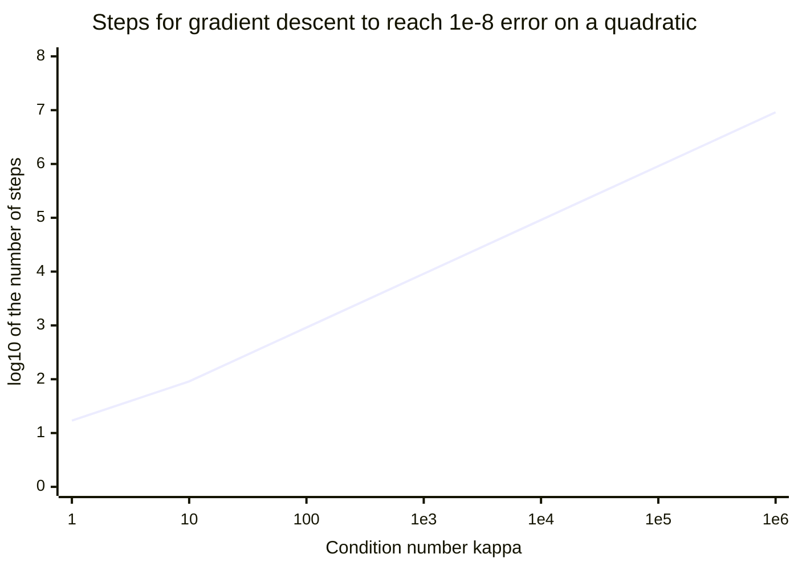
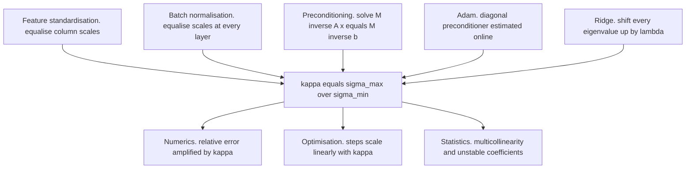
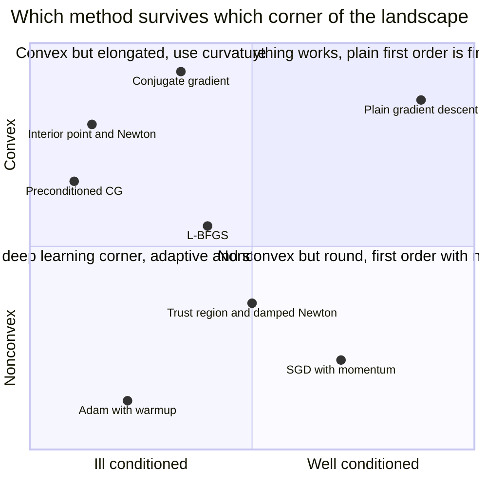
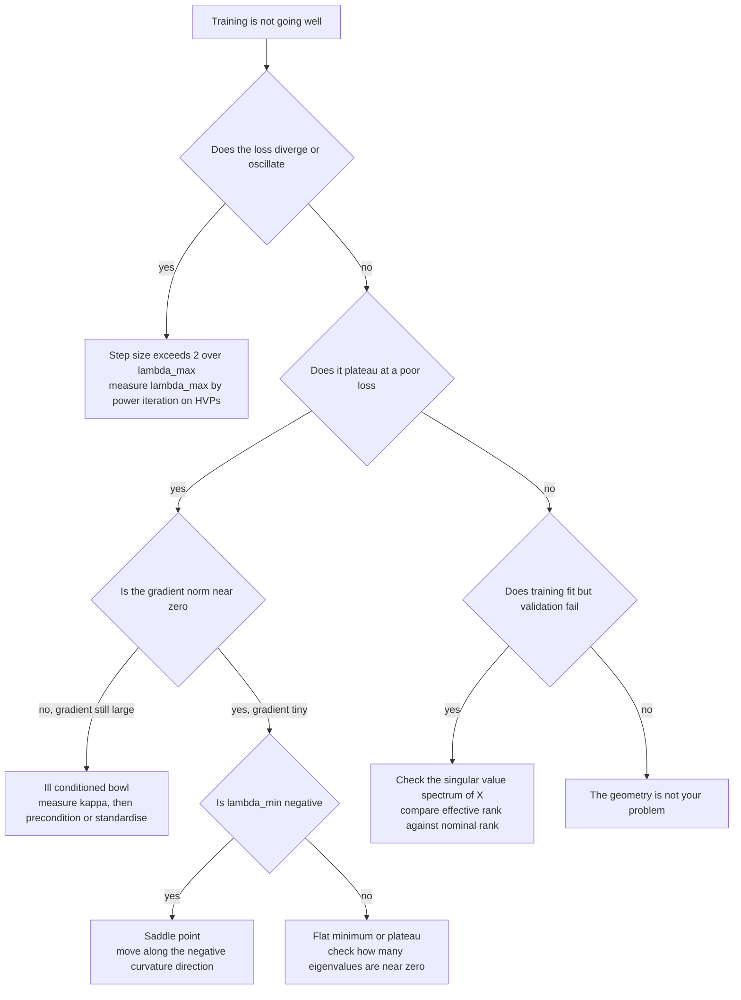

# The Objective Has a Shape

*This opens "The Shape of a Problem," a two-post prologue to "Why Learning Works: The Theorems Behind Machine Learning." That series proved theorems, but never taught the reading skill they assume: looking at an objective — a matrix, a gradient, a Hessian, a constraint — and saying in advance how it will behave. This post is the geometry of the objective; the companion post is the geometry of the uncertainty around it.*

---

## Two Problems, Two Unit Systems

Here are two least-squares problems: four hundred manufactured parts, two centred measurements each — a part's length and the thickness of a coating on it — and a target depending on both. One version records the coating in metres, since the rest of the file is SI; the other in micrometres, the natural unit for something six hundred nanometres thick.

The two data matrices differ by a factor of $10^6$ in one column. Statistically they are identical: same fit, residuals, predictions, $R^2$, with the solutions differing only by the rescaling of that one coefficient. Run gradient descent on both with the optimal constant step size, stopping when the fitted values are within $10^{-8}$ of the exact solution — a criterion invariant to column scaling, so the comparison is fair.

```python
import numpy as np

rng = np.random.default_rng(0)
n = 400

length  = rng.normal(0.0, 0.40, size=n)                       # metres
length -= length.mean()
noise   = rng.normal(0.0, 1.0, size=n)
coating = 6e-7 * (0.5 * length / length.std() + np.sqrt(1 - 0.25) * noise)
coating -= coating.mean()                                     # metres, sub-micrometre

y = 3.0 * length + 1.2e6 * coating + rng.normal(0.0, 0.05, size=n)
X_si    = np.column_stack([length, coating])                  # coating in metres
X_micro = np.column_stack([length, coating * 1e6])            # coating in micrometres

def kappa(X):
    s = np.linalg.svd(X, compute_uv=False)
    return (s[0] / s[-1]) ** 2

def gd_steps(X, y, tol=1e-8, cap=40_000):
    H = X.T @ X                                               # progress on Xw is
    ev = np.linalg.eigvalsh(H)                                # invariant to column
    step = 2.0 / (ev[0] + ev[-1])                             # rescaling: fair test
    w_star = np.linalg.lstsq(X, y, rcond=None)[0]
    target = X @ w_star
    scale = np.linalg.norm(target)
    w = np.zeros(X.shape[1])
    for k in range(1, cap + 1):
        w -= step * (H @ w - X.T @ y)
        if np.linalg.norm(X @ w - target) / scale < tol:
            return k
    return None

print(f"{'coating measured in':<22}{'kappa(X^T X)':>16}{'steps to 1e-8':>16}{'predicted':>14}")
for name, X in [("metres", X_si), ("micrometres", X_micro)]:
    k = gd_steps(X, y)
    kap = kappa(X)
    rho = (kap - 1) / (kap + 1)                               # contraction per step
    pred = np.log(1e-8) / np.log(rho)
    reached = "not in 40000" if k is None else str(k)
    print(f"{name:<22}{kap:16.3e}{reached:>16}{pred:14.2e}")

w_si    = np.linalg.lstsq(X_si, y, rcond=None)[0]
w_micro = np.linalg.lstsq(X_micro, y, rcond=None)[0]
print(f"\nidentical fits: max |X_si w_si - X_micro w_micro| = "
      f"{np.max(np.abs(X_si @ w_si - X_micro @ w_micro)):.2e}")
```

```text
coating measured in         kappa(X^T X)   steps to 1e-8     predicted
metres                         5.849e+11    not in 40000      5.39e+12
micrometres                    4.794e+00              44      4.35e+01

identical fits: max |X_si w_si - X_micro w_micro| = 1.78e-15
```

Forty-four steps against forty thousand and counting — the metres formulation actually needs about $5 \times 10^{12}$ iterations, a number nobody will run — while the fits agree to $10^{-15}$. The only thing that changed is a unit label.

The column labelled *predicted* is the point of this post: nobody ran gradient descent to produce it. It came from the data matrix alone, before the first iteration, out of one number — the condition number. Forty-three point five predicted; forty-four observed.

That number is one of three this post is about. The other two are curvature — what the Hessian's eigenvalues say about a bowl, a ridge, or a plateau — and duality, the worth of a constraint. Almost everything you experience as "the model will not train" is one of the three, legible in advance, without running anything.

---

## Norms Are Preferences, and the Unit Ball Makes the Preference Visible

An **inner product** on $\mathbb{R}^d$ is a positive definite symmetric bilinear form $\langle x, y \rangle$, inducing a **norm** $\|x\| = \sqrt{\langle x,x\rangle}$; every such inner product has the form $\langle x, y\rangle_M = x^\top M y$ for symmetric positive definite $M$, with the Euclidean case $M = I$ a choice, not a law. Not every norm comes from an inner product — $\|x\|_1$ and $\|x\|_\infty$ fail the parallelogram law, and that failure is the source of everything interesting about them.

A norm is a **preference over directions**, displayed by its unit ball $B = \{x : \|x\| \le 1\}$, the set of vectors it considers small. Three pictures in $\mathbb{R}^2$:

- $\|\cdot\|_2$: a disc, perfectly round, no direction favoured — invariant under rotation, since Euclidean geometry has no preferred basis.
- $\|\cdot\|_\infty$: an axis-aligned square, extreme points at the four corners $(\pm 1, \pm 1)$.
- $\|\cdot\|_1$: a diamond, the square rotated by forty-five degrees. Its extreme points are $(\pm 1, 0)$ and $(0, \pm 1)$, and **they lie on the coordinate axes**.

That last sentence is the entire geometric content of sparsity. When a constraint binds, the minimiser of a smooth loss over a convex set generically sits at an extreme point — for the $\ell^1$ ball's cross-polytope in $\mathbb{R}^d$, the $2d$ vertices $\pm e_i$, supported on small subsets of coordinates. A polytope vertex has an entire *cone* of outward normals, so a whole open set of loss gradients points into it; a point on a sphere has only a single normal ray, making that landing a measure-zero coincidence.

This is the picture, not the proof. The full argument — that penalising and constraining are the same problem, and the closed-form soft threshold saying exactly when a coefficient dies — is derived in *Penalizing Is Constraining: What Regularization Actually Does*.

Given a norm $\|\cdot\|$, its **dual norm** measures linear functionals:

$$
\|y\|_* = \sup_{\|x\| \le 1} \, y^\top x .
$$

Read it as: how much can this functional extract from a vector the primal norm considers small. The Euclidean norm is self-dual by Cauchy-Schwarz, and $\|\cdot\|_1$, $\|\cdot\|_\infty$ are dual to each other, since $\sup_{\|x\|_1 \le 1} y^\top x = \max_i |y_i|$. Whenever a norm appears in an objective, its dual appears in the certificate that the objective is optimal — the exact price at which LASSO collapses to zero is $\lambda_{\max} = \|X^\top y\|_\infty$, a dual norm, not a coincidence.

---

## A Matrix Is a Map, Not a Table

A matrix $A \in \mathbb{R}^{m\times n}$ is stored as a table and taught as one. It is a linear map $\mathbb{R}^n \to \mathbb{R}^m$, and every question worth asking is about the map.

The **image** $\operatorname{im}(A) = \{Ax\}$ is what the map can reach; the **kernel** $\ker(A) = \{x : Ax = 0\}$ is what it destroys; the **rank** is $\dim\operatorname{im}(A)$, and rank-nullity, $\operatorname{rank}(A) + \dim\ker(A) = n$, says every input dimension is either preserved or annihilated.

That is not ceremony; it is the whole of least squares. Given $X \in \mathbb{R}^{n \times d}$ and $y \in \mathbb{R}^n$, the equation $Xw = y$ usually has no solution, since $y \in \mathbb{R}^n$ while $\operatorname{im}(X)$ is only a $d$-dimensional subspace of it. So ask for the closest reachable point: minimise $\|Xw - y\|_2$. Geometry forces the answer — the closest point of a subspace to an external point is its **orthogonal projection**, whose defining property is that the residual is perpendicular to the subspace. Demanding $x_j^\top(y - Xw) = 0$ for every column $x_j$ of $X$ gives

$$
X^\top (y - Xw) = 0 \quad\Longleftrightarrow\quad X^\top X\, w = X^\top y .
$$

The normal equations, derived without differentiating anything. The name is literal: *normal* means perpendicular. If $X$ has full column rank then $X^\top X$ is invertible, $w = (X^\top X)^{-1}X^\top y$, and the fitted values are $\hat y = X(X^\top X)^{-1}X^\top y = P y$ with $P$ the orthogonal projector onto $\operatorname{im}(X)$: symmetric, idempotent, $P^2 = P$.

Solving and projecting are the same act. The hat matrix is a projector, so its trace equals the dimension of the space it projects onto — the parameter count, for an unregularised model. Multicollinearity means the columns nearly fail to be independent, so $\operatorname{im}(X)$ is nearly lower-dimensional than $d$, and the projection's coordinates in the column basis are nearly undetermined even though the projection itself is well determined. The fit is stable; the coefficients are not — a statement about the map, and the commonest source of confusion about collinearity.

---

## Quadratic Forms: The Objective as an Ellipsoid

The squared error, expanded, is a quadratic form plus a linear term plus a constant. For symmetric positive definite $A$, the function $q(x) = x^\top A x$ is the model organism for every smooth objective near its minimum.

By the spectral theorem, $A = Q \Lambda Q^\top$ with $Q$ orthogonal and $\Lambda = \operatorname{diag}(\lambda_1, \dots, \lambda_d)$, all $\lambda_i > 0$. Substituting $u = Q^\top x$ — a rotation into the eigenbasis, which changes no lengths — gives

$$
q(x) = u^\top \Lambda u = \sum_{i=1}^d \lambda_i u_i^2 .
$$

So the level set $\{q(x) = c\}$ is $\sum_i \lambda_i u_i^2 = c$: an **ellipsoid** centred at the origin, with axes along the eigenvectors $q_i$ and semi-axis lengths $\sqrt{c/\lambda_i}$. Large eigenvalue, short axis, steep walls; small eigenvalue, long axis, nearly flat floor.

The instrument that reads one direction is the **Rayleigh quotient** $R(x) = x^\top A x / x^\top x$, which is $q$ restricted to the unit sphere. It answers "by how much does $A$ stretch along $x$", equals $\lambda_i$ at each eigenvector, and by Courant-Fischer is maximised at $q_1$ and minimised at $q_d$ — both proved, with the four standard algorithms that follow from them, in *One Eigendecomposition, Four Algorithms*.

Carry forward one thing: the ratio $\lambda_1/\lambda_d$ is the **elongation** of the ellipsoid, how much longer its longest axis is than its shortest. Everything in the next two sections is that ratio wearing different clothes.

---

## The Singular Values Are the Stretch Factors

For a non-square, non-symmetric matrix there are no eigenvalues to speak of, and the right object is the singular value decomposition: every $X \in \mathbb{R}^{n\times d}$ factors as $X = U \Sigma V^\top$ with $U, V$ orthogonal and $\Sigma$ diagonal with $\sigma_1 \ge \sigma_2 \ge \cdots \ge 0$.

Read right to left, this says every linear map is **rotate, stretch, rotate**: $V^\top$ rotates the input into a special orthonormal basis, $\Sigma$ scales the $i$-th coordinate by $\sigma_i$, and $U$ rotates into a special orthonormal basis of the output, so the unit sphere maps to an ellipsoid with semi-axes $\sigma_i$ along the directions $u_i$. The connection to the previous section is one line: $X^\top X = V\Sigma^\top\Sigma V^\top$, so $\lambda_i(X^\top X) = \sigma_i(X)^2$.

The practical consequence is that **rank is the wrong question and the spectrum is the right one.** Rank counts nonzero singular values, a discontinuous function of the matrix: perturb a rank-7 matrix by $10^{-15}$ in every entry and it becomes full rank while behaving in every computation exactly as it did before. What matters is where the singular values *fall off a cliff*.

```python
import numpy as np

rng = np.random.default_rng(11)
n, d, r = 300, 60, 7                          # 7 real directions, 53 near-noise

B = rng.normal(size=(n, r))
C = rng.normal(size=(r, d))
X = B @ C + 1e-5 * rng.normal(size=(n, d))
w_true = np.zeros(d); w_true[:r] = rng.normal(size=r)
y = X @ w_true + 0.01 * rng.normal(size=n)

s = np.linalg.svd(X, compute_uv=False)

def stable_rank(s):                           # ||X||_F^2 / ||X||_2^2, continuous
    return float((s ** 2).sum() / s[0] ** 2)

def entropy_rank(s):                          # Roy-Vetterli: exp of spectral entropy
    p = s / s.sum()
    p = p[p > 0]
    return float(np.exp(-(p * np.log(p)).sum()))

print(f"nominal rank (numpy default tolerance) : {np.linalg.matrix_rank(X)}")
print(f"rank at tolerance 1e-3 * sigma_max     : {int(np.sum(s > 1e-3 * s[0]))}")
print(f"stable rank ||X||_F^2 / ||X||_2^2      : {stable_rank(s):.2f}")
print(f"entropy effective rank                 : {entropy_rank(s):.2f}")
print(f"kappa = sigma_max / sigma_min          : {s[0] / s[-1]:.3e}")
print("ratio sigma_k / sigma_(k+1): " +
      "  ".join(f"{s[k] / s[k + 1]:.1f}" for k in range(9)))

print(f"\n{'solver':<26}{'||w||_2':>12}{'train MSE':>12}{'test MSE':>12}")
Xte = rng.normal(size=(200, r)) @ C + 1e-5 * rng.normal(size=(200, d))
yte = Xte @ w_true + 0.01 * rng.normal(size=200)
for label, rcond in [("lstsq, full precision", 1e-15),
                     ("lstsq, cut below 1e-3", 1e-3)]:
    w = np.linalg.lstsq(X, y, rcond=rcond)[0]
    print(f"{label:<26}{np.linalg.norm(w):12.3e}"
          f"{np.mean((X @ w - y) ** 2):12.3e}{np.mean((Xte @ w - yte) ** 2):12.3e}")
```

```text
nominal rank (numpy default tolerance) : 60
rank at tolerance 1e-3 * sigma_max     : 7
stable rank ||X||_F^2 / ||X||_2^2      : 3.97
entropy effective rank                 : 6.85
kappa = sigma_max / sigma_min          : 1.825e+06
ratio sigma_k / sigma_(k+1): 1.2  1.1  1.2  1.0  1.1  1.3  382407.2  1.0  1.0

solver                         ||w||_2   train MSE    test MSE
lstsq, full precision        4.658e+02   7.517e-05   1.281e-04
lstsq, cut below 1e-3        1.307e+00   9.309e-05   1.098e-04
```

Nominal rank sixty. Consecutive singular-value ratios hover around $1.2$ until the seventh, where the spectrum drops by a factor of $382{,}407$ in one step. Every numerical method will treat this as a rank-7 matrix, because everything below the cliff sits at the level of the noise added to build it. Two continuous surrogates agree without any threshold being chosen: the **stable rank** $\|X\|_F^2/\|X\|_2^2$ and the entropy-based **effective rank** of Roy and Vetterli.

The bottom table is the cost of ignoring this. Fitting through all sixty directions gives a coefficient vector of norm $466$ and the *worst* test error; truncating below $10^{-3}$ gives norm $1.3$ and the best. The training errors are indistinguishable — the extra fifty-three directions bought $2 \times 10^{-5}$ of training MSE by inflating the coefficients two and a half orders of magnitude.

---

## The Condition Number

Define, for a matrix with full column rank,

$$
\kappa(A) = \frac{\sigma_{\max}(A)}{\sigma_{\min}(A)} \; \ge \; 1 .
$$

This is the single most useful number you can compute about a linear problem before solving it — it has three faces, rarely shown to be the same face.

### Face one: numerics

Solve $Ax = b$ and perturb the right-hand side to $b + \delta b$ — measurement noise, or just the rounding that put $b$ into a float. Then $A\,\delta x = \delta b$, so $\|\delta x\| \le \|A^{-1}\|\,\|\delta b\|$; and $\|b\| = \|Ax\| \le \|A\|\,\|x\|$, so $1/\|x\| \le \|A\|/\|b\|$. Multiply the two:

$$
\frac{\|\delta x\|}{\|x\|} \;\le\; \|A\|\,\|A^{-1}\| \cdot \frac{\|\delta b\|}{\|b\|} \;=\; \kappa(A)\,\frac{\|\delta b\|}{\|b\|} .
$$

In the spectral norm $\|A\| = \sigma_{\max}$ and $\|A^{-1}\| = 1/\sigma_{\min}$, so the product is exactly $\kappa$: **$\kappa$ is the amplification factor from relative input error to relative output error**, and the bound is attained, not pessimistic. Double precision carries about sixteen significant digits; $\kappa = 10^{12}$ hands you four. It is also why forming $X^\top X$ to solve least squares is a mistake — it squares $\kappa$, the whole argument for QR and SVD-based solvers.

### Face two: optimisation

Minimise a quadratic

$$
f(w) = \tfrac{1}{2}(w - w^\star)^\top A (w - w^\star), \qquad A \succ 0,
$$

by gradient descent, $w_{k+1} = w_k - \alpha \nabla f(w_k) = w_k - \alpha A (w_k - w^\star)$. With $e_k = w_k - w^\star$, subtracting $w^\star$ from both sides gives the error recursion:

$$
e_{k+1} = (I - \alpha A)\, e_k .
$$

Rotating into the eigenbasis of $A$ via $\tilde e = Q^\top e$: since $I - \alpha A = Q(I - \alpha\Lambda)Q^\top$, the recursion decouples into $d$ independent scalar recursions:

$$
\tilde e_{k+1, i} = (1 - \alpha \lambda_i)\,\tilde e_{k,i} .
$$

Each eigendirection contracts by its own factor $|1 - \alpha\lambda_i|$, and the slowest one governs. So the per-step contraction is

$$
\rho(\alpha) = \max_{i} |1 - \alpha \lambda_i| = \max\big(|1 - \alpha\lambda_{\min}|,\ |1 - \alpha\lambda_{\max}|\big),
$$

the maximum sitting at an endpoint since $\lambda \mapsto |1-\alpha\lambda|$ is a V. Convergence requires $\rho < 1$, hence $\alpha < 2/\lambda_{\max}$ — exceed it and the largest-curvature direction *amplifies* every step. The best $\alpha$ balances the two endpoints: $1 - \alpha\lambda_{\min} = \alpha\lambda_{\max} - 1$ gives

$$
\alpha^\star = \frac{2}{\lambda_{\min} + \lambda_{\max}}, \qquad \rho^\star = \frac{\lambda_{\max} - \lambda_{\min}}{\lambda_{\max} + \lambda_{\min}} = \frac{\kappa - 1}{\kappa + 1} .
$$

The optimal step size is pinned between the two extreme eigenvalues — small enough not to diverge along the steepest direction, and therefore hopelessly small along the flattest one. To reach $\|e_k\| \le \varepsilon \|e_0\|$ you need $k \ge \ln(1/\varepsilon)/\ln(1/\rho^\star)$, and since $\ln(1/\rho^\star) = -\ln\!\big(1 - \tfrac{2}{\kappa+1}\big) \approx \tfrac{2}{\kappa+1}$ for large $\kappa$,

$$
k \;\approx\; \frac{\kappa + 1}{2}\,\ln\frac{1}{\varepsilon} .
$$

**Iteration count is linear in the condition number.** Ten times worse conditioning costs ten times as many steps, forever — no tuning of the step size escapes it, since $\alpha^\star$ was already optimal. The formula predicted $43.5$ steps for the micrometre problem in the opening section; the loop took $44$.



A straight line with slope one — that is what "linear in $\kappa$" looks like.

### Face three: statistics

The design matrix's condition number is **multicollinearity wearing a different hat**: nearly proportional columns give some direction $v$ with $Xv \approx 0$ — a tiny $\sigma_{\min}$, a large $\kappa$, and an error surface with an enormously long flat axis along which the coefficients are essentially unidentified. Variance inflation factors, econometrics' condition indices, and $\kappa(X)$ all measure this same elongation.

This is why ridge regression works — not for the reason usually given. Ridge minimises $\|Xw-y\|_2^2 + \lambda\|w\|_2^2$, which is *exactly* ordinary least squares on the augmented design

$$
\tilde X = \begin{bmatrix} X \\ \sqrt{\lambda}\, I \end{bmatrix}, \qquad \tilde y = \begin{bmatrix} y \\ 0 \end{bmatrix},
$$

since $\|\tilde X w - \tilde y\|_2^2 = \|Xw-y\|_2^2 + \lambda\|w\|_2^2$ identically. And $\tilde X^\top \tilde X = X^\top X + \lambda I$, whose eigenvalues are $\sigma_i^2 + \lambda$. So:

> Adding a ridge penalty $\lambda$ replaces every singular value $\sigma_i$ by $\sqrt{\sigma_i^2 + \lambda}$.

```python
import numpy as np

rng = np.random.default_rng(5)
n, d = 200, 12
U, _ = np.linalg.qr(rng.normal(size=(n, d)))
V, _ = np.linalg.qr(rng.normal(size=(d, d)))
sigma = np.logspace(0, -4, d)                    # a spectrum spanning four decades
X = (U * sigma) @ V.T

for lam in [0.0, 1e-6, 1e-4, 1e-2]:
    Xt = np.vstack([X, np.sqrt(lam) * np.eye(d)])   # the augmented design
    s_aug = np.linalg.svd(Xt, compute_uv=False)
    s_pred = np.sqrt(np.sort(sigma ** 2 + lam)[::-1])
    kap_H = (s_aug[0] / s_aug[-1]) ** 2              # kappa of X'X + lam I
    print(f"lam = {lam:8.0e}   max |sv(aug) - sqrt(sigma^2 + lam)| = "
          f"{np.max(np.abs(s_aug - s_pred)):.2e}   kappa(X'X + lam I) = {kap_H:.3e}")
```

```text
lam =    0e+00   max |sv(aug) - sqrt(sigma^2 + lam)| = 2.22e-16   kappa(X'X + lam I) = 1.000e+08
lam =    1e-06   max |sv(aug) - sqrt(sigma^2 + lam)| = 4.44e-16   kappa(X'X + lam I) = 9.901e+05
lam =    1e-04   max |sv(aug) - sqrt(sigma^2 + lam)| = 5.55e-17   kappa(X'X + lam I) = 1.000e+04
lam =    1e-02   max |sv(aug) - sqrt(sigma^2 + lam)| = 4.44e-16   kappa(X'X + lam I) = 1.010e+02
```

The identity holds to machine precision, and the consequence is arithmetic: since $\lambda$ is added to *every* eigenvalue, it is negligible next to the large ones and dominant next to the small ones, so

$$
\kappa\big(X^\top X + \lambda I\big) = \frac{\sigma_{\max}^2 + \lambda}{\sigma_{\min}^2 + \lambda} \;\longrightarrow\; 1 \quad\text{as } \lambda \to \infty ,
$$

monotonically — here it walks $10^8 \to 10^6 \to 10^4 \to 10^2$ as $\lambda$ climbs. That is a **conditioning argument**, with no prior, posterior, or Bayes in sight; the MAP-under-a-Gaussian-prior reading is a second interpretation layered on top. Hoerl and Kennard introduced ridge in 1970 for exactly this reason — to fix an $X^\top X$ with a small eigenvalue.

### The unification

Feature standardisation, batch normalisation, preconditioning, Adam's per-coordinate scaling, and ridge regression are five interventions on one quantity. Standardisation rescales columns so no coordinate dominates the spectrum by unit choice alone — the fix for the opening example. Batch normalisation does the same to the *inputs of every layer*, continuously, during training, which is why it lets you raise the learning rate: it holds $\lambda_{\max}$ down at every depth. Preconditioning replaces $A$ by $M^{-1}A$ for cheap $M \approx A$, and its explicit and only design goal is $\kappa(M^{-1}A) \ll \kappa(A)$. Adam divides each coordinate's step by a running root-mean-square of its gradients — a diagonal preconditioner estimated online, roughly $\operatorname{diag}(A)^{-1/2}$, and the reason it survives badly scaled features when plain SGD does not. Ridge shifts the whole spectrum up by $\lambda$. Five names, five literatures, five sets of hyperparameters, one number being pushed toward one.



---

## The Derivative Is a Linear Map, and the Gradient Depends on the Metric

For $f : \mathbb{R}^d \to \mathbb{R}$, the derivative at $x$ is the **differential** $df_x$, the unique linear map with $f(x+h) = f(x) + df_x(h) + o(\|h\|)$. It is a linear functional: it eats a direction and returns a number. It is not a vector, and it involves no inner product.

The **gradient** is a vector, and it exists only once you choose one. By the Riesz representation theorem, every linear functional on an inner product space is $h \mapsto \langle g, h\rangle$ for a unique $g$, and *that* $g$ is the gradient. Change the inner product, change the gradient: under $\langle x,y\rangle_M = x^\top M y$ the representer of the same differential is $\nabla_M f = M^{-1}\nabla f$.

Stated flatly: **"steepest descent" is not metric-free.** The claim that the negative gradient is steepest comes from Cauchy-Schwarz, a statement about one specific inner product; the direction that most decreases $f$ per unit of *movement* depends on how movement is measured. Steepest descent under $\|\cdot\|_M$ is $-M^{-1}\nabla f$; under $\|\cdot\|_1$ it is coordinate descent, along the single axis with the largest partial derivative; under $\|\cdot\|_\infty$ it is sign-SGD, an equal-sized step in every coordinate with the sign of its partial derivative.

Two well-known methods are this observation cashed in. **Mirror descent** (Nemirovski and Yudin) replaces the Euclidean proximity term by a Bregman divergence tailored to the constraint set — over the probability simplex the natural potential is negative entropy, and the update becomes multiplicative rather than additive. **Natural gradient** (Amari) takes $M$ to be the Fisher information matrix, so the step is steepest with respect to distance in *distribution space*, and is invariant to reparameterisation.

Both are choosing $M$ so the objective looks round in the induced geometry — choosing a metric in which $\kappa = 1$. Preconditioning is the same move. And the Fisher information matrix turns out to be the Hessian of a divergence rather than of a loss, which is the subject of the companion post, *The Distribution Has a Shape*.

---

## The Hessian: Curvature Is the Local Difficulty

Second-order Taylor with remainder: for twice continuously differentiable $f$,

$$
f(x + h) = f(x) + \nabla f(x)^\top h + \tfrac{1}{2} h^\top \nabla^2 f(x + t h)\, h
$$

for some $t \in (0,1)$. Near a critical point the gradient term vanishes and $H = \nabla^2 f(x)$ *is* the objective, to leading order — level sets are locally ellipsoids along $H$'s eigenvectors, and the eigenvalues classify the point: all $\lambda_i > 0$ a bowl, a strict local minimum; all negative, a maximum; mixed signs, a **saddle** — a minimum along some directions, a maximum along others; $\lambda_i \approx 0$ leaves the test inconclusive, a flat valley where third-order terms govern and progress is slow.

Three consequences follow, each correcting a widespread misdiagnosis.

### Saddles, not local minima

The folk model of a hard landscape is a field of local minima the optimiser falls into. In high dimension this is close to backwards.

A critical point is a minimum only if *all* $d$ Hessian eigenvalues are positive — a conjunction of $d$ conditions, and the probability decays doubly exponentially in the dimension (Dean and Majumdar), with near-minima rare and concentrated near the bottom (Bray and Dean). Dauphin, Pascanu, Gulcehre, Cho, Ganguli and Bengio brought this into machine learning in 2014, proposing a saddle-free Newton method that moves *along* negative curvature instead of fleeing it.

The translation: when training stalls at a nonzero loss with a small but nonzero gradient, "stuck in a local minimum" is almost certainly the wrong diagnosis — a saddle or a long flat valley is, where the gradient is small because most eigenvalues are near zero, not because the point is optimal. The distinction is testable, cheaply.

```python
import numpy as np
from scipy.sparse.linalg import LinearOperator, eigsh

rng = np.random.default_rng(3)
n, d, h = 256, 6, 12
X = rng.normal(size=(n, d))
y = np.tanh(X @ rng.normal(size=d)) + 0.1 * rng.normal(size=n)

shapes = [(h, d), (h,), (h,), ()]                # W1, b1, w2, b2
sizes  = [int(np.prod(s)) for s in shapes]
P      = sum(sizes)                              # 97 parameters

def unpack(v):
    out, i = [], 0
    for s, k in zip(shapes, sizes):
        out.append(v[i:i + k].reshape(s)); i += k
    return out

def pack(*parts):
    return np.concatenate([np.ravel(p) for p in parts])

def loss_grad_hvp(theta, v=None):
    # Hv via the R-operator: forward-mode diff of the backward pass.
    W1, b1, w2, b2 = unpack(theta)
    z = X @ W1.T + b1
    a = np.tanh(z)
    s = 1.0 - a ** 2                             # tanh'
    f = a @ w2 + b2
    r = (f - y) / n
    L = 0.5 * np.sum((f - y) ** 2) / n

    da = np.outer(r, w2)
    dz = da * s
    g = pack(dz.T @ X, dz.sum(0), a.T @ r, r.sum())
    if v is None:
        return L, g, None

    W1t, b1t, w2t, b2t = unpack(v)               # the tangent direction
    Rz  = X @ W1t.T + b1t
    Ra  = s * Rz
    Rs  = -2.0 * a * Ra
    Rf  = Ra @ w2 + a @ w2t + b2t
    Rr  = Rf / n
    Rda = np.outer(Rr, w2) + np.outer(r, w2t)
    Rdz = Rda * s + da * Rs
    Hv  = pack(Rdz.T @ X, Rdz.sum(0), Ra.T @ r + a.T @ Rr, Rr.sum())
    return L, g, Hv

def spectrum_ends(theta):
    # Smallest eigenvalue as the top eigenvalue of the shifted operator hi*I - H.
    Hv = lambda v: loss_grad_hvp(theta, v)[2]
    opts = dict(k=4, which="LA", ncv=48, maxiter=10_000,
                tol=1e-9, return_eigenvectors=False)
    hi = eigsh(LinearOperator((P, P), matvec=Hv), **opts).max()
    shifted = LinearOperator((P, P), matvec=lambda v: hi * v - Hv(v))
    lo = hi - eigsh(shifted, **opts).max()
    return hi, lo

def dense_hessian(theta):                        # verification only
    return np.column_stack([loss_grad_hvp(theta, e)[2] for e in np.eye(P)])

theta = 0.5 * rng.normal(size=P)
print(f"{'point':<24}{'lam_max':>10}{'lam_min':>10}{'frac < 0':>10}{'||grad||':>11}")
for label, steps in [("random initialisation", 0), ("after 200000 GD steps", 200_000)]:
    for _ in range(steps):
        theta -= 0.4 * loss_grad_hvp(theta)[1]
    hi, lo = spectrum_ends(theta)
    ev = np.linalg.eigvalsh(dense_hessian(theta))
    L, g, _ = loss_grad_hvp(theta)
    print(f"{label:<24}{hi:10.4f}{lo:10.4f}{np.mean(ev < -1e-8):10.3f}{np.linalg.norm(g):11.2e}")
    if steps == 0:
        print(f"  matrix-free ends match dense eigvalsh to "
              f"{max(abs(hi - ev[-1]), abs(lo - ev[0])):.1e}"
              f"   ({P} parameters, Hessian never formed)")

pos = ev[ev > 1e-10]
print(f"\ntraining loss at the end                = {loss_grad_hvp(theta)[0]:.6f}")
print(f"lam_max / smallest positive eigenvalue = {ev[-1] / pos.min():.2e}")
print(f"eigenvalues in [-1e-5, 1e-5]           = {int(np.sum(np.abs(ev) < 1e-5))} of {P}")
```

```text
point                      lam_max   lam_min  frac < 0   ||grad||
random initialisation       4.2271   -2.4486     0.608   3.89e+00
  matrix-free ends match dense eigvalsh to 2.7e-15   (97 parameters, Hessian never formed)
after 200000 GD steps       3.7933    0.0000     0.000   6.41e-05

training loss at the end                = 0.002324
lam_max / smallest positive eigenvalue = 2.44e+06
eigenvalues in [-1e-5, 1e-5]           = 2 of 97
```

Two things to take away. First: **you can get the extreme Hessian eigenvalues of any differentiable loss without ever forming the Hessian.** Pearlmutter's 1994 R-operator differentiates the backward pass forward, producing $Hv$ at roughly the cost of one gradient; fed to Lanczos as a `LinearOperator`, both ends come back in tens of matrix-vector products, matching a dense `eigvalsh` to $10^{-15}$. Every autodiff framework exposes this; almost nobody uses it.

Second, the landscape's shape: at initialisation **sixty-one percent of the eigenvalues are negative** — deep inside a saddle region with hundreds of descent directions available. After training none are negative, but two are numerically zero and $\lambda_{\max}$ over the smallest positive eigenvalue is $2.4\times 10^6$ — a nearly singular, wildly elongated bowl. $\kappa$ is formally infinite here, since the Hessian has a null space, a generic feature of networks whose reparameterisation symmetries produce flat directions — why nobody quotes a condition number for a deep net.

### Newton's method is preconditioning by curvature

Newton's step is $x_{k+1} = x_k - H^{-1}\nabla f(x_k)$; by the previous section's analysis, the error recursion becomes $e_{k+1} = (I - H^{-1}A)e_k$, which on a quadratic with $H = A$ is $e_{k+1} = 0$ — one step, exactly, since multiplying by $H^{-1}$ turns the level ellipsoid into a sphere with $\kappa = 1$.

So why is nobody doing it? Cost: $O(d^3)$ to factor a $d\times d$ Hessian at $O(d^2)$ memory is a physical impossibility at $d = 10^9$, not a tuning problem. More fundamentally, **away from a minimum $H$ is not positive definite**, so $-H^{-1}\nabla f$ need not be a descent direction — at a saddle Newton is *attracted* to it, since it solves for any stationary point regardless of kind.

The second-order toolkit answers one or both objections: **Gauss-Newton** replaces $H$ by $J^\top J$, PSD by construction; **L-BFGS** builds a low-rank-plus-diagonal approximation to $H^{-1}$ from past gradient differences, never storing a matrix; **Adam** keeps only a diagonal from squared gradients; trust-region and damped methods add $\mu I$ to $H$ until positive definite — ridge again. All approximate one idea: *use the curvature to undo the elongation*.

### Sharp minima, flat minima, and an unresolved argument

The Hessian spectrum at a solution says how much the loss moves when the parameters do — a natural candidate for a generalisation quantity. Keskar, Mudigere, Nocedal, Smelyanskiy and Tang's influential empirical version: large-batch training converges to *sharp* minimisers — high curvature, narrow basin — generalising measurably worse than the flat ones small-batch training finds via its gradient noise.

The honest caveat: the notion is not well defined as usually stated. Dinh, Pascanu, Bengio and Bengio showed that the layer-wise rescaling symmetry of rectifier networks — multiply one layer's weights by $c$, the next by $1/c$ — leaves the function unchanged while making the Hessian spectrum arbitrarily sharp. Sharpness in the plain sense is a property of the parameterisation, not the function; a flatness measure invariant to that symmetry, and still predictive, remains open. Sharpness-aware training works in practice; whether it works *because* of a reparameterisation-invariant flatness is unsettled.

---

## What Convexity Actually Buys

A set is convex if it contains the segment between any two of its points; a function is convex if its epigraph is. The standard advertisement — that convexity makes problems easy — is misleading; plenty of convex problems are enormous and slow. What convexity buys is one thing, and it is the right thing:

> **Local information becomes global information.**

For convex $f$, every local minimum is global, and for differentiable convex $f$, $\nabla f(x) = 0$ is not merely *necessary* for optimality but *sufficient*: the first-order condition $f(y) \ge f(x) + \nabla f(x)^\top (y-x)$ gives $f(y) \ge f(x)$ for every $y$ once $\nabla f(x) = 0$, in one line. A vanishing gradient becomes a **certificate** — you can stop, and say why, with evidence gathered at a single point covering the whole space.

Everything downstream follows: duality gaps that certify optimality, interior-point methods with polynomial iteration bounds, the fact that ridge or logistic regression returns the *same* answer regardless of initialisation — none of it available in the non-convex case, where a zero gradient marks only a critical point, usually a saddle.

The workhorse inequality is **Jensen's**: for convex $\varphi$ and integrable $Z$, $\varphi(\mathbb{E}[Z]) \le \mathbb{E}[\varphi(Z)]$. It is behind the evidence lower bound in variational inference, the non-negativity of the Kullback-Leibler divergence, and the E-step's monotonic improvement in expectation-maximisation. When a proof moves an expectation past a function, it is Jensen.

Deep networks are flagrantly non-convex and train anyway — largely because the obstacles are mostly saddles, which noisy first-order methods escape, and because overparameterisation flattens the landscape until the global minimisers form a connected manifold, with the extreme-width limit behaving like a convex problem in function space. *Double Descent: Where the Classical Theory Runs Out* takes that argument further.

---

## Duality: The Shadow Price Interpretation

Take the constrained problem

$$
p^\star = \min_x \ f(x) \quad \text{subject to} \quad g_i(x) \le b_i, \ i = 1,\dots,m .
$$

Form the **Lagrangian** by pricing each constraint rather than enforcing it, with a multiplier $\mu_i \ge 0$, and define the **dual function** $q(\mu) = \inf_x L(x,\mu)$ — an unconstrained minimisation:

$$
L(x, \mu) = f(x) + \sum_{i=1}^m \mu_i\big(g_i(x) - b_i\big).
$$

**Weak duality**, in three lines. Let $x$ be feasible and $\mu \ge 0$. Then $g_i(x) - b_i \le 0$, so $L(x,\mu) \le f(x)$, hence $q(\mu) \le L(x,\mu) \le f(x)$. Taking the infimum over feasible $x$ and the supremum over $\mu \ge 0$: $d^\star = \sup_{\mu \ge 0} q(\mu) \le p^\star$. No convexity was used — $q(\mu)$ is a certified lower bound on the optimum of *any* problem, which is what branch-and-bound lives on.

$q$ is concave regardless, a pointwise infimum of functions affine in $\mu$, so the dual is a concave maximisation even when the primal is hideous. **Strong duality**, $d^\star = p^\star$, requires more: for a convex primal, **Slater's condition** — a strictly feasible point with $g_i(\bar x) < b_i$ for all $i$ — suffices (Section 5.3.2 of Boyd and Vandenberghe).

### The multiplier is a derivative

Define the **perturbation function** $p^\star(b)$, the optimal value as a function of the constraint levels. Then, under strong duality and where the derivative exists,

$$
\frac{\partial p^\star(b)}{\partial b_i} = -\mu_i^\star .
$$

The multiplier is a **price**: the rate at which the optimum improves per unit of extra slack in constraint $i$. Zero means the constraint is free; large means it is what's costing you. Economists have called this the shadow price for a century; it is the same theorem.

Alongside it sits **complementary slackness**, $\mu_i^\star(g_i(x^\star) - b_i) = 0$: at an optimum each constraint is either active or carries zero price, never strictly slack and expensive at once. Watch it hold to eleven digits.

```python
import numpy as np
from scipy.optimize import minimize

Q = np.array([[3.0, 1.0, 0.0],
              [1.0, 2.0, 0.5],
              [0.0, 0.5, 4.0]])
c = np.array([1.0, 2.0, 3.0])
A = np.array([[1.0, 1.0, 1.0],
              [1.0, -1.0, 0.0]])
b0 = np.array([0.6, 5.0])

Qinv = np.linalg.inv(Q)
f = lambda x: 0.5 * x @ Q @ x - c @ x

def primal(b):                                   # min f(x) s.t. Ax <= b
    cons = [{"type": "ineq", "fun": lambda x, i=i: b[i] - A[i] @ x,
             "jac": lambda x, i=i: -A[i]} for i in range(len(b))]
    res = minimize(f, np.zeros(3), jac=lambda x: Q @ x - c,
                   constraints=cons, method="SLSQP",
                   tol=1e-14, options={"maxiter": 500, "ftol": 1e-16})
    return res.fun, res.x

def dual(b):                                      # max over mu >= 0 of g(mu)
    def neg_g(mu):
        u = c - A.T @ mu
        return 0.5 * u @ Qinv @ u + mu @ b
    def neg_g_jac(mu):
        u = c - A.T @ mu
        return -A @ (Qinv @ u) + b
    res = minimize(neg_g, np.zeros(len(b)), jac=neg_g_jac, method="L-BFGS-B",
                   bounds=[(0.0, None)] * len(b),
                   options={"ftol": 1e-18, "gtol": 1e-14, "maxiter": 2000})
    return -res.fun, res.x

p_star, x_star = primal(b0)
d_star, mu_star = dual(b0)

print(f"primal optimum p* = {p_star:.10f}   at x* = {np.round(x_star, 6)}")
print(f"dual   optimum d* = {d_star:.10f}   at mu* = {np.round(mu_star, 6)}")
print(f"duality gap p* - d* = {p_star - d_star:.3e}")

print(f"\n{'constraint':<14}{'a_i x*':>12}{'b_i':>8}{'slack':>12}{'mu_i*':>12}"
      f"{'mu_i * slack':>14}")
for i in range(len(b0)):
    slack = b0[i] - A[i] @ x_star
    print(f"{'a' + str(i + 1) + ' x <= b' + str(i + 1):<14}{A[i] @ x_star:12.6f}"
          f"{b0[i]:8.2f}{slack:12.6f}{mu_star[i]:12.6f}{mu_star[i] * slack:14.2e}")

print(f"\n{'i':<4}{'-mu_i* (dual)':>16}{'dp*/db_i (finite diff)':>26}{'difference':>14}")
eps = 1e-6
for i in range(len(b0)):
    bp, bm = b0.copy(), b0.copy()
    bp[i] += eps; bm[i] -= eps
    sens = (primal(bp)[0] - primal(bm)[0]) / (2 * eps)
    print(f"{i + 1:<4}{-mu_star[i]:16.8f}{sens:26.8f}{abs(-mu_star[i] - sens):14.2e}")

print(f"\n{'relax b1 by':>12}{'linear forecast':>18}{'actual p*':>14}{'error':>11}")
for delta in [0.001, 0.01, 0.1, 1.0]:
    predicted = p_star - mu_star[0] * delta
    actual = primal(b0 + np.array([delta, 0.0]))[0]
    print(f"{delta:12.3f}{predicted:18.8f}{actual:14.8f}"
          f"{abs(predicted - actual):11.1e}")
```

```text
primal optimum p* = -1.2600000000   at x* = [-0.2  0.4  0.4]
dual   optimum d* = -1.2600000000   at mu* = [1.2 0. ]
duality gap p* - d* = -2.220e-16

constraint          a_i x*     b_i       slack       mu_i*  mu_i * slack
a1 x <= b1        0.600000    0.60    0.000000    1.200000      0.00e+00
a2 x <= b2       -0.600000    5.00    5.600000    0.000000      0.00e+00

i      -mu_i* (dual)    dp*/db_i (finite diff)    difference
1        -1.20000000               -1.20000000      3.45e-11
2        -0.00000000                0.00000000      0.00e+00

 relax b1 by   linear forecast     actual p*      error
       0.001       -1.26120000   -1.26119935    6.5e-07
       0.010       -1.27200000   -1.27193475    6.5e-05
       0.100       -1.38000000   -1.37347458    6.5e-03
       1.000       -2.46000000   -1.81168831    6.5e-01
```

The gap is $-2.2 \times 10^{-16}$, machine epsilon: strong duality here is exact, not approximate. The first constraint is tight with price $1.2$; the second has $5.6$ units of slack and price exactly zero — both products $\mu_i \cdot \text{slack}$ vanishing, complementary slackness. The multiplier, from a separate optimisation over $\mu$, matches a finite-difference sensitivity of the primal optimum to eleven digits.

The last block is the honest caveat: the price is a *derivative*, so the linear forecast is first-order only — the error grows as $\delta^2$, a factor of a hundred per factor of ten in $\delta$. A shadow price values a small relaxation, not a large one, since the active set can change under you.

### Where you have already met this

**Support vector machines.** The SVM is a quadratic program with one inequality constraint per training point. Complementary slackness zeroes the multiplier of every non-binding constraint, so only points whose margin constraint is active get $\mu_i > 0$. Those are the **support vectors**, and since $w^\star = \sum_i \mu_i y_i x_i$, everything else drops out of the model. SVM sparsity is complementary slackness, not a design feature.

**The Fenchel conjugate.** Define $f^*(y) = \sup_x \big(y^\top x - f(x)\big)$: a description of a convex function by its **tangent lines rather than its points**. For closed convex $f$, $f^{**} = f$ (Fenchel-Moreau) — the two descriptions are equivalent. The Lagrangian dual is this transform applied to a constrained problem, which is why the dual variable is a slope. One line ties back to the second section: for a norm $\|\cdot\|$,

$$
\|\cdot\|^*(y) = \begin{cases} 0 & \text{if } \|y\|_* \le 1, \\ +\infty & \text{otherwise,}\end{cases}
$$

so the conjugate of a norm is the indicator of the *dual* norm's unit ball — the dual norm of the second section and the dual problem of this one are the same duality.

The equivalence between the penalised problem $\min f(w) + \lambda g(w)$ and the constrained problem $\min f(w)$ subject to $g(w) \le t$ — licensing the ellipse-and-diamond picture everyone draws for ridge and LASSO — is worked out in *Penalizing Is Constraining*: $\lambda$ was always the shadow price of the budget $t$, pricing and budgeting being dual descriptions of the same problem.



---

## The Theorems You Actually Need, and What Each One Licenses

A compact reference: each entry is a statement and the permission it grants.

**Spectral theorem.** A real symmetric matrix has real eigenvalues and an orthonormal eigenbasis, $A = Q\Lambda Q^\top$. *Licenses:* rotating any symmetric problem into coordinates where it decouples into independent scalar problems.

**Singular value decomposition.** Every real matrix factors as $U\Sigma V^\top$ with $U,V$ orthogonal and $\Sigma$ diagonal non-negative. *Licenses:* rotate-stretch-rotate, plus $\kappa$, effective rank and the pseudoinverse for non-square, rank-deficient matrices.

**Eckart-Young-Mirsky.** The rank-$k$ SVD truncation is the closest rank-$k$ matrix in every unitarily invariant norm, with error known in closed form from the discarded singular values. *Licenses:* truncating a spectrum and calling the result optimal rather than convenient.

**Cauchy-Schwarz.** $|\langle x,y\rangle| \le \|x\|\|y\|$, with equality exactly when $x$ and $y$ are parallel. *Licenses:* the claim that the negative gradient is steepest — relative to the inner product used.

**Taylor with remainder.** $f(x+h) = f(x) + \nabla f(x)^\top h + \tfrac12 h^\top\nabla^2 f(\xi) h$ for some $\xi$ on the segment. *Licenses:* replacing a smooth loss by a local quadratic model — every second-order method and every trust region — as an identity, not an approximation.

**Weierstrass extreme value theorem.** A continuous function on a non-empty compact set attains its extrema. *Licenses:* writing $\arg\min$ at all. On $\mathbb{R}^d$ compactness comes from coercivity, which is what a penalty term supplies.

**Karush-Kuhn-Tucker conditions.** At a constrained optimum, under a constraint qualification: Lagrangian stationarity, primal feasibility, $\mu \ge 0$, complementary slackness. *Licenses:* certifying a constrained solution without exploring the feasible set. Necessary in general, and *sufficient* when convex — the half that lets you stop searching.

**Strong duality under Slater.** For a convex problem with a strictly feasible point, $d^\star = p^\star$ and an optimal multiplier exists. *Licenses:* solving the dual instead of the primal, reading shadow prices off the multipliers, and using the dual value as a stopping certificate.

**Danskin's theorem.** Let $\phi(x,z)$ be continuous on $\mathbb{R}^n \times Z$ with $Z$ compact, differentiable in $x$ with $\partial\phi/\partial x$ continuous in $z$, and $f(x) = \max_{z\in Z}\phi(x,z)$. If the maximiser $\bar z$ is unique, $\nabla f(x) = \nabla_x \phi(x,\bar z)$. *Licenses:* differentiating through a maximisation by holding the maximiser fixed — why adversarial training backpropagates through its inner attack, and why minimax objectives admit gradient methods at all.

---

## Reading the Shape: A Diagnostic Table

| Symptom | Geometric cause | What to measure | What to do |
|---|---|---|---|
| Fast drop, then a long crawl with a small nonzero gradient | Long flat valley or saddle plateau: spread-out eigenvalues, most near zero | $\lambda_{\max}$ and $\lambda_{\min}$ of the Hessian by Lanczos on Hessian-vector products | Precondition or switch to a per-coordinate method; if $\lambda_{\min} < 0$, take a negative-curvature step |
| Loss oscillates, then diverges to NaN | Step size above $2/\lambda_{\max}$: the steepest direction amplifies | $\lambda_{\max}$ via a few power iterations on HVPs | Set the learning rate below $2/\lambda_{\max}$; add warmup, clipping, or normalisation |
| Huge, opposite-signed coefficients; validation collapses if one feature is dropped | Near-linear dependence among columns: tiny $\sigma_{\min}$ | Singular value spectrum of $X$; $\kappa(X)$; variance inflation factors | Drop or combine the offending columns, add ridge, or truncate the SVD below the cliff |
| Training loss identical across seeds, but the fitted coefficients are not | Flat directions: the loss has a near-null space, so the solution is a manifold | Effective rank of $X$; count of Hessian eigenvalues below tolerance | Regularise to pick a point deliberately, or report an ensemble; don't interpret individual coefficients |
| Everything slowed down after adding one feature | A column with a wildly different scale inflated $\kappa$ | Per-column norms; $\kappa(X^\top X)$ before and after standardising | Standardise, or move to an optimiser with per-coordinate scaling |
| Adam trains fine, plain SGD does not, same architecture and data | $\kappa$ dominated by coordinate scale, which a diagonal preconditioner fixes | Spread of per-coordinate gradient magnitudes over a few hundred steps | Keep the adaptive method, or normalise activations and revisit SGD |
| A second-order method diverges away from the optimum | The Hessian is indefinite there, so $-H^{-1}\nabla f$ is an ascent direction | Sign of $\lambda_{\min}$ at the current iterate | Use Gauss-Newton, damping, or a trust region — anything forcing positive definiteness |
| Constrained solution jumps under a small change in the data | The active set changed: a multiplier crossed zero | The multipliers $\mu^\star$ and the slacks; watch for $\mu_i$ near zero | Treat near-zero multipliers as unstable; re-solve across a range of $b$, not just one point |



---

## Going Deeper

**Books:**
- Boyd, S., & Vandenberghe, L. (2004). *Convex Optimization.* Cambridge University Press.
  - Chapter 5 does this post's duality section properly, including multiplier sensitivity in Section 5.6.
- Trefethen, L. N., & Bau, D. (1997). *Numerical Linear Algebra.* SIAM.
  - Lectures 12-15: the definitive short treatment of conditioning and stability, and this post's SVD-first thesis.
- Nocedal, J., & Wright, S. J. (2006). *Numerical Optimization*, 2nd ed. Springer.
  - Where the second-order family lives: Newton, Gauss-Newton, L-BFGS, trust regions, and when each preserves descent.
- Golub, G. H., & Van Loan, C. F. (2013). *Matrix Computations*, 4th ed. Johns Hopkins University Press.
  - Why forming $X^\top X$ squares the condition number, plus the Lanczos machinery behind the matrix-free eigenvalues above.

**Online Resources:**
- [*Convex Optimization*, full text PDF](https://web.stanford.edu/~boyd/cvxbook/bv_cvxbook.pdf) — Boyd and Vandenberghe's complete book, free from the authors.
- [Stanford EE364a, "Duality" lecture slides](https://web.stanford.edu/class/ee364a/lectures/duality.pdf) — weak and strong duality, complementary slackness and sensitivity in forty slides.
- [Why Momentum Really Works](https://distill.pub/2017/momentum/) — Goh's *Distill* article analyses gradient descent eigendirection by eigendirection, as above, then shows what momentum changes.
- [The Matrix Cookbook](https://www2.compute.dtu.dk/pubdb/pubs/3274-full.html) — Petersen and Pedersen's identity reference; the derivative and decomposition sections save hours.

**Videos:**
- [MIT 18.065, Matrix Methods in Data Analysis, Signal Processing, and Machine Learning](https://www.youtube.com/playlist?list=PLUl4u3cNGP63oMNUHXqIUcrkS2PivhN3k) by Gilbert Strang — a semester on the SVD, projections and conditioning.
- [Stanford EE364A: Convex Optimization I](https://www.youtube.com/playlist?list=PLoROMvodv4rMJqxxviPa4AmDClvcbHi6h) by Stephen Boyd — duality and KKT in the middle third, taught by the textbook's author.
- [Singular Value Decomposition, Data-Driven Science and Engineering](https://www.youtube.com/playlist?list=PLMrJAkhIeNNSVjnsviglFoY2nXildDCcv) by Steve Brunton — rotate-stretch-rotate, low-rank truncation, and where to cut.

**Academic Papers:**
- Pearlmutter, B. A. (1994). ["Fast Exact Multiplication by the Hessian."](https://doi.org/10.1162/neco.1994.6.1.147) *Neural Computation*, 6(1), 147-160.
  - The R-operator used above: exact Hessian-vector products at the cost of a gradient, no Hessian ever stored.
- Bray, A. J., & Dean, D. S. (2007). ["Statistics of Critical Points of Gaussian Fields on Large-Dimensional Spaces."](https://arxiv.org/abs/cond-mat/0611023) *Physical Review Letters*, 98(15), 150201.
  - Critical points organised by index and height, with minima exponentially rare.
- Dean, D. S., & Majumdar, S. N. (2006). ["Large Deviations of Extreme Eigenvalues of Random Matrices."](https://arxiv.org/abs/cond-mat/0609651) *Physical Review Letters*, 97(16), 160201.
  - Where the $\exp[-\beta\,\theta(0)N^2]$ probability of an all-positive spectrum comes from, with $\theta(0) = (\ln 3)/4$.
- Dauphin, Y. N., Pascanu, R., Gulcehre, C., Cho, K., Ganguli, S., & Bengio, Y. (2014). ["Identifying and attacking the saddle point problem in high-dimensional non-convex optimization."](https://arxiv.org/abs/1406.2572) *Advances in Neural Information Processing Systems 27*.
  - Moved the saddle picture into machine learning, with a Newton variant exploiting negative curvature instead of fleeing it.
- Keskar, N. S., Mudigere, D., Nocedal, J., Smelyanskiy, M., & Tang, P. T. P. (2017). ["On Large-Batch Training for Deep Learning: Generalization Gap and Sharp Minima."](https://arxiv.org/abs/1609.04836) *ICLR 2017*.
  - The empirical case that large batches find sharp minima and generalise worse; the source of most later flatness reasoning.
- Dinh, L., Pascanu, R., Bengio, S., & Bengio, Y. (2017). ["Sharp Minima Can Generalize For Deep Nets."](https://arxiv.org/abs/1703.04933) *ICML 2017*.
  - The rebuttal: rectifier rescaling makes any minimum arbitrarily sharp without changing the function.
- Amari, S. (1998). ["Natural Gradient Works Efficiently in Learning."](https://doi.org/10.1162/089976698300017746) *Neural Computation*, 10(2), 251-276.
  - Steepest descent under the Fisher metric rather than the Euclidean one.

**Questions to Explore:**
- Every intervention in the unification paragraph reduces $\kappa$ in a different basis — standardisation in the feature basis, ridge isotropically, Adam in the parameter basis. Is there a principled way to choose which basis to precondition in, short of estimating the full Hessian?
- Any flatness measure that explains generalisation must be invariant to the network's symmetry group. Does one exist, and is it computable from Hessian-vector products?
- The shadow-price forecast's error grew as $\delta^2$, a second derivative of the perturbation function. What does the curvature of $p^\star(b)$ tell you that the multiplier does not?
- $\kappa$ is blind to everything between the extreme singular values, yet matrices with the same $\kappa$ and different spectral shapes behave differently under Krylov methods. What is the right summary of a spectrum for predicting iteration counts?
- Convexity converts local certificates into global ones, and overparameterisation recovers something similar without it. Is there a weaker property — Polyak-Łojasiewicz is one candidate — that captures what makes a vanishing gradient informative?
