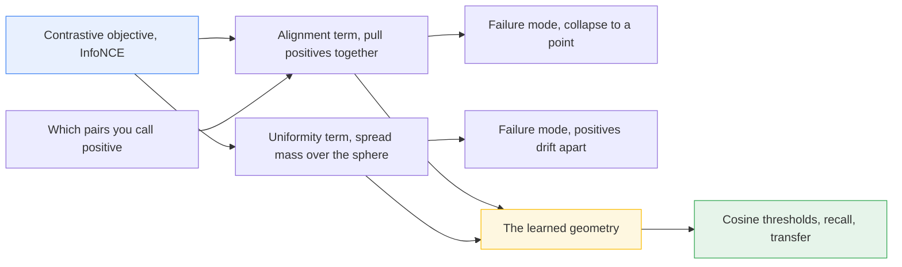
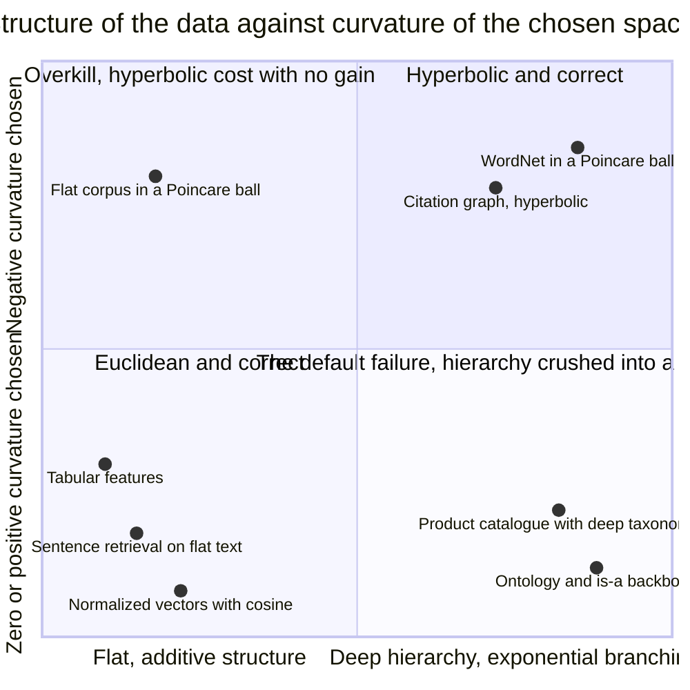
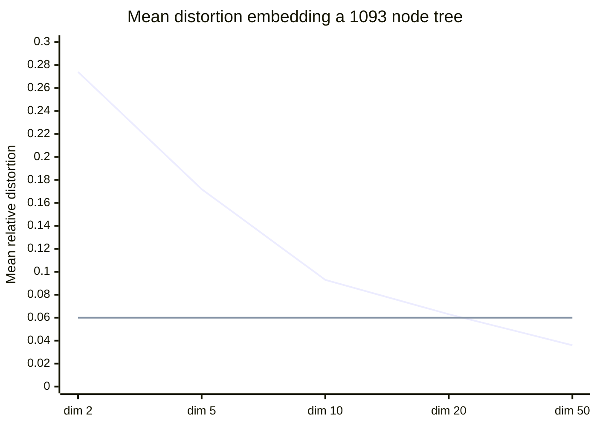
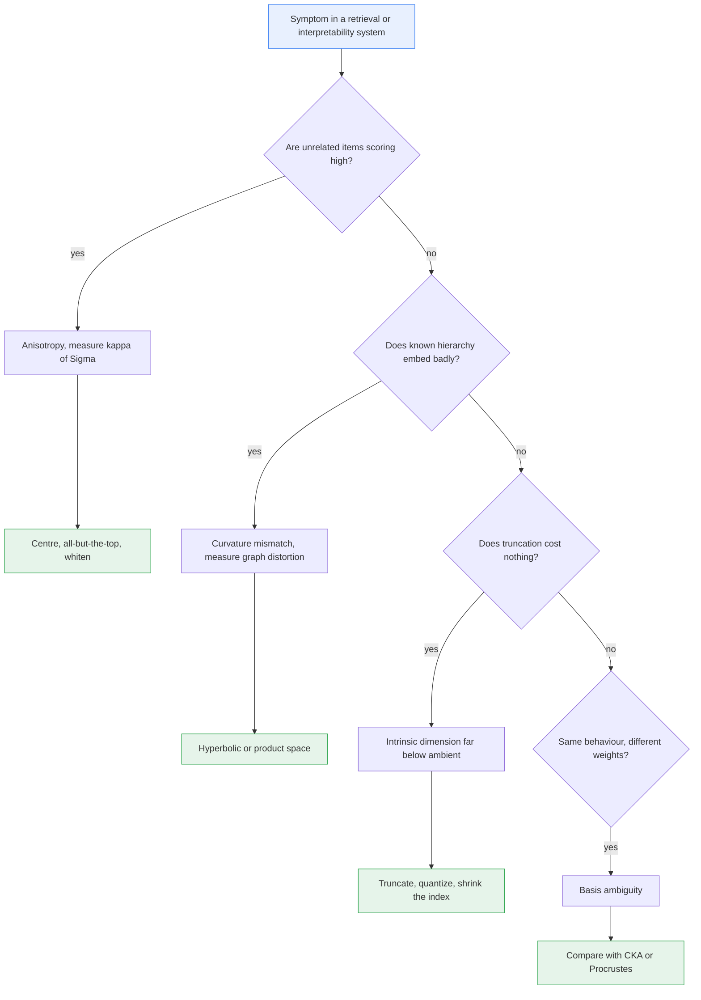

# The Representation Has a Shape

*This closes **The Shape of a Problem**, the prologue to **Why Learning Works: The Theorems Behind Machine Learning**. The first post read the geometry of the objective, the second the geometry of the data. This one reads the geometry of the thing the model builds in between -- the learned space -- and finds that the same three operations govern it, except that here one of them is a choice you have been making by default.*

---

## The Measurement That Should Not Happen

*The Distribution Has a Shape* proved a clean result about high dimension. Draw two independent uniform unit vectors in $\mathbb{R}^d$. Then $\mathbb{E}[(u^\top v)^2] = 1/d$, so a typical cosine is about $1/\sqrt{d}$ -- roughly $0.036$ at $d = 768$, and vanishing as $d$ grows. Random directions are nearly orthogonal. That is not a heuristic; it is a computation you can do in two lines.

Now run it on a real encoder. Take a few thousand sentences with nothing in common -- product reviews, changelogs, recipes -- embed them, and take the mean pairwise cosine. It does not come back at $0.036$. Ethayarajh's layer-by-layer measurements of ELMo, BERT and GPT-2 found the average cosine between *uniformly randomly sampled words* far above zero in every layer of every model, reaching close to $0.99$ in GPT-2's final layer. Sentence encoders are less extreme, but a mean pairwise cosine of $0.4$ to $0.8$ over unrelated text is unremarkable.

Either the theorem is wrong, or the embeddings are not what you assumed.

The theorem is fine. The embeddings are not uniform on the sphere. They occupy a **narrow cone**: a shared mean offset plus a handful of directions that carry an outsized share of the variance. Every cosine you compute is dominated by the part all the vectors have in common.

```python
"""The measurement that should not happen: isotropic theory vs a real embedding cloud."""

import numpy as np

rng = np.random.default_rng(20260908)
n, d = 4000, 768


def mean_cosine(X):
    """Mean off-diagonal pairwise cosine of the rows of X."""
    U = X / np.linalg.norm(X, axis=1, keepdims=True)
    G = U @ U.T
    off = ~np.eye(len(U), dtype=bool)
    return G[off].mean(), G[off].std()


# (a) What The Distribution Has a Shape predicts: isotropic, mean-zero directions.
isotropic = rng.normal(size=(n, d))

# (b) What an encoder actually produces: a common mean offset plus a few
#     rogue directions carrying most of the variance -- a narrow cone.
scale = np.ones(d)
scale[:3] = [12.0, 8.0, 5.0]                 # rogue dimensions
common = rng.normal(size=d) * 1.35           # shared mean vector
cone = common + rng.normal(size=(n, d)) * scale

for name, X in [("isotropic Gaussian", isotropic), ("anisotropic encoder", cone)]:
    m, s = mean_cosine(X)
    ev = np.linalg.eigvalsh(np.cov(X, rowvar=False))
    print(f"{name:<22} mean cos {m:+.4f}   sd {s:.4f}   "
          f"kappa(Sigma) {ev[-1] / ev[0]:9.1f}   "
          f"top-3 var share {ev[-3:].sum() / ev.sum():.3f}")

print(f"\ntheory says mean |cos| is about 1/sqrt(d) = {1 / np.sqrt(d):.4f}")
```

```text
isotropic Gaussian     mean cos +0.0000   sd 0.0361   kappa(Sigma)       6.4   top-3 var share 0.008
anisotropic encoder    mean cos +0.5730   sd 0.0750   kappa(Sigma)     449.6   top-3 var share 0.234

theory says mean |cos| is about 1/sqrt(d) = 0.0361
```

Two clouds in the same $768$ dimensions. The first behaves exactly as the theorem says. The second reports a mean cosine of $0.57$ with a standard deviation of $0.075$: the *entire* usable range of your similarity scores is a narrow band sitting on top of a constant. Set a retrieval threshold at $0.75$ and you are not measuring semantics. You are measuring how far up the cone a document happens to sit.

The rest of this post is the repair, and it runs on the trilogy's three operations. **Projection** removes the cone. A **quadratic form** -- the covariance again, with the same condition number -- says how badly the space is deformed and how to undo it. And **curvature**, which the first two posts read off a loss surface and a divergence, turns out here to be a property of the space itself, one you have been choosing by default and almost certainly choosing wrong.

---

## Anisotropy: The Narrow Cone

The phenomenon has a name and a mechanism. Gao and co-authors called it the **representation degeneration problem**: in models trained with likelihood maximisation and weight tying, learnt word embeddings drift into a narrow cone, which limits their representational power. Their analysis pins the cause on token frequency. For a rare token, the gradient from the very many contexts where it does *not* appear dominates the few where it does, and that pressure pushes rare embeddings toward a common direction. The result is a shared component with nothing to do with meaning.

A second effect compounds it: a small number of coordinates with enormous variance. A dot product is a sum over coordinates, so three dimensions with variance $100\times$ the rest contribute most of the sum, and the remaining $765$ dimensions of carefully learned distinctions arrive as a rounding error. Ethayarajh's conclusion was that anisotropy is not a defect of one checkpoint but an inherent consequence of contextualisation.

The repairs are geometric moves you already know.

**Mean-centring** subtracts the shared offset. It is a projection — remove the component along the constant direction, exactly as least squares removes the component of $y$ along a column — and it sends the mean cosine to zero by construction.

**All-but-the-top** (Mu and Viswanath) removes the mean *and* the top few principal components: projection onto the orthogonal complement of the dominant subspace, which is the "rogue dimensions" fix stated in linear algebra.

**Whitening** goes all the way: rotate into the eigenbasis of $\Sigma$ and rescale every direction to unit variance, $W = \Sigma^{-1/2}$. This is precisely the Mahalanobis move from *The Distribution Has a Shape* — Euclidean distance after changing the metric so the covariance is the identity — applied to a learned space instead of a data distribution.

And that gives the sentence this section exists for: **making an embedding space isotropic is reducing $\kappa(\Sigma)$.** The same condition number that measured multicollinearity in a design matrix and the aspect ratio of a covariance ellipsoid measures the narrowness of the cone. Whitening drives it to $1$ by definition.

```python
"""Three geometric repairs on the same cone: centring, all-but-the-top, whitening."""

import numpy as np

rng = np.random.default_rng(20260908)
n, d = 4000, 768

scale = np.ones(d)
scale[:3] = [12.0, 8.0, 5.0]
X = rng.normal(size=d) * 1.35 + rng.normal(size=(n, d)) * scale


def report(name, Z):
    U = Z / np.linalg.norm(Z, axis=1, keepdims=True)
    off = (U @ U.T)[~np.eye(n, dtype=bool)]
    ev = np.linalg.eigvalsh(np.cov(Z, rowvar=False))
    ev = ev[ev > ev[-1] * 1e-8]                          # ignore killed directions
    print(f"{name:<28}{off.mean():>+9.4f}{np.percentile(off, 99):>+10.4f}"
          f"{ev[-1] / ev[0]:>14.1f}")


Xc = X - X.mean(axis=0)                                  # mean-centring

_, _, Vt = np.linalg.svd(Xc, full_matrices=False)        # all-but-the-top, k = 3
Xabtt = Xc - (Xc @ Vt[:3].T) @ Vt[:3]

lam, V = np.linalg.eigh(np.cov(Xc, rowvar=False))        # whitening: kappa -> 1
Xw = Xc @ V @ np.diag(np.clip(lam, 1e-8, None) ** -0.5) @ V.T

print(f"{'representation':<28}{'mean cos':>9}{'p99 cos':>10}{'kappa(Sigma)':>14}")
for name, Z in [("raw", X), ("centred", Xc),
                ("centred + all-but-top-3", Xabtt), ("whitened", Xw)]:
    report(name, Z)
```

```text
representation               mean cos   p99 cos  kappa(Sigma)
raw                           +0.5807   +0.6921         445.1
centred                       -0.0002   +0.3508         445.1
centred + all-but-top-3       -0.0002   +0.0838           6.3
whitened                      -0.0002   +0.0752           1.0
```

Read the `p99 cos` column, not the mean. Centring alone zeroes the mean while leaving $\kappa$ untouched at $445$ and the 99th percentile at $0.35$: the cone is re-centred, not removed, and unrelated pairs still score high. Removing three principal components collapses $\kappa$ to $6.3$ and the tail to $0.084$; whitening finishes at $\kappa = 1$ and $0.075$, the isotropic baseline theory demanded in the first place.

Now the honest part, because this is where geometry runs ahead of evidence. It is *not* settled that anisotropy meaningfully degrades downstream tasks. Ait-Saada and Nadif, testing text clustering directly, found high anisotropy compatible with high-quality clustering and no reliable link between isotropy and performance, and later work adds evidence in the same direction across more tasks. The defensible claim is narrower and still useful: anisotropy makes **the numerical value of a cosine uninterpretable and non-portable**. The *ranking* within one query may survive; the *score* does not.

---

## The Loss Sculpts the Geometry: Alignment and Uniformity

If the shape is wrong, ask what put it there. For contrastive encoders the answer is unusually explicit.

Wang and Isola decomposed the contrastive objective into two geometric forces on the unit hypersphere. Given an encoder $f$ mapping to $\mathcal{S}^{d-1}$, a distribution $p_{\text{pos}}$ over positive pairs and $p_{\text{data}}$ over single examples:

$$
\mathcal{L}_{\text{align}} \;=\; \mathbb{E}_{(x, y) \sim p_{\text{pos}}}\Big[\, \big\| f(x) - f(y) \big\|_2^{\alpha} \,\Big],
$$

$$
\mathcal{L}_{\text{uniform}} \;=\; \log\, \mathbb{E}_{x, y \sim p_{\text{data}}}\Big[\, e^{-t\,\| f(x) - f(y) \|_2^2} \,\Big],
$$

with $\alpha = 2$ and $t = 2$ in their experiments. **Alignment** pulls positive pairs together: two views of the same thing should land at the same point. **Uniformity** is the log of an average Gaussian potential between all pairs — a repulsive energy that is minimised, over Borel probability measures on the sphere, exactly by the uniform distribution. Their result is that as the number of negatives grows, the InfoNCE objective is asymptotically these two terms, and that optimising them directly matches or beats contrastive training downstream.

Look at what that is. A loss function has been rewritten as a **shape specification**: put the positives on top of each other, spread the rest evenly over a sphere. *The Objective Has a Shape* argued that a norm is a preference and a loss is a surface. Contrastive learning is where that stops being a reading and becomes literal, because the optimum is characterised not as a parameter value but as a *distribution on a manifold*.

Two consequences follow. The uniformity term is an explicit anti-anisotropy force, which is why contrastively trained sentence encoders have rounder spaces than encoders trained by likelihood maximisation alone, and why post-hoc whitening buys less on top of them. And the forces trade off: crank alignment and everything collapses to a point; crank uniformity and positives stop being close.

It also explains a fact that surprises people who ship retrieval. Fine-tuning an embedding model on a few thousand in-domain pairs routinely moves recall more than swapping in a larger encoder. Swapping the encoder changes capacity. Fine-tuning changes **which pairs are declared positive**, which by the decomposition above is a direct edit to the geometry. You are not adding representational power. You are re-sculpting a space you already had.



---

## Intrinsic Dimension: How Many of the 1536 Are Real

Your vectors have $1536$ coordinates. That is the **ambient dimension**, and it is an implementation detail. The **intrinsic dimension** is the dimension of the manifold the points actually lie on, and it is usually far smaller.

Two estimators are worth knowing by name, both built on nearest-neighbour distances. **Levina and Bickel's maximum-likelihood estimator** models points in a small ball as a Poisson process on a $d$-dimensional manifold and reads $d$ off the likelihood of the first $k$ neighbour distances. **Facco and co-authors' two-NN estimator** uses only the two nearest neighbours: for uniformly sampled points, the ratio $\mu = r_2/r_1$ has the exact distribution $F(\mu) = 1 - \mu^{-d}$, so plotting $-\log(1 - F)$ against $\log \mu$ and taking the slope through the origin returns $d$. Using only the two smallest distances is the point — the smaller the neighbourhood, the closer it is to flat, which makes the estimator robust to curvature and to density variation.

```python
"""How many of the 256 are real? Two intrinsic-dimension estimators, and their bias."""

import numpy as np
from sklearn.neighbors import NearestNeighbors

rng = np.random.default_rng(7)


def two_nn(X, discard=0.1):
    """Facco et al.: mu = r2/r1 has CDF 1 - mu^-d, so a log-log slope gives d."""
    r = NearestNeighbors(n_neighbors=3).fit(X).kneighbors(X)[0]
    mu = np.sort(r[:, 2] / np.maximum(r[:, 1], 1e-12))[: int(len(X) * (1 - discard))]
    F = np.arange(1, len(mu) + 1) / (len(mu) + 1)        # the heavy tail is trimmed
    x, y = np.log(mu), -np.log1p(-F)
    return float(x @ y / (x @ x))                        # slope through the origin


def levina_bickel(X, k=10):
    """MLE from the first k neighbour distances, inverses averaged then inverted."""
    r = NearestNeighbors(n_neighbors=k + 1).fit(X).kneighbors(X)[0][:, 1:]
    lg = np.log(np.maximum(r[:, -1:], 1e-12)) - np.log(np.maximum(r[:, :-1], 1e-12))
    return float(1.0 / np.mean(lg.sum(axis=1) / (k - 1)))


def cloud(n, true_d, ambient=256):  # a curved latent manifold, rotated into `ambient`
    z = rng.uniform(-1.0, 1.0, size=(n, true_d))
    z = np.hstack([z, np.sin(3 * z[:, :1]), z[:, :1] * z[:, 1:2]])   # curvature
    return z @ (rng.normal(size=(z.shape[1], ambient)) / np.sqrt(ambient))


print(f"{'n':>7}{'true ID':>9}{'two-NN':>9}{'MLE k=10':>10}")
for n, true_d in [(200, 10), (1000, 10), (4000, 10), (16000, 10),
                  (16000, 2), (16000, 5), (16000, 20), (16000, 40)]:
    X = cloud(n, true_d)
    print(f"{n:>7}{true_d:>9}{two_nn(X):>9.2f}{levina_bickel(X):>10.2f}")
```

```text
      n  true ID   two-NN  MLE k=10
    200       10    12.34      7.89
   1000       10    12.51      8.04
   4000       10    12.99      8.61
  16000       10    12.99      8.82
  16000        2     2.87      1.99
  16000        5     6.89      4.73
  16000       20    23.39     15.53
  16000       40    40.19     25.98
```

Both estimators see a two-figure number where the ambient dimension is $256$: **the cloud is thin.** The caveats are visible in the same table. Both estimates *drift with sample size* — at $n = 200$ the MLE reports $7.9$ for a $10$-dimensional manifold and is still climbing at $n = 16{,}000$; small samples read low. And the two disagree by more than $50\%$ at true dimension $40$, where the MLE reports $26$ and two-NN reports $40$. Treat an intrinsic-dimension estimate as an order of magnitude, never as a number to plan capacity against.

The tie-back is exact. *The Objective Has a Shape* defined **effective rank**: a matrix with $n$ singular values but only a handful that are large behaves, numerically, as a matrix of that smaller rank. Intrinsic dimension is the same idea measured on a point cloud instead of on a matrix — how many directions the data genuinely varies along, as opposed to how many coordinates you allocated.

Which is why several practices that look like luck are licensed. Dimensionality reduction works because the extra ambient coordinates were carrying nothing. Product quantization works because the codebooks only have to cover a low-dimensional set. Truncating a matryoshka-style embedding from $1536$ to $256$ loses little because $256$ was already generous — with one honest distinction: matryoshka truncation works because the *training objective* front-loaded information into early coordinates, whereas PCA truncation works because of Eckart–Young. Both exploit the same thinness; only one gets it for free.

---

## Superposition: More Features Than Dimensions

Here is a fact that sounds impossible and is not. A model can represent far more features than it has dimensions.

The counting argument is the whole thing. Strict orthogonality in $\mathbb{R}^d$ buys you exactly $d$ directions. But relax "orthogonal" to "cosine below $\varepsilon$" and the count explodes. For two random unit vectors, $\mathbb{P}(|u^\top v| > \varepsilon) \le 2e^{-d\varepsilon^2/2}$, so the number of directions you can pack before any pair collides grows like $e^{c d \varepsilon^2}$ — exponential in $d$. This is the Johnson–Lindenstrauss lemma from *The Distribution Has a Shape* read backwards. JL says $k = O(\log m / \varepsilon^2)$ dimensions suffice to hold $m$ points at distortion $\varepsilon$; invert it and $m = e^{O(k\varepsilon^2)}$ points fit in $k$ dimensions. The lemma is normally quoted as a compression guarantee. It is equally a **packing** guarantee, and packing is what a network needs.

```python
"""Superposition's licence: how many almost-orthogonal directions fit in d dimensions."""

import numpy as np

rng = np.random.default_rng(31337)


def pack(d, tol, budget=300_000, block=2048):
    """Greedily keep random unit vectors whose cosine with all kept ones is under tol."""
    kept = np.zeros((0, d))
    for _ in range(budget // block):
        C = rng.normal(size=(block, d))
        C /= np.linalg.norm(C, axis=1, keepdims=True)
        for v in C:
            if kept.size == 0 or np.abs(kept @ v).max() < tol:
                kept = np.vstack([kept, v])
    return len(kept)


tol = 0.30
ds = [4, 8, 16, 24, 32, 40]
counts = [pack(d, tol) for d in ds]

print(f"tolerance on pairwise |cos| = {tol}\n")
print(f"{'d':>5}{'directions packed':>20}{'ratio to d':>12}")
for d, m in zip(ds, counts):
    print(f"{d:>5}{m:>20}{m / d:>12.1f}")

slope = np.polyfit(ds, np.log(counts), 1)[0]
print(f"\nlog(count) is linear in d with slope {slope:.3f}, so the count is "
      f"about exp({slope:.3f} d).")
print(f"tol^2 = {tol**2:.3f}. Extrapolated to d = 768: 1e{slope * 768 / np.log(10):.0f}.")
```

```text
tolerance on pairwise |cos| = 0.3

    d   directions packed  ratio to d
    4                   4         1.0
    8                   8         1.0
   16                  23         1.4
   24                  48         2.0
   32                  81         2.5
   40                 136         3.4

log(count) is linear in d with slope 0.096, so the count is about exp(0.096 d).
tol^2 = 0.090. Extrapolated to d = 768: 1e32.
```

The measured exponent is $0.096$ per dimension and $\varepsilon^2 = 0.09$: the bound's functional form falls out of a greedy random packing with no tuning, and at $d = 768$ the extrapolation is on the order of $10^{32}$ directions with pairwise cosine under $0.3$. A network tracking a hundred thousand features in a residual stream of width $768$ is not doing anything exotic. It is using the room.

**Superposition** is the hypothesis that this is what neural networks actually do: store more features than they have neurons by assigning them almost-orthogonal directions and eating the interference, which is affordable precisely because real features are sparse — most are off at any moment, so most of the interference never has to be paid. Elhage and co-authors' *Toy Models of Superposition* constructs models small enough to understand completely and shows the phenomenon appearing on cue as sparsity rises, along with structured geometric arrangements of the packed features.

Three claims follow, and it matters which kind each is. **Polysemanticity** is a measurement, not a hypothesis: individual neurons respond to unrelated concepts, which is what a basis-misaligned packing looks like read one coordinate at a time. **The linear representation hypothesis** — that features are *directions* in activation space rather than neurons — is a hypothesis with substantial evidence, going back to the analogy arithmetic in *Embeddings: The Geometry of Meaning* and forward to probing and steering vectors. **Sparse autoencoders** are the attempted inverse: an overcomplete, sparsely activating dictionary trained to recover the packed directions, with real results and open problems — feature splitting, sensitivity to dictionary width and sparsity penalty, and the difficulty of showing a recovered feature is the model's and not the autoencoder's.

Say the honest thing plainly: superposition is a well-supported hypothesis with strong toy-model evidence and suggestive evidence at scale. It is **not** a theorem about production models. Johnson–Lindenstrauss is a theorem; that a given transformer exploits it in a given layer is an inference.

---

## Curvature: When Euclidean Space Is the Wrong Space

Everything so far assumed $\mathbb{R}^d$ with the ordinary inner product. That assumption is a modelling choice, it was made for you by the framework, and for a large class of data it is wrong in a way no amount of dimension can fix.

Take a tree with branching factor $b$. The number of nodes within graph distance $r$ of the root grows like $b^r$: **exponentially**. Now ask where those nodes are going to go in $\mathbb{R}^n$. A Euclidean ball of radius $r$ has volume proportional to $r^n$: **polynomial** in $r$, for any fixed $n$. Exponentially many points, polynomially much room. Something has to give, and what gives is distance — nodes that should be far apart get placed close, because there is nowhere else to put them.

This is not a tuning problem. It is a volume count, and it has a matching theorem: Bourgain showed that the least distortion with which a complete binary tree of height $h$ embeds into Hilbert space is of order $\sqrt{\log h}$, with no dependence on the target dimension whatsoever. Since $h \sim \log_2 n$, the distortion grows like $\sqrt{\log \log n}$ — slowly, but without bound, and adding dimensions does not help.

Hyperbolic space is the space where the counting works. In the hyperbolic plane, the area of a disk of radius $r$ is $2\pi(\cosh r - 1) \sim \pi e^{r}$: **exponential in the radius**, the same rate as the tree. A hierarchy is not being squeezed into hyperbolic space; it fits, because the room grows at the rate the data does. Nickel and Kiela's Poincaré embeddings exploit exactly this, and their WordNet noun-hierarchy reconstruction numbers are the cleanest statement of the gap: at $5$ dimensions, mean average precision of $0.823$ hyperbolic against $0.024$ Euclidean; even at $200$ Euclidean dimensions the figure only reaches $0.168$, and mean rank stays above $1{,}100$ against under $4$ for the Poincaré embedding at every dimension they tried.

```python
"""A branching tree in Euclidean space versus the Poincare disk, by distortion."""

import numpy as np
from scipy.sparse.csgraph import shortest_path

DEPTH, B = 6, 3
n = (B ** (DEPTH + 1) - 1) // (B - 1)
parent = [(i - 1) // B for i in range(n)]
depth, A = np.zeros(n, int), np.zeros((n, n))
for i in range(1, n):
    depth[i] = depth[parent[i]] + 1
    A[i, parent[i]] = A[parent[i], i] = 1.0
D = shortest_path(A, unweighted=True)                    # the tree metric
iu = np.triu_indices(n, 1)

def distortion(E):  # mean relative error over all pairs, after the best rescaling
    a, b = E[iu], D[iu]
    return np.abs((a @ b) / (a @ a) * a - b).mean() / b.mean()

d2 = D**2                                                # classical MDS
lam, V = np.linalg.eigh(-0.5 * (d2 - d2.mean(0) - d2.mean(1)[:, None] + d2.mean()))
print(f"tree: {n} nodes; {(lam < -1e-8).sum()} of {n} eigenvalues of the centred "
      "Gram matrix are negative -- not a Euclidean metric at any dimension\n")
print(f"{'space':<22}{'dim':>5}{'mean distortion':>18}")
for k in [2, 5, 10, 20, 50]:
    Y = V[:, -k:] * np.sqrt(np.clip(lam[-k:], 0, None))
    print(f"{'Euclidean, MDS':<22}{k:>5}"
          f"{distortion(np.linalg.norm(Y[:, None] - Y[None], axis=-1)):>18.3f}")

theta, span = np.zeros(n), np.full(n, 2 * np.pi)         # angular sector per subtree
for i in range(1, n):
    p, j = parent[i], i - B * parent[i] - 1              # parent, index among siblings
    span[i] = span[p] / B
    theta[i] = theta[p] - span[p] / 2 + (j + 0.5) * span[i]
r = np.tanh(1.25 * depth / 2)                            # hyperbolic radius -> disk
P = np.stack([r * np.cos(theta), r * np.sin(theta)], axis=1)
sq, nm = np.sum((P[:, None] - P[None]) ** 2, axis=-1), 1 - np.sum(P**2, axis=1)
print(f"{'Poincare disk':<22}{2:>5}"
      f"{distortion(np.arccosh(1 + 2 * sq / np.outer(nm, nm))):>18.3f}")
```

```text
tree: 1093 nodes; 364 of 1093 eigenvalues of the centred Gram matrix are negative -- not a Euclidean metric at any dimension

space                   dim   mean distortion
Euclidean, MDS            2             0.274
Euclidean, MDS            5             0.172
Euclidean, MDS           10             0.093
Euclidean, MDS           20             0.063
Euclidean, MDS           50             0.036
Poincare disk             2             0.060
```

The first line of output is the impossibility itself: $364$ of the centred Gram matrix's eigenvalues are negative, so the tree metric is not the distance matrix of *any* Euclidean point set, in any dimension. Everything below is damage control. Two hyperbolic dimensions, with an embedding constructed by hand in six lines, match twenty Euclidean dimensions found by optimal classical scaling. Grow the tree and the gap widens: repeat this with $511$ nodes instead of $1{,}093$ and the Euclidean-2 distortion falls only from $0.274$ to $0.281$ while the Poincaré figure improves.

The generalisation is the useful part. Curvature is a knob with three settings, and the sign is a modelling decision:

- **Negative curvature (hyperbolic)** for anything tree-like or scale-free: taxonomies, org charts, file systems, ontologies, citation graphs, the "is-a" backbone of a knowledge base.
- **Zero curvature (Euclidean)** for genuinely flat, additive structure — the default, and correct more often than the previous bullet suggests.
- **Positive curvature (spherical)** for directional data where only angle carries information. Note that $\ell_2$-normalising your embeddings and using cosine similarity *is already* choosing a sphere; most retrieval stacks are doing spherical geometry and calling it Euclidean.
- **Products of spaces** for mixed structure — a hyperbolic factor for the hierarchy and a Euclidean factor for the attributes hanging off it, with each part measured in the geometry that fits it.



And now close the loop on the trilogy. *The Objective Has a Shape* read curvature off a Hessian: the local shape of a loss surface, which you observe and precondition against. *The Distribution Has a Shape* read curvature off the Fisher information: the local shape of a divergence, which the data hands you. Here, curvature is a property of **the space itself** — not inherited from an objective or a distribution but *selected*, and selected by default to be zero every time anyone types `float32[1536]`.



---

## Comparing Two Spaces

Two checkpoints, two architectures, two training runs: *did they learn the same representation?* That sounds like a vibe. It is a falsifiable claim, and what makes it falsifiable is naming the transformations you are willing to ignore.

**Orthogonal Procrustes.** Given two matrices $X, Y \in \mathbb{R}^{n \times d}$ of representations for the same $n$ inputs, solve

$$
\min_{R^\top R = I} \; \big\| XR - Y \big\|_F,
$$

whose solution is $R = UV^\top$ from the SVD $X^\top Y = U\Sigma V^\top$; the residual is your dissimilarity. The assumption is explicit: representations are defined up to rotation and reflection, so a basis change is not a difference — but scale is, unless you normalise first, and different widths kill the comparison outright.

**Centered kernel alignment.** Kornblith and co-authors introduced CKA precisely because the alternatives failed a basic test. With centred Gram matrices $K = XX^\top$ and $L = YY^\top$,

$$
\mathrm{CKA}(K, L) \;=\; \frac{\mathrm{HSIC}(K, L)}{\sqrt{\mathrm{HSIC}(K,K)\,\mathrm{HSIC}(L,L)}},
$$

which compares *similarity structure between examples* rather than coordinates. It is invariant to orthogonal transformation and to isotropic scaling, and — critically — it works between representations of different widths. Their headline evidence was that CCA and its variants could not identify corresponding layers of identical networks trained from different seeds, while CKA could.

The caveat is not optional. Ding, Denain and Steinhardt grounded these measures with sensitivity and specificity tests and found that similarity indices *disagree with each other on basic questions* — including whether networks differing only in initialisation learn similar representations — with answers depending on preprocessing and on which components dominate the spectrum. A similarity index is a measurement instrument with its own biases, not a verdict.

Which brings us to the strongest version of the claim. Huh and co-authors' **Platonic Representation Hypothesis** proposes that representations across models, architectures, objectives and even modalities are *converging* toward a shared statistical model of the underlying world, with alignment increasing with scale. Their paper is explicitly a position, with counterexamples acknowledged — and it inherits the caveat above, since subsequent work argues the similarity measures used to demonstrate convergence are themselves confounded by model scale, so that much of the apparent convergence in global spectral measures weakens once calibrated for, while local neighbourhood agreement survives. Hold it as a hypothesis under active test.

---

## The Theorems and Results You Actually Need

Statement on the left, permission granted on the right — and the middle column says which kind of claim it is.

| Result | Kind | Statement, and what it licenses |
|---|---|---|
| **Johnson–Lindenstrauss** | Theorem | $k = O(\log m/\varepsilon^2)$ dimensions preserve all pairwise distances to $1 \pm \varepsilon$, independent of the source dimension. Read forward: random projection and sketching. Read backwards: $e^{O(k\varepsilon^2)}$ almost-orthogonal directions fit in $k$ dimensions, which is the packing budget superposition spends. |
| **Volume growth** | Theorem | A ball of radius $r$ has volume $\Theta(r^n)$ in $\mathbb{R}^n$ and $\Theta(e^r)$ in the hyperbolic plane, while a tree of branching factor $b$ has $\Theta(b^r)$ nodes within radius $r$. Licenses choosing negative curvature for hierarchy on a counting argument, before any experiment. |
| **Bourgain's tree bound** | Theorem | A complete binary tree of height $h$ embeds into Hilbert space with least distortion $\Theta(\sqrt{\log h})$, at any dimension. Licenses the claim that a hierarchy embedding badly in $\mathbb{R}^d$ is not a tuning failure. |
| **Eckart–Young–Mirsky** | Theorem | The truncated SVD is the optimal rank-$k$ approximation in Frobenius and spectral norm. Licenses PCA truncation, low-rank adapters, and the claim that discarding small singular directions is optimal, not merely convenient. |
| **Alignment–uniformity** | Theorem (asymptotic) | As negatives grow, the contrastive objective decomposes into $\mathcal{L}_{\text{align}}$ and $\mathcal{L}_{\text{uniform}}$, the latter minimised by the uniform distribution on the sphere. Licenses reading a loss as a shape specification, and optimising the two terms directly. |
| **Procrustes / CKA invariances** | Definitions with proofs | Procrustes is invariant to orthogonal transformation only; CKA additionally to isotropic scaling and to differing widths. Licenses a comparison *once you have stated the invariance* — and forbids comparing indices with different invariances. |
| **Superposition** | Hypothesis, strong toy evidence | Networks store more features than dimensions in almost-orthogonal directions, tolerating interference because features are sparse. Licenses expecting polysemantic neurons and motivating dictionary learning. Does not license claims about a specific production model. |
| **Linear representation** | Hypothesis, substantial evidence | Features are directions, not neurons. Licenses probing, steering vectors and vector arithmetic — as a working assumption that should be tested per model. |
| **Platonic representation** | Hypothesis, contested evidence | Representations converge across models and modalities toward a shared statistical model of reality. Licenses nothing operational yet; the measurement instruments are themselves under revision. |

---

## Reading the Shape: A Diagnostic Table

| Symptom | Geometric cause | What to measure | What to do |
|---|---|---|---|
| Every document scores $0.8$ against every query | Anisotropy: a shared mean and a few rogue directions dominate every dot product | Mean and p99 pairwise cosine on unrelated text; $\kappa(\Sigma)$; variance share of the top 3 eigenvalues | Mean-centre, then all-but-the-top or whitening. Judge cosines against the measured baseline, not against zero |
| A threshold tuned on one corpus is useless on another | The threshold encoded that corpus's cone offset, not a semantic boundary | The two corpora's mean cosines side by side | Calibrate per corpus, or score on a centred/whitened space where the baseline is stable. Prefer rank-based cutoffs to absolute ones |
| Retrieval collapses as the index grows | Distance concentration: relative variance of distances falling toward the Beyer condition | $D_{\max}/D_{\min}$ on sampled queries; intrinsic dimension of the corpus embeddings | Rerank; exploit structure rather than raw distance; check whether the corpus has become genuinely higher-dimensional |
| Parent and child embed far apart, unrelated siblings embed close | Curvature mismatch: exponential structure crushed into polynomial volume | Distortion of the known hierarchy's graph metric under the embedding; negative eigenvalues of the centred Gram matrix | Hyperbolic or product-space embedding for the hierarchy; or keep the graph and stop asking a flat space to encode it |
| Reducing $1536$ dimensions to $256$ loses nothing | Intrinsic dimension was already far below ambient; effective rank is small | Two-NN and MLE intrinsic dimension; the covariance spectrum's decay | Truncate deliberately and bank the index savings. Verify on your own queries; do not trust the estimator's exact value |
| Two checkpoints have very different weights and identical behaviour | Representation is defined up to a change of basis; weights are coordinates, behaviour is geometry | CKA between layers; orthogonal Procrustes residual if widths match | Compare representations, not parameters. State the invariance you assume before quoting a number |
| Individual neurons respond to unrelated concepts | Superposition: features packed in almost-orthogonal directions misaligned with the basis | Activation sparsity; dictionary-learning reconstruction quality | Analyse directions, not neurons. Treat recovered features as hypotheses to validate causally |
| Fine-tuning on a few thousand pairs beats a bigger encoder | The bottleneck was geometry, not capacity: which pairs count as positive is a shape specification | Alignment and uniformity of the space before and after; recall at the same threshold | Invest in pair curation before model size. Watch for collapse — track uniformity, not just alignment |



---

## The Trilogy, Closed

Three posts, three objects, one set of operations.

The **objective** is what you optimise. Project onto a column space; weigh the design matrix with a condition number; read the curvature off a Hessian. The **distribution** is where the data comes from. Project onto the space of measurable functions; weigh the cloud with a covariance and its condition number; read the curvature off the Fisher information. The **representation** is what the model builds in between. Project out the cone; weigh the learned space with the same covariance and the same condition number; read the curvature — except that this time you choose it.

The recurrence is not aesthetic. Those three operations are exactly what the three most basic objects in the stack let you compute. An **inner product** gives you projection and nothing else: nearest point in a subspace, orthogonality of a residual, all of least squares and conditional expectation and cone removal. A **quadratic form** gives you a metric: variance along a direction, Mahalanobis distance, the aspect ratio $\kappa$ that unifies slow convergence, unstable coefficients and uninterpretable cosines. A **second derivative** gives you curvature: the Hessian for a loss, the Fisher information for a divergence, the sign of the sectional curvature for a space. Everything else is assembled out of those three, which is why the same diagnostic reappears wearing different clothes.

The series that follows this prologue proves theorems: PAC learnability, VC dimension, kernels, boosting, the Bellman contraction, universal approximation. Every proof in it is an argument about a projection, a metric or a curvature. Knowing which one is running is most of what it takes to read the proof — and, when a system misbehaves in production, most of what it takes to know which of the three you got wrong.

---

## Going Deeper

**Books:**

- **Bronstein, M. M., Bruna, J., Cohen, T., & Veličković, P. (2021). *Geometric Deep Learning: Grids, Groups, Graphs, Geodesics, and Gauges.*** Available free at [geometricdeeplearning.com](https://geometricdeeplearning.com/).
  - The systematic case that architecture is a statement about the geometry of the data.
- **Lee, J. M. (2018). *Introduction to Riemannian Manifolds*, 2nd edition. Springer.**
  - Where curvature stops being an analogy; the constant-curvature model spaces are the background for hyperbolic embeddings.
- **Matoušek, J. (2002). *Lectures on Discrete Geometry*. Springer.**
  - Low-distortion metric embeddings: Johnson–Lindenstrauss, and the obstructions to embedding trees.
- **Deisenroth, M. P., Faisal, A. A., & Ong, C. S. (2020). *Mathematics for Machine Learning*. Cambridge University Press.** Free at [mml-book.github.io](https://mml-book.github.io/).
  - Inner products, projections and eigendecompositions at the level this post assumes.

**Academic Papers:**

- **Ethayarajh, K. (2019). ["How Contextual are Contextualized Word Representations? Comparing the Geometry of BERT, ELMo, and GPT-2 Embeddings."](https://arxiv.org/abs/1909.00512) *EMNLP-IJCNLP 2019*, 55–65.**
  - The measurements that start this post: anisotropy in every layer of every model tested.
- **Gao, J., He, D., Tan, X., Qin, T., Wang, L., & Liu, T.-Y. (2019). ["Representation Degeneration Problem in Training Natural Language Generation Models."](https://arxiv.org/abs/1907.12009) *ICLR 2019*.**
  - The mechanism: likelihood maximisation with weight tying pushes rare-token embeddings into a shared narrow cone.
- **Mu, J., & Viswanath, P. (2018). ["All-but-the-Top: Simple and Effective Postprocessing for Word Representations."](https://arxiv.org/abs/1702.01417) *ICLR 2018*.**
  - Remove the mean and the top principal components: two lines of numpy, and the clearest case of a projection as a repair.
- **Ait-Saada, M., & Nadif, M. (2023). ["Is Anisotropy Truly Harmful? A Case Study on Text Clustering."](https://aclanthology.org/2023.acl-short.103/) *ACL 2023 (Short Papers)*, 1194–1203.**
  - The counter-evidence. Read it before writing an isotropy step into a pipeline.
- **Wang, T., & Isola, P. (2020). ["Understanding Contrastive Representation Learning through Alignment and Uniformity on the Hypersphere."](https://arxiv.org/abs/2005.10242) *ICML 2020*, 9929–9939.**
  - The decomposition that turns a loss into a shape specification.
- **Facco, E., d'Errico, M., Rodriguez, A., & Laio, A. (2017). ["Estimating the Intrinsic Dimension of Datasets by a Minimal Neighborhood Information."](https://www.nature.com/articles/s41598-017-11873-y) *Scientific Reports*, 7, 12140.**
  - The two-NN estimator and its exact $F(\mu) = 1 - \mu^{-d}$ derivation.
- **Levina, E., & Bickel, P. J. (2004). ["Maximum Likelihood Estimation of Intrinsic Dimension."](https://www.stat.berkeley.edu/~bickel/mldim.pdf) *NIPS 17*.**
  - The other estimator, and the source of the downward bias visible in this post's table.
- **Elhage, N., Hume, T., Olsson, C., et al. (2022). ["Toy Models of Superposition."](https://transformer-circuits.pub/2022/toy_model/index.html) *Transformer Circuits Thread* (also [arXiv:2209.10652](https://arxiv.org/abs/2209.10652)).**
  - Models small enough to understand completely, where superposition appears as sparsity rises.
- **Nickel, M., & Kiela, D. (2017). ["Poincaré Embeddings for Learning Hierarchical Representations."](https://arxiv.org/abs/1705.08039) *NIPS 30*.**
  - Five hyperbolic dimensions against two hundred Euclidean ones, on WordNet.
- **Kornblith, S., Norouzi, M., Lee, H., & Hinton, G. (2019). ["Similarity of Neural Network Representations Revisited."](https://arxiv.org/abs/1905.00414) *ICML 2019*.**
  - CKA, its invariances, and why the earlier CCA-based indices failed the seed test.
- **Ding, F., Denain, J.-S., & Steinhardt, J. (2021). ["Grounding Representation Similarity Through Statistical Testing."](https://arxiv.org/abs/2108.01661) *NeurIPS 2021*.**
  - The critique: similarity indices disagree on basic questions and depend on preprocessing.
- **Huh, M., Cheung, B., Wang, T., & Isola, P. (2024). ["The Platonic Representation Hypothesis."](https://arxiv.org/abs/2405.07987) *ICML 2024 (Position)*.**
  - The strong form of the convergence claim, with its counterexamples stated.

**Online Resources:**

- [Transformer Circuits Thread](https://transformer-circuits.pub/) — Where superposition, features and dictionary learning are developed, with interactive figures.
- [Hyperbolic Deep Learning](http://hyperbolicdeeplearning.com/) — A curated index of hyperbolic representation-learning work, with the geometry primers first.
- [scikit-learn: Random Projection](https://scikit-learn.org/stable/modules/random_projection.html) — The Johnson–Lindenstrauss bound as an API, including `johnson_lindenstrauss_min_dim`.
- [Alignment and Uniformity project page](https://www.tongzhouwang.info/hypersphere/) — Wang and Isola's own page, with visualisations of both forces and reference code.

**Videos:**

- [A Walkthrough of Toy Models of Superposition](https://www.youtube.com/watch?v=R3nbXgMnVqQ) by Neel Nanda with Jess Smith — Builds the intuition for why sparsity buys you superposition.
- [Hyperbolic Embeddings Tutorial (DiffGeo4DL, NeurIPS 2020)](https://www.youtube.com/watch?v=MdPk3qD4Wig) — Hyperbolic embeddings and their machine learning applications, from the differential geometry workshop.
- [Stanford CS224W, Lecture 19.2: Hyperbolic Graph Embeddings](https://www.youtube.com/watch?v=m2zoddmgvd0) — The volume-growth argument and hyperbolic graph neural networks, in a graph-learning course.

**Questions to Explore:**

- Anisotropy makes cosine values non-portable but may not hurt ranking. Is there a corpus-independent similarity statistic — a cosine calibrated against the measured cone — that transfers across corpora the way a raw cosine does not?
- Superposition says a model tolerates interference because features are sparse. Could the sparsity of a layer's features be estimated from its activations alone, and would that predict how many dictionary elements a sparse autoencoder needs?
- The sign of the curvature is a modelling choice. Could it be *learned* — a trainable curvature parameter per factor in a product space — and would the learned sign agree with what the data's volume growth says it should be?
- The trilogy claims projection, quadratic form and curvature exhaust the geometry that matters. What is the first machine learning phenomenon that is genuinely none of the three?
