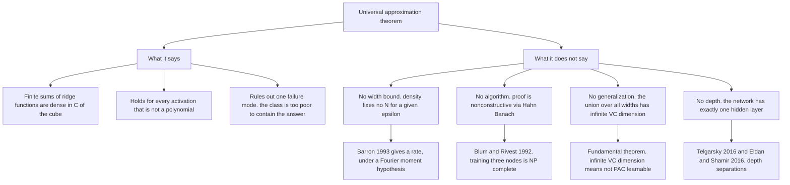
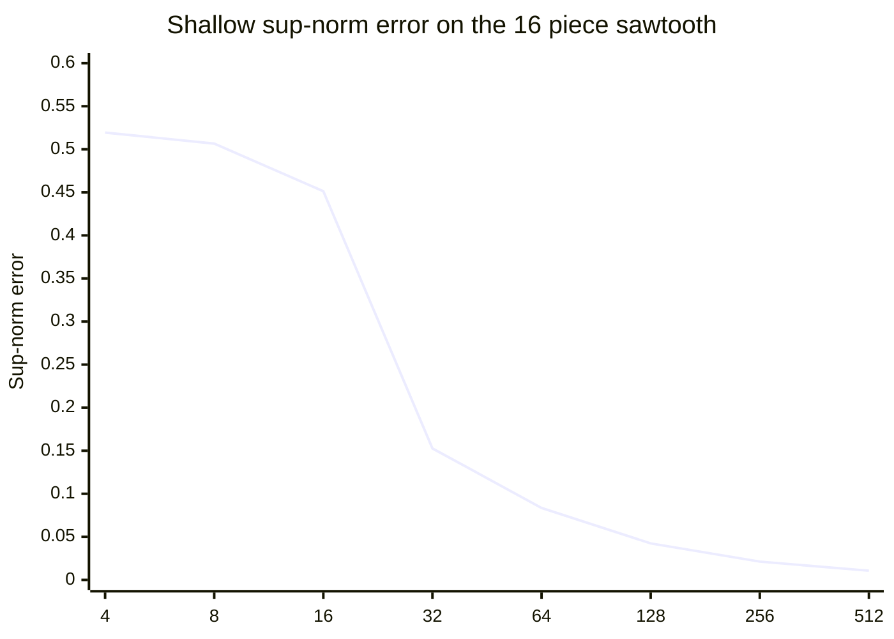

# Universal Approximation, and What It Does Not Give You

*Part of "Why Learning Works: The Theorems Behind Machine Learning." The series so far has been about guarantees: when a class is learnable, what its capacity costs, and why no assumption-free learner exists. This post opens the closing block on deep learning, and it opens it by taking away the result everyone reaches for first.*

---

## The Most Over-Quoted Theorem in Machine Learning

"A neural network can approximate any function." You have read that sentence in a textbook, heard it in an interview, and seen it deployed to end an argument about architecture choice. It is true. It is also, as ordinarily used, close to content-free.

Here is what it actually asserts. Fix a compact set. Fix a continuous target $f$ on it. Fix a tolerance $\varepsilon > 0$. Then there **exists** a one-hidden-layer network agreeing with $f$ to within $\varepsilon$ everywhere on that set. That is all. The statement is an existence claim about a limit point in a function space. It carries:

- no bound on how many hidden units the network needs;
- no algorithm for finding its weights, and no mention of gradient descent;
- no sample, no distribution, and therefore no claim about unseen data;
- no reference to depth, since the network in question has exactly one hidden layer.

Strip those four away and what is left is a topological fact: a particular set of functions is dense in a particular Banach space. Density is a strong property and a cheap one. Polynomials are dense in $C([0,1])$ too, by Weierstrass, and nobody concludes from that that polynomial regression is the answer to computer vision.

So this post does three things. It states the theorem in the form its authors proved it, including the sharper "if and only if" that most retellings drop. It gives the architecture of the proof and says plainly where the analytic weight sits, without pretending to prove it here. And then it spends most of its length on the four missing pieces, because every interesting question about deep learning lives in the gap the theorem leaves.

---

## The Theorem, Stated Properly

Write $I_n = [0,1]^n$ for the unit hypercube and $C(I_n)$ for the continuous real functions on it, normed by

$$
\|f\|_\infty = \sup_{x \in I_n} |f(x)|.
$$

Two definitions carry the entire statement, and both are routinely garbled in summaries.

**Definition (dense).** A subset $A$ of a normed space $X$ is *dense* in $X$ if its closure is $X$: for every $f \in X$ and every $\varepsilon > 0$ there exists $g \in A$ with $\|f - g\| < \varepsilon$.

Read the quantifiers in order. The target comes first, the tolerance second, and only then the approximant. So $g$ is allowed to depend on both $f$ and $\varepsilon$ in an arbitrary way, and nothing in the definition constrains any property of $g$ — its size, its complexity, its norm. Density is precisely the statement that the infimum of the error is zero. It says nothing about the cost of driving the error down.

**Definition (sigmoidal).** A function $\sigma : \mathbb{R} \to \mathbb{R}$ is *sigmoidal* if

$$
\sigma(t) \longrightarrow 1 \;\text{ as } t \to +\infty,
\qquad
\sigma(t) \longrightarrow 0 \;\text{ as } t \to -\infty.
$$

Note what is *not* required: monotonicity, continuity, or any particular shape between the limits.

**Definition (discriminatory).** Let $M(I_n)$ be the space of finite signed regular Borel measures on $I_n$. A function $\sigma$ is *discriminatory* if, for $\mu \in M(I_n)$,

$$
\int_{I_n} \sigma(y^\top x + \theta)\, d\mu(x) = 0
\quad \text{for all } y \in \mathbb{R}^n,\ \theta \in \mathbb{R}
\;\;\Longrightarrow\;\; \mu = 0.
$$

In words: the family of ridge functions $x \mapsto \sigma(y^\top x + \theta)$, as $y$ and $\theta$ range over everything, is rich enough that no nonzero measure can be orthogonal to all of it at once. This is the hypothesis that does the real work, and it is an analytic condition on $\sigma$, not a structural one on the network.

With those in place:

> **Theorem 1 (Cybenko, 1989).** Let $\sigma$ be any continuous discriminatory function. Then finite sums of the form
> $$
> G(x) = \sum_{j=1}^{N} \alpha_j \,\sigma\!\left(y_j^\top x + \theta_j\right),
> \qquad \alpha_j, \theta_j \in \mathbb{R},\; y_j \in \mathbb{R}^n,
> $$
> are dense in $C(I_n)$. That is, for every $f \in C(I_n)$ and every $\varepsilon > 0$ there is a $G$ of this form with $|G(x) - f(x)| < \varepsilon$ for all $x \in I_n$.

> **Lemma 1 (Cybenko, 1989).** Any bounded, measurable sigmoidal function is discriminatory. In particular, any continuous sigmoidal function is discriminatory.

Theorem 1 plus Lemma 1 is the universal approximation theorem as it is usually quoted: one hidden layer, a continuous sigmoidal activation, arbitrary width $N$, uniform approximation of any continuous function on the cube.

### The Sharper Version

Cybenko's theorem is sufficient, not necessary, and the necessary-and-sufficient statement arrived four years later. Two intermediate results matter.

Hornik (1991) removed the sigmoidal shape entirely: single-hidden-layer networks with an arbitrary **bounded and nonconstant** activation are universal approximators in $L^p(\mu)$ for finite measures $\mu$, and when the activation is additionally continuous, they approximate continuous functions uniformly on compacta. Boundedness excludes the ReLU, which is why the story does not end there.

> **Theorem 2 (Leshno, Lin, Pinkus and Schocken, 1993).** Let $\sigma : \mathbb{R} \to \mathbb{R}$ be locally bounded and piecewise continuous, with its set of discontinuity points of Lebesgue measure zero. Let
> $$
> \mathcal{N}_\sigma = \operatorname{span}\left\{\, x \mapsto \sigma(w^\top x + b) \;:\; w \in \mathbb{R}^n,\, b \in \mathbb{R} \,\right\}.
> $$
> Then $\mathcal{N}_\sigma$ is dense in $C(\mathbb{R}^n)$ in the topology of uniform convergence on compact sets **if and only if** $\sigma$ is not an algebraic polynomial (almost everywhere).

That "if and only if" is the version worth remembering, and it covers the ReLU, which is unbounded and not a polynomial. It also tells you the exact boundary of the phenomenon, and the "only if" half is a one-line observation you can verify yourself.

*Proof of the necessity direction.* Suppose $\sigma$ is a polynomial of degree $d$. For fixed $w, b$, the map $x \mapsto \sigma(w^\top x + b)$ is a polynomial in $x$ of total degree at most $d$. Hence every element of $\mathcal{N}_\sigma$, being a finite linear combination of such maps, lies in $P_d$, the space of polynomials in $n$ variables of degree at most $d$. But $P_d$ is finite-dimensional, so it is closed, and it is a proper subset of $C(\mathbb{R}^n)$. Therefore $\overline{\mathcal{N}_\sigma} \subseteq P_d \neq C(\mathbb{R}^n)$, and $\mathcal{N}_\sigma$ is not dense. $\blacksquare$

Universality fails on exactly one class of activations, and it fails for a reason that has nothing to do with neural networks: a polynomial activation collapses the whole architecture into a fixed finite-dimensional linear space, and widening the layer adds no new directions. Every other reasonable activation works. This is worth internalising, because it means the choice of activation is almost never an approximation-theoretic decision. Sigmoid, tanh, ReLU, GELU, SiLU, a hand-drawn squiggle — all universal, all equally so. Whatever separates them in practice is optimisation and conditioning, not expressive power.

---

## The Proof, and Where Its Weight Sits

What follows is the architecture of Cybenko's argument, not a proof: the analytic effort lives entirely in Lemma 1, which I state and do not prove. The full proof of both is in Cybenko's paper, four pages, and in Pinkus's *Acta Numerica* survey with the modern generalisations attached.

Let $S \subset C(I_n)$ be the set of finite sums $G$ above. $S$ is a linear subspace. Let $R = \overline{S}$ be its closure and suppose, for contradiction, that $R \neq C(I_n)$. Then $R$ is a *closed proper* subspace, and four moves finish it.

**Step one, Hahn-Banach.** A closed proper subspace of a normed space is not dense, so there is a point outside it at positive distance from it. Hahn-Banach separation then supplies a bounded linear functional $L$ on $C(I_n)$ with $L \neq 0$ and $L \equiv 0$ on $R$, hence on $S$. This is the move that makes the whole thing work and the move that makes it useless for computation: it hands you a functional whose existence is guaranteed and whose identity is unknown.

**Step two, Riesz representation.** Bounded linear functionals on $C(I_n)$ are exactly integration against finite signed regular Borel measures. So there is $\mu \in M(I_n)$, not the zero measure, with $L(h) = \int_{I_n} h \, d\mu$ for every $h \in C(I_n)$. The abstract obstruction has become a concrete object.

**Step three, apply it to the generators.** For every $y$ and $\theta$, the single-unit function $x \mapsto \sigma(y^\top x + \theta)$ is itself an element of $S$ (take $N = 1$, $\alpha_1 = 1$), so $L$ annihilates it:

$$
\int_{I_n} \sigma(y^\top x + \theta)\, d\mu(x) = 0
\qquad \text{for all } y \in \mathbb{R}^n,\ \theta \in \mathbb{R}.
$$

**Step four, discriminatory-ness.** The displayed condition is verbatim the hypothesis in the definition of *discriminatory*, so $\mu = 0$, so $L = 0$, contradicting step one. Hence no closed proper subspace containing $S$ exists, and $R = C(I_n)$. $\blacksquare$

Given Lemma 1, that is a complete argument, and it is short because all the difficulty has been packed into the lemma. Proving that a bounded measurable sigmoidal $\sigma$ is discriminatory is where Cybenko spends his effort: it requires showing that if all the ridge integrals vanish then $\mu$ annihilates every half-space, then invoking a Fourier-analytic argument to conclude $\mu = 0$. That is the mathematics. The Hahn-Banach shell around it is bookkeeping.

Two observations about this argument matter more than the argument.

**It is nonconstructive, irreducibly.** Hahn-Banach in this generality is equivalent to a weak form of the axiom of choice, and the proof proceeds entirely by contradiction: it shows that a proper closed subspace is impossible, never exhibiting a single approximating network. There is no $N$ anywhere in it, no recipe for the $\alpha_j$, no relation between $\varepsilon$ and anything. Reading a bound out of this proof is not merely hard; the proof contains no bound to read.

**Every hypothesis is about $\sigma$.** Look at what Lemma 1 assumes: bounded, measurable, sigmoidal. Nothing about the target, nothing about the data, nothing about the architecture beyond "one hidden layer, arbitrary width." The theorem is a statement about a function class. It could not possibly be a statement about learning, because learning is not mentioned.

---

## Four Things It Does Not Say

### No Width Bound

Density gives you a sequence $G_N \to f$; it does not tell you how far along the sequence you must walk. And "how far" is the only question an engineer has.

There is a real theorem here, and it is a *different* theorem with a hypothesis on the target. For $f : \mathbb{R}^n \to \mathbb{R}$ with Fourier representation $\tilde{f}$, define the first absolute moment of the Fourier magnitude distribution,

$$
C_f = \int_{\mathbb{R}^n} |\omega| \, \bigl|\tilde{f}(\omega)\bigr| \, d\omega,
$$

and call $f$ a *Barron function* when $C_f < \infty$.

> **Theorem 3 (Barron, 1993).** Let $f$ have $C_f < \infty$, let $B_r$ be the ball of radius $r$, and let $\mu$ be a probability measure on $B_r$. For every $N \geq 1$ there is a one-hidden-layer sigmoidal network $f_N$ with $N$ units such that
> $$
> \int_{B_r} \bigl(f(x) - f_N(x)\bigr)^2 \, d\mu(x) \;\leq\; \frac{(2 r C_f)^2}{N}.
> $$

An $L^2$ error of order $C_f / \sqrt{N}$, with **no dependence on the input dimension $n$** in the rate. That is a genuinely remarkable result, and it is the reason the "curse of dimensionality" discussion around neural networks is subtler than it looks. Barron's companion observation sharpens the contrast: a linear expansion in $N$ *fixed* basis functions cannot beat order $N^{-2/n}$ uniformly over the same smoothness class. Fitting the ridge directions $y_j$, rather than fixing a basis, is where the dimension-independence comes from.

But note the price. The bound is for targets in the Barron class, and it charges $C_f$, which can be astronomically large; it is an $L^2$ bound, not a sup-norm bound; and it says nothing about functions outside the class. Those functions exist and are not exotic — Section 5's depth-separation constructions are explicit continuous functions requiring width exponential in a parameter for any one-hidden-layer network to reach even a constant accuracy. Universal approximation covers them; universal approximation says only that you will need a lot of units, without saying how many.

### No Learning

The theorem asserts that a good network *is in the class*. It offers nothing about finding it, and the gap is not a technicality.

> **Theorem 4 (Blum and Rivest, 1992).** Training a three-node network of linear threshold units to fit a set of labelled examples exactly, when such a fit exists, is NP-complete.

Three nodes. Two hidden units and one output, the smallest nontrivial network anyone has ever drawn, and deciding whether weights exist that fit the data is already NP-complete. Their conclusion is the honest one: for any training algorithm for such a network, there are training sets on which it either runs for superpolynomial time or returns suboptimal weights.

Gradient descent appears nowhere in universal approximation and inherits no guarantee from it. In practice, gradient descent on overparameterised networks works far better than worst-case hardness suggests — that is a genuine and only partly explained phenomenon, and it is the subject of a different literature. What matters here is the logical point: the existence result and the optimisation result are independent. Neither implies the other, and quoting the first as if it addressed the second is a category error.

### No Generalization

This is the most consequential omission, and it connects directly to [the VC dimension post](https://juanlara18.github.io/portfolio/#/blog/vc-dimension-sauer-shelah) earlier in this series.

Approximation is a statement about a compact set with the target function *in hand*. Learning is a statement about a finite sample drawn from an unknown distribution. These are different problems, and richness that helps the first hurts the second — provably.

Let $\mathcal{H}_N$ be the class of binary classifiers obtained by thresholding a width-$N$ network at $\tfrac12$, and let $\mathcal{H}_\infty = \bigcup_{N \geq 1} \mathcal{H}_N$ be the union over all widths.

> **Proposition.** $\mathcal{H}_\infty$ has infinite VC dimension.

*Proof.* Fix any $m$ distinct points $x_1, \dots, x_m$ in the interior of $I_n$ and any labelling $b \in \{0,1\}^m$. Choose disjoint open balls $B_i \ni x_i$. By Urysohn's lemma there is a continuous $f : I_n \to [0,1]$ with $f(x_i) = b_i$ for each $i$, taking values in $\{0,1\}$ appropriately on the balls. By Theorem 1 there is a network $G$ with $\|G - f\|_\infty < \tfrac14$, so $|G(x_i) - b_i| < \tfrac14$ for every $i$, and thresholding $G$ at $\tfrac12$ recovers $b$ exactly. Every finite set is shattered, so no finite $d$ bounds the VC dimension. $\blacksquare$

Now put that beside the fundamental theorem of statistical learning from earlier in this series: a binary class is PAC learnable if and only if its VC dimension is finite. The conclusion is immediate and unwelcome.

**The property that makes the unrestricted class universal is the same property that makes it unlearnable.** Density and finite VC dimension are in direct opposition, and the proposition above shows the opposition is not a coincidence — the shattering construction *runs through* the approximation theorem.

The resolution is the resolution the whole series has been building toward. You never learn in $\mathcal{H}_\infty$. You learn in $\mathcal{H}_N$ for a finite $N$, whose VC dimension is finite, and you pay the usual decomposition: an approximation term that falls as $N$ grows and an estimation term that rises. Universal approximation controls only the first, and only in the limit. Read together, the two theorems say much less than people want them to: one guarantees the answer is somewhere in the class, the other charges you for how big the class had to be to contain it.

### No Depth

Cybenko's theorem, Hornik's theorem and the Leshno *et al.* characterisation are all statements about networks with **exactly one hidden layer**. Depth is not a hypothesis in any of them, and none of them improves when you add layers, because there is nothing to improve: the error already goes to zero.

So universal approximation cannot be the reason deep learning works. It is a theorem about shallow networks. If it were the whole story, the last decade of architecture research would have been a waste of time, and the sensible engineering choice would be one enormous hidden layer.



---

## Why Depth, Then: Separation Theorems

If not approximation power, what does depth buy? The honest answer, as far as theory goes, is *efficiency of representation on specific hard functions*, and there are two clean theorems saying so.

Telgarsky's construction is the more elementary and the more instructive. Define the **mirror map** on $[0,1]$,

$$
m(x) = \begin{cases} 2x & 0 \leq x \leq \tfrac12, \\ 2(1-x) & \tfrac12 < x \leq 1, \end{cases}
$$

a single triangular tooth. Two facts about it drive everything. First, it is computable by two ReLU units:

$$
m(x) = \operatorname{ReLU}\!\bigl(2\operatorname{ReLU}(x) - 4\operatorname{ReLU}(x - \tfrac12)\bigr),
$$

which you can check by cases. Second, composition **doubles** the number of teeth: $m^{\circ k}$, the $k$-fold composition, is a sawtooth with $2^k$ affine pieces on $[0,1]$, because each application folds the interval onto itself and every existing piece is replicated on both halves. So $2k$ layers of two units each produce $2^k$ oscillations. Depth multiplies; width adds.

That asymmetry is exactly what the lower bound formalises. Call $\sigma$ *$t$-sawtooth* if it is piecewise affine with at most $t$ pieces; the ReLU is $2$-sawtooth.

> **Lemma (Telgarsky).** If $\sigma$ is $t$-sawtooth, then every $f : \mathbb{R} \to \mathbb{R}$ computed by a network with activation $\sigma$, $m$ nodes per layer and $l$ layers is $(tm)^l$-sawtooth.

*Why it holds.* A sum of functions with $p$ and $q$ affine pieces has at most $p + q - 1$ pieces, so one layer of $m$ nodes multiplies the piece count by at most $tm$; and composing a $p$-piece function with a $q$-piece function yields at most $pq$ pieces, so $l$ layers multiply it $l$ times. The bound is $(tm)^l$: exponential in depth, only polynomial in width.

> **Theorem 5 (Telgarsky, 2015; COLT 2016).** For any positive integer $k$, any number of layers $l$ and any width $m$ with $m \leq 2^{(k-3)/l - 1}$, there is a set of $2^k$ labelled points in $[0,1] \times \{0,1\}$ on which some ReLU network with $2$ nodes in each of $2k$ layers achieves zero empirical risk, while every network with $m$ nodes per layer and $l$ layers has empirical risk at least $\tfrac16$.

The published COLT version states the same phenomenon at asymptotic scale: for every $k$ there are networks with $\Theta(k^3)$ layers, $\Theta(1)$ nodes per layer and $\Theta(1)$ distinct parameters that cannot be approximated by networks with $O(k)$ layers unless those have $\Omega(2^k)$ nodes. The result holds for the whole family of semi-algebraic gates — ReLU, maximum, indicator, piecewise polynomial — so it separates convolutional networks and boosted trees too, not just plain ReLU stacks.

Eldan and Shamir push the separation to its minimal form.

> **Theorem 6 (Eldan and Shamir, COLT 2016).** There is a (approximately radial) function on $\mathbb{R}^d$, expressible by a small three-layer network, that no two-layer network can approximate to better than a fixed constant accuracy unless its width is exponential in $d$.

Depth three versus depth two, an exponential gap, for essentially every activation in use including ReLU, sigmoid and threshold. One extra layer is worth exponentially many units.

Now the caveat, and it is not small. **These are existence results about specific engineered functions.** Telgarsky's sawtooth and Eldan and Shamir's radial bump were built to be hard for shallow networks; neither theorem says that the functions arising in vision, language or tabular prediction have this character, and neither says a deep network will be *found* by training. They establish that depth can be exponentially more parameter-efficient than width. They do not establish that it is, on your data. That question remains open, and honest accounts of deep learning theory say so.

---

## Making the Gap Concrete

Take the sawtooth $\Delta_k = m^{\circ k}$ as target and ask what a one-hidden-layer ReLU network needs. A width-$N$ network on $\mathbb{R}$ is continuous piecewise affine with at most $N$ breakpoints, hence at most $N+1$ pieces, so exact representation of a $2^k$-piece target requires $N \geq 2^k - 1$. That is a rigorous lower bound. The experiment measures the upper side: fix uniform knots, solve for the optimal output weights by least squares, and record the sup-norm error.

```python
import numpy as np

def relu(z):
    return np.maximum(z, 0.0)

def sawtooth(x, k):
    """k-fold composition of the mirror map: 2**k affine pieces on [0, 1]."""
    y = x.copy()
    for _ in range(k):
        y = np.where(y <= 0.5, 2.0 * y, 2.0 * (1.0 - y))
    return y

grid = np.linspace(0.0, 1.0, 20001)

def shallow_sup_error(k, width):
    """Optimal output weights for a one-hidden-layer ReLU net, uniform knots."""
    knots = np.arange(1, width + 1) / (width + 1.0)
    Phi = np.column_stack([np.ones_like(grid), grid, relu(grid[:, None] - knots)])
    target = sawtooth(grid, k)
    coef, *_ = np.linalg.lstsq(Phi, target, rcond=None)
    return np.max(np.abs(Phi @ coef - target))

print("target = sawtooth with 16 affine pieces (k = 4)")
for width in [4, 8, 16, 32, 64, 128, 256, 512]:
    print(f"  width {width:>4}   sup-norm error {shallow_sup_error(4, width):.6f}")

print("\nsmallest width reaching sup-norm error <= 0.10")
for k in range(1, 7):
    width = next(w for w in range(1, 200) if shallow_sup_error(k, w) <= 0.10)
    print(f"  k = {k}   pieces {2**k:>3}   width {width:>3}")
```

```text
target = sawtooth with 16 affine pieces (k = 4)
  width    4   sup-norm error 0.519391
  width    8   sup-norm error 0.506625
  width   16   sup-norm error 0.451287
  width   32   sup-norm error 0.152630
  width   64   sup-norm error 0.083563
  width  128   sup-norm error 0.042355
  width  256   sup-norm error 0.021261
  width  512   sup-norm error 0.010647

smallest width reaching sup-norm error <= 0.10
  k = 1   pieces   2   width   1
  k = 2   pieces   4   width   3
  k = 3   pieces   8   width   7
  k = 4   pieces  16   width  15
  k = 5   pieces  32   width  31
  k = 6   pieces  64   width  63
```

Both halves of the table are the point. The error does go to zero — the theorem is true, and beyond width 32 it halves with each doubling. But look at the first three rows: at widths 4, 8 and 16 the error sits near $0.5$, which is what "no approximation at all" looks like on a target with range $[0,1]$. Density has not lied to you; it has simply not started paying out yet.

The second table is the cost curve. Required width is exactly $2^k - 1$, doubling each time the target gains one fold. One additional composition in the target costs a doubling of the shallow network. This is the gap between "for every $\varepsilon$ there exists a network" and "here is the network."



The second experiment fixes the parameter budget instead of the width and lets depth spend it. The deep network is the exact composition above: $k$ blocks of two hidden units plus one output unit, six parameters each. The shallow competitor gets the same budget, spent on width.

```python
def deep_net(x, k):
    """k blocks of the two-unit mirror map: 2k layers, 6k parameters."""
    y = x.copy()
    for _ in range(k):
        h1, h2 = relu(y), relu(y - 0.5)
        y = relu(2.0 * h1 - 4.0 * h2)
    return y

print(f"{'k':>2} {'params':>7} {'deep err':>10} {'width':>6} {'params':>7} {'shallow err':>12}")
for k in [4, 6, 8]:
    budget = 6 * k
    deep_err = np.max(np.abs(deep_net(grid, k) - sawtooth(grid, k)))
    width = (budget - 1) // 3          # shallow net uses 3 * width + 1 parameters
    shallow_err = shallow_sup_error(k, width)
    print(f"{k:>2} {budget:>7} {deep_err:>10.1f} {width:>6} {3*width+1:>7} {shallow_err:>12.6f}")
```

```text
 k  params   deep err  width  params  shallow err
 4      24        0.0      7      22     0.500127
 6      36        0.0     11      34     0.505033
 8      48        0.0     15      46     0.500184
```

Twenty-four parameters arranged in depth reproduce a sixteen-piece sawtooth to floating-point exactness. Twenty-two parameters arranged in width achieve error $0.500$ — no better than the constant function $\tfrac12$. And the asymmetry grows: the deep budget rises linearly in $k$ while the shallow width it would need rises like $2^k$. The theorem promises the shallow network exists. It does. At $k = 8$ it needs 255 units where depth needs 48 parameters.

---

## What the Theorem Is Actually Good For

None of this makes universal approximation a bad theorem. It makes it a *precise* one, which is a different thing, and precision is what lets you use it correctly.

Here is the honest reading. The theorem rules out exactly one failure mode: that your hypothesis class is too impoverished to contain a good answer. That failure mode is real, it has killed research programmes before, and knowing it is closed is worth something. When your network underfits, universal approximation tells you the cause is not the architecture family. It is the width, the optimiser, the data, or the loss — but not the fundamental expressiveness of feedforward networks with a non-polynomial activation. That is a genuine diagnostic, and it eliminates a whole class of wrong hypotheses.

What it is not is an explanation. It is a statement about the *hypothesis class*, in the same register as "polynomials are dense in $C[0,1]$" or "trigonometric polynomials are dense in $L^2$." Those are facts about function spaces, and nobody mistakes them for theories of signal processing.

The gap the theorem leaves is where deep learning actually lives:

| Question | What universal approximation says | Where the answer lives |
|---|---|---|
| Is a good network in the class? | Yes, for any continuous target | The theorem itself |
| How many units does it need? | Nothing | Barron rates, depth separations |
| Can I find it by training? | Nothing | Optimisation theory; NP-hard in the worst case |
| Will it work on new data? | Nothing | VC and Rademacher bounds, implicit regularisation |
| Why does depth help? | Nothing; the network is shallow | Telgarsky, Eldan and Shamir, and open |

Four rows of that table say "nothing," and every one of them is an active research area. The next posts in this series take up two of them. Universal approximation is where the interesting questions start, not where they stop — and the reason it is over-quoted is that it is the only one of the five rows with a clean, complete, forty-year-old answer.

---

## Going Deeper

**Books:**
- Anthony, M., & Bartlett, P. L. (1999). *Neural Network Learning: Theoretical Foundations.* Cambridge University Press.
  - The standard reference tying approximation to VC-style capacity for neural classes; the source for why density and learnability pull in opposite directions.
- Shalev-Shwartz, S., & Ben-David, S. (2014). *Understanding Machine Learning: From Theory to Algorithms.* Cambridge University Press.
  - Chapter 20 treats neural networks as a hypothesis class, with the expressiveness and hardness results side by side.
- Goodfellow, I., Bengio, Y., & Courville, A. (2016). *Deep Learning.* MIT Press.
  - Section 6.4.1 is the rare textbook treatment that states the universal approximation theorem and immediately lists what it fails to guarantee.
- DeVore, R., Hanin, B., & Petrova, G. (2021). *Neural Network Approximation.* Acta Numerica 30, 327-444.
  - A modern survey of approximation rates, including where classical nonlinear approximation theory stops describing what networks do.

**Online Resources:**
- [A visual proof that neural nets can compute any function](http://neuralnetworksanddeeplearning.com/chap4.html) — Michael Nielsen's chapter 4, a constructive, entirely visual argument for the one-dimensional case; the honest complement to the nonconstructive proof above.
- [Deep learning theory lecture notes](https://mjt.cs.illinois.edu/dlt/) — Matus Telgarsky's course notes, with the sawtooth construction, the piece-counting lemma and the depth hierarchy worked in full.
- [Approximation theory of the MLP model in neural networks](https://www.cambridge.org/core/journals/acta-numerica/article/abs/approximation-theory-of-the-mlp-model-in-neural-networks/18072C558C8410C4F92A82BCC8FC8CF9) — Pinkus's *Acta Numerica* 8 (1999), 143-195; the definitive survey, and the place to read the full Leshno et al. proof.
- [The Modern Mathematics of Deep Learning](https://arxiv.org/abs/2105.04026) — Berner, Grohs, Kutyniok and Petersen; a broad map of what is and is not proved, with approximation theory as one chapter among several.

**Videos:**
- [The Universal Approximation Theorem for neural networks](https://www.youtube.com/watch?v=Ijqkc7OLenI) by Michael Nielsen — the video companion to the visual proof, building the approximation bump by bump.
- [Approximation Power](https://www.youtube.com/watch?v=KU6IaE37B9o) by Matus Telgarsky, Simons Institute Deep Learning Boot Camp — the depth-separation results delivered by their author, with the piece-counting argument on the board.
- [The Power of Depth for Feedforward Neural Networks](https://www.youtube.com/watch?v=Ue_hR6x0B-U) by Ohad Shamir, COLT 2016 — the conference talk for Theorem 6, including why the radial construction is the natural hard case.

**Academic Papers:**
- Cybenko, G. (1989). ["Approximation by superpositions of a sigmoidal function."](https://doi.org/10.1007/BF02551274) *Mathematics of Control, Signals and Systems*, 2, 303-314.
  - Theorem 1 and Lemma 1 as stated above; four pages, and the Hahn-Banach argument is on the second.
- Leshno, M., Lin, V. Y., Pinkus, A., & Schocken, S. (1993). ["Multilayer feedforward networks with a nonpolynomial activation function can approximate any function."](https://doi.org/10.1016/S0893-6080(05)80131-5) *Neural Networks*, 6(6), 861-867.
  - The sharp characterisation: universality holds if and only if the activation is not a polynomial.
- Barron, A. R. (1993). ["Universal approximation bounds for superpositions of a sigmoidal function."](https://doi.org/10.1109/18.256500) *IEEE Transactions on Information Theory*, 39(3), 930-945.
  - The rate theorem, and the contrast with fixed-basis expansions that explains where dimension-independence comes from.
- Telgarsky, M. (2016). ["Benefits of depth in neural networks."](https://arxiv.org/abs/1602.04485) *COLT 2016*, PMLR 49.
  - Theorem 5; the earlier note [arXiv:1509.08101](https://arxiv.org/abs/1509.08101) contains the cleanest finite-sample form of the separation.
- Eldan, R., & Shamir, O. (2016). ["The Power of Depth for Feedforward Neural Networks."](https://arxiv.org/abs/1512.03965) *COLT 2016*, PMLR 49:907-940.
  - Theorem 6: three layers against two, an exponential gap, for essentially every activation in use.

**Questions to Explore:**
- The Barron class is defined by a Fourier moment; the depth separations are defined by oscillation count. Is there a single complexity measure on target functions that predicts both the shallow width required and the depth advantage, rather than two unrelated hypotheses?
- The proposition above shows that the union over all widths shatters every finite set. Width-$N$ classes have finite VC dimension growing with $N$. Where exactly on that ladder do the networks people actually train sit, and does the answer depend on the optimiser rather than the architecture?
- Telgarsky's hard functions are built to oscillate. Natural data is widely believed to be compositional and hierarchical. Is compositionality the same property the separation theorems exploit, or merely a suggestive analogy that no theorem yet connects?
- Universal approximation holds for every non-polynomial activation, so it cannot explain why the ReLU displaced the sigmoid. If expressive power is identical, what is the right formal object measuring the difference — conditioning of the Jacobian, the shape of the loss landscape, gradient signal at initialisation — and is any of it a theorem yet?
- Approximation is a statement about existence in a class; training is a search. Is there a class of targets for which one can prove both that a small network exists *and* that gradient descent from random initialisation finds one, without assuming the network is nearly linear?
