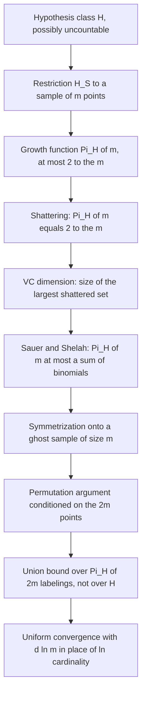
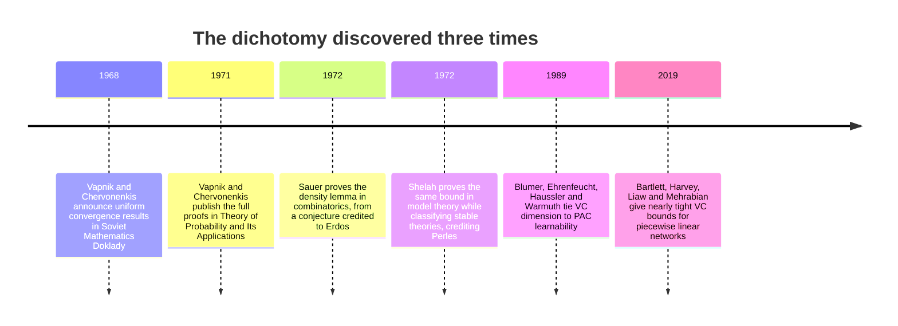

# When the Hypothesis Class Is Infinite: VC Dimension and the Sauer-Shelah Lemma

*This is part of a series on the theorems that make machine learning work. The previous post proved that a finite hypothesis class is PAC learnable, with a sample complexity that pays $\ln|\mathcal{H}|$ for taking a union bound over every hypothesis at once, then pointed at the obvious hole: when $|\mathcal{H}| = \infty$, that logarithm is infinite and the bound says nothing. This post fills the hole.*

---

## The Union Bound Says Nothing

Here is the bound we ended with. Fix a hypothesis class $\mathcal{H}$, a sample $S$ of $m$ i.i.d. points, and $\delta \in (0,1)$. With probability at least $1-\delta$, every $h \in \mathcal{H}$ satisfies

$$
R(h) \leq \hat{R}_S(h) + \sqrt{\frac{\ln|\mathcal{H}| + \ln(2/\delta)}{2m}}
$$

where $R(h) = \mathbb{P}_{(x,y)\sim D}[h(x) \neq y]$ is the true risk and $\hat{R}_S(h)$ the empirical risk on $S$. The proof was two lines: Hoeffding for a single $h$, then a union bound over all of them, at a price of $\ln|\mathcal{H}|$.

Now consider the class of linear classifiers in the plane,

$$
\mathcal{H}_{\text{lin}} = \{x \mapsto \mathbb{1}[\langle w, x\rangle + b \geq 0] : w \in \mathbb{R}^2,\, b \in \mathbb{R}\}.
$$

This class has the cardinality of the continuum. $\ln|\mathcal{H}_{\text{lin}}|$ is not a number. The bound degenerates to $R(h) \leq \hat{R}_S(h) + \infty$, which is true and worthless. Taken at face value, the theorem from the last post asserts that logistic regression on two features cannot be certified to generalize from any finite sample, ever — absurd, and the theorem is not wrong, but the *quantity* it charges us for is.

The fix is to notice what the union bound is protecting against. We take a union over $\mathcal{H}$ because we are worried that *some* hypothesis will get lucky on $S$ and look better than it is. But two hypotheses that agree on every point of $S$ are, from the sample's point of view, the same hypothesis: they have identical empirical risk, so charging for both is double counting — and charging for uncountably many of them, when they collapse into a handful of distinguishable behaviors, is absurd counting.

So the question becomes: how many genuinely distinguishable behaviors does $\mathcal{H}$ have on $m$ points? That number is finite even when $\mathcal{H}$ is not, and it is the object this entire post is about.

---

## The Right Object: Restriction to a Sample

**Definition (restriction).** Let $\mathcal{H}$ be a class of functions from $\mathcal{X}$ to $\{0,1\}$ and let $S = (x_1, \dots, x_m) \in \mathcal{X}^m$. The *restriction of $\mathcal{H}$ to $S$* is

$$
\mathcal{H}_S = \{(h(x_1), h(x_2), \dots, h(x_m)) : h \in \mathcal{H}\} \subseteq \{0,1\}^m.
$$

$\mathcal{H}_S$ is a set of binary vectors: one vector per distinct *labeling* (or *dichotomy*) that some hypothesis in $\mathcal{H}$ induces on those $m$ specific points. Different hypotheses producing the same vector are merged. However large $\mathcal{H}$ is, $|\mathcal{H}_S| \leq 2^m$, because there are only $2^m$ binary vectors of length $m$.

**Definition (growth function).** The *growth function* of $\mathcal{H}$ is

$$
\Pi_{\mathcal{H}}(m) = \max_{S \in \mathcal{X}^m} |\mathcal{H}_S|.
$$

It is the largest number of labelings $\mathcal{H}$ can realize on any sample of size $m$, a worst case over samples taken because we will need a bound that holds no matter which points the distribution hands us. Trivially $\Pi_{\mathcal{H}}(m) \leq 2^m$, and $\Pi_{\mathcal{H}}(m) \leq |\mathcal{H}|$ when $\mathcal{H}$ is finite, so it is never worse than cardinality and often incomparably better.

Make it concrete with half-planes. Take three points in general position, the vertices of a triangle. All $2^3 = 8$ labelings are realizable: a line can isolate any one vertex, any two, or none, so $\Pi_{\mathcal{H}_{\text{lin}}}(3) = 8 = 2^3$.

Now take four points in convex position, in cyclic order $p_1, p_2, p_3, p_4$. The labeling $(+, -, +, -)$ is unrealizable: the segments $p_1p_3$ and $p_2p_4$ cross, and a line with $p_1, p_3$ strictly on one side and $p_2, p_4$ strictly on the other would put the crossing point strictly on both sides. Its complement fails for the same reason, so at least two of the sixteen labelings are lost: $\Pi_{\mathcal{H}_{\text{lin}}}(4) = 14$.

Fourteen, out of a class with uncountably many members. The continuum of lines is an illusion created by looking at the parameters instead of the behavior. Cover's counting theorem gives the exact value for every $m$: $2\sum_{k=0}^{1}\binom{m-1}{k}$ dichotomies for affine half-planes in $\mathbb{R}^2$ on points in general position, a count that leaves $2^m$ at $m = 4$ and never returns.

---

## Shattering and the VC Dimension

**Definition (shattering).** $\mathcal{H}$ *shatters* a set $S$ of size $m$ if $\mathcal{H}_S = \{0,1\}^m$, that is, if all $2^m$ labelings of $S$ are realized by members of $\mathcal{H}$.

Shattering means $\mathcal{H}$ is, on those particular points, completely unconstrained: whatever labels an adversary picks, some hypothesis matches them. Empirical risk on a shattered set carries no information about the truth, since zero training error is achievable regardless of what the labels are.

**Definition (VC dimension).** The *Vapnik-Chervonenkis dimension* of $\mathcal{H}$ is

$$
\mathrm{VCdim}(\mathcal{H}) = \sup\{m \in \mathbb{N} : \Pi_{\mathcal{H}}(m) = 2^m\},
$$

equivalently the size of the largest set shattered by $\mathcal{H}$, and $\infty$ if $\mathcal{H}$ shatters sets of arbitrarily large size.

Two features of this definition trip nearly everyone on first contact, and they are worth stating explicitly because half the errors in VC computations come from getting them backwards.

**The definition is asymmetric.** To prove $\mathrm{VCdim}(\mathcal{H}) \geq d$ you must exhibit *one* set of size $d$ and verify that all $2^d$ labelings are realizable. You get to choose the set; it may be as convenient, as symmetric, as artificially well placed as you like. To prove $\mathrm{VCdim}(\mathcal{H}) \leq d$ you must show that *every* set of size $d+1$ fails, and you do not get to choose: an adversary places the points. So a VC computation is always two arguments running in opposite quantifier directions, an existence proof and a universal impossibility proof, and they usually look nothing like each other.

**The supremum is over all $m$, not the first failure.** Ruling out size $d+1$ is enough only because a subset of a shattered set is shattered, so if no set of size $d+1$ is shattered then no larger set is either. That step is doing real work and is easy to skip past.

---

## Four Worked Dimensions, in Both Directions

### Thresholds on the line: $\mathrm{VCdim} = 1$

Let $\mathcal{H}_{\text{thr}} = \{h_a : a \in \mathbb{R}\}$ with $h_a(x) = \mathbb{1}[x \geq a]$. One point is shattered by placing $a$ on either side of it, and two points $x_1 < x_2$ never are, since realizing $(1,0)$ would force $x_2 < a \leq x_1$; so $\mathrm{VCdim} = 1$.

### Intervals on the line: $\mathrm{VCdim} = 2$

Let $\mathcal{H}_{\text{int}} = \{x \mapsto \mathbb{1}[x \in [a,b]] : a \leq b\}$.

*Lower bound.* Take $S = \{0, 1\}$. Then $[3,4]$ gives $(0,0)$, $[-\tfrac12, \tfrac12]$ gives $(1,0)$, $[\tfrac12, \tfrac32]$ gives $(0,1)$, and $[-1,2]$ gives $(1,1)$. All four labelings appear, so $\mathrm{VCdim} \geq 2$.

*Upper bound.* Let $x_1 < x_2 < x_3$ be arbitrary. Consider the labeling $(1,0,1)$. Realizing it needs an interval $[a,b]$ with $x_1, x_3 \in [a,b]$, hence $a \leq x_1$ and $x_3 \leq b$, hence $a \leq x_1 < x_2 < x_3 \leq b$, so $x_2 \in [a,b]$ and $x_2$ is labeled $1$. Contradiction. No three-point set is shattered, so $\mathrm{VCdim} = 2$.

### Axis-aligned rectangles in the plane: $\mathrm{VCdim} = 4$

Let $\mathcal{H}_{\text{rect}}$ be the indicators of axis-aligned rectangles $[a_1,b_1] \times [a_2,b_2]$.

*Lower bound.* Take the diamond $S = \{(0,1), (0,-1), (1,0), (-1,0)\}$, one extreme point in each axis direction. All sixteen labelings follow from one observation: a labeling is realizable if and only if the bounding box of the positive points contains no negative point (if it does not, that box is a witness; if it does, every rectangle containing the positives contains that negative). Empty and singleton positive sets have degenerate boxes. For two opposite points, say $\{(0,1),(0,-1)\}$, the box is $\{0\} \times [-1,1]$, excluding $(\pm 1, 0)$. For two adjacent points, say $\{(0,1),(1,0)\}$, the box is $[0,1] \times [0,1]$, excluding $(-1,0)$ and $(0,-1)$. For any three points the box is a half of the bounding square that excludes the omitted extreme point: dropping $(0,1)$ gives $[-1,1] \times [-1,0]$. And the full set has no negatives to exclude. So $\mathrm{VCdim} \geq 4$.

*Upper bound.* Let $S$ be any set of five distinct points. Choose $x^{\text{top}}$ with maximal second coordinate, $x^{\text{bot}}$ with minimal second coordinate, $x^{\text{left}}$ with minimal first coordinate, $x^{\text{right}}$ with maximal first coordinate, breaking ties arbitrarily. These are at most four distinct points, so some $p \in S$ is none of them. Consider the labeling that marks $E = \{x^{\text{top}}, x^{\text{bot}}, x^{\text{left}}, x^{\text{right}}\}$ positive and every other point of $S$, in particular $p$, negative. Any rectangle containing $E$ has first-coordinate range containing $[x^{\text{left}}_1, x^{\text{right}}_1]$ and second-coordinate range containing $[x^{\text{bot}}_2, x^{\text{top}}_2]$, so it contains the bounding box of all of $S$, so it contains $p$ and labels it positive. The labeling is unrealizable, so no five-point set is shattered and $\mathrm{VCdim} = 4$.

### Half-planes and hyperplanes: $\mathrm{VCdim} = d+1$ in $\mathbb{R}^d$

Let $\mathcal{H}_d = \{x \mapsto \mathbb{1}[\langle w,x\rangle + b \geq 0] : w \in \mathbb{R}^d, b \in \mathbb{R}\}$. Write $f_{w,b}(x) = \langle w,x\rangle + b$ for the affine functional; the affine functionals on $\mathbb{R}^d$ form a vector space of dimension $d+1$.

*Lower bound.* Take $d+1$ affinely independent points $x_1, \dots, x_{d+1}$, for instance the origin and the standard basis vectors, and consider the evaluation map $T: f \mapsto (f(x_1), \dots, f(x_{d+1}))$. $T$ is linear between spaces of equal dimension $d+1$, and its kernel is the affine functionals vanishing on all $x_i$; since the $x_i$ affinely span $\mathbb{R}^d$, only the zero functional does, so $T$ is a bijection. For any target labeling $y \in \{0,1\}^{d+1}$, apply $T^{-1}$ to the vector with entries $+1$ where $y_i=1$ and $-1$ where $y_i=0$; the resulting half-space realizes $y$. The set is shattered, so $\mathrm{VCdim}(\mathcal{H}_d) \geq d+1$.

*Upper bound, via Radon.*

> **Radon's theorem.** Any set of $d+2$ points in $\mathbb{R}^d$ can be partitioned into two disjoint subsets $A$ and $B$ whose convex hulls intersect. (The proof is short — solve the $d+1$ homogeneous linear equations $\sum_i \lambda_i x_i = 0$, $\sum_i \lambda_i = 0$ in the $d+2$ unknowns $\lambda_i$ for a nonzero solution, split on the sign of $\lambda_i$, and the shared convex combination is the intersection point; see Going Deeper for a full writeup.)

Now let $S$ be any set of $d+2$ distinct points in $\mathbb{R}^d$, and let $A, B$ be a Radon partition with $z$ in both hulls. Suppose some $f_{w,b}$ labeled $A$ positive and $B$ negative, so $f \geq 0$ on $A$ and $f < 0$ on $B$. An affine functional maps a convex combination to the corresponding combination of values, so writing $z$ through $A$ gives $f(z) \geq 0$ and writing it through $B$ gives $f(z) < 0$. Contradiction. That labeling is unrealizable, no set of $d+2$ points is shattered, and $\mathrm{VCdim}(\mathcal{H}_d) = d+1$. In the plane this gives $3$, matching the enumeration above where $\Pi(3) = 8$ and $\Pi(4) = 14 < 16$.

Three of these four classes have VC dimension equal to their number of real parameters, and the coincidence is seductive. It is also false in general, and the counterexample is not exotic.

### One parameter, infinite VC dimension

**Theorem.** Let $\mathcal{H}_{\sin} = \{h_\theta : \theta \in \mathbb{R}\}$ with $h_\theta(x) = \mathbb{1}[\sin(\theta x) > 0]$, a class indexed by a single real parameter. Then $\mathrm{VCdim}(\mathcal{H}_{\sin}) = \infty$.

*Proof.* Fix $m$ and take $x_i = 2^i$ for $i = 1, \dots, m$. Let $y \in \{0,1\}^m$ be any target labeling. Define bits $b_i = 1 - y_i$ for $i \leq m$, append $b_{m+1} = 1$, and set

$$
\theta = \pi \sum_{j=1}^{m+1} b_j 2^{-j},
$$

so that $\theta/\pi$ is the binary fraction $0.b_1b_2\cdots b_{m+1}$. Fix $i \leq m$. Then

$$
\frac{\theta x_i}{\pi} = \sum_{j=1}^{m+1} b_j 2^{\,i-j} = N_i + r_i, \qquad N_i = \sum_{j=1}^{i} b_j 2^{\,i-j}, \quad r_i = \sum_{j=i+1}^{m+1} b_j 2^{\,i-j}.
$$

$N_i$ is a nonnegative integer. Every term of $N_i$ with $j < i$ is an even integer and the term $j = i$ equals $b_i$, so $N_i \equiv b_i \pmod 2$. For the remainder, $r_i \geq b_{m+1} 2^{\,i-m-1} > 0$ and $r_i \leq \sum_{j=i+1}^{m+1} 2^{\,i-j} = 1 - 2^{\,i-m-1} < 1$, so $r_i \in (0,1)$ and therefore $\sin(\pi r_i) > 0$. Then

$$
\sin(\theta x_i) = \sin(\pi N_i + \pi r_i) = (-1)^{N_i}\sin(\pi r_i),
$$

so $\sin(\theta x_i) > 0$ if and only if $N_i$ is even, if and only if $b_i = 0$, if and only if $y_i = 1$. Thus $h_\theta$ realizes the labeling $y$. Since $y$ was arbitrary, $\{2^1, \dots, 2^m\}$ is shattered; since $m$ was arbitrary, the VC dimension is infinite. $\blacksquare$

The appended bit $b_{m+1} = 1$ is not decoration: without it the remainder $r_m$ would be zero, $\sin(\theta x_m)$ would be exactly zero, and the strict inequality in the definition of $h_\theta$ would fail on the last point.

So a class with one real parameter can shatter arbitrarily large sets, and by the fundamental theorem below it is not PAC learnable at all. "VC dimension equals the number of parameters" is a folk belief, widely repeated and simply wrong. The correct statement goes only one way: classes defined by *polynomial* inequalities in the parameters admit bounds polynomial in the parameter count, and for deep networks with piecewise-linear activations Bartlett, Harvey, Liaw and Mehrabian proved nearly matching bounds of order $W L \log W$ in weights $W$ and depth $L$. Nothing forces such a relation for a general parameterization; a single real number can carry arbitrarily many binary digits, and $\sin(\theta x)$ spends them all.

---

## The Sauer-Shelah Lemma

Everything so far has been definitions and examples. Here is the theorem that turns them into a tool.

**Theorem (Sauer-Shelah).** Let $\mathcal{H}$ be a class of functions $\mathcal{X} \to \{0,1\}$ with $\mathrm{VCdim}(\mathcal{H}) = d < \infty$. Then for every $m \geq 0$,

$$
\Pi_{\mathcal{H}}(m) \leq \sum_{i=0}^{d}\binom{m}{i}.
$$

Read what this says. VC dimension is defined by the behavior of $\mathcal{H}$ on sets of size at most $d$; the growth function is about sets of every size. The lemma asserts that a failure to shatter at one small scale controls the count at *all* scales, forever — a purely finite, purely combinatorial statement, with no probability in it anywhere.

*Proof.* Fix a sample $S = (x_1, \dots, x_m)$; it suffices to bound $|\mathcal{H}_S|$ for each $S$. Only the restriction matters, so we may forget $\mathcal{H}$ entirely and prove the equivalent finite statement:

> Let $\mathcal{F} \subseteq \{0,1\}^m$ be any family of binary vectors. Say $\mathcal{F}$ shatters a set of coordinates $I \subseteq \{1,\dots,m\}$ if the projection $\mathcal{F}|_I$ is all of $\{0,1\}^{|I|}$, and let $\mathrm{VCdim}(\mathcal{F})$ be the largest size of a shattered coordinate set. If $\mathrm{VCdim}(\mathcal{F}) \leq d$ then $|\mathcal{F}| \leq \sum_{i=0}^{d}\binom{m}{i}$.

This is equivalent to what we want because $\mathcal{H}_S$ shatters a coordinate set $I$ exactly when $\mathcal{H}$ shatters the corresponding subset of points, so $\mathrm{VCdim}(\mathcal{H}_S) \leq \mathrm{VCdim}(\mathcal{H}) = d$.

We induct on $m + d$.

*Base case $d = 0$.* Suppose $|\mathcal{F}| \geq 2$. Two distinct vectors of $\mathcal{F}$ differ in some coordinate $i$, so $\mathcal{F}|_{\{i\}} = \{0,1\}$ and $\{i\}$ is shattered, giving $\mathrm{VCdim}(\mathcal{F}) \geq 1$. Contrapositively, $\mathrm{VCdim}(\mathcal{F}) = 0$ forces $|\mathcal{F}| \leq 1 = \binom{m}{0}$.

*Base case $m = 0$.* There is exactly one vector of length zero, so $|\mathcal{F}| \leq 1 = \binom{0}{0}$, and the claimed sum is at least $1$.

*Inductive step.* Let $m \geq 1$, $d \geq 1$, and assume the claim for all smaller values of $m + d$. Split $\mathcal{F}$ along the last coordinate. Define two families of vectors of length $m-1$:

$$
\mathcal{F}' = \{(a_1,\dots,a_{m-1}) : (a_1,\dots,a_{m-1},a_m) \in \mathcal{F} \text{ for some } a_m\},
$$

$$
\mathcal{F}'' = \{(a_1,\dots,a_{m-1}) : (a_1,\dots,a_{m-1},0) \in \mathcal{F} \text{ and } (a_1,\dots,a_{m-1},1) \in \mathcal{F}\}.
$$

$\mathcal{F}'$ is the projection of $\mathcal{F}$ onto the first $m-1$ coordinates, with duplicates collapsed. $\mathcal{F}''$ is the set of prefixes that extend to a full vector of $\mathcal{F}$ in *both* ways.

**Counting.** Each element $a$ of $\mathcal{F}'$ has either one or two preimages in $\mathcal{F}$, and it has exactly two precisely when $a \in \mathcal{F}''$. Summing over $\mathcal{F}'$,

$$
|\mathcal{F}| = |\mathcal{F}'| + |\mathcal{F}''|.
$$

This identity is the whole trick: the projection loses exactly the vectors that were doubled, and the doubled ones are counted back by $\mathcal{F}''$.

**Bounding $\mathcal{F}'$.** If $I \subseteq \{1,\dots,m-1\}$ is shattered by $\mathcal{F}'$, it is shattered by $\mathcal{F}$: any labeling of $I$ realized by some prefix in $\mathcal{F}'$ is realized by any full vector of $\mathcal{F}$ extending that prefix, and the coordinates in $I$ are untouched by the extension. Hence $\mathrm{VCdim}(\mathcal{F}') \leq d$. The induction hypothesis at $(m-1, d)$ gives

$$
|\mathcal{F}'| \leq \sum_{i=0}^{d}\binom{m-1}{i}.
$$

**Bounding $\mathcal{F}''$.** Suppose $I \subseteq \{1,\dots,m-1\}$ is shattered by $\mathcal{F}''$. We claim $I \cup \{m\}$ is shattered by $\mathcal{F}$. Take any labeling of $I \cup \{m\}$, say $\sigma$ on $I$ and bit $\beta$ on coordinate $m$. Because $\mathcal{F}''$ shatters $I$, there is $a \in \mathcal{F}''$ with $a|_I = \sigma$; because $a \in \mathcal{F}''$, both $(a, 0)$ and $(a,1)$ lie in $\mathcal{F}$, so $(a, \beta) \in \mathcal{F}$ realizes the labeling. Hence every set shattered by $\mathcal{F}''$ can be enlarged by the coordinate $m$ into a set shattered by $\mathcal{F}$, giving

$$
\mathrm{VCdim}(\mathcal{F}'') + 1 \leq \mathrm{VCdim}(\mathcal{F}) \leq d, \qquad \text{so} \qquad \mathrm{VCdim}(\mathcal{F}'') \leq d - 1.
$$

The induction hypothesis at $(m-1, d-1)$ gives

$$
|\mathcal{F}''| \leq \sum_{i=0}^{d-1}\binom{m-1}{i}.
$$

**Closing with Pascal.** Adding the two bounds and re-indexing the second sum,

$$
|\mathcal{F}| \leq \sum_{i=0}^{d}\binom{m-1}{i} + \sum_{i=0}^{d-1}\binom{m-1}{i} = \binom{m-1}{0} + \sum_{i=1}^{d}\left[\binom{m-1}{i} + \binom{m-1}{i-1}\right].
$$

Pascal's identity $\binom{m-1}{i} + \binom{m-1}{i-1} = \binom{m}{i}$ collapses the bracket, and $\binom{m-1}{0} = \binom{m}{0} = 1$, so

$$
|\mathcal{F}| \leq \sum_{i=0}^{d}\binom{m}{i},
$$

which is the claim. $\blacksquare$

### The polynomial form

The binomial sum is already a polynomial of degree $d$ in $m$, but a closed form makes the growth rate obvious.

**Corollary.** If $\mathrm{VCdim}(\mathcal{H}) = d \geq 1$ then for all $m \geq d$,

$$
\Pi_{\mathcal{H}}(m) \leq \sum_{i=0}^{d}\binom{m}{i} \leq \left(\frac{em}{d}\right)^{d}.
$$

*Proof sketch.* Weight each term $\binom{m}{i}$ by $(m/d)^{d-i} \geq 1$ and extend the sum to $i = m$; the binomial theorem collapses the result to $(m/d)^d(1+d/m)^m$, and $1+x \leq e^x$ with $x = d/m$ bounds this by $(m/d)^d e^d = (em/d)^d$. $\blacksquare$

Because it will matter for the generalization bound, note what happens under a logarithm: $\ln \Pi_{\mathcal{H}}(m) \leq d\ln(em/d)$. The quantity the union bound charged us, $\ln|\mathcal{H}|$, has been replaced by something that grows *logarithmically* in the sample size and linearly in $d$. That is the entire payoff.

---

## The Phase Transition

Put the pieces together and something strange falls out.

If $\mathrm{VCdim}(\mathcal{H}) = \infty$, then by definition $\mathcal{H}$ shatters sets of every size, so $\Pi_{\mathcal{H}}(m) = 2^m$ for every $m$. If $\mathrm{VCdim}(\mathcal{H}) = d < \infty$, then Sauer-Shelah pins $\Pi_{\mathcal{H}}(m) \leq (em/d)^d = O(m^d)$ for all $m \geq d$. There is no third case.

So the growth function of a hypothesis class is either exponential everywhere or polynomial. It cannot be $m^{\log m}$, or $2^{\sqrt{m}}$, or $1.5^m$, or anything else in the vast territory between the two, and this holds for an arbitrary set of binary functions on an arbitrary domain, with no smoothness, measurability, or structure assumed. Moreover, the moment $\Pi_{\mathcal{H}}(m) < 2^m$ for a single value of $m$, the class is committed: $d < m$, and the polynomial ceiling applies from then on. Falling below $2^m$ once is falling below it forever.

This is the same flavor of result as a zero-one law: a quantity that could a priori do anything is proved to have only two possible behaviors. That is not a coincidence — the same dichotomy was found three times, independently, for three unrelated reasons: combinatorics (Sauer), model theory (Shelah), and statistics (Vapnik and Chervonenkis, first).

The gap is visible numerically. The code below computes the growth function of axis-aligned rectangles by exhaustive enumeration: for each of many random point sets, it tests all $2^m$ labelings for realizability using the bounding-box criterion, and takes the maximum. The result is a lower bound on $\Pi_{\mathcal{H}}(m)$, since we only sample point configurations rather than optimizing over all of them.

```python
import itertools
from math import comb
import numpy as np

def realizable_by_rectangle(P, bits):
    # realizable iff the bounding box of the positives has no negative inside
    pos = P[np.asarray(bits, dtype=bool)]
    if len(pos) == 0:
        return True
    lo, hi = pos.min(axis=0), pos.max(axis=0)
    inside = np.all((P >= lo) & (P <= hi), axis=1)
    return not np.any(inside & ~np.asarray(bits, dtype=bool))

def restriction_size(P):
    m = len(P)
    return sum(realizable_by_rectangle(P, b)
               for b in itertools.product((0, 1), repeat=m))

def growth_function(m, trials=200, seed=0):
    rng = np.random.default_rng(seed)
    return max(restriction_size(rng.normal(size=(m, 2))) for _ in range(trials))

d = 4                                    # VC dimension of axis-aligned rectangles
print(f"{'m':>3}{'measured':>10}{'2^m':>8}{'Sauer-Shelah':>14}{'(em/d)^d':>11}")
for m in range(1, 10):
    g = growth_function(m)
    sauer = sum(comb(m, i) for i in range(d + 1))
    poly = f"{(np.e * m / d) ** d:.1f}" if m >= d else "-"
    print(f"{m:>3}{g:>10}{2**m:>8}{sauer:>14}{poly:>11}")
```

```
  m  measured     2^m  Sauer-Shelah   (em/d)^d
  1         2       2             2          -
  2         4       4             4          -
  3         8       8             8          -
  4        16      16            16       54.6
  5        28      32            31      133.3
  6        49      64            57      276.4
  7        76     128            99      512.1
  8       117     256           163      873.6
  9       168     512           256     1399.3
```

The measured count equals $2^m$ for $m \leq 4$, which is the lower-bound half of $\mathrm{VCdim} = 4$ confirmed by brute force, and it separates from $2^m$ at exactly $m = 5$, which is the upper-bound half. From there the exponential column doubles each row while the measured column crawls, and the Sauer-Shelah column sits above the measurement at every $m$ while remaining a decent approximation to it. The looser $(em/d)^d$ form is much weaker, as expected, since it was bought with two inequalities.

---

## From Combinatorics to Probability: the VC Generalization Bound

Sauer-Shelah is a counting statement. Turning it into a statement about generalization takes real probabilistic work. Here is the destination first.

**Theorem (VC generalization bound).** Let $\mathcal{H}$ be a class of binary classifiers with $\mathrm{VCdim}(\mathcal{H}) = d$, and let $S$ be an i.i.d. sample of size $m \geq d$ from any distribution $D$. Then for any $\delta > 0$, with probability at least $1-\delta$ over the draw of $S$, every $h \in \mathcal{H}$ satisfies

$$
R(h) \leq \hat{R}_S(h) + \sqrt{\frac{8}{m}\left(d\ln\frac{2em}{d} + \ln\frac{4}{\delta}\right)}.
$$

Compare this to where we started: the vacuous $\ln|\mathcal{H}|$ has become $d \ln(2em/d)$, finite for every class of finite VC dimension no matter how large the class is. Solving for sample size, $m$ is of order $\frac{d + \ln(1/\delta)}{\epsilon^2}$ up to the logarithmic factor — the VC dimension has replaced cardinality as the price of admission.

I am going to state honestly what I can and cannot do here: the full proof is not given here. It runs several pages and the constants differ between treatments, and compressing it would mean writing something that reads like a proof without being one. Instead, here are the three moves, each named, so the shape of the argument is visible and the reference is checkable.

**Move 1: symmetrization.** The obstruction is that $R(h)$ is an expectation over the unknown $D$, not a function of anything we observe, so there is nothing finite to union bound over. Introduce a *ghost sample* $S'$, a second i.i.d. sample of size $m$ that is never drawn in reality and exists only in the analysis. One shows that the probability that some $h$ has $R(h)$ far from $\hat{R}_S(h)$ is bounded by roughly twice the probability that some $h$ has $\hat{R}_S(h)$ far from $\hat{R}_{S'}(h)$. The quantity to control is now a difference of two *empirical* risks on $2m$ points, and the unobservable $R(h)$ is gone.

**Move 2: permutation.** Condition on the multiset $S \cup S'$ of $2m$ points. Given that multiset, the split into real and ghost halves is uniformly random among the ways of swapping paired points, since all $2m$ came i.i.d. from the same $D$. This reduces the question to a fixed set of $2m$ points under a random relabeling of which half is which, and for a single fixed $h$ a Hoeffding-type inequality over that randomness gives a failure probability exponentially small in $m\epsilon^2$.

**Move 3: union bound over labelings, not hypotheses.** On that fixed set of $2m$ points, two hypotheses inducing the same labeling have identical empirical risks on both halves, so they define the same bad event. The union bound therefore runs over $\mathcal{H}_{S \cup S'}$, which has at most $\Pi_{\mathcal{H}}(2m) \leq (2em/d)^d$ elements by Sauer-Shelah — a polynomial number of bad events, each exponentially unlikely, and the exponential from Move 2 beats that polynomial. Solving for $\epsilon$ produces the $\sqrt{d\ln(2em/d)/m}$ shape above.

The full argument, with all constants, is in Vapnik and Chervonenkis's 1971 paper, and in modern textbook form in Mohri, Rostamizadeh and Talwalkar's *Foundations of Machine Learning*, Chapter 3, and in Shalev-Shwartz and Ben-David's *Understanding Machine Learning*, Chapter 6.



---

## The Fundamental Theorem of Statistical Learning

The VC bound gives one direction: finite VC dimension implies uniform convergence, hence learnability. The converse also holds, and the resulting equivalence is the sharpest available answer to the question of what guarantees that we can generalize at all.

**Theorem (Fundamental theorem of statistical learning).** Let $\mathcal{H}$ be a class of functions from a domain $\mathcal{X}$ to $\{0,1\}$, with the loss function being the $0$-$1$ loss. Then the following are equivalent:

1. $\mathcal{H}$ has the uniform convergence property.
2. Any ERM rule is a successful agnostic PAC learner for $\mathcal{H}$.
3. $\mathcal{H}$ is agnostically PAC learnable.
4. $\mathcal{H}$ is PAC learnable.
5. Any ERM rule is a successful PAC learner for $\mathcal{H}$.
6. $\mathcal{H}$ has finite VC dimension.

This is Theorem 6.7 in Shalev-Shwartz and Ben-David, and it comes with a quantitative version, Theorem 6.8, which additionally pins the sample complexity between constant multiples of $\frac{d + \ln(1/\delta)}{\epsilon^2}$ in the agnostic case and of $\frac{d\ln(1/\epsilon) + \ln(1/\delta)}{\epsilon}$ in the realizable case, so that the upper and lower bounds match up to constants and logarithmic factors.

The scope conditions are not decoration, and the theorem is false without them: it is stated for *binary* classification under the *$0$-$1$ loss*. For multiclass problems the VC dimension must be replaced by a different combinatorial parameter, and in general learning settings the equivalence between learnability and uniform convergence genuinely breaks — there are learnable problems with no uniform convergence once you leave binary classification.

Within its scope, look at what the equivalence delivers. Statement 4 asks about the existence of *any* algorithm, quantified over all distributions and sample sizes: an infinitary, algorithmic, probabilistic question. Statement 6 is a finite combinatorial property of the class, defined by examining finite subsets, with no reference to algorithms, distributions, or probability. They are the same statement. Learnability is not an algorithmic property at all: it is a property of the shape of the hypothesis class, and once that class has finite VC dimension, the dumbest possible algorithm, "return anything that fits the training data," works.



---

## What the Bound Does Not Do

It would be dishonest to end on the triumph. The VC bound has three limitations, and the third is not a technicality.

**It is distribution-free, which is both the strength and the weakness.** The bound holds for every distribution $D$, which is exactly why it is usable: you do not need to know $D$, and cannot be defeated by an adversarial choice of it. But a guarantee that holds for every distribution is calibrated to the worst one. If your data lies near a low-dimensional manifold, if the classes are well separated, if the margin is large, the bound does not know and does not care — it quotes the price of the hardest distribution consistent with your hypothesis class, and real distributions are almost never that hard.

**It is worst-case over the class, and says nothing about your hypothesis.** The statement is uniform: it holds simultaneously for all $h \in \mathcal{H}$, which is what makes it valid to apply after looking at the data. That uniformity is purchased by being driven by the worst member of $\mathcal{H}$, and your algorithm does not return the worst member — gradient descent with weight decay and early stopping returns a highly non-generic hypothesis from a small, algorithm-dependent region of the class that a bound quantifying over all of $\mathcal{H}$ cannot see, and so cannot credit.

**For modern networks it is vacuous.** For a ReLU network with $W$ weights and depth $L$, the VC dimension is of order $W L \log W$, which for any network you would actually train exceeds $m$ by orders of magnitude. Plug $d \gg m$ into the bound and the square root exceeds $1$, so the bound says only that the error rate is at most something bigger than $1$ — true and empty. Worse, the theory is not merely silent here: Zhang and coauthors showed that standard architectures can fit ImageNet with randomly permuted labels, meaning they shatter the training set, and yet the same architectures trained on real labels generalize well. The class shatters the sample and generalizes anyway. Uniform convergence over the full hypothesis class cannot explain that, because as a statement about the full class it is simply false in that regime.

This is not a small caveat, and it deserves to be said plainly: the theory in this post explains why linear classifiers, decision stumps, small trees and complexity-controlled kernel machines generalize, and it does not explain why overparameterized neural networks generalize. Closing that gap is what the last post of this series is about.

The first, most useful repair is to make the complexity measure depend on the data, not only on the class.

**Definition (empirical Rademacher complexity).** For a sample $S = (x_1, \dots, x_m)$ and a class $\mathcal{H}$,

$$
\hat{\mathfrak{R}}_S(\mathcal{H}) = \mathbb{E}_{\sigma}\left[\sup_{h \in \mathcal{H}} \frac{1}{m}\sum_{i=1}^{m}\sigma_i h(x_i)\right],
$$

where the $\sigma_i$ are independent uniform $\pm 1$ signs — how well can the class correlate with pure noise on *your* sample? Bounds stated in terms of $\hat{\mathfrak{R}}_S(\mathcal{H})$ have the same shape as the VC bound and are never worse, since Massart's lemma combined with Sauer-Shelah recovers the VC bound from the Rademacher one, while a benign sample or a norm-constrained subclass makes the Rademacher term genuinely smaller. That is what opens the door to margin- and norm-based bounds for neural networks, measured on the weights the optimizer actually found rather than every weight configuration it might have found — still far from tight, but at least asking about the hypothesis you have, not the worst one you could have had.

---

## Going Deeper

**Books:**
- Shalev-Shwartz, S., & Ben-David, S. (2014). *Understanding Machine Learning: From Theory to Algorithms.* Cambridge University Press.
  - Chapter 6: the canonical modern treatment of growth function, Sauer-Shelah-Perles, and the fundamental theorem.
- Mohri, M., Rostamizadeh, A., & Talwalkar, A. (2018). *Foundations of Machine Learning, Second Edition.* MIT Press.
  - Chapter 3 derives Rademacher complexity first, with VC dimension as a special case, and contains the generalization bound quoted above.
- Vapnik, V. N. (1998). *Statistical Learning Theory.* Wiley.
  - The primary source, in Vapnik's own framing, for the necessary and sufficient conditions for uniform convergence.
- Anthony, M., & Bartlett, P. L. (1999). *Neural Network Learning: Theoretical Foundations.* Cambridge University Press.
  - The reference for VC dimension of parameterized and neural classes, including the pathologies that defeat "VC dimension equals parameter count."

**Online Resources:**
- [Understanding Machine Learning, authors' page](https://www.cs.huji.ac.il/~shais/UnderstandingMachineLearning/) — the free PDF; Chapter 6 pairs with this post.
- [Foundations of Machine Learning, book page](https://cs.nyu.edu/~mohri/mlbook/) — chapter drafts, slides and errata from the authors.
- [Sauer-Shelah lemma, Wikipedia](https://en.wikipedia.org/wiki/Sauer%E2%80%93Shelah_lemma) — the independent discoveries and the tightness of the bound.

**Videos:**
- [Lecture 6: Theory of Generalization](https://www.youtube.com/watch?v=6FWRijsmLtE) by Yaser Abu-Mostafa, Caltech — growth function and break points.
- [Lecture 7: The VC Dimension](https://www.youtube.com/watch?v=Dc0sr0kdBVI) by Yaser Abu-Mostafa, Caltech — VC dimension versus degrees of freedom.

**Academic Papers:**
- Vapnik, V. N., & Chervonenkis, A. Ya. (1971). ["On the Uniform Convergence of Relative Frequencies of Events to Their Probabilities."](https://doi.org/10.1137/1116025) *Theory of Probability and Its Applications*, 16(2), 264-280.
  - The founding paper; results were announced in 1968, proved in full here.
- Sauer, N. (1972). ["On the density of families of sets."](https://doi.org/10.1016/0097-3165(72)90019-2) *Journal of Combinatorial Theory, Series A*, 13(1), 145-147.
  - Three pages proving the bound Erdos had conjectured.
- Shelah, S. (1972). ["A combinatorial problem; stability and order for models and theories in infinitary languages."](https://doi.org/10.2140/pjm.1972.41.247) *Pacific Journal of Mathematics*, 41(1), 247-261.
  - The same bound, reached independently from model theory.

**Questions to Explore:**
- Is there a structural reason combinatorial complexity measures so often refuse intermediate growth rates, or is each such dichotomy an accident of its own proof?
- What would the theory look like if the growth function were averaged over configurations drawn from $D$ rather than maximized?
- Overparameterized networks generalize because of properties of the algorithm, not the class. What definition of "hypothesis class" would let a theorem of this shape apply to a trained network?
- Rademacher complexity is data-dependent but still uniform over the class. Is there a coherent notion of complexity that is uniform over nothing, that speaks only about the single hypothesis returned, and still supports a high-probability guarantee?
