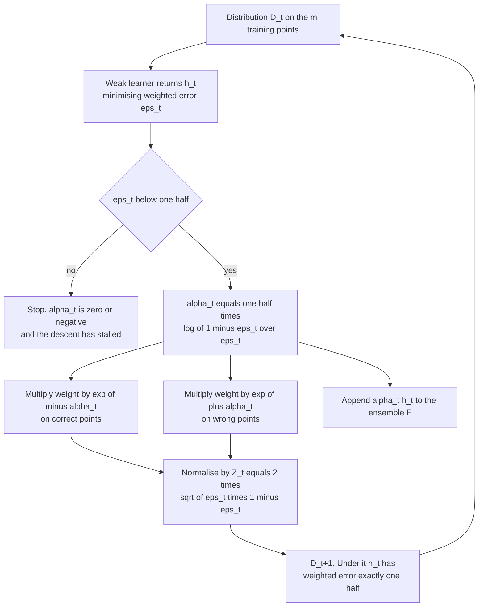
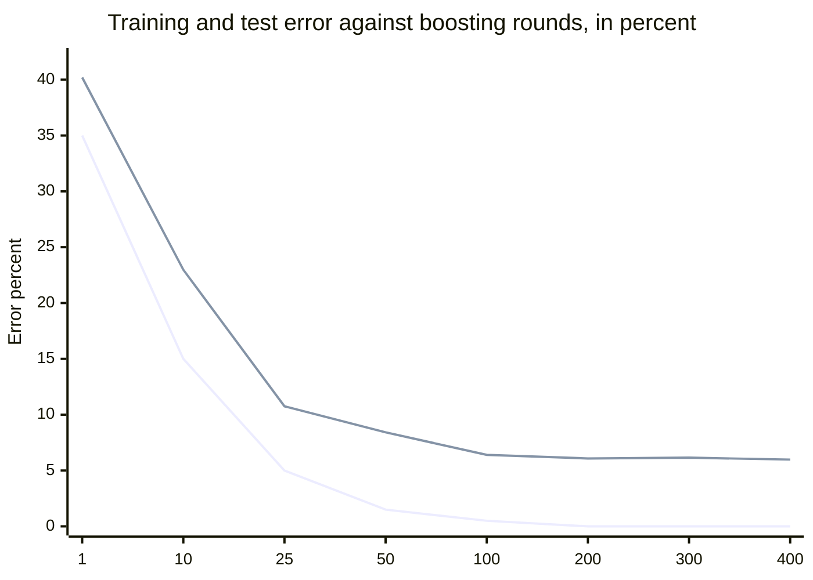

# Weak Learnability Equals Strong Learnability

*Part of the series "Why Learning Works: The Theorems Behind Machine Learning." Earlier instalments established when a class is learnable at all. This one is about how much learning you can manufacture from almost none.*

---

## A Committee of Barely-Competent Predictors

A hypothesis that is right $51\%$ of the time is, on its own, close to worthless. You would not ship it, you would not report it, and no amount of confidence interval will make it interesting. Now take a few hundred such hypotheses, each obtained on a different reweighting of the same training set, and combine them by a weighted vote. The result can be made as accurate as you like.

This is not a heuristic about ensembles being nice. It is an equivalence theorem: the class of concepts learnable to *arbitrary* accuracy and the class learnable to *some fixed* accuracy slightly better than chance are the same class. Nothing is gained by demanding a strong learner up front, because a weak one can always be promoted.

Michael Kearns and Leslie Valiant posed the question in 1988, alongside their work on cryptographic hardness of learning; it circulated as the **hypothesis boosting problem**. Robert Schapire answered it affirmatively in 1990. The construction he gave to prove it is not the one anyone uses. The one everyone uses, AdaBoost, arrived seven years later as a better answer to an already-settled question, and then immediately produced an experimental anomaly that the theory of the day said should not happen.

Both halves of that story are theorems, and this post proves them.

---

## The Two Definitions

Fix a domain $\mathcal{X}$, labels $\mathcal{Y} = \{-1,+1\}$, and a concept class $\mathcal{C}$ of functions $\mathcal{X} \to \mathcal{Y}$. For a distribution $D$ over $\mathcal{X}$ and a target $c \in \mathcal{C}$, the risk of a predictor $h$ is $L_{D,c}(h) = \mathbb{P}_{x \sim D}[h(x) \neq c(x)]$.

> **Definition (strong learnability).** $\mathcal{C}$ is **strongly learnable** if there is an algorithm $A$ and a polynomial $p$ such that for every $c \in \mathcal{C}$, every distribution $D$ over $\mathcal{X}$, and every $\epsilon, \delta \in (0,1)$, given $m \geq p(1/\epsilon, 1/\delta, n, \mathrm{size}(c))$ examples drawn i.i.d. from $D$ and labelled by $c$, $A$ outputs $h$ with $L_{D,c}(h) \leq \epsilon$ with probability at least $1 - \delta$, in time polynomial in the same quantities.

This is Valiant's PAC criterion. The quantifier that matters is *for every* $\epsilon$: the algorithm must be able to hit any accuracy target you name.

> **Definition (weak learnability).** $\mathcal{C}$ is **weakly learnable** if there exist a constant $\gamma > 0$ and an algorithm $A$ such that for every $c \in \mathcal{C}$, every $D$, and every $\delta \in (0,1)$, given polynomially many examples $A$ outputs $h$ with
>
> $$
> L_{D,c}(h) \;\leq\; \tfrac{1}{2} - \gamma
> $$
>
> with probability at least $1 - \delta$.

Here $\epsilon$ is not a parameter. It is frozen at one fixed value $\epsilon_0 = \tfrac12 - \gamma$ strictly below chance, and the algorithm is allowed to be no better than that, ever. Call $\gamma$ the **edge**.

Strong learnability trivially implies weak learnability: run the strong learner with $\epsilon = \epsilon_0$. The question Kearns and Valiant asked is the converse, and it is not obviously true. A weak learner offers no mechanism for improvement. It answers one question, at one fixed quality, and you may not ask it to try harder.

> **Theorem 1 (Schapire, 1990).** A concept class $\mathcal{C}$ is weakly learnable if and only if it is strongly learnable.

The source is Robert E. Schapire, "The Strength of Weak Learnability," *Machine Learning* **5**(2), 197-227, 1990. The forward direction is the content; the converse is the trivial observation above. What makes the theorem more than a curiosity is that its proof is *constructive*: it exhibits a procedure that calls the weak learner a bounded number of times and outputs a hypothesis of arbitrary accuracy. The rest of this post is about two such procedures, one of which is good.

---

## Schapire's Original Construction, and Why Nobody Runs It

The 1990 construction is a recursion built on a three-hypothesis primitive. Suppose the weak learner returns hypotheses of error at most $\epsilon < 1/2$ under *any* distribution it is handed. Run it once on $D$ to get $h_1$. Now build a second distribution $D_2$ that is deliberately hard for $h_1$: draw from $D$, flip a fair coin, and on heads keep the point only if $h_1$ classifies it correctly, on tails only if $h_1$ errs. Under $D_2$, $h_1$ is right exactly half the time, so it carries no information there; the weak learner must find something genuinely new, and returns $h_2$. Finally let $D_3$ be $D$ conditioned on the event $h_1(x) \neq h_2(x)$, the region where the first two disagree, and get $h_3$. Output the majority vote $\mathrm{MAJ}(h_1,h_2,h_3)$.

The vote errs only when at least two of the three err, and a short case analysis over the disagreement patterns bounds its error by

$$
g(\epsilon) \;=\; 3\epsilon^2 - 2\epsilon^3 .
$$

For $\epsilon < 1/2$ one checks $g(\epsilon) < \epsilon$, so one application strictly improves accuracy: $g(0.4) \approx 0.352$, $g(0.352) \approx 0.28$, and so on. Recursing to depth $k$ — each of the three sub-learners being itself a depth-$(k-1)$ booster — drives the error to $g^{(k)}(\epsilon_0)$, which reaches any target $\epsilon$ after $O(\log\log(1/\epsilon))$ levels, at a cost of $3^k$ calls to the weak learner.

That is a complete proof of Theorem 1, and it is also an algorithm nobody runs. Three reasons, all structural. First, $D_2$ and $D_3$ are *filtered* distributions: sampling from them requires rejection sampling against $D$, and the acceptance rate for $D_3$ is the disagreement probability, which shrinks as the hypotheses get good — so the sample cost per call blows up exactly when the algorithm is working. Second, the recursion tree is irregular: different branches need different sample sizes to meet their confidence budgets, and $\delta$ must be apportioned across $3^k$ nodes. Third, and worst in practice, the recursion depth $k$ must be fixed in advance, which means **you must know $\epsilon_0$ before you start**. A weak learner that happens to return error $0.1$ on round three is treated exactly like one returning $0.49$; the algorithm cannot adapt to good luck.

AdaBoost fixes all three at once. It samples from reweightings of the training set rather than filtered versions of $D$, it is a flat loop rather than a tree, and its step sizes are functions of the errors actually observed. The name is short for *adaptive* boosting, and the adaptivity is the third fix.

---

## AdaBoost as Coordinate Descent on the Exponential Loss

Freund and Schapire published AdaBoost as an application of a general online-allocation algorithm: Yoav Freund and Robert E. Schapire, "A Decision-Theoretic Generalization of On-Line Learning and an Application to Boosting," *Journal of Computer and System Sciences* **55**(1), 119-139, 1997. The derivation below is the later, cleaner one: AdaBoost is exactly greedy coordinate descent on a convex surrogate loss, and every constant in it falls out of a one-variable minimisation.

Fix a training sample $S = ((x_1,y_1),\dots,(x_m,y_m))$ with $y_i \in \{-1,+1\}$, and a base class $\mathcal{H}$ of hypotheses $h : \mathcal{X} \to \{-1,+1\}$. The ensemble after $T$ rounds is the real-valued function

$$
F_T(x) \;=\; \sum_{t=1}^{T} \alpha_t h_t(x), \qquad H_T(x) = \mathrm{sign}\big(F_T(x)\big).
$$

Define the **margin** of example $i$ as $y_i F_T(x_i)$, and its normalised version $y_i f_T(x_i)$ where $f_T = F_T / \sum_t |\alpha_t|$ takes values in $[-1,1]$. The margin is positive exactly when the ensemble is correct, and its magnitude measures how decisively.

### The Surrogate

> **Lemma 2.** For every $u \in \mathbb{R}$, $\;\mathbb{1}_{[u \leq 0]} \leq e^{-u}$.

*Proof.* If $u \leq 0$ then $-u \geq 0$, so $e^{-u} \geq e^{0} = 1 = \mathbb{1}_{[u \leq 0]}$. If $u > 0$ then $\mathbb{1}_{[u \leq 0]} = 0 < e^{-u}$, since the exponential is strictly positive. $\blacksquare$

Applying Lemma 2 at $u = y_i F(x_i)$ and averaging over the sample gives, for any $F$ whatsoever,

$$
\widehat{L}_{0\text{-}1}(F) \;=\; \frac{1}{m}\sum_{i=1}^{m} \mathbb{1}_{[y_i F(x_i) \leq 0]} \;\leq\; \frac{1}{m}\sum_{i=1}^{m} e^{-y_i F(x_i)} \;=\; \widehat{L}_{\exp}(F). \tag{1}
$$

The right-hand side is the **exponential loss**. It is convex and differentiable in $F$, which the $0$-$1$ loss is not, and (1) says minimising it controls the thing we actually care about. That inequality is the hinge of the whole argument; it will reappear in the proof of Theorem 4 unchanged.

### One Coordinate at a Time

Suppose $F_{t-1}$ is fixed and we look for the best single addition $\alpha h$ with $h \in \mathcal{H}$, $\alpha \in \mathbb{R}$. Write the unnormalised weights and their normalisation,

$$
w_i^{(t)} \;=\; e^{-y_i F_{t-1}(x_i)}, \qquad W_t \;=\; \sum_{j=1}^{m} w_j^{(t)}, \qquad D_t(i) \;=\; \frac{w_i^{(t)}}{W_t},
$$

so that $D_t$ is a probability distribution on the sample: $D_t(i) \geq 0$ and $\sum_i D_t(i) = 1$. Then

$$
\begin{aligned}
\widehat{L}_{\exp}(F_{t-1} + \alpha h)
&= \frac{1}{m}\sum_{i=1}^{m} e^{-y_i F_{t-1}(x_i)} e^{-\alpha y_i h(x_i)} \\
&= \frac{W_t}{m}\sum_{i=1}^{m} D_t(i)\, e^{-\alpha y_i h(x_i)}.
\end{aligned}
$$

Because $h$ and $y_i$ take values in $\{-1,+1\}$, the product $y_i h(x_i)$ is $+1$ when $h$ is right and $-1$ when it is wrong. Splitting the sum on that dichotomy and writing

$$
\epsilon_{D_t}(h) \;=\; \sum_{i \,:\, h(x_i) \neq y_i} D_t(i) \;=\; \mathbb{P}_{i \sim D_t}\big[h(x_i) \neq y_i\big]
$$

for the **weighted error** of $h$ under $D_t$, we obtain the one-term objective

$$
\widehat{L}_{\exp}(F_{t-1} + \alpha h) \;=\; \frac{W_t}{m}\,\underbrace{\Big[\epsilon_{D_t}(h)\, e^{\alpha} + \big(1 - \epsilon_{D_t}(h)\big)\, e^{-\alpha}\Big]}_{\textstyle \varphi(\alpha,\, \epsilon_{D_t}(h))}. \tag{2}
$$

The factor $W_t/m$ is a positive constant determined by rounds $1,\dots,t-1$. So minimising the loss over $(\alpha, h)$ is exactly minimising $\varphi$.

**Which $h$?** Hold $\alpha > 0$ fixed and differentiate $\varphi$ in its second argument:

$$
\frac{\partial \varphi}{\partial \epsilon} \;=\; e^{\alpha} - e^{-\alpha} \;>\; 0 \quad \text{for } \alpha > 0.
$$

So $\varphi$ is strictly increasing in $\epsilon$, and for any positive step size the optimal base hypothesis is the one minimising $\epsilon_{D_t}(h)$ over $\mathcal{H}$. **That is precisely the object a weak learner supplies**: hand it the distribution $D_t$ and it returns some $h_t$ with $\epsilon_t := \epsilon_{D_t}(h_t) \leq \tfrac12 - \gamma$. The weak-learning assumption is not an extra hypothesis bolted onto the optimisation; it is the statement that the coordinate-minimisation subproblem can be solved approximately.

**Which $\alpha$?** With $\epsilon = \epsilon_t$ now fixed, minimise $\varphi(\cdot, \epsilon_t)$ over $\alpha \in \mathbb{R}$:

$$
\begin{aligned}
\frac{d\varphi}{d\alpha} &= \epsilon_t e^{\alpha} - (1-\epsilon_t) e^{-\alpha} \;=\; 0 \\
\epsilon_t e^{\alpha} &= (1-\epsilon_t) e^{-\alpha} \\
e^{2\alpha} &= \frac{1-\epsilon_t}{\epsilon_t} \\
\alpha_t &= \frac{1}{2}\ln\!\left(\frac{1-\epsilon_t}{\epsilon_t}\right).
\end{aligned} \tag{3}
$$

The second derivative is $\varphi'' = \epsilon_t e^{\alpha} + (1-\epsilon_t)e^{-\alpha} > 0$ for $\epsilon_t \in (0,1)$, so $\varphi$ is strictly convex in $\alpha$ and (3) is its unique global minimiser, not merely a critical point.

Two readings of (3) are worth pausing on. First, $\alpha_t > 0$ if and only if $(1-\epsilon_t)/\epsilon_t > 1$, that is **if and only if $\epsilon_t < 1/2$** — the weak-learning condition is exactly the condition for the step to point forwards. A hypothesis with $\epsilon_t > 1/2$ receives a negative weight, which is correct: its negation is a good hypothesis. A hypothesis with $\epsilon_t = 1/2$ receives weight zero, contributes nothing, and the descent stalls. Second, $\alpha_t \to \infty$ as $\epsilon_t \to 0$: a base hypothesis that is perfect on the current weights swallows the ensemble.

Substituting (3) back into $\varphi$, and using $e^{\alpha_t} = \sqrt{(1-\epsilon_t)/\epsilon_t}$,

$$
\begin{aligned}
Z_t \;:=\; \varphi(\alpha_t, \epsilon_t)
&= \epsilon_t \sqrt{\frac{1-\epsilon_t}{\epsilon_t}} + (1-\epsilon_t)\sqrt{\frac{\epsilon_t}{1-\epsilon_t}} \\
&= \sqrt{\epsilon_t(1-\epsilon_t)} + \sqrt{\epsilon_t(1-\epsilon_t)} \\
&= 2\sqrt{\epsilon_t(1-\epsilon_t)}.
\end{aligned} \tag{4}
$$

Keep $Z_t$ in view. It is simultaneously the minimum value of the one-round objective, the normalising constant of the next distribution, and — by Theorem 4 — the per-round factor in the training-error bound. These are the same number for a reason, and the reason is that the algorithm is coordinate descent on (1).

---

## The Algorithm

> **AdaBoost.** Input: $S = ((x_1,y_1),\dots,(x_m,y_m))$, base class $\mathcal{H}$, rounds $T$. Initialise $D_1(i) = 1/m$.
>
> For $t = 1,\dots,T$:
> 1. Obtain $h_t \in \mathcal{H}$ approximately minimising $\epsilon_t = \mathbb{P}_{i \sim D_t}[h_t(x_i) \neq y_i]$.
> 2. Set $\alpha_t = \tfrac12 \ln\!\big((1-\epsilon_t)/\epsilon_t\big)$.
> 3. Reweight: $D_{t+1}(i) = D_t(i)\, e^{-\alpha_t y_i h_t(x_i)} / Z_t$, with $Z_t = 2\sqrt{\epsilon_t(1-\epsilon_t)}$.
>
> Output $H(x) = \mathrm{sign}\big(\sum_{t=1}^{T}\alpha_t h_t(x)\big)$.

The mechanism is in step 3. Since $\alpha_t > 0$, the factor is $e^{-\alpha_t} < 1$ on correctly classified points and $e^{+\alpha_t} > 1$ on misclassified ones: each round shifts mass onto what the current ensemble gets wrong. The shift is calibrated, not arbitrary. Under $D_{t+1}$ the weighted error of $h_t$ is

$$
\sum_{i \,:\, h_t(x_i) \neq y_i} \frac{D_t(i) e^{\alpha_t}}{Z_t} \;=\; \frac{\epsilon_t \sqrt{(1-\epsilon_t)/\epsilon_t}}{2\sqrt{\epsilon_t(1-\epsilon_t)}} \;=\; \frac{\sqrt{\epsilon_t(1-\epsilon_t)}}{2\sqrt{\epsilon_t(1-\epsilon_t)}} \;=\; \frac{1}{2}.
$$

Exactly one half. The reweighting neutralises the hypothesis just chosen, which is Schapire's 1990 filtering idea recovered as an automatic consequence of the descent step, with no rejection sampling anywhere.



---

## The Training Error Bound

> **Theorem 4 (Freund and Schapire, 1997).** Let $H$ be the output of AdaBoost after $T$ rounds, with weighted errors $\epsilon_1,\dots,\epsilon_T$ and edges $\gamma_t = \tfrac12 - \epsilon_t$. Then the empirical error satisfies
>
> $$
> \frac{1}{m}\big|\{i : H(x_i) \neq y_i\}\big| \;\leq\; \prod_{t=1}^{T} Z_t \;=\; \prod_{t=1}^{T} 2\sqrt{\epsilon_t(1-\epsilon_t)} \;\leq\; \exp\!\Big({-2\sum_{t=1}^{T}\gamma_t^2}\Big).
> $$

*Proof.* Unroll the recursion in step 3. For each $i$,

$$
\begin{aligned}
D_{T+1}(i) &= D_T(i)\,\frac{e^{-\alpha_T y_i h_T(x_i)}}{Z_T} \;=\; D_1(i)\prod_{t=1}^{T}\frac{e^{-\alpha_t y_i h_t(x_i)}}{Z_t} \\
&= \frac{1}{m}\cdot \frac{\exp\big(-y_i \sum_{t}\alpha_t h_t(x_i)\big)}{\prod_{t} Z_t} \;=\; \frac{1}{m}\cdot\frac{e^{-y_i F_T(x_i)}}{\prod_{t} Z_t},
\end{aligned} \tag{5}
$$

where the exponents combine because $\sum_t -\alpha_t y_i h_t(x_i) = -y_i F_T(x_i)$. Now use the one fact we have not yet spent: $D_{T+1}$ is a probability distribution, so its entries sum to one. Summing (5) over $i$,

$$
1 \;=\; \sum_{i=1}^{m} D_{T+1}(i) \;=\; \frac{1}{\prod_t Z_t}\cdot \frac{1}{m}\sum_{i=1}^{m} e^{-y_i F_T(x_i)},
$$

and rearranging,

$$
\frac{1}{m}\sum_{i=1}^{m} e^{-y_i F_T(x_i)} \;=\; \prod_{t=1}^{T} Z_t. \tag{6}
$$

The product of normalisers *is* the exponential loss of the ensemble. Chaining (6) with inequality (1) gives the first claim:

$$
\frac{1}{m}\sum_{i=1}^{m}\mathbb{1}_{[y_i F_T(x_i) \leq 0]} \;\leq\; \frac{1}{m}\sum_{i=1}^{m} e^{-y_i F_T(x_i)} \;=\; \prod_{t=1}^{T} Z_t,
$$

and the left side is the empirical error of $H = \mathrm{sign}(F_T)$, counting ties as errors. The identity $Z_t = 2\sqrt{\epsilon_t(1-\epsilon_t)}$ is (4).

For the exponential form, substitute $\epsilon_t = \tfrac12 - \gamma_t$:

$$
Z_t \;=\; 2\sqrt{\left(\tfrac12 - \gamma_t\right)\left(\tfrac12 + \gamma_t\right)} \;=\; 2\sqrt{\tfrac14 - \gamma_t^2} \;=\; \sqrt{1 - 4\gamma_t^2}.
$$

Apply $1 + x \leq e^{x}$ with $x = -4\gamma_t^2$, then take square roots (both sides are positive and $\sqrt{\cdot}$ is increasing):

$$
Z_t \;=\; \sqrt{1 - 4\gamma_t^2} \;\leq\; \sqrt{e^{-4\gamma_t^2}} \;=\; e^{-2\gamma_t^2}.
$$

Multiplying over $t$ gives $\prod_t Z_t \leq \exp(-2\sum_t \gamma_t^2)$. $\blacksquare$

### This Bound Is the Proof of Theorem 1

Suppose the weak-learning assumption holds uniformly, $\gamma_t \geq \gamma > 0$ for every round. Theorem 4 gives empirical error at most $e^{-2T\gamma^2}$, which drops below $1/m$ — and therefore, being itself a multiple of $1/m$, equals exactly zero — as soon as

$$
T \;>\; \frac{\ln m}{2\gamma^2}.
$$

So a logarithmic number of calls to the weak learner produces a hypothesis consistent with the sample. To convert consistency into a bound on true risk, note that $H_T$ lies in the class of $T$-fold weighted majority votes over $\mathcal{H}$, whose VC dimension is $O(T d \log(Td))$ when $\mathcal{H}$ has VC dimension $d$ — polynomial in $T$ and $d$. The standard PAC sample-complexity bound for a class of finite VC dimension then delivers $L_D(H_T) \leq \epsilon$ with probability $1-\delta$ from a sample polynomial in $1/\epsilon$, $1/\delta$, $d$ and $T$, with $T$ itself logarithmic in $m$.

Every quantity is polynomial, and the accuracy target $\epsilon$ was arbitrary. **That is strong learnability, built out of a weak learner and nothing else** — the equivalence of Theorem 1, obtained constructively, by a flat loop over $T$ rounds instead of a $3^k$-node recursion.

---

## The Anomaly

Theorem 4 predicts training error falling to zero. It says nothing about what happens afterwards, and conventional wisdom said what happens afterwards is overfitting: keep adding terms to a model that already fits perfectly and test error should turn upwards.

It does not. In the experiment that opens Schapire, Freund, Bartlett and Lee's paper — boosting C4.5 on the UCI *letter* dataset — training error reached zero after **five** trees, while test error continued to fall from $8.4\%$ on round 5 to $3.1\%$ on round 1000. A single C4.5 tree gives $13.8\%$; bagging 1000 trees gives $6.6\%$. After round 5 the ensemble was making no further progress on any quantity Theorem 4 tracks, and it improved by nearly a factor of three anyway.

Their explanation is the margin. Adding rounds after the training error hits zero changes no *sign*, but it keeps increasing the *margins* $y_i f_T(x_i)$ — the confidence with which the vote is correct. And the margin distribution supports a generalisation bound that does not mention $T$ at all.

> **Theorem 5 (Schapire, Freund, Bartlett and Lee, 1998, Theorem 2).** Let $\mathcal{H}$ have VC dimension $d$, let $S$ be $m$ examples drawn i.i.d. from $\mathcal{D}$, and let $\theta > 0$. With probability at least $1-\delta$ over the sample, every weighted average $f$ of hypotheses in $\mathcal{H}$ satisfies
>
> $$
> \mathbb{P}_{\mathcal{D}}\big[y f(x) \leq 0\big] \;\leq\; \mathbb{P}_{S}\big[y f(x) \leq \theta\big] \;+\; O\!\left(\frac{1}{\sqrt{m}}\left(\frac{d\log^2(m/d)}{\theta^2} + \log\frac{1}{\delta}\right)^{\!1/2}\right).
> $$

The number of rounds does not appear. Complexity enters only through $d$, the complexity of the *base* class, and $\theta$, the margin you are willing to demand. Ten thousand rounds cost nothing in this bound; a small $\theta$ costs a great deal. Their companion result shows AdaBoost drives the first term down: for any $\theta$,

$$
\mathbb{P}_{S}\big[y f(x) \leq \theta\big] \;\leq\; 2^{T}\prod_{t=1}^{T}\sqrt{\epsilon_t^{\,1-\theta}\,(1-\epsilon_t)^{1+\theta}},
$$

which decays exponentially in $T$ whenever $\theta$ is small enough relative to the edge — the same style of argument as Theorem 4, with $\theta$ threaded through the exponential-loss inequality.

### Why This Is Not a Happy Ending

The margin explanation is *contested*, and it has been for a quarter of a century. Leo Breiman ("Prediction Games and Arcing Algorithms," *Neural Computation* **11**(7), 1493-1517, 1999) built **arc-gv**, an algorithm designed to maximise the *minimum* margin directly rather than incidentally. If the margin story were the mechanism, arc-gv should generalise better. It achieved larger minimum margins than AdaBoost, and it performed **worse** on test error. That is close to a refutation.

Lev Reyzin and Robert Schapire ("How Boosting the Margin Can Also Boost Classifier Complexity," ICML 2006) partially rescued it: arc-gv's base trees were systematically *deeper* than AdaBoost's, so the comparison confounded margins with base-class complexity, and Theorem 5 depends on both. Holding tree depth fixed, arc-gv still won on minimum margin but AdaBoost produced a better margin *distribution* — more mass at moderate margins — and better test error. The revised claim is therefore that the whole distribution matters and the minimum does not. That is a weaker and less falsifiable claim than the one Breiman attacked, and the literature since has continued to argue about which functional of the margin distribution is the right one. Treat "boosting works because of margins" as an open research question with strong evidence on both sides, not as settled theory.

My own small experiment below is a case in point, and I report it as it came out. Training error hits zero at round 109; the minimum margin then rises steadily from $+0.005$ to $+0.035$ by round 400, exactly as the story predicts. Test error over the same stretch moves from $6.15\%$ to $5.97\%$ — a real improvement, but of seven test points in four thousand, and it bottoms out at $5.92\%$ around round 194 rather than declining monotonically. Meanwhile the fraction of training points with margin below $0.10$ *rises* from $0.305$ to $0.410$: the minimum margin and the bulk of the distribution move in opposite directions. Nothing here contradicts Theorem 5, which is an inequality and not a prediction. But a single run of boosted stumps on synthetic data is not the letter dataset, and the honest summary is that the phenomenon is far weaker here than the famous plot suggests.

---

## Three Real Limits

**AdaBoost does overfit.** The claim was never that it cannot, only that it often does not. On noisy data it does, reliably and badly, and Theorem 4 offers no protection: it bounds *training* error, and a bound that goes to zero says nothing about the gap. Early stopping by cross-validation is a real regulariser here, not a superstition.

**The exponential loss is unbounded below in the margin.** This is the deepest of the three, because it is a property of the objective and not of any implementation choice. As $u \to -\infty$, $e^{-u} \to \infty$; a point the ensemble gets confidently and persistently wrong contributes an exponentially exploding term to (1). Concretely, for two points $i$ and $j$ the weight ratio is

$$
\frac{D_t(i)}{D_t(j)} \;=\; \exp\!\Big(y_j F_{t-1}(x_j) - y_i F_{t-1}(x_i)\Big),
$$

so a margin gap growing linearly in $t$ produces a weight ratio growing exponentially in $t$. A single mislabelled example — one whose label no hypothesis in $\mathcal{H}$ can ever match — eventually owns nearly all the mass of $D_t$, and from then on the weak learner is optimising against that one point. This is not a bug to patch; it follows from the shape of $e^{-u}$. Losses with linear negative tails, such as the logistic loss underlying LogitBoost, or explicitly bounded losses, are the structural fix.

**The weak-learning assumption is about the current weights, not the data.** Theorem 4 requires $\epsilon_t \leq \tfrac12 - \gamma$ *at every round*, under a distribution the algorithm itself has made adversarial for the base class. That is a much stronger demand than "the base learner beats chance on the training set," and it degrades in practice. In the run below, the mean weighted error over the first 50 rounds is $0.387$; over rounds 351 to 400 it is $0.446$, drifting toward $1/2$. The edge $\gamma_t$ is shrinking, the per-round factor $Z_t = \sqrt{1-4\gamma_t^2}$ is approaching one, and the bound of Theorem 4 has essentially stopped improving. When $\epsilon_t$ reaches $1/2$ exactly, $\alpha_t = 0$ and the algorithm halts in place.

---

## Where It Went

Jerome Friedman's contribution was to notice that nothing in the derivation depends on the exponential loss beyond convexity and differentiability ("Greedy Function Approximation: A Gradient Boosting Machine," *Annals of Statistics* **29**(5), 1189-1232, 2001). Read the AdaBoost step as gradient descent in function space: the negative gradient of the loss at the current ensemble, evaluated at the training points, is a vector of pseudo-residuals $-\big[\partial L(y_i, F(x_i))/\partial F(x_i)\big]$; fit a base learner to *that* vector by least squares, then choose the step size by line search. For the exponential loss this reproduces AdaBoost's reweighting exactly. For squared error it reduces to fitting residuals; for the logistic loss it yields LogitBoost; for the Huber and quantile losses it gives robust regression boosters. Every modern gradient-boosting library is an instance of this template with second-order steps and better split-finding. The line from "can a coin-flip learner be amplified?" to XGBoost is unbroken, and every link in it is one of the theorems above.

---

## AdaBoost from Scratch

Two hundred points in $[-1,1]^2$, labelled by whether they fall outside a circle of radius $0.798$ (chosen so the classes are near balanced), and a base class of axis-aligned decision stumps. Stumps are genuinely weak here: no single one gets below $35\%$ error. The first block runs the algorithm and prints, per round, the weighted error $\epsilon_t$, the derived step $\alpha_t$, the running bound $\prod_t Z_t$ of Theorem 4, and the actual training error.

```python
import numpy as np

rng = np.random.default_rng(0)

def sample(n):                                    # +1 outside a circle, -1 inside
    X = rng.uniform(-1, 1, size=(n, 2))
    return X, np.where((X ** 2).sum(1) > 0.798 ** 2, 1, -1)

X, y = sample(200)
Xte, yte = sample(4000)

mid = lambda v: (v[:-1] + v[1:]) / 2              # every axis-aligned stump
stumps = [(j, t, s) for j in range(2) for t in mid(np.unique(X[:, j])) for s in (1, -1)]
H = np.array([s * np.where(X[:, j] > t, 1, -1) for j, t, s in stumps])
Hte = np.array([s * np.where(Xte[:, j] > t, 1, -1) for j, t, s in stumps])
WRONG = (H != y)

def adaboost(T):
    D, chosen = np.full(len(y), 1.0 / len(y)), []
    for _ in range(T):
        err = WRONG @ D                           # weighted error of every stump
        k = int(np.argmin(err))                   # the weak learner's answer
        eps = float(np.clip(err[k], 1e-12, 1 - 1e-12))
        alpha = 0.5 * np.log((1 - eps) / eps)     # the minimiser of phi
        Z = 2 * np.sqrt(eps * (1 - eps))          # phi at that minimiser
        D = D * np.exp(-alpha * y * H[k]) / Z
        chosen.append((k, eps, alpha, Z))
    return chosen

rounds = adaboost(400)

F, bound = np.zeros(len(y)), 1.0
print("  t    eps_t    alpha_t   prod Z_t   train err")
for t, (k, eps, alpha, Z) in enumerate(rounds[:8], 1):
    F += alpha * H[k]
    bound *= Z
    print(f" {t:2d}   {eps:.4f}   {alpha:+.4f}    {bound:.4f}     {(np.sign(F) != y).mean():.3f}")
```

```text
  t    eps_t    alpha_t   prod Z_t   train err
  1   0.3500   +0.3095    0.9539     0.350
  2   0.3632   +0.2808    0.9175     0.350
  3   0.3536   +0.3015    0.8773     0.260
  4   0.3379   +0.3363    0.8300     0.325
  5   0.3894   +0.2249    0.8094     0.205
  6   0.3320   +0.3496    0.7623     0.270
  7   0.3881   +0.2276    0.7430     0.185
  8   0.3416   +0.3282    0.7047     0.175
```

The bound column decreases monotonically, as it must — every $Z_t < 1$ because every $\epsilon_t < 1/2$. The training-error column does not: it rises at round 4 and again at round 6. There is no contradiction. Theorem 4 asserts an *upper bound*, and $0.325 \leq 0.8300$ comfortably. Greedy descent on the exponential surrogate is not descent on the $0$-$1$ loss, and the surrogate is the thing that improves every round.

The second block continues the same ensemble to 400 rounds, tracking a held-out set of 4000 points, the normalised minimum margin, and the margin distribution.

```python
F, G, A = np.zeros(len(y)), np.zeros(len(yte)), 0.0
train, test, mmin, dist = [], [], [], {}
for t, (k, eps, alpha, Z) in enumerate(rounds, 1):
    F, G, A = F + alpha * H[k], G + alpha * Hte[k], A + abs(alpha)
    margin = y * F / A                            # normalised margins, in [-1, 1]
    train.append((np.sign(F) != y).mean())
    test.append((np.sign(G) != yte).mean())
    mmin.append(margin.min())
    if t in (109, 400):
        dist[t] = margin.copy()

T0 = next(t for t, e in enumerate(train, 1) if e == 0.0)
print(f"training error first reaches zero at round {T0}\n")
print("   T   train err   test err   min margin   mean eps_t so far")
for t in (1, 10, 50, T0, 200, 400):
    print(f"{t:4d}     {train[t-1]:.3f}      {test[t-1]:.4f}     {mmin[t-1]:+.4f}"
          f"       {np.mean([r[1] for r in rounds[:t]]):.4f}")
print(f"\nbest test error {min(test):.4f}, reached at round {int(np.argmin(test)) + 1}")
print("\nfraction of training margins at or below theta")
print("theta       0.05    0.10    0.20    0.30")
for t in (T0, 400):
    print(f"T = {t:3d}    " + "   ".join(f"{(dist[t] <= th).mean():.3f}"
                                         for th in (.05, .10, .20, .30)))
```

```text
training error first reaches zero at round 109

   T   train err   test err   min margin   mean eps_t so far
   1     0.350      0.4020     -1.0000       0.3500
  10     0.150      0.2298     -0.3206       0.3590
  50     0.015      0.0843     -0.0431       0.3873
 109     0.000      0.0615     +0.0050       0.4048
 200     0.000      0.0607     +0.0184       0.4190
 400     0.000      0.0597     +0.0345       0.4318

best test error 0.0592, reached at round 194

fraction of training margins at or below theta
theta       0.05    0.10    0.20    0.30
T = 109    0.080   0.305   0.725   0.945
T = 400    0.060   0.410   0.830   0.945
```

Three things are visible at once. Test error does keep falling after round 109, mildly and non-monotonically. The minimum margin does keep growing, by a factor of seven. And the mean weighted error climbs steadily from $0.350$ toward $1/2$, which is the third limit above made quantitative: the weak learner is running out of edge against distributions the algorithm has sharpened specifically against it.



The lower line is training error, flat on zero from round 109; the upper is test error, still drifting down beneath it. That gap, and what it means, is the part of boosting theory that is still open.

---

## Going Deeper

**Books:**
- Schapire, R. E., & Freund, Y. (2012). *Boosting: Foundations and Algorithms.* MIT Press.
  - The definitive treatment by the people who built it; Chapters 1-5 cover everything above at greater length, including Breiman's objection and the replies to it.
- Shalev-Shwartz, S., & Ben-David, S. (2014). *Understanding Machine Learning: From Theory to Algorithms.* Cambridge University Press.
  - Chapter 10 gives the weak-to-strong equivalence and Theorem 4 in the PAC notation used here; free PDF from the authors.
- Hastie, T., Tibshirani, R., & Friedman, J. (2009). *The Elements of Statistical Learning*, 2nd ed. Springer.
  - Chapter 10 is the statistical reading: boosting as forward stagewise additive modelling, and the route from there to gradient boosting.
- Mohri, M., Rostamizadeh, A., & Talwalkar, A. (2018). *Foundations of Machine Learning*, 2nd ed. MIT Press.
  - Chapter 7 proves the margin bound with Rademacher complexity rather than VC dimension, giving sharper constants.

**Online Resources:**
- [Explaining AdaBoost](https://www.schapire.net/papers/explaining-adaboost.pdf) — Schapire's own short survey; the clearest single document on why the algorithm admits so many equivalent derivations.
- [Boosting the Margin, full text](https://cseweb.ucsd.edu/~yfreund/papers/BoostingtheMargin.pdf) — the 1998 paper, including the letter-dataset figure quoted above and the proof of Theorem 5.
- [Understanding Machine Learning, free PDF](https://www.cs.huji.ac.il/~shais/UnderstandingMachineLearning/) — Chapter 10 is short and self-contained.
- [XGBoost documentation: introduction to boosted trees](https://xgboost.readthedocs.io/en/stable/tutorials/model.html) — where Friedman's template ends up, with the second-order step written out.

**Videos:**
- [Machine Learning for Intelligent Systems, CS4780](https://www.youtube.com/playlist?list=PLl8OlHZGYOQ7bkVbuRthEsaLr7bONzbXS) by Kilian Weinberger, Cornell — the boosting lectures derive AdaBoost as coordinate descent in essentially the notation used here.
- [MIT 9.520 / 6.860, Statistical Learning Theory and Applications](https://www.youtube.com/playlist?list=PL_Ig1a5kxu55ivmyrfRmeUOFeaaWuqPpg) — places boosting inside regularisation theory and the margin literature.

**Academic Papers:**
- Schapire, R. E. (1990). ["The Strength of Weak Learnability."](https://doi.org/10.1007/BF00116037) *Machine Learning*, 5(2), 197-227.
  - Theorem 1 and the three-hypothesis recursion; worth reading for how different a constructive proof can look from a usable algorithm.
- Freund, Y., & Schapire, R. E. (1997). ["A Decision-Theoretic Generalization of On-Line Learning and an Application to Boosting."](https://doi.org/10.1006/jcss.1997.1504) *Journal of Computer and System Sciences*, 55(1), 119-139.
  - AdaBoost and Theorem 4, derived from the online allocation setting rather than from coordinate descent.
- Schapire, R. E., Freund, Y., Bartlett, P., & Lee, W. S. (1998). ["Boosting the Margin: A New Explanation for the Effectiveness of Voting Methods."](https://doi.org/10.1214/aos/1024691352) *The Annals of Statistics*, 26(5), 1651-1686.
  - Theorem 5 and the letter-dataset experiment; the origin of the margin explanation.
- Breiman, L. (1999). ["Prediction Games and Arcing Algorithms."](https://doi.org/10.1162/089976699300016106) *Neural Computation*, 11(7), 1493-1517.
  - arc-gv, larger minimum margins, worse test error; read it alongside Reyzin and Schapire's 2006 ICML reply before deciding what you believe.
- Friedman, J. H. (2001). ["Greedy Function Approximation: A Gradient Boosting Machine."](https://doi.org/10.1214/aos/1013203451) *The Annals of Statistics*, 29(5), 1189-1232.
  - The generalisation to arbitrary differentiable losses that every modern boosting library implements.

**Questions to Explore:**
- Theorem 5 is an inequality whose right-hand side is usually numerically vacuous at realistic $m$ and $d$. If a bound never binds, in what sense does it explain an observed phenomenon, and what would a non-vacuous margin bound have to look like?
- Breiman maximised the minimum margin and lost. Reyzin and Schapire pointed to the distribution instead. Is there a functional of the margin distribution that is both predictive across datasets and directly optimisable, or does every attempt to optimise it inflate base-class complexity in compensation?
- The exponential loss's unbounded negative tail is what makes AdaBoost noise-sensitive and also what gives $\alpha_t$ a closed form. Is that a necessary trade-off, or is there a loss with a linear negative tail whose coordinate step is still analytic?
- The weak-learning assumption is required against a sequence of distributions the algorithm generates adversarially. Under what conditions on $\mathcal{H}$ and $\mathcal{D}$ can the edge $\gamma_t$ be guaranteed not to decay, rather than merely assumed?
- AdaBoost converges to a maximum-margin solution in the separable case, as does gradient descent on logistic regression. Is "implicit margin maximisation" one theorem with several instances, or a coincidence of exponential-tailed losses?
