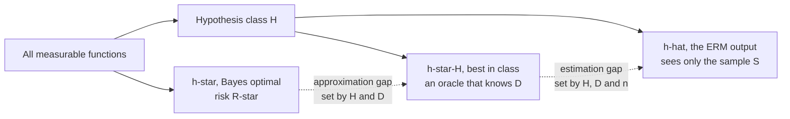
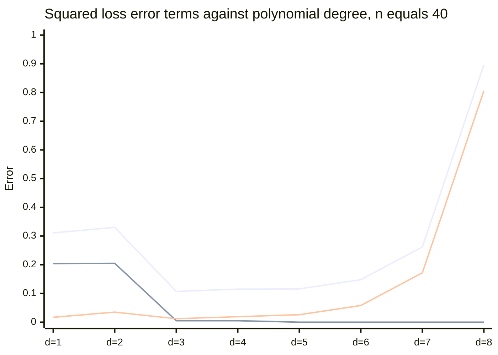
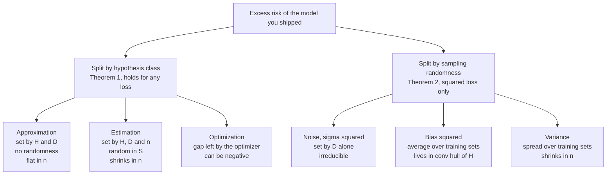
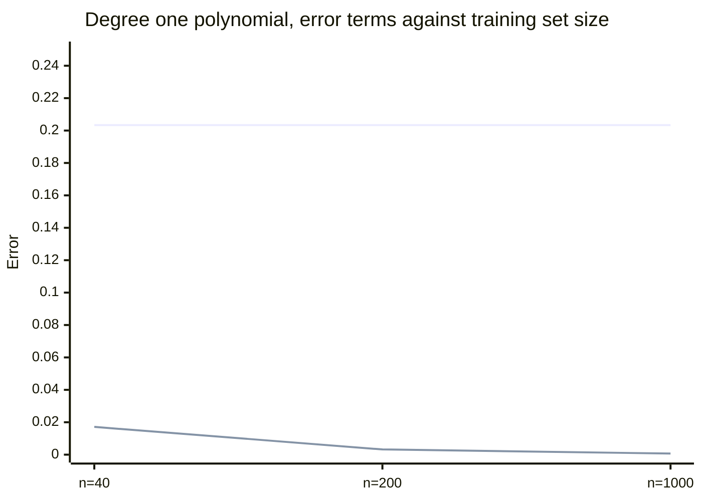

# What Are We Actually Minimizing? Empirical Risk, and the Two Decompositions Everyone Conflates

*Part of **Why Learning Works: The Theorems Behind Machine Learning**, a series that proves why machine learning works rather than describing what it does. Results are stated as theorems -- hypotheses first, conclusion second -- and proved, or the proof's location is named plainly when it will not fit. This post establishes the objects: risk, empirical risk, and the two error decompositions the series keeps pulling apart.*

---

## The Gap Nobody Names

You have a finite sample. You compute an average loss over it. You adjust parameters until that average is small. Then you ship the model, and it meets data you have never seen, drawn from a distribution you have never fully observed, and you hope the average loss there is also small.

Nothing in that paragraph connects the first quantity to the second. The training average is a number you can compute; the test expectation is a number you cannot. You chose your model *because* it made the computable number small, which is precisely the choice most likely to make that number an optimistic estimate of the one you care about. Training loss is not a neutral measurement of the model. It is a measurement taken after the model was selected to look good on it.

That gap is the whole subject of statistical learning theory. Before you can bound it you have to name what is in it, and that is what this post does.

There are two standard ways to take generalization error apart. One splits it by *hypothesis class*: how good is the best model you could have picked, versus how much worse is the one you did pick. The other splits it by *sampling randomness*: how wrong is your procedure on average across training sets, versus how much does it wobble between them. These get used interchangeably in courses, interviews and blog posts. They are not the same decomposition. They do not measure the same things, they do not respond to the same interventions, and one of them barely exists outside squared loss.

---

## Risk and Empirical Risk

Fix a measurable input space $\mathcal{X}$, a label space $\mathcal{Y}$, an unknown joint distribution $D$ over $\mathcal{X} \times \mathcal{Y}$, and a loss $\ell : \mathcal{Y} \times \mathcal{Y} \to \mathbb{R}_{\geq 0}$.

**Definition (risk).** For a measurable predictor $h : \mathcal{X} \to \mathcal{Y}$, the *risk* -- equivalently the *generalization error* -- of $h$ is

$$
R(h) \;=\; \mathbb{E}_{(x,y) \sim D}\big[\ell(h(x), y)\big].
$$

**Definition (empirical risk).** Given $S = \big((x_1, y_1), \ldots, (x_n, y_n)\big)$ drawn i.i.d. from $D$,

$$
\hat{R}_S(h) \;=\; \frac{1}{n}\sum_{i=1}^{n} \ell\big(h(x_i), y_i\big).
$$

Two properties matter, because most downstream confusion comes from forgetting one.

**$R(h)$ is not observable.** It is an integral against $D$, and you do not have $D$. No held-out split and no cross-validation scheme hands you $R(h)$; each hands you another empirical average, better for one specific reason -- that sample did not choose $h$ -- but still an estimate with its own variance.

**$\hat{R}_S(h)$ is a random variable.** For a *fixed* $h$, chosen before seeing $S$, it averages $n$ i.i.d. integrable variables with mean $R(h)$, so it is unbiased and concentrates at the usual $O(n^{-1/2})$ rate. That is not our case: the moment $h$ is selected using $S$, the terms are no longer independent of the function being evaluated, unbiasedness dies, and concentration must be re-established *uniformly* over the class. That is what VC theory and Rademacher complexity exist for, and it is where this series goes next.

**Definition (empirical risk minimization).** Fix a hypothesis class $\mathcal{H}$, a set of measurable predictors $\mathcal{X} \to \mathcal{Y}$. The *empirical risk minimizer* is

$$
\hat{h} \;\in\; \operatorname*{arg\,min}_{h \in \mathcal{H}} \hat{R}_S(h).
$$

This is Vapnik's inductive principle, stated in essentially this form in his 1991 NIPS paper: since you cannot minimize the risk, minimize its empirical counterpart and then work to control the difference. ERM is not a theorem. It is a *proposal* for turning data into a hypothesis, and the theorems are all about when the proposal is justified.

Two pedantic notes that matter later. The $\arg\min$ may not exist -- for infinite $\mathcal{H}$ the infimum need not be attained, and one uses an $\varepsilon$-approximate minimizer with $\hat{R}_S(\hat{h}) \leq \inf_{h \in \mathcal{H}} \hat{R}_S(h) + \varepsilon$. And when it exists it need not be unique: two ERM solutions with *identical* training loss can have wildly different risk, which is most of what research on the implicit bias of gradient descent is trying to explain.

---

## Three Hypotheses That All Get Called "The Model"

Casual speech has one phrase, "the model," for three genuinely different objects.

**$h^\star$, the Bayes-optimal predictor.** The minimizer of $R$ over *all* measurable functions, with no restriction:

$$
h^\star \;\in\; \operatorname*{arg\,min}_{h \text{ measurable}} R(h), \qquad R^\star := R(h^\star).
$$

For squared loss, $h^\star(x) = \mathbb{E}[y \mid x]$. For 0-1 loss on a finite label set, $h^\star(x) \in \arg\max_c \Pr[y = c \mid x]$. $R^\star$ is the *Bayes risk*, a property of $D$ alone. No algorithm, architecture or quantity of data gets below it.

**$h^\star_{\mathcal{H}}$, the best hypothesis in the class.** The minimizer of $R$ restricted to $\mathcal{H}$: what an oracle would return if it knew $D$ exactly but had to answer from within $\mathcal{H}$. It depends on $\mathcal{H}$ and $D$, and on $S$ not at all.

**$\hat{h}$, the empirical risk minimizer.** What your training run returned. It depends on $\mathcal{H}$, $D$ and $S$ -- and because $S$ is random, $\hat{h}$ is a random *function* and $R(\hat{h})$ a random *variable*.



---

## Theorem 1: The Approximation-Estimation Decomposition

**Theorem 1.** Let $\ell$ be any loss, $D$ any distribution, $\mathcal{H}$ any class for which $h^\star_{\mathcal{H}}$ exists, and $\hat{h} \in \mathcal{H}$ any hypothesis whatsoever. Then

$$
R(\hat{h}) - R(h^\star) \;=\; \underbrace{\big[R(h^\star_{\mathcal{H}}) - R(h^\star)\big]}_{\text{approximation error}} \;+\; \underbrace{\big[R(\hat{h}) - R(h^\star_{\mathcal{H}})\big]}_{\text{estimation error}}.
$$

**Proof.** Add and subtract $R(h^\star_{\mathcal{H}})$ on the right; the two copies cancel. $\blacksquare$

That is the entire proof, and the triviality is the point. Theorem 1 is a telescoping identity, not a discovery. It holds for any loss, distribution, class and $\hat{h}$ in that class -- including a deliberately terrible one. What earns it a name is that its two brackets have completely different dependencies.

**Approximation error, $R(h^\star_{\mathcal{H}}) - R(h^\star) \geq 0$**, is a property of the pair $(\mathcal{H}, D)$ and nothing else. It is the price of restricting the search to $\mathcal{H}$ at all: the risk you cannot escape even with infinite data and a perfect optimizer, because the function that would escape it is not in your class. It is deterministic, containing no sampling randomness. And here is the consequence people skip: **it does not decrease with more data.** Fitting a linear model to a quadratic relationship on ten million points does not make the model less linear. The approximation error at $n = 100$ is exactly the approximation error at $n = 10^9$. "Get more data" is the reflex answer to every performance problem, and against this term it does literally nothing.

**Estimation error, $R(\hat{h}) - R(h^\star_{\mathcal{H}})$**, is a property of $(\mathcal{H}, D, n)$ and of the learning rule. It is non-negative immediately, since $h^\star_{\mathcal{H}}$ minimizes $R$ over $\mathcal{H}$ and $\hat{h} \in \mathcal{H}$, and it is random, since $\hat{h}$ depends on $S$. It *does* shrink with $n$. The standard route is

$$
R(\hat{h}) - R(h^\star_{\mathcal{H}}) \;\leq\; 2 \sup_{h \in \mathcal{H}} \big|\hat{R}_S(h) - R(h)\big|,
$$

converting the question into one about uniform convergence; that supremum is what VC dimension and Rademacher complexity bound, typically at rate $\tilde{O}(\sqrt{d/n})$ for a class of complexity $d$. **Those bounds are cited here, not proved** -- they are later posts in this series, and the inequality above should be read as a signpost, nothing more.

### The Third Term Nobody Puts in the Theorem

Theorem 1 assumes $\hat{h}$ is the ERM solution. For any model trained with stochastic gradient descent it is not: your optimizer ran finitely many steps on a non-convex objective from a random initialization, and returned some $\tilde{h}$ with $\hat{R}_S(\tilde{h}) \geq \hat{R}_S(\hat{h})$. Applying the same telescoping twice,

$$
R(\tilde{h}) - R(h^\star) \;=\; \underbrace{\big[R(h^\star_{\mathcal{H}}) - R(h^\star)\big]}_{\text{approximation}} \;+\; \underbrace{\big[R(\hat{h}) - R(h^\star_{\mathcal{H}})\big]}_{\text{estimation}} \;+\; \underbrace{\big[R(\tilde{h}) - R(\hat{h})\big]}_{\text{optimization}}.
$$

Note the asymmetry. The first two terms are non-negative by construction; the third is not, because both $\tilde{h}$ and $\hat{h}$ live in $\mathcal{H}$ and nothing orders their risks. Early stopping is the canonical case: you stop short of the empirical risk minimizer precisely because the ERM solution generalizes *worse* than the iterate in hand. Positive gap in training loss, negative gap in risk.

---

## Theorem 2: The Bias-Variance Decomposition

**Theorem 2 (bias-variance decomposition for squared loss).** Assume:

1. The data are generated as $y = f(x) + \varepsilon$ with $f : \mathcal{X} \to \mathbb{R}$ a fixed unknown function.
2. $\mathbb{E}[\varepsilon] = 0$ and $\operatorname{Var}(\varepsilon) = \sigma^2 < \infty$.
3. $\varepsilon$ is independent of the training sample $S$.
4. $\hat{h}_S$ comes from a deterministic rule applied to $S$, so $\hat{h}_S(x)$ is a function of $S$ alone, with $\mathbb{E}_S\big[\hat{h}_S(x)^2\big] < \infty$.
5. The loss is squared loss.

Then for every fixed $x \in \mathcal{X}$,

$$
\mathbb{E}_{S,\varepsilon}\Big[\big(y - \hat{h}_S(x)\big)^2\Big] \;=\; \underbrace{\sigma^2}_{\text{noise}} \;+\; \underbrace{\Big(\mathbb{E}_S\big[\hat{h}_S(x)\big] - f(x)\Big)^2}_{\text{bias}^2} \;+\; \underbrace{\operatorname{Var}_S\big(\hat{h}_S(x)\big)}_{\text{variance}}.
$$

**Proof.** Fix $x$ and abbreviate $f := f(x)$, $\hat{h} := \hat{h}_S(x)$, $\bar{h} := \mathbb{E}_S\big[\hat{h}_S(x)\big]$. Note that $f$ and $\bar{h}$ are *deterministic real numbers* -- $f$ because it is a fixed function at a fixed point, $\bar{h}$ because it is an expectation, and an expectation is a number, not a random variable. Only $\hat{h}$ and $\varepsilon$ are random.

Decompose the residual by adding and subtracting $\bar{h}$:

$$
y - \hat{h} \;=\; \big(f + \varepsilon\big) - \hat{h} \;=\; \varepsilon \;+\; \big(f - \bar{h}\big) \;+\; \big(\bar{h} - \hat{h}\big).
$$

Square it. With $A = \varepsilon$, $B = f - \bar{h}$, $C = \bar{h} - \hat{h}$, we have $(A+B+C)^2 = A^2 + B^2 + C^2 + 2AB + 2AC + 2BC$, so

$$
\big(y - \hat{h}\big)^2 = \varepsilon^2 + \big(f-\bar{h}\big)^2 + \big(\bar{h}-\hat{h}\big)^2 + 2\varepsilon\big(f-\bar{h}\big) + 2\varepsilon\big(\bar{h}-\hat{h}\big) + 2\big(f-\bar{h}\big)\big(\bar{h}-\hat{h}\big).
$$

Take $\mathbb{E}_{S,\varepsilon}$ of both sides. The three squares:

$$
\begin{aligned}
\mathbb{E}\big[\varepsilon^2\big] &= \operatorname{Var}(\varepsilon) + \big(\mathbb{E}[\varepsilon]\big)^2 \;=\; \sigma^2 + 0 \;=\; \sigma^2, \\[4pt]
\mathbb{E}\big[(f-\bar{h})^2\big] &= (f-\bar{h})^2, \\[4pt]
\mathbb{E}\big[(\bar{h}-\hat{h})^2\big] &= \mathbb{E}_S\Big[\big(\hat{h}_S(x) - \mathbb{E}_S[\hat{h}_S(x)]\big)^2\Big] \;=\; \operatorname{Var}_S\big(\hat{h}_S(x)\big).
\end{aligned}
$$

The first uses only $\mathbb{E}[\varepsilon] = 0$ and the definition of variance. The second holds because $(f - \bar{h})^2$ is a constant, and the expectation of a constant is that constant. The third is the definition of variance applied to $\hat{h}_S(x)$ as a random variable over the draw of $S$.

Now the three cross-terms, each vanishing for a specific and *different* reason.

$$
\mathbb{E}\big[2\varepsilon(f-\bar{h})\big] \;=\; 2(f-\bar{h})\,\mathbb{E}[\varepsilon] \;=\; 0.
$$

Here $(f - \bar{h})$ is a constant and factors out; what kills the term is assumption 2, $\mathbb{E}[\varepsilon] = 0$. If the noise were biased -- a miscalibrated sensor, an annotation process that skews high -- this term would survive and the theorem as stated would be false.

$$
\mathbb{E}\big[2\varepsilon(\bar{h}-\hat{h})\big] \;=\; 2\,\mathbb{E}[\varepsilon]\;\mathbb{E}_S\big[\bar{h}-\hat{h}\big] \;=\; 2 \cdot 0 \cdot 0 \;=\; 0.
$$

This one needs assumption 3. Factorising the expectation of the product into the product of expectations is legitimate *because* $\varepsilon$, the noise on the test label at $x$, is independent of $S$, which determined $\hat{h}$. Note how easily that fails: if $x$ is also in the training set, the same noise realisation that perturbed its label influenced the fit, $\varepsilon$ and $\hat{h}$ are dependent, and the cross-term is generally negative. That is exactly the mechanism by which training error underestimates risk. The term is doubly dead here, since $\mathbb{E}_S[\bar{h} - \hat{h}] = 0$ too, but only one of the two reasons is robust.

$$
\mathbb{E}\big[2(f-\bar{h})(\bar{h}-\hat{h})\big] \;=\; 2(f-\bar{h})\,\mathbb{E}_S\big[\bar{h}-\hat{h}\big] \;=\; 2(f-\bar{h})\big(\bar{h} - \bar{h}\big) \;=\; 0.
$$

This needs nothing but the definition of $\bar{h}$: the average deviation of a random variable from its own mean is zero. It is the cancellation that makes the ordinary variance formula work, and it is the structural reason the theorem is a statement about the algebra of the square rather than about learning.

Summing the six terms gives $\sigma^2 + (f - \bar{h})^2 + \operatorname{Var}_S\big(\hat{h}_S(x)\big)$. $\blacksquare$

### What the Expectation Ranges Over

**Two independent sources of randomness**: the draw of the training set $S \sim D^n$, and the draw of the test label noise $\varepsilon$ at $x$. It is *not* an expectation over test inputs. The statement is pointwise in $x$, which is held fixed throughout the proof.

**The population version needs an extra integration** against the input marginal $D_{\mathcal{X}}$:

$$
\mathbb{E}_S\big[R(\hat{h}_S)\big] = \sigma^2 + \int \big(\bar{h}(x) - f(x)\big)^2 dD_{\mathcal{X}}(x) + \int \operatorname{Var}_S\big(\hat{h}_S(x)\big) dD_{\mathcal{X}}(x),
$$

assuming homoscedastic noise; otherwise the first term is $\int \sigma^2(x)\,dD_{\mathcal{X}}(x)$. These integrated quantities are what people mean by "the bias" and "the variance" with no $x$ attached, and the aggregation hides structure: a method can be badly biased in one region and badly variable in another, and the integrated numbers will not say which. Note too that neither quantity is computable from your one dataset -- both are properties of the *learning procedure*, averaged over training sets you never drew, and every bias-variance number you have seen was estimated by resampling.

---

## Verifying Theorem 2 Numerically

The experiment fits polynomials of degree 1 to 15 on a noisy sine over $[0,1]$, resamples the training set four thousand times, and estimates the three terms at 101 test points.

```python
import numpy as np

RNG      = np.random.default_rng(20281130)
N_TRAIN  = 40      # points per training set
SIGMA    = 0.30    # label-noise standard deviation
N_SETS   = 4000    # independent resamples of S
X_TEST   = np.linspace(0.0, 1.0, 101)

f_true = lambda x: np.sin(2.0 * np.pi * x)
F_TEST = f_true(X_TEST)

X_train  = RNG.uniform(0.0, 1.0, size=(N_SETS, N_TRAIN))
Y_train  = f_true(X_train) + RNG.normal(0.0, SIGMA, size=(N_SETS, N_TRAIN))
# Fresh test noise, independent of every training set: assumption 3, by construction.
EPS_TEST = RNG.normal(0.0, SIGMA, size=(N_SETS, X_TEST.size))
Y_TEST   = F_TEST[None, :] + EPS_TEST

for d in range(1, 16):
    preds = np.empty((N_SETS, X_TEST.size))       # preds[k, j] = h_hat_{S_k}(x_j)
    for k in range(N_SETS):
        # Polynomial.fit rescales the domain to [-1, 1], which keeps deg 15 conditioned.
        preds[k] = np.polynomial.Polynomial.fit(X_train[k], Y_train[k], d)(X_TEST)

    bias2 = ((preds.mean(axis=0) - F_TEST) ** 2).mean()
    var   = preds.var(axis=0).mean()              # ddof=0
    noise = (EPS_TEST ** 2).mean()
    mse   = ((Y_TEST - preds) ** 2).mean()        # measured E_{S,eps}[(y - h_hat)^2]
    ident = np.abs(((F_TEST[None, :] - preds) ** 2).mean(axis=0)
                   - ((preds.mean(axis=0) - F_TEST) ** 2 + preds.var(axis=0))).max()

    print(f"{d:>3} {mse:>15.6f} {bias2:>12.6f} {var:>15.6f} {noise:>9.6f} "
          f"{bias2+var+noise:>15.6f} {abs(mse-(bias2+var+noise))/mse:>9.2e} {ident:>9.2e}")
```

The output, abridged to eight of the fifteen rows:

| deg | measured MSE | bias² | variance | noise | sum | rel. resid | exact-id err |
|----:|-------------:|------:|---------:|------:|----:|-----------:|-------------:|
| 1 | 0.311233 | 0.203826 | 0.016935 | 0.090227 | 0.310987 | 7.91e-04 | 4.39e-15 |
| 2 | 0.330277 | 0.205065 | 0.034761 | 0.090227 | 0.330053 | 6.81e-04 | 6.99e-15 |
| 3 | 0.107258 | 0.004987 | 0.012034 | 0.090227 | 0.107248 | 9.38e-05 | 5.97e-16 |
| 4 | 0.114583 | 0.005317 | 0.019070 | 0.090227 | 0.114614 | 2.72e-04 | 4.20e-16 |
| 5 | 0.116055 | 0.000026 | 0.025830 | 0.090227 | 0.116083 | 2.39e-04 | 3.61e-16 |
| 8 | 0.895728 | 0.000010 | 0.806043 | 0.090227 | 0.896280 | 6.15e-04 | 3.91e-14 |
| 12 | 5163.959934 | 0.186189 | 5163.671811 | 0.090227 | 5163.948227 | 2.27e-06 | 5.82e-10 |
| 15 | 5924295.668440 | 1771.111733 | 5922524.745897 | 0.090227 | 5924295.947856 | 4.72e-08 | 6.56e-07 |

The two right-hand columns measure different things, and only one is a check on the theorem.

**Exact-identity error** checks $\mathbb{E}_S\big[(f(x) - \hat{h}_S(x))^2\big] = \text{bias}^2(x) + \operatorname{Var}_S(\hat{h}_S(x))$ on the same four thousand replicates used to compute both sides. That is an algebraic identity for a finite collection of numbers, so it should hold to floating-point precision, and it does: $4 \times 10^{-15}$ at degree 1, degrading to $7 \times 10^{-7}$ only at degree 15, where fitted values are of order $10^3$ and cancellation bites. The theorem is not approximately true here. What that column measures is the conditioning of double-precision arithmetic.

**Relative residual** compares the measured $\mathbb{E}_{S,\varepsilon}[(y-\hat{h})^2]$ against $\sigma^2 + \text{bias}^2 + \text{variance}$, and *this* one is Monte Carlo. The gap is sampling error in the cross-term $2\,\mathbb{E}[\varepsilon(f - \hat{h})]$, which the theorem says is exactly zero and which four thousand replicates pin to $10^{-4}$ relative. The empirical noise floor came out at $0.090227$ against a true $\sigma^2 = 0.09$, a $0.25\%$ error that dominates the residual at low degrees.

Three readings. The **U-curve sits at degree 3**: total error falls from $0.311$ to $0.107$, then climbs monotonically. Degree 8 minimizes bias²; degree 3 minimizes both variance and the total. The three terms have *different* minimizers, which is the trade-off stated as an integer. **Degree 2 is worse than degree 1** ($0.330$ against $0.311$) while bias² barely moves, because $\sin(2\pi x)$ is odd-symmetric about $x = 1/2$ on $[0,1]$, so the best quadratic is essentially the best linear one; the extra parameter buys no approximation power and roughly doubles variance. Capacity your target cannot use is not free. And **variance is unbounded while bias² is not**: at degree 15 variance is $5.9 \times 10^6$, while the best degree-15 polynomial approximates $\sin(2\pi x)$ with integrated squared error of about $7 \times 10^{-23}$ in the same computation.



The three series are total error, bias², and variance. Bias² collapses by degree 5 and stays there; variance is flat until degree 6 and then explodes. The total's minimum sits where the two *slopes* balance, not where either curve is individually small.

---

## These Are Not the Same Decomposition

It is common to see approximation error identified with bias and estimation error with variance, as though Theorem 1 and Theorem 2 were one theorem in two notations. They are not.

**Difference 1: scope over losses.** Theorem 1 used no property of $\ell$ at all -- only that $a - c = (a-b) + (b-c)$ for real numbers. Theorem 2 used the expansion of $(A+B+C)^2$ and the vanishing of three specific cross-products. Every one of those steps is a property of the square. Change to absolute, hinge, cross-entropy or 0-1 loss and the additive structure the proof depends on is gone.

**Difference 2: what is random.** Approximation error is a fixed real number determined by $\mathcal{H}$ and $D$, with no sampling randomness. Bias² is $\big(\mathbb{E}_S[\hat{h}_S(x)] - f(x)\big)^2$: an expectation over training sets, defined only relative to an ensemble you did not draw. One is a geometric distance from a function class to a target; the other is a statistical property of an estimator.

**Difference 3: they are not numerically equal even for well-behaved classes.** The best degree-$d$ polynomial approximation to $\sin(2\pi x)$ in $L^2[0,1]$ -- that is $h^\star_{\mathcal{H}}$, from least squares against the *noiseless* function on a dense grid -- gives approximation error directly. Set it beside measured bias² and estimation error at three sample sizes. (This sweep uses 1,500 replicates, so bias² differs from the table above in the fourth decimal.)

| deg | approx. error | bias², $n{=}40$ | bias², $n{=}1000$ | est. err., $n{=}40$ | est. err., $n{=}200$ | est. err., $n{=}1000$ |
|----:|--------------:|----------------:|------------------:|--------------------:|---------------------:|----------------------:|
| 1 | 0.20338 | 0.20383 | 0.20339 | 0.01713 | 0.00322 | 0.00068 |
| 2 | 0.20338 | 0.20516 | 0.20341 | 0.03663 | 0.00551 | 0.00112 |
| 3 | 0.00479 | 0.00501 | 0.00480 | 0.01220 | 0.00203 | 0.00041 |
| 5 | 0.00002 | 0.00005 | 0.00002 | 0.02757 | 0.00300 | 0.00058 |
| 8 | 0.00000 | 0.00028 | 0.00000 | 0.89765 | 0.00493 | 0.00092 |

The approximation error is one number per degree: **identical at $n = 40$, $n = 200$ and $n = 1000$, because it does not depend on $n$.** Bias² is close but not equal, and the discrepancy shrinks with $n$ ($0.20383 \to 0.20339$ against a fixed $0.20338$). Estimation error falls by roughly a factor of five each time $n$ multiplies by five, the $O(1/n)$ rate expected for squared-loss excess risk in a fixed-dimensional class.

Why they are close here, and how they come apart, is worth stating precisely. Integrated bias² is $\lVert \bar{h} - f \rVert^2$ with $\bar{h} = \mathbb{E}_S[\hat{h}_S]$; approximation error is $\min_{h \in \mathcal{H}} \lVert h - f\rVert^2$. But $\bar{h}$ is a pointwise average of functions from $\mathcal{H}$, so it lies in the *closed convex hull* of $\mathcal{H}$, not necessarily in $\mathcal{H}$.

- If $\mathcal{H}$ is convex -- a linear space, as degree-$d$ polynomials are -- then $\bar{h} \in \mathcal{H}$, so $\lVert \bar{h} - f\rVert^2 \geq \min_{h\in\mathcal{H}}\lVert h-f\rVert^2$: **bias² is at least the approximation error**, with equality only if $\bar{h} = h^\star_{\mathcal{H}}$. That is the pattern in every row above.
- If $\mathcal{H}$ is *not* convex -- neural networks, decision trees, anything non-linearly parameterised -- then $\bar{h}$ can lie strictly outside $\mathcal{H}$, and bias² can be **strictly smaller than the approximation error of $\mathcal{H}$**. The averaged predictor beats everything in the class. That is the entire mechanism of bagging: random forests work by making $\bar{h}$ real instead of hypothetical.

Anyone who tells you approximation error *is* bias is asserting an inequality that runs the wrong way half the time.

**Difference 4: zero approximation error is compatible with catastrophic variance.** Degree-15 polynomials on $[0,1]$ have approximation error $7 \times 10^{-23}$ against $\sin(2\pi x)$ -- zero, for any practical purpose. $h^\star_{\mathcal{H}}$ is essentially perfect. And the measured variance of the ERM solution at $n = 40$ is $5.9 \times 10^{6}$. The class contains the answer; the estimator cannot find it. The two quantities are not coupled, and any decomposition treating them as one will mislead you whenever capacity is large relative to $n$.



### Why 0-1 Loss Has No Clean Decomposition

Squared loss decomposes because $(A+B+C)^2$ expands into squares plus cross-terms that die under the right centering and independence assumptions. Zero-one loss has no such expansion. It is not even continuous, let alone quadratic. There is no algebraic identity waiting to be found.

That has not stopped people looking, and the history is instructive because it is a history of *disagreement*. Kong and Dietterich proposed a decomposition in 1995 while analysing error-correcting output codes. Breiman gave a different one in his 1996 Berkeley technical report on arcing classifiers, designed to explain why bagging and boosting reduce test error. Kohavi and Wolpert, Tibshirani, James and Hastie, and Heskes published further variants in the same period. Domingos proposed a unified treatment in 2000 covering both zero-one and squared loss, and James gave a general-loss analysis in 2003.

These are not refinements of one another. They disagree. Different authors' "bias" and "variance" for 0-1 loss are different functions of the same predictor, because they were built to satisfy different desiderata: some insist the terms sum exactly to the expected loss and pay by letting bias depend on the distribution of predictions; others keep the definitions clean and accept that the sum is not the loss.

James's diagnosis is the sharpest available. Bias and variance each play two roles -- an *inherent* measure of the quantity itself, and an *effect* measure of its contribution to prediction error. For squared loss the two coincide, which is exactly why the classical decomposition feels inevitable. For general losses they come apart, and any definition must choose which role to preserve. No choice preserves both, which is why the literature fragmented rather than converged.

Domingos's treatment carries a further counterintuitive consequence: under 0-1 loss, variance can *reduce* expected error. Where the average prediction is already wrong, wobble is your friend -- a fraction of the individual fits land on the correct class, which a stable, confidently-wrong procedure never would. The variance term enters with an effective sign depending on whether bias is present at that point. Nothing like this happens under squared loss, where variance is a non-negative additive penalty at every point.

So: for classification accuracy, "bias-variance" is a useful metaphor and a contested formalism. Use it to reason. Do not use it to compute. If you must compute, name the paper whose definition you are using.

---

## The Noise Floor

The $\sigma^2$ in Theorem 2 is the only term in either decomposition mentioning neither $\mathcal{H}$, nor $n$, nor the learning rule.

**Proposition.** Under the hypotheses of Theorem 2, with $\varepsilon$ independent of $x$, for *any* measurable predictor $g$ -- any architecture, procedure, or quantity of data --

$$
\mathbb{E}_{x,\varepsilon}\big[(y - g(x))^2\big] \;=\; \sigma^2 + \mathbb{E}_x\big[(f(x) - g(x))^2\big] \;\geq\; \sigma^2,
$$

with equality if and only if $g = f$ almost surely.

**Proof.** Write $y - g(x) = \varepsilon + \big(f(x) - g(x)\big)$, square, take expectations. The cross-term is $2\,\mathbb{E}[\varepsilon]\,\mathbb{E}_x[f(x)-g(x)] = 0$ by $\mathbb{E}[\varepsilon] = 0$ and independence of $\varepsilon$ from $x$. The remaining square is non-negative, and zero in expectation exactly when $f = g$ almost surely. $\blacksquare$

That is what "irreducible" means, formally. Not a statement about problem difficulty or the state of the art: a statement that the target is not a deterministic function of the inputs you have, and no estimator recovers information that was never in the conditioning set. The classification analogue is the **Bayes error rate**, $R^\star = \mathbb{E}_x\big[1 - \max_c \Pr[y = c \mid x]\big]$.

Now the consequence that costs teams money, and it follows from one observation: **the training loss does not contain $\sigma^2$.** A flexible enough model drives $\hat{R}_S$ toward zero however noisy the labels, because it fits the realised noise. So take two models with training loss $0.01$ and validation loss $0.11$, whose learning curves you could overlay pixel for pixel. Model A sits at the Bayes rate on a problem with $\sigma^2 = 0.10$; the remaining $0.10$ is the world, not the model. Model B is on a problem with $\sigma^2 = 0.001$ and is leaving nearly all its achievable performance on the table. Identical curves. Opposite correct decisions: ship A and stop, escalate B.

Nothing in the loss tells you which you have. You need $\sigma^2$ estimated from outside the model -- repeated labels on the same input, inter-annotator agreement, replicate measurements, a physical noise model. The most valuable thing many teams could do is spend a week measuring their irreducible error, and almost none do, which is why "the model plateaued at 91 percent" gets said in review meetings without anybody knowing whether 91 percent is a failure or a ceiling.

---

## What Each Lever Actually Moves

| Intervention | Approximation | Estimation | Bias² | Variance | Noise $\sigma^2$ |
|---|---|---|---|---|---|
| More training data | unchanged | decreases | roughly unchanged | decreases | unchanged |
| Richer hypothesis class | decreases | increases | decreases | increases | unchanged |
| Stronger regularization | increases | decreases | increases | decreases | unchanged |
| Better features, cleaner labels | decreases | varies | decreases | varies | **decreases** |

The last row is the only one that moves the noise floor, and it does so by changing the problem -- enlarging the conditioning set so $\operatorname{Var}(y \mid x)$ is genuinely smaller. That is data work, not modelling work, and it is the only lever with an unbounded ceiling.

Rows two and three are the classical trade-off, measured. Degree 1 to degree 3 buys a large reduction in approximation error, $0.20338 \to 0.00479$, at almost no variance cost. Degree 3 to degree 8 buys the last $0.005$ and pays a factor of sixty-seven in variance, $0.012 \to 0.806$. Add the curves and you get a U. That U is why model selection exists as a discipline.



The flat line is approximation error, unmoved by a twenty-five-fold increase in data. The decaying line is estimation error. If you take one operational fact from this post, take that picture: much of your error may sit on a curve more data cannot touch, and collection effort will not tell you so, because it keeps improving the *other* curve just enough to look like progress.

### One Honest Caveat

All of that describes a *regime*, not a law.

The U-curve is what you observe when the class is small relative to the sample -- when capacity adds variance faster than it removes bias. Here that regime is degrees 1 through 8 at $n = 40$, and the picture is textbook. But the sweep stops where it does for a reason. Push the parameter count past $n$, into the region where the class interpolates the training data exactly, and test error does something the U-curve does not predict: it peaks near the interpolation threshold and then *falls again*, sometimes below the classical minimum. Overparameterised networks live entirely on the far side of that peak.

This refutes nothing. Theorem 2 is an identity, and identities do not get refuted. It is a warning that the *empirical* claim "variance increases monotonically with capacity" is a regime-dependent observation quietly promoted to a law over thirty years. What happens past the threshold, and what the training algorithm's implicit regularisation has to do with it, is a later post in this series. For now: the two theorems here are exactly true, and the U-shaped picture drawn from them is true in a regime most current deep learning is not in. Knowing which of the two you are leaning on is the difference between using the theory and quoting it.

---

## Going Deeper

**Books:**

- Shalev-Shwartz, S., & Ben-David, S. (2014). *Understanding Machine Learning: From Theory to Algorithms.* Cambridge University Press.
  - Chapters 2-6 develop ERM, PAC learning and the approximation-estimation split in almost the order this series follows.
- Hastie, T., Tibshirani, R., & Friedman, J. (2009). *The Elements of Statistical Learning* (2nd ed.). Springer.
  - Chapter 7 is the canonical statistical treatment of bias-variance and effective degrees of freedom.
- Mohri, M., Rostamizadeh, A., & Talwalkar, A. (2018). *Foundations of Machine Learning* (2nd ed.). MIT Press.
  - The natural next book once you want the estimation-error bounds proved rather than cited.
- Vapnik, V. N. (1998). *Statistical Learning Theory.* Wiley.
  - The primary source for ERM and structural risk minimization, and for learning framed as function estimation from finite data.

**Online Resources:**

- [Bias-Variance Tradeoff, MLU-Explain](https://mlu-explain.github.io/bias-variance/) — Interactive visual treatment; good beside the proof, not instead of it.
- [Cornell CS4780 lecture notes on the bias-variance tradeoff](https://www.cs.cornell.edu/courses/cs4780/2023sp/lectures/pdfs/lecturenote11.pdf) — Weinberger's written derivation, structured differently from the one above.
- [*Understanding Machine Learning*, full text (PDF)](https://www.cs.huji.ac.il/~shais/UnderstandingMachineLearning/understanding-machine-learning-theory-algorithms.pdf) — The Shalev-Shwartz and Ben-David book, hosted by the authors.

**Videos:**

- [Machine Learning Lecture 19: Bias Variance Decomposition, Cornell CS4780](https://www.youtube.com/watch?v=zUJbRO0Wavo) by Kilian Weinberger — The full derivation on the board, careful about what each expectation ranges over.
- [Machine Learning Fundamentals: Bias and Variance](https://www.youtube.com/watch?v=EuBBz3bI-aA) by Josh Starmer, StatQuest — Deliberately non-rigorous intuition; a companion to the proof, not a substitute.

**Academic Papers:**

- Vapnik, V. (1991). ["Principles of Risk Minimization for Learning Theory."](https://proceedings.neurips.cc/paper/1991/hash/ff4d5fbbafdf976cfdc032e3bde78de5-Abstract.html) *Advances in Neural Information Processing Systems* 4, 831-838.
  - ERM and structural risk minimization as competing inductive principles; the framing this series inherits.
- Geman, S., Bienenstock, E., & Doursat, R. (1992). ["Neural Networks and the Bias/Variance Dilemma."](https://direct.mit.edu/neco/article/4/1/1/5624/Neural-Networks-and-the-Bias-Variance-Dilemma) *Neural Computation*, 4(1), 1-58.
  - Put the dilemma at the centre of neural network theory; its claim that large parameter counts must raise variance is what overparameterisation results complicate.
- Domingos, P. (2000). ["A Unified Bias-Variance Decomposition for Zero-One and Squared Loss."](https://cdn.aaai.org/AAAI/2000/AAAI00-086.pdf) *Proceedings of AAAI/IAAI 2000*, 564-569.
  - One definition covering both losses, and the source of the result that variance can reduce zero-one loss where bias is present.

**Questions to Explore:**

- Theorem 2 requires $\varepsilon$ independent of $S$. In any deployment with a feedback loop, that independence fails structurally. What replaces the decomposition when the training distribution is itself a function of the deployed model?
- Bias² lives in the closed convex hull of $\mathcal{H}$ while approximation error lives in $\mathcal{H}$, and bagging exploits exactly that gap. Can you characterise, for a given non-convex class, how much performance is recoverable purely by convexification?
- Bayes error is defined relative to a fixed input space, and feature engineering changes that space. Is there a notion of "irreducible error" that survives across representations, or is every noise floor conditional on a representational choice we rarely make explicit?
- The 0-1 decompositions disagree because they optimise different desiderata. Is that evidence no canonical decomposition exists, or that nobody has found the right invariance to demand? What would a uniqueness theorem for loss decompositions look like?
- Deep networks are trained with cross-entropy, yet practitioners reason about them almost entirely in bias-variance language. What is the strongest defensible statement about "variance" for a cross-entropy-trained classifier, and how much of the usual reasoning survives it?
