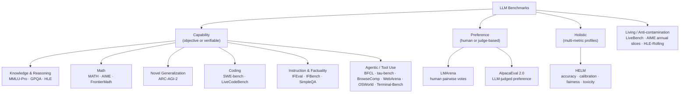

# LLM Benchmarks: A Field Guide to Reading the Leaderboards

The announcement lands on a Tuesday morning. A new model has topped the leaderboard. The launch post highlights three benchmarks, all chosen with care, all showing the model ahead. By Wednesday, another lab publishes its own chart with different benchmarks and different bars. By Friday, someone posts a thread explaining why both charts are misleading.

Everyone is technically correct. No one is giving you the full measurement story.

This is the second post in the Benchmarks series. Where the [first post](./vector-db-benchmarks) focused on vector databases—systems with cleaner interfaces and clearer algorithmic tradeoffs—this post deals with a messier problem: how to measure systems that generate open-ended language, use tools, browse the web, write patches, and increasingly act as agents rather than autocomplete engines.

That last clause is the key update for 2026. If you still think "LLM benchmark" mainly means MMLU, GSM8K, and HumanEval, you are reading the map from two model generations ago. Those benchmarks still matter historically. Some still matter diagnostically. But the frontier has moved. The modern evaluation picture includes contamination-resistant suites, factuality benchmarks, agentic tool-use tests, web-environment tasks, computer-use benchmarks, and reasoning tests like `ARC-AGI-2` that are trying to probe something much less like "knows facts" and much more like "can adapt to something genuinely new."

The answer to "which model is better?" remains what it has always been in empirical science: it depends on which measuring instrument you are using, who calibrated it, what it was built to detect, and now, increasingly, what scaffold or agent loop wrapped the model during evaluation.

---

## The Benchmark Ecosystem: Why There Are So Many

A language model is not a single capability. It is a bundle of partially overlapping capabilities: knowledge retrieval, scientific reasoning, code generation, tool invocation, dialogue management, constraint following, web search, software repair, calibration, refusal behavior, and human-preferred communication style. No single benchmark can measure all of that well. Any benchmark that claims to measure everything usually measures several things badly.

This is the first reason the benchmark landscape keeps expanding: the task surface is genuinely large.

The second reason is contamination. Once a benchmark becomes important, it becomes a target. Its questions propagate through papers, blog posts, copies of datasets, training corpora, synthetic finetuning data, and evaluation dashboards. Models released after that point often score higher not only because they are better, but because they have absorbed pieces of the benchmark ecosystem.

The third reason is that the field now disagrees not only about what "better" means, but about what the unit of evaluation is. Some benchmarks still measure a raw model. Many of the most important 2026 benchmarks measure a **system**: model plus tools, model plus browser, model plus agent loop, model plus retrieval stack, model plus test-time compute budget. That is a more realistic measurement for deployment, but it also makes comparisons harder.

The fourth reason is that human preference and objective correctness keep diverging. A model can be more accurate and less liked. It can be safer and less useful. It can be excellent at function calling and mediocre at actual multi-step task completion. It can dominate MMLU-Pro and still fail at browsing the web for obscure facts.

The useful way to think about the ecosystem in 2026 is along four tensions:

- breadth vs. specialization
- static vs. live evaluation
- raw model vs. scaffolded system
- capability vs. preference

---

## The Contamination Problem: Why Numbers Alone Are Not Enough

Before discussing any individual benchmark, the contamination problem has to be understood clearly, because it reframes almost every static score in this article.

When a benchmark is published, its contents enter the public internet. Once that happens, the benchmark is no longer only a test; it is also future training material. If a later model answers a benchmark question correctly, you cannot assume it generalized from first principles. It may have memorized the exact question, a paraphrase, an explanation thread, a worked solution, or synthetic data derived from the benchmark. This is **training data contamination**.

Contamination shows up in recurring ways:

**Score inflation over time.** A benchmark that looked highly discriminative in 2021 becomes tightly clustered at the top in 2025 or 2026.

**Saturation.** Once many strong models score near ceiling, the benchmark stops telling you much. This is the fate of `GSM8K`, much of `MMLU`, and increasingly `HumanEval`.

**Suspicious gaps between related tasks.** When a model scores extremely high on a famous benchmark and much lower on a newer or harder variant of the same skill, the gap is telling you something real.

**False confidence in tiny deltas.** A one- or two-point gap on a contaminated benchmark often looks more meaningful on a launch slide than it actually is.

The practical response is not to throw away old benchmarks. It is to reclassify them:

- some are now **historical markers**
- some are still useful as **sanity checks**
- some remain useful only when paired with a harder successor
- some should be replaced with live, private, or continuously refreshed benchmarks

### Decontamination is harder than it sounds

A common instinct is to say: just check whether the benchmark question appears verbatim in the training data. But verbatim search only catches the easiest leakage. It misses paraphrases, worked solutions, answer-only leakage, evaluation notebooks, tutoring sites, question templates, and synthetic training data built from benchmark-adjacent material.

This is why newer benchmark design increasingly moves in one of four directions:

- use newer or continuously refreshed questions, as with `LiveBench` and `LiveCodeBench`
- keep part of the benchmark private, as with `FrontierMath` and many agent benchmarks
- use annual or rolling slices, as with `AIME` year slices and `HLE-Rolling`
- evaluate capabilities that are structurally harder to memorize as static QA, such as interactive browsing or software repair

### The scaffold problem

Contamination is no longer the only reason a benchmark score can mislead you. In 2026, many of the most important scores are **system scores**, not model scores.

If two labs report results on `SWE-bench Verified`, `BrowseComp`, `OSWorld`, or `Terminal-Bench`, you need to know:

- which tools were available
- whether the system could browse
- how much test-time compute it used
- whether it was allowed multiple attempts
- whether a planner/grounder split or multi-agent scaffold was used
- what observation format the agent saw: plain text, accessibility tree, screenshots, or both

The model still matters. But once you cross into agentic evaluation, the harness matters too.

That is not a flaw in the benchmark. It reflects reality. Deployed systems are scaffolded. But it does mean that leaderboards increasingly measure **engineering decisions plus model capability**, not model capability in isolation.

---

## Knowledge and Reasoning Benchmarks

This is the family most people think of first, and also the family most distorted by historical momentum. Some of the names remain important because everyone knows them. That does not mean they still deserve equal weight.

### MMLU: Still famous, mostly historical

**Published by:** Dan Hendrycks, Collin Burns, et al. (UC Berkeley), 2020  
**Paper:** [arxiv.org/abs/2009.03300](https://arxiv.org/abs/2009.03300)

`MMLU` made broad academic-question benchmarking mainstream. It spans 57 subjects in four-choice multiple choice format and was genuinely informative when models were far from expert-human performance.

It is no longer a frontier discriminator.

That does not make it useless. `MMLU` still tells you whether a model has broad background competence. It is still a useful historical reference and sanity check. But by 2026, a high `MMLU` score mainly tells you that the model is not broken and is not weak in obvious ways. It does **not** tell you much about open-ended reasoning, tool use, coding in context, browsing ability, or deployment fitness.

**Best current use:** baseline sanity check and subject-breadth context.  
**Bad current use:** headline evidence that one frontier model is materially "smarter" than another.

### MMLU-Pro: The benchmark that replaced MMLU, but did not escape history

**Published by:** TIGER-Lab, 2024  
**Paper:** [arxiv.org/abs/2406.01574](https://arxiv.org/abs/2406.01574)  
**Leaderboard:** [huggingface.co/spaces/TIGER-Lab/MMLU-Pro](https://huggingface.co/spaces/TIGER-Lab/MMLU-Pro)

`MMLU-Pro` improves on the original benchmark in two important ways: harder sourcing and 10-way multiple choice instead of 4-way multiple choice. That reduces guessing effects and raises the reasoning burden.

It remains a useful cross-domain knowledge-and-reasoning benchmark in 2026 because:

- it is still widely reported
- it is meaningfully harder than `MMLU`
- it gives you a quick breadth signal across many academic domains

But its role has changed. In 2024 it felt like the harder successor. In 2026 it is better understood as the **minimum serious breadth benchmark**. If a frontier model looks strong everywhere else but weak here, that is notable. If two top models differ by a small margin, that by itself should not drive a decision.

**Best current use:** broad cross-domain reasoning signal.  
**Best pairing:** `GPQA`, `HLE`, or `LiveBench` for additional headroom.

### GPQA Diamond: Still one of the best science-reasoning signals, but no longer alone

**Published by:** David Rein et al. (NYU, Anthropic, DeepMind), 2023  
**Paper:** [arxiv.org/abs/2311.12022](https://arxiv.org/abs/2311.12022)

`GPQA` remains one of the cleanest benchmark designs in the modern literature. Its questions are written by domain experts in biology, chemistry, and physics, and they are designed so that non-experts with internet access do not reliably solve them. The benchmark has meaningful human baselines and genuinely probes domain reasoning rather than easy lookup.

That is why `GPQA Diamond` still deserves a place in any serious 2026 benchmark guide.

What has changed is not its design quality but its relative position. It used to feel like the sharpest frontier capability test in public discourse. Today it is one of several. Top models increasingly push into or beyond expert-human ranges on parts of `GPQA`, which means you should not read it in isolation.

**Best current use:** expert STEM reasoning.  
**Best pairing:** `HLE`, `ARC-AGI-2`, or domain-specific evaluation.

### Humanity's Last Exam (HLE): The new flagship "still hard" academic benchmark

**Published by:** Center for AI Safety / Scale AI, 2025; published in *Nature* in 2026  
**Paper:** [arxiv.org/abs/2501.14249](https://arxiv.org/abs/2501.14249)  
**Site:** [lastexam.ai](http://lastexam.ai/)

`Humanity's Last Exam` exists because too many older benchmarks stopped being frontier-hard. It assembles 2,500 expert-level questions across a very broad range of fields and is explicitly designed to measure the current ceiling of academic-style reasoning.

There are two reasons to care about `HLE`.

First, it restores headroom. If you want to know whether the strongest systems are still far from solving expert-level academic QA in a general sense, `HLE` is one of the best public references.

Second, it has already begun evolving: the introduction of `HLE-Rolling` is itself a sign of where the field is going. Static benchmarks become targets. Once that happens, the benchmark either has to evolve or surrender its diagnostic power.

**Best current use:** very hard broad academic reasoning.  
**Caveat:** still mostly question-answering; not a tool-use or task-completion benchmark.

### BBH: Good historically, less central now

**Published by:** Suzgun et al. (Google Research), 2022  
**Paper:** [arxiv.org/abs/2210.09261](https://arxiv.org/abs/2210.09261)

`BIG-Bench Hard` was influential because it highlighted multi-step reasoning and the gains from chain-of-thought prompting. It still has pedagogical value, especially if you are studying reasoning methods or prompt sensitivity.

But in 2026 it is no longer where you go first to separate frontier systems. Its role is historical and methodological more than decisive.

---

## Novel Generalization Benchmarks

Most language benchmarks measure something a model can in principle learn from text. `ARC-AGI-2` is interesting because it pushes against that default.

### ARC-AGI-2: The benchmark you consult when you care about adaptation, not recall

**Published by:** François Chollet, Mike Knoop, Gregory Kamradt, Bryan Landers, Henry Pinkard, 2025; technical report updated in 2026  
**Paper:** [arxiv.org/abs/2505.11831](https://arxiv.org/abs/2505.11831)  
**Site:** [arcprize.org/arc-agi/2](https://arcprize.org/arc-agi/2/)  
**Leaderboard:** [arcprize.org/leaderboard](https://arcprize.org/leaderboard)

`ARC-AGI-2` is a few-shot visual-symbolic reasoning benchmark built around 2D grid transformations. Each task gives a handful of input-output examples and asks the system to infer the underlying rule and apply it to new inputs. The benchmark emphasizes **generalization to novel tasks** rather than stored world knowledge.

It matters for two reasons.

First, it is one of the clearest attempts to probe fluid reasoning under distribution shift. The model cannot lean on encyclopedic knowledge or familiar language templates. It has to infer structure from a tiny local context.

Second, `ARC-AGI-2` explicitly foregrounds **efficiency**. The ARC Prize team now treats cost per task as a first-class signal alongside accuracy. That is philosophically important. It is an attempt to distinguish solving by intelligent adaptation from solving by expensive search.

The benchmark was intentionally redesigned to be less brute-force-friendly than `ARC-AGI-1`, with better calibration across public and private splits and a more rigorous human baseline process. Early paper snapshots showed frontier systems scoring only a few percentage points on semi-private evaluation. By 2026 the live leaderboard is moving quickly enough that any static score in a blog post risks aging badly, which is itself part of the point: this is now an actively contested frontier benchmark.

`ARC-AGI-2` does **not** replace `MMLU-Pro`, `GPQA`, or `SWE-bench`. It measures something different.

**Use it when you care about:** novel rule induction, adaptation, and reasoning efficiency.  
**Do not use it as:** a general proxy for product quality, coding ability, or domain knowledge.

---

## Mathematics Benchmarks

Math remains one of the strongest evaluation domains because correctness is usually verifiable and contamination is often easier to reason about than in open-ended chat.

### GSM8K: Baseline only

**Published by:** Cobbe et al. (OpenAI), 2021  
**Paper:** [arxiv.org/abs/2110.14168](https://arxiv.org/abs/2110.14168)

`GSM8K` is now what `MMLU` is in knowledge evaluation: a baseline sanity check, not a serious frontier separator. If a model struggles here, that matters. If two strong models differ by one or two points here, it probably does not.

### MATH: Still useful, but no longer the end of the story

**Published by:** Hendrycks et al. (UC Berkeley), 2021  
**Paper:** [arxiv.org/abs/2103.03874](https://arxiv.org/abs/2103.03874)

`MATH` remains a valuable benchmark because it goes beyond arithmetic into competition-style mathematical reasoning. Level 4 and 5 problems still tell you more than `GSM8K` does.

But like every static benchmark, it has become less definitive over time. In 2026, `MATH` is best treated as the bridge between older math evaluation and newer, harder math benchmarks.

### AIME: Still one of the clearest practical frontier signals

**Published by:** Mathematical Association of America, annually  
**Reference:** [artofproblemsolving.com/wiki/index.php/AIME](https://artofproblemsolving.com/wiki/index.php/AIME)

`AIME` continues to matter because it is hard, updated annually, and easy to explain. It does not have the breadth of a full benchmark suite, but it does something extremely useful: it gives you a fresh yearly snapshot of difficult mathematical reasoning with meaningful human context.

That freshness is a feature, not a footnote.

### FrontierMath: Where the headroom still obviously exists

**Published by:** Epoch AI, 2024 onward  
**Site:** [epoch.ai/benchmarks/frontiermath](https://epoch.ai/benchmarks/frontiermath/)

`FrontierMath` is one of the few public math benchmarks in 2026 where nobody can pretend the frontier has solved the domain. The problems are original, extremely difficult, and mostly private. Solving them often requires hours or days of expert-level work.

This is why the benchmark matters. It restores scarce headroom.

It also comes with caveats that should be stated plainly:

- much of the benchmark is private
- a subset is exclusively accessible to some actors
- evaluations are highly scaffold-sensitive because models are typically allowed code execution and substantial reasoning budgets

Those caveats do not invalidate it. They simply mean you should read `FrontierMath` as a frontier stress test, not as a consumer-friendly headline number.

On Epoch AI's 2026 pages, even strong models remain far from ceiling, and Tier 4 is harsher still. That is exactly what you want from a frontier benchmark.

**Best current math portfolio:** `AIME` for freshness, `MATH` for continuity, `FrontierMath` for ceiling-testing.

---

## Coding Benchmarks

This category went through the same maturation as reasoning benchmarks: the field moved from isolated function completion toward real software tasks.

### HumanEval and HumanEval+: useful legacy, weak proxy

**Published by:** Chen et al. (OpenAI), 2021  
**Paper:** [arxiv.org/abs/2107.03374](https://arxiv.org/abs/2107.03374)  
**HumanEval+:** [arxiv.org/abs/2305.01210](https://arxiv.org/abs/2305.01210)

`HumanEval` was a landmark benchmark. `HumanEval+` made it stricter. But both are now limited by what they fundamentally are: tiny, isolated, mostly Python snippet problems.

That still makes them useful as coding sanity checks. It does not make them good proxies for software engineering.

### SWE-bench and SWE-bench Verified: still the anchor for real coding work

**Published by:** Jimenez et al. (Princeton / University of Chicago), 2023  
**Paper:** [arxiv.org/abs/2310.06770](https://arxiv.org/abs/2310.06770)  
**Leaderboard:** [swebench.com](https://www.swebench.com/)

`SWE-bench` remains one of the most important benchmarks in the entire LLM ecosystem because it measures something users actually buy coding systems for: resolve a real issue in a real repository and pass the existing tests.

`SWE-bench Verified` is now the default serious comparison set because it filters for instances that human reviewers confirmed are clear and correctly specified. The broader `SWE-bench` family has also expanded:

- `Verified` for reliable core comparisons
- `Lite` for cheaper evaluation
- `Multilingual` for broader language coverage
- `Multimodal` for issues involving visual context

This family matters because it captures the difference between "can write code" and "can do software engineering in context." It also dramatizes the scaffold problem: raw models, prompted models, and agentic coding systems can differ massively on the same underlying benchmark.

**Best current use:** real coding assistants and agentic software systems.  
**What the score is measuring:** model quality plus search, edit, test, and recovery loop quality.

### LiveCodeBench: the right complement to SWE-bench

**Published by:** Jain et al. (UC Berkeley, MIT, Cornell), 2024  
**Paper:** [arxiv.org/abs/2403.07974](https://arxiv.org/abs/2403.07974)  
**Leaderboard:** [livecodebench.github.io](https://livecodebench.github.io/)

`LiveCodeBench` is the clean answer to `HumanEval` contamination. It continuously collects fresh contest problems and supports evaluation by release window, which lets you ask whether a model is genuinely solving unseen problems.

It also broadens coding evaluation beyond one task. The project explicitly treats code generation as only one slice of coding competence and includes related tasks like self-repair and test-output prediction.

If `SWE-bench` is the benchmark for real-repo engineering, `LiveCodeBench` is the benchmark for fresh coding generalization.

**Best current coding bundle:** `SWE-bench Verified` plus `LiveCodeBench`.

---

## Agentic and Tool-Use Benchmarks

This is the category most benchmark guides still underweight.

By 2026, "agentic capability" is not one thing. A system can be good at formatting a JSON tool call and bad at multi-step task completion. It can be strong on synthetic APIs and weak on real web navigation. It can use a browser well and fail at terminal work. It can be a strong coding agent and a poor general assistant.

That is why this family needs to be broken down explicitly.

### BFCL: tool calling as a benchmarkable skill

**Published by:** Berkeley / Gorilla project  
**Leaderboard:** [gorilla.cs.berkeley.edu/leaderboard.html](http://gorilla.cs.berkeley.edu/leaderboard.html)

The `Berkeley Function Calling Leaderboard` began as a function-calling benchmark and has evolved into a broader agentic-evaluation framework. By `BFCL v4`, the project explicitly frames itself as moving from tool use toward agentic evaluation.

Its value is clarity. If you want to know whether a model can reliably map user requests into structured tool calls, abstain when a tool is not relevant, handle multi-turn tool interactions, and survive format sensitivity, `BFCL` is one of the best public references.

It is not the whole agent story, but it is the right place to start if the product depends on robust API invocation.

### tau-bench: tool use plus policy plus dialogue

**Published by:** Sierra Research  
**Paper:** [arxiv.org/abs/2406.12045](https://arxiv.org/abs/2406.12045)  
**Repo:** [github.com/sierra-research/tau-bench](https://github.com/sierra-research/tau-bench)

`tau-bench` asks a more realistic question than "can the model call a function correctly?" It evaluates whether an agent can solve multi-turn customer-service-style tasks using tools while obeying business rules and policies.

This matters because enterprise agents do not fail only by formatting JSON incorrectly. They fail by violating constraints, forgetting state across turns, choosing the wrong action sequence, or satisfying the user in a way that breaks policy. `tau-bench` gets closer to that failure surface than most other public tool-use benchmarks.

**Best current use:** tool-based assistants that must maintain state and obey rules over multiple turns.

### BrowseComp: the benchmark for persistent web research

**Published by:** OpenAI, 2025  
**Paper:** [arxiv.org/abs/2504.12516](https://arxiv.org/abs/2504.12516)  
**Announcement:** [openai.com/index/browsecomp](https://openai.com/index/browsecomp/)

`BrowseComp` exists because simple factuality benchmarks became too easy for browsing-enabled systems. It measures a harder capability: finding **hard-to-find** facts on the open web.

The design is elegant. Questions have short, verifiable answers, but they are deliberately inverted so that the answer is hard to locate and easy to verify once found. This makes the benchmark tractable to grade while still stressing persistence, search reformulation, source evaluation, and research strategy.

The early public numbers made the point sharply: browsing alone was not enough. OpenAI reported GPT-4o at 0.6%, GPT-4o with browsing at 1.9%, `o1` at 9.9%, and Deep Research at 51.5%. That gap is why `BrowseComp` matters.

**Best current use:** research agents, browser agents, and systems sold on "deep web research."  
**Caveat:** it measures hard retrieval, not the full distribution of real user browsing tasks.

### GAIA: general assistants, not just search tools

**Published by:** Meta, Hugging Face, and collaborators  
**Paper:** [arxiv.org/abs/2311.12983](https://arxiv.org/abs/2311.12983)

`GAIA` evaluates general AI assistants on conceptually simple but tool-demanding tasks. The original pitch is still one of the best in the benchmark literature: these are tasks average humans can often solve, yet strong AI systems struggle with them because they require orchestrating browsing, files, reasoning, and other tools coherently. In the original paper, humans reached 92% while GPT-4 with plugins was at 15%, which tells you immediately what sort of gap `GAIA` is trying to expose.

That makes `GAIA` a valuable bridge benchmark. It sits between general-chat evaluation and fully interactive environments.

### WebArena and VisualWebArena: reproducible web-agent evaluation

**WebArena:** [webarena.dev](https://webarena.dev/)  
**VisualWebArena:** [jykoh.com/vwa](https://jykoh.com/vwa)

If `BrowseComp` stresses open-web research, `WebArena` stresses reproducible web task completion. It provides self-hosted websites and realistic tasks so you can test an agent's ability to navigate, click, fill, search, and complete workflows in a controlled environment.

`VisualWebArena` adds multimodal grounding, which matters because many real web tasks are not well captured by text-only DOM abstractions.

This benchmark family is important for one reason above all: it lets you evaluate web agents without the reproducibility chaos of the live web.

### OSWorld: browser agents are not the whole computer

**Paper:** [arxiv.org/abs/2404.07972](https://arxiv.org/abs/2404.07972)  
**Site:** [os-world.github.io](https://os-world.github.io/)

`OSWorld` broadens agent evaluation from "can operate a website" to "can operate a computer." It includes open-ended tasks across browsers, desktop apps, file systems, and cross-application workflows, with execution-based evaluation.

This is one of the most important environment benchmarks in 2026 because it exposes how far computer-use agents still are from human competence. The original paper reported humans above 72.36% while the best model reached only 12.24%. The project has since moved to `OSWorld-Verified`, which reflects the same trend as `SWE-bench Verified`: the field is maturing from flashy demos to cleaner evaluation.

### Terminal-Bench: agents that live in the shell

**Site:** [tbench.ai](https://tbench.ai/)

`Terminal-Bench` covers an increasingly important deployment setting: agents operating in terminal environments across software engineering, system administration, security, data science, and machine learning tasks.

This matters because terminal agents fail differently from browser agents. They need command sequencing, environment understanding, file manipulation discipline, debugging, and often better long-horizon recovery behavior than chat benchmarks reveal.

The existence of `Terminal-Bench 2.0`, an in-development `3.0`, and a science-focused branch is further evidence that agentic evaluation is fragmenting into concrete deployment domains. That is healthy.

### A practical taxonomy for agentic benchmarks

If you only remember one thing from this section, make it this mapping:

| Benchmark | What it mainly measures | Best use |
|-----------|--------------------------|----------|
| `BFCL` | structured tool/function calling | API-driven assistants |
| `tau-bench` | multi-turn tool use under policy constraints | enterprise agents |
| `BrowseComp` | persistent web research | research agents |
| `GAIA` | general assistant capability with tools | broad assistant systems |
| `WebArena` / `VisualWebArena` | reproducible browser task completion | web agents |
| `OSWorld` | computer-use across apps and OS workflows | desktop/computer-use agents |
| `Terminal-Bench` | terminal task completion | CLI and code-operating agents |

---

## Instruction Following and Factuality

This category is more important in 2026 than benchmark discourse often suggests. Production systems fail constantly on format, constraint following, and hallucination.

### IFEval: still the baseline

**Published by:** Zhou et al. (Google DeepMind), 2023  
**Paper:** [arxiv.org/abs/2311.07911](https://arxiv.org/abs/2311.07911)

`IFEval` is still the common benchmark for verifiable instruction following. It asks whether a model can satisfy explicit structural or formatting constraints that can be checked programmatically.

It remains useful. It is also increasingly overfit.

That does not mean you should discard it. It means you should stop treating a high `IFEval` score as proof that a model generalizes well to arbitrary unseen constraints.

### IFBench: the needed correction

**Published by:** Allen Institute for AI and collaborators, 2025  
**Paper:** [arxiv.org/abs/2507.02833](https://arxiv.org/abs/2507.02833)

`IFBench` is one of the most important benchmark additions of the last year because it directly addresses the overfitting problem in precise instruction following. It introduces 58 new, verifiable out-of-domain constraints and shows that many models with strong `IFEval` numbers generalize poorly to unseen constraint types.

That is a textbook benchmark update: not a new task, but a better measurement of the same task.

If your system depends on exact formatting, constrained outputs, rewriting under instruction, or structured compliance, `IFBench` should now sit beside `IFEval`, not behind it.

### SimpleQA: factuality that is actually easy to grade

**Published by:** OpenAI, 2024  
**Paper:** [arxiv.org/abs/2411.04368](https://arxiv.org/abs/2411.04368)  
**Announcement:** [openai.com/index/introducing-simpleqa](https://openai.com/index/introducing-simpleqa/)

Factuality is notoriously difficult to measure in long-form outputs, so `SimpleQA` narrows the problem to short fact-seeking questions with clear answers. That sounds reductive. It is also useful.

The benchmark matters because it is:

- diverse
- hard for frontier models
- small-answer enough to grade reliably
- explicitly built around hallucination analysis and calibration

When it was released, even strong frontier systems were nowhere near ceiling; OpenAI's own write-up notes GPT-4o was still below 40%. That alone made it more useful than older saturated QA benchmarks.

`SimpleQA` is not a complete measure of factuality in long-form generation. But if you care about hallucination rate on short factual prompts, it is one of the cleanest public signals.

### MT-Bench and AlpacaEval 2.0: still useful, but read as judge-based preference proxies

`MT-Bench` and `AlpacaEval 2.0` were pivotal in normalizing LLM-as-judge evaluation. They still matter historically and practically. `AlpacaEval 2.0` in particular corrected for verbosity bias with length-controlled win rate, which was a real methodological improvement.

But in 2026, both are best treated as **judge-based proxies**, not ultimate truth. Use them as cheap reproducible complements, not replacements for human preference or task-specific evaluation.

---

## Human Preference and Holistic Evaluation

### LMArena: still the best public human-preference signal

**Published by:** LMSys / LMArena, ongoing  
**How it works:** [lmarena.ai/cs/how-it-works](https://lmarena.ai/cs/how-it-works)

`LMArena` remains the benchmark to consult when you want to know what users actually prefer in direct head-to-head comparisons. Users submit prompts, compare two anonymous model responses, and vote. Those votes feed a Bradley-Terry-style ranking system.

That matters because user-facing quality is not the same as academic correctness.

But by 2026, you should read `LMArena` more carefully than many launch posts do:

- prefer category-specific views over one aggregate rank
- care about battle count and confidence intervals, not just leaderboard order
- remember that prompts are self-selected
- remember that style, verbosity, and system-prompt optimization all affect outcomes

`LMArena` is still the best public proxy for broad human preference. It is not a substitute for your own evaluation.

### HELM: the reminder that one number is never enough

**Published by:** Liang et al. (Stanford CRFM), 2022  
**Paper:** [arxiv.org/abs/2211.09110](https://arxiv.org/abs/2211.09110)

`HELM` remains important because it refuses the seduction of single-number evaluation. Accuracy, calibration, fairness, robustness, bias, and toxicity can move in different directions, and `HELM` makes those tradeoffs legible.

That is especially important now that model providers are increasingly optimized for public leaderboards. `HELM` is one of the better antidotes to scoreboard monoculture.

---

## Living Benchmarks: Built to Resist Contamination

### LiveBench

**Published by:** White, Dettmers, et al., 2024; spotlighted at ICLR 2025  
**Paper:** [arxiv.org/abs/2406.19314](https://arxiv.org/abs/2406.19314)  
**Leaderboard:** [livebench.ai](https://livebench.ai)

`LiveBench` is the most direct engineering response to static benchmark decay. It refreshes regularly, delays public release of the newest questions, uses verifiable answers, and spans multiple categories. As of the `2026-01-08` release, it covers reasoning, coding, agentic coding, mathematics, data analysis, language, and instruction following.

This benchmark should be more central in benchmark discussions than it often is, because it directly solves a real problem: how to compare models fairly when their training cutoffs differ.

At the start of 2026, the top public scores on `LiveBench` sat around 80 global average rather than near saturation. That is the kind of signal you want: broad, hard, refreshed, and still discriminative.

**Best current use:** broad contamination-resistant comparison across categories.  
**Best question to ask with it:** how does this model perform on questions published after its training cutoff?

---

## The Full Benchmark Reference Table

This table is a reference snapshot for 2026 Q2. The point is not to memorize it. The point is to classify benchmarks by present-day usefulness rather than historical fame.

| Benchmark | Category | Status in 2026 | Best For | Main Caveat |
|-----------|----------|----------------|----------|-------------|
| `MMLU` | broad knowledge | historical / sanity check | broad baseline competence | saturated and contaminated |
| `MMLU-Pro` | broad knowledge | still useful | cross-domain reasoning breadth | less decisive than launch slides suggest |
| `GPQA Diamond` | expert science | still useful | scientific reasoning | frontier headroom is shrinking |
| `HLE` | expert academic QA | frontier-relevant | hard academic reasoning | still QA, not task completion |
| `ARC-AGI-2` | novel generalization | frontier-relevant | adaptation and reasoning efficiency | not comparable to text QA benchmarks |
| `GSM8K` | basic math | sanity check only | minimum math competence | saturated |
| `MATH` | competition math | useful | harder symbolic reasoning | static benchmark |
| `AIME` | annual exam math | highly useful | fresh frontier math signal | narrow task family |
| `FrontierMath` | expert math | frontier-relevant | true math headroom | private, scaffold-sensitive |
| `HumanEval+` | code snippets | legacy support | isolated coding sanity checks | weak proxy for real engineering |
| `SWE-bench Verified` | software engineering | essential | repo-level coding agents | harness matters a lot |
| `LiveCodeBench` | live coding | essential | contamination-resistant coding | less about repo maintenance |
| `IFEval` | instruction following | useful baseline | format and constraint compliance | increasingly overfit |
| `IFBench` | instruction following | highly useful | generalization to unseen constraints | newer, less universally reported |
| `SimpleQA` | factuality | highly useful | short-answer factuality and hallucination rate | narrow factuality slice |
| `LMArena` | human preference | essential | user-facing quality | prompt population and style bias |
| `AlpacaEval 2.0` | judge-based preference | useful complement | cheap reproducible preference proxy | judge bias remains |
| `HELM` | holistic | essential for risk-sensitive use | calibration, fairness, toxicity | not a single headline score |
| `LiveBench` | live cross-domain | essential | broad fair comparison | still one suite among many |
| `BFCL` | tool calling | essential for tool APIs | structured function/tool use | not full task completion |
| `tau-bench` | policy-constrained tool use | highly useful | enterprise agents | simulated domains |
| `BrowseComp` | browsing agents | highly useful | hard web research | not broad consumer browsing |
| `GAIA` | general assistants | highly useful | tool-using assistant capability | broad and heterogeneous |
| `WebArena` / `VisualWebArena` | web agents | highly useful | reproducible browser automation | less like the live web |
| `OSWorld` | computer use | highly useful | desktop and cross-app agents | heavy environment assumptions |
| `Terminal-Bench` | CLI agents | highly useful | terminal-native agents | young, fast-evolving benchmark |

---

## How to Choose the Right Benchmark for Your Task

The useful question is never "which model is best?" It is "which model is best for the thing I am actually building?"

### For knowledge-intensive RAG and search

Lead with `GPQA Diamond`, `MMLU-Pro`, and `SimpleQA`. Add `HELM` if calibration and fairness matter. If your system claims research ability rather than recall ability, add `BrowseComp`.

### For coding assistants and developer tools

Use `SWE-bench Verified` first. Add `LiveCodeBench` for contamination-resistant coding generalization. If the system works in terminal environments, add `Terminal-Bench`. If it must follow rigid output schemas, add `IFEval` or `IFBench`.

### For math-heavy applications

Treat `GSM8K` as a minimum bar, not a selector. Use `AIME` and `MATH` for practical differentiation and `FrontierMath` when you care about true frontier mathematical reasoning.

### For user-facing chat products

Use `LMArena` category rankings, not a single global rank, and pair them with `AlpacaEval 2.0` as a reproducible secondary signal. If the product is factual, add `SimpleQA`.

### For API agents and tool orchestration

Use `BFCL` for tool calling, `tau-bench` for policy-constrained multi-turn tool use, and `GAIA` if the assistant needs broad tool-enabled competence.

### For browsing agents

Use `BrowseComp` for hard research and `WebArena` / `VisualWebArena` for reproducible browser task completion. They measure different things and should not be treated as substitutes.

### For computer-use agents

Use `OSWorld`. If the agent lives mostly in shells and developer environments, add `Terminal-Bench`.

### For comparing models with different training cutoffs

Use `LiveBench`, `LiveCodeBench`, annual `AIME` slices, and rolling or private benchmarks where possible. Static benchmarks alone are not enough.

---

## Reading a Benchmark Result Critically: A Checklist

Before letting any benchmark score influence a decision, run through these questions.

**Who published the result?** Developer-reported results are not worthless, but they deserve more scrutiny than independent evaluations.

**What exactly was evaluated?** A raw model, a prompted model, an agent scaffold, a browser-enabled system, a multi-agent stack? This matters enormously in 2026.

**Which tools were available?** Search, browser, Python, terminal, retrieval, custom APIs, test reruns, majority vote, best-of-N, verifier models. Tool access can dominate the outcome.

**How much test-time compute was used?** Reasoning effort, retries, pass@k, majority voting, best-of-N, and self-consistency all change scores. Ask whether the comparison is budget-matched.

**What observation format did the system receive?** Text only, HTML, accessibility tree, screenshot, screenshot plus DOM. Agentic results are highly format-sensitive.

**Was the benchmark static or live?** A strong score on a static benchmark may be less meaningful than a moderate score on a fresh one.

**Was the evaluation independent?** If an LLM judge was used, which judge and version? If humans were used, how were they recruited and instructed?

**Is the benchmark relevant to your task?** A high `GPQA` score tells you very little about code review. A high `BFCL` score tells you little about research browsing. Match the metric to the intended use.

**Has the benchmark been gamed before?** `MMLU` contamination, `AlpacaEval` verbosity bias, arena system-prompt tuning, and overfitting to `IFEval` are not hypothetical concerns.

**What does the score ignore?** Cost, latency, token budget, reliability across retries, calibration, or policy compliance are often invisible in a single number.

---

## The Reflexive Problem: Goodhart's Law in Evaluation

There is a final problem sitting above all the benchmark-specific details: once a measure becomes a target, it stops being a clean measure.

This is Goodhart's Law, and it is unavoidable.

When `MMLU` became a prestige metric, labs optimized for `MMLU`. When `Chatbot Arena` became a prestige metric, labs optimized for arena preference. When `SWE-bench` became the coding benchmark everyone cited, agentic coding systems began optimizing against it. When `IFEval` became standard, models learned the small set of verifiable constraint types too well relative to generalization.

This is not fraud. It is the normal behavior of a competitive field optimizing for visible metrics.

The right response is not cynicism. It is portfolio thinking.

Do not ask a benchmark to be more than evidence. Each benchmark is one noisy observation. The more varied the methodologies—human preference, verifiable QA, live data, private sets, interactive environments, software repair, browser tasks, factuality tests—the less likely you are to be fooled by one over-optimized score.

And your own evaluation on your own tasks remains more predictive than any public benchmark. Public benchmarks are maps. Your production workload is the terrain.

---

## What Comes Next in the Series

This post and the vector database benchmarks post form the first two pillars of the Benchmarks series. The series will continue with:

**Embedding Model Benchmarks (MTEB):** The Massive Text Embedding Benchmark is still the reference, but like every broad benchmark it is only useful if you understand which subtask mix matches your workload.

**RAG System Evaluation End-to-End:** `RAGAS`, `ARES`, `TruLens`, and the growing ecosystem of LLM-judged answer-quality evaluation. Retrieval quality and answer quality are not the same thing.

**Inference Infrastructure Benchmarks:** throughput, latency under load, speculative decoding, batching, quantization, and the deployment-side measurements that turn model capability into user experience.

Each post in this series carries a changelog when meaningful updates are made. Benchmark maps age quickly. A stale benchmark guide is a misleading benchmark guide.

---

Benchmarks are maps. They represent territory—capability, preference, factuality, task completion, calibration—but they are not the territory itself.

A map from 2021 can still help you navigate in 2026, but only if you know which roads disappeared, which new roads were built, and which landmarks are now tourist attractions rather than working infrastructure.

The skill is not memorizing who is first on whichever leaderboard happened to trend this week. The skill is knowing which benchmark is historical, which is still live, which measures the model, which measures the scaffold, which measures the user experience, and which one is actually relevant to the thing you are building.

The model that dominates the most famous static benchmarks is not automatically the model that best serves your users. The evaluation that tells you the most is usually the one you design yourself, on your data, against your failures, informed—but never replaced—by the public benchmarks.

---

## Going Deeper

**Papers and primary sources:**

- Hendrycks, D., et al. (2020). [Measuring Massive Multitask Language Understanding.](https://arxiv.org/abs/2009.03300)
- Rein, D., et al. (2023). [GPQA: A Graduate-Level Google-Proof Q&A Benchmark.](https://arxiv.org/abs/2311.12022)
- Chollet, F., et al. (2025/2026). [ARC-AGI-2: A New Challenge for Frontier AI Reasoning Systems.](https://arxiv.org/abs/2505.11831)
- Phan, L., et al. (2025/2026). [Humanity's Last Exam.](https://arxiv.org/abs/2501.14249)
- Jimenez, C., et al. (2023). [SWE-bench: Can Language Models Resolve Real-World GitHub Issues?](https://arxiv.org/abs/2310.06770)
- Jain, N., et al. (2024). [LiveCodeBench: Holistic and Contamination Free Evaluation of Large Language Models for Code.](https://arxiv.org/abs/2403.07974)
- White, C., et al. (2024). [LiveBench: A Challenging, Contamination-Free LLM Benchmark.](https://arxiv.org/abs/2406.19314)
- Pyatkin, V., et al. (2025). [Generalizing Verifiable Instruction Following.](https://arxiv.org/abs/2507.02833)
- Wei, J., et al. (2024). [Introducing SimpleQA.](https://openai.com/index/introducing-simpleqa/)
- Patil, S. G., et al. (2025). [The Berkeley Function Calling Leaderboard (BFCL): From Tool Use to Agentic Evaluation of Large Language Models.](http://gorilla.cs.berkeley.edu/leaderboard.html)
- Sierra Research. [tau-bench.](https://github.com/sierra-research/tau-bench)
- OpenAI. [BrowseComp: a benchmark for browsing agents.](https://openai.com/index/browsecomp/)
- Mialon, G., et al. (2024). [GAIA: a benchmark for general AI assistants.](https://arxiv.org/abs/2311.12983)
- Xie, T., et al. (2024). [OSWorld: Benchmarking Multimodal Agents for Open-Ended Tasks in Real Computer Environments.](https://arxiv.org/abs/2404.07972)

**Leaderboards and project pages to bookmark:**

- [LiveBench](https://livebench.ai)
- [SWE-bench](https://www.swebench.com/)
- [ARC Prize Leaderboard](https://arcprize.org/leaderboard)
- [LMArena](https://lmarena.ai/)
- [BFCL](http://gorilla.cs.berkeley.edu/leaderboard.html)
- [OSWorld](https://os-world.github.io/)
- [Terminal-Bench](https://tbench.ai/)
- [FrontierMath](https://epoch.ai/benchmarks/frontiermath/)

**Questions worth keeping open:**

If contamination is structural, are rolling benchmarks the long-term answer, or only a temporary delay? If the best agent benchmarks measure entire systems rather than raw models, should we stop pretending otherwise and compare full stacks openly? If human preference leaderboards reward style as much as substance, how should we balance preference, truthfulness, and cost? And if `ARC-AGI-2`, `FrontierMath`, and `HLE` all remain genuinely hard while consumer chat quality keeps improving, what exactly do we mean when we say a model is "better"?
